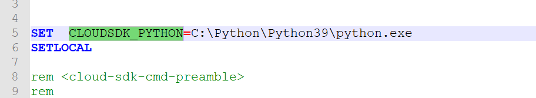
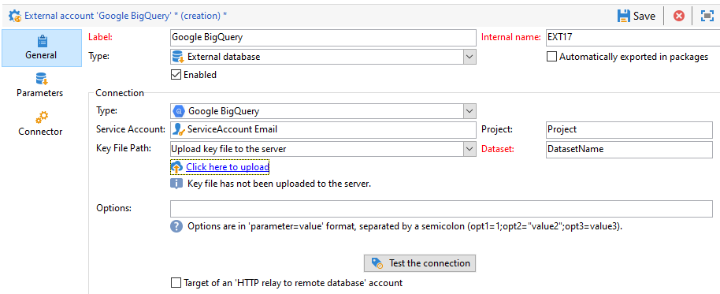

# Configure access to Google BigQuery {#configure-fda-google-big-query}

Use Adobe Campaign Classic **Federated Data Access** (FDA) option to process information stored in an external database. Follow the steps below to configure access to [!DNL Google BigQuery].

1. Configure [!DNL Google BigQuery] on [Windows](#google-windows) or [Linux](#google-linux)
1. Configure the [!DNL Google BigQuery] [external account](#google-external) in Adobe Campaign Classic
1. Set up [!DNL Google BigQuery] connector bulk load on [Windows](#bulk-load-windows) or [Linux](#bulk-load-linux)

>[!NOTE]
>
> [!DNL Google BigQuery] connector is available for hybrid and on-premise deployments. For more on this, refer to [this page](../../installation/using/capability-matrix.md).


## Google BigQuery on Windows {#google-windows}

### Driver set up on Windows {#driver-window}

1. Download the [ODBC driver for Windows](https://cloud.google.com/bigquery/docs/reference/odbc-jdbc-drivers).

1. Configure the ODBC driver in Windows. For more on this, refer to [this page](https://storage.googleapis.com/simba-bq-release/jdbc/Simba%20JDBC%20Driver%20for%20Google%20BigQuery%20Install%20and%20Configuration%20Guide.pdf).

1. For the [!DNL Google BigQuery] connector to work, Adobe Campaign Classic requires the following parameters to connect:

    * **[!UICONTROL Project]**: create or use an existing project. 
    
        For more information, refer to this [page](https://cloud.google.com/resource-manager/docs/creating-managing-projects).

    * **[!UICONTROL Service account]**: create a service account.

        For more information, refer to this [page](https://cloud.google.com/iam/docs/creating-managing-service-accounts).

    * **[!UICONTROL Key File Path]**: the **[!UICONTROL Service account]** requires a **[!UICONTROL Key File]** for a [!DNL Google BigQuery] connection through ODBC. 
    
        For more information, refer to this [page](https://cloud.google.com/iam/docs/creating-managing-service-account-keys).

    * **[!UICONTROL Dataset]**: **[!UICONTROL Dataset]** is optional for an ODBC connection. Since every query needs to provide the dataset where the table is located, specifying a **[!UICONTROL Dataset]** is mandatory for [!DNL Google BigQuery] FDA Connector in Adobe Campaign Classic. 
    
        For more information, refer to this [page](https://cloud.google.com/bigquery/docs/datasets).

1. In Adobe Campaign Classic, you can then configure your [!DNL Google BigQuery] external account. For more on how to configure your external account, refer to [this section](#google-external).

### Bulk load set up on Windows {#bulk-load-window}

>[!NOTE]
>
>You need Python installed for Google Cloud SDK to work. 
>
>We recommend using Python3, see this [page](https://www.python.org/downloads/).

Bulk Load utility allows faster transfer, which is achieved through Google Cloud SDK.

1. Download Windows 64-bit (x86_64) archive from this [page](https://cloud.google.com/sdk/docs/downloads-versioned-archives) and extract it in the corresponding directory.

1. Run the `google-cloud-sdk\install.sh` script. You need to acccept the setting of path variable. 

1. After the installation, check that the path variable `...\google-cloud-sdk\bin` is set. If not, add it manually.

1. In the  `..\google-cloud-sdk\bin\bq.cmd` file, add the `CLOUDSDK_PYTHON` local variable, which will redirect to the location of the Python installation. 
    
    For example:

    

1. Restart Adobe Campaign Classic for the changes to be taken into account.

## Google BigQuery on Linux {#google-linux}

### Driver set up on Linux {#driver-linux}

1. Before installing the ODBC driver, you need to update your system. On Linux or CentOS, run the following command:

    ```
    yum update
    # install unixODBC driver manager
    yum install unixODBC
    ```

1. You then need to install the unixODBC driver manager with the following command:

    ```
    # switch to root user
    sudo su
    ```

    On Debian:

    ```
    apt-get update
    apt-get upgrade
    # install unixODBC driver manager
    apt-get install unixODBC
    ```

1. Download the [Magnitude Simba Linux ODBC Driver (.tar.gz)](https://cloud.google.com/bigquery/docs/reference/odbc-jdbc-drivers). Then, transfer the tarball file into a temporary folder on your machine or use the wget command:

    ```
    # in this example driver version is 2.3.1.1001
    wget https://storage.googleapis.com/simba-bq-release/odbc/SimbaODBCDriverforGoogleBigQuery_[Version]-Linux.tar.gz
    ```

1. Extract the main tarball file as follows where **TarballName** is the name of the tarball package containing the driver:

    ```
    tar --directory=/tmp -zxvf [TarballName]
    ```

1. Access the folder you extracted and extract the inner tarball file corresponding to the version of the driver. Install it into another temporary folder, in the following example BigQueryDriver:

    ```
    mkdir /tmp/BigQueryDriver/
    cd /tmp/SimbaODBCDriverforGoogleBigQuery_[Version]-Linux/
    tar --directory=/tmp/BigQueryDriver/ -zxvf SimbaODBCDriverforGoogleBigQuery[Bitness]_[Version].tar.gz
    ```

1. Access the temporary location where the main tarball file was extracted and copy the `GoogleBigQueryODBC.did` and `setup/simba.googlebigqueryodbc.ini` files into the new folder created in the previous step:

    ```
    cd /tmp/SimbaODBCDriverforGoogleBigQuery_[Version]-Linux/
    cp GoogleBigQueryODBC.did /tmp/BigQueryDriver/SimbaODBCDriverforGoogleBigQuery[Bitness]_[Version]/lib/
    cp setup/simba.googlebigqueryodbc.ini /tmp/BigQueryDriver/SimbaODBCDriverforGoogleBigQuery[Bitness]_[Version]/lib/
    ```

1. Create the installation directory, as follows:

    ```
    mkdir -p /opt/simba/googlebigqueryodbc/
    ```

1. Copy the content of the directory into the new installation directory:

    ```
    cp -r /tmp/BigQueryDriver/SimbaODBCDriverforGoogleBigQuery[Bitness]_[Version]/* /opt/simba/googlebigqueryodbc/
    ```

1.  Replace `<INSTALLDIR>` with `/opt/simba/googlebigqueryodbc` in `simba.googlebigqueryodbc.ini` in the installation directory:

    ```
    cd /opt/simba/googlebigqueryodbc/lib/
    sed -i 's/<INSTALLDIR>/\/opt\/simba\/googlebigqueryodbc/g' simba.googlebigqueryodbc.ini
    ```

1. Change the `DriverManagerEncoding` to UTF-16 and `SwapFilePath` in `simba.googlebigqueryodbc.ini`. If needed, you can also change the logging settings. 

    The following is an example of an updated driver-wide configuration file:

    ```
    # /opt/simba/googlebigqueryodbc/lib/simba.googlebigqueryodbc.ini
    [Driver]
    DriverManagerEncoding=UTF-16
    ErrorMessagesPath=opt/simba/googlebigqueryodbc/ErrorMessages
    LogLevel=6
    LogPath=/tmp
    SwapFilePath=/tmp
    ```

1. If you are using a system drivers file or any current `odbcinst.ini` file, configure `/etc/odbcinst.ini` to point to the Google BigQuery driver location `/opt/simba/googlebigqueryodbc/lib/libgooglebigqueryodbc_sb[Bitness].so`. 

    For example:

    ```
    # /etc/odbcinst.ini
    # Make sure to use Simba ODBC Driver for Google BigQuery as a driver name.
 
    [ODBC Drivers]
    Simba ODBC Driver for Google BigQuery=Installed
 
    [Simba ODBC Driver for Google BigQuery]
    Description=Simba ODBC Driver for Google BigQuery(64-bit)
    Driver=/opt/simba/googlebigqueryodbc/lib/libgooglebigqueryodbc_sb64.so
    ```

1. Find the location of the unixODBC driver manager libraries and add the `unixODBC` and `googlebigqueryodbc` library paths to the `LD_LIBRARY_PATH environment` variable.

    ```
    find / -name 'lib*odbc*.so*' -print
    #output:
    /usr/lib/x86_64-linux-gnu/libodbccr.so.2
    /usr/lib/x86_64-linux-gnu/libodbcinst.so.2.0.0
    /usr/lib/x86_64-linux-gnu/libodbccr.so.1
    .
    .
    /opt/simba/googlebigqueryodbc/lib/libgooglebigqueryodbc_sb64.so
 
    #the command would look like this
    export LD_LIBRARY_PATH=$LD_LIBRARY_PATH:/opt/simba/googlebigqueryodbc:/usr/lib
    ```

1. In Adobe Campaign Classic, you can then configure your [!DNL Google BigQuery] external account. For more on how to configure your external account, refer to [this section](#google-external).

### Bulk load set up on Linux {#bulk-load-linux}

>[!NOTE]
>
>You need Python installed for Google Cloud SDK to work. 
>
>We recommend using Python3, see this [page](https://www.python.org/downloads/).

Bulk Load utility allows faster transfer, which is achieved through Google Cloud SDK.

1. Download Linux 64-bit (x86_64) archive in this [page](https://cloud.google.com/sdk/docs/downloads-versioned-archives) and extract in the corresponding directory.

1. Run the `google-cloud-sdk\install.sh` script. You need to accept the setting of path variable. 

1. After the installation, check that the path variable `...\google-cloud-sdk\bin` is set. If not, add it manually.

1. If you want to avoid using the `PATH` variable or if you want to move the `google-cloud-sdk` directory to another location, use the `bqpath` option value when configuring the **[!UICONTROL External account]** to specify the exact path to the bin directory on your system.

1. Restart Adobe Campaign Classic for the changes to be taken into account.

## Google BigQuery external account {#google-external}

You need to create a [!DNL Google BigQuery] external account to connect your Adobe Campaign Classic instance to your [!DNL Google BigQuery] external database.

1. From Adobe Campaign Classic **[!UICONTROL Explorer]**, click **[!UICONTROL Administration]** '>' **[!UICONTROL Platform]** '>' **[!UICONTROL External accounts]**.

1. Click **[!UICONTROL New]**.

1. Select **[!UICONTROL External database]** as your external account's **[!UICONTROL Type]**.

1. Configure the [!DNL Google BigQuery] external account, you must specify:

    * **[!UICONTROL Type]**: [!DNL Google BigQuery]

    * **[!UICONTROL Service account]**: Email of your **[!UICONTROL Service account]**. For more information on this, refer to [Google Cloud documentation](https://cloud.google.com/iam/docs/creating-managing-service-accounts).

    * **[!UICONTROL Project]**: Name of your **[!UICONTROL Project]**. For more information on this, refer to [Google Cloud documentation](https://cloud.google.com/resource-manager/docs/creating-managing-projects).

    * **[!UICONTROL Key file Path]**: 
        * **[!UICONTROL Upload key file to the server]**: select **[!UICONTROL Click here to upload]** if you choose to upload the key through Adobe Campaign Classic.
        
        * **[!UICONTROL Enter manually the key file path]**: copy/paste your absolute path in this the field if you choose to use a pre-existing key.

    * **[!UICONTROL Dataset]**: Name of your **[!UICONTROL Dataset]**. For more information on this, refer to [Google Cloud documentation](https://cloud.google.com/bigquery/docs/datasets-intro).

    
