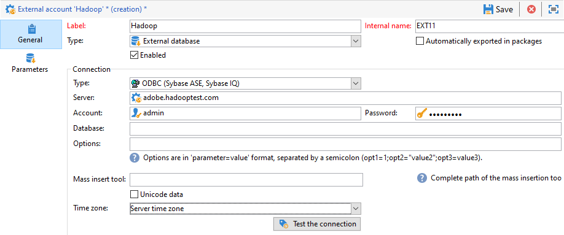

# Configure access to Hadoop {#configure-access-to-hadoop}

Use Campaign **Federated Data Access** (FDA) option to process information stored in an external databases. Follow the steps below to configure access to Hadoop.

1. Configure [Hadoop database](#configuring-hadoop) 
1. Configure the Hadoop [external account](#hadoop-external) in Campaign

## Configuring Hadoop 3.0 {#configuring-hadoop}

Connecting to a Hadoop external database in FDA requires the following configurations on the Adobe Campaign server. Note that this configuration is available for both Windows and Linux.

1. Download the ODBC drivers for Hadoop depending on your OS version. Drivers can be found on [this page](https://www.cloudera.com/downloads.html).

1. You then need to install the ODBC drivers and create a DSN for your Hive connection. Instructions can be found in [this page](https://docs.cloudera.com/documentation/other/connectors/hive-odbc/2-6-5/Cloudera-ODBC-Driver-for-Apache-Hive-Install-Guide.pdf)

1. After downloading and installing the ODBC drivers, you need to restart Campaign Classic. To do so, run the following command:

     ```
     systemctl stop nlserver.service
     systemctl start nlserver.service
     ```

1. In Campaign Classic, you can then configure your [!DNL Hadoop] external account. For more on how to configure your external account, refer to [this section](#hadoop-external).

## Hadoop external account {#hadoop-external}

The [!DNL Hadoop] external account allows you to connect your Campaign instance to your Hadoop external database.

1. In Campaign Classic, configure your [!DNL Hadoop] external account. From the **[!UICONTROL Explorer]**, click **[!UICONTROL Administration]** / **[!UICONTROL Platform]** / **[!UICONTROL External accounts]**.

1. Click **[!UICONTROL New]**.

1. Select **[!UICONTROL External database]** as your external account's **[!UICONTROL Type]**.

1. Configure the **[!UICONTROL Hadoop]** external account, you must specify:

    * **[!UICONTROL Type]**: ODBC (Sybase ASE, Sybase IQ)

    * **[!UICONTROL Server]**: Name of the DNS

    * **[!UICONTROL Account]**: Name of the user

    * **[!UICONTROL Password]**: User account password

    * **[!UICONTROL Database]**: Name of your database if not specified in DSN. It can be left empty if specified in the DSN

    * **[!UICONTROL Time zone]**: Server time zone

    

The connector supports the following ODBC options:

| Name |  Value |
|---|---|
|  ODBCMgr | iODBC |
|  warehouse |  1/2/4 |

The connector also supports the following Hive options:

| Name |  Value |  Description |
|---|---|---|
|  bulkKey |  Azure blob or DataLake access key |  For wasb:// or wasbs:// bulk loaders (i.e. if the bulk load tool starts with wasb:// or wasbs://). <br>It is the access key for blob or DataLake bucket for bulk load. |
|  hdfsPort |  port number <br>set by default to 8020 |  For HDFS bulk load (i.e. if the bulk load tool starts with webhdfs:// or webhdfss://). |
|  bucketsNumber |  20 |  Number of buckets when creating a clustered table. |
|  fileFormat |  PARQUET |  Default file format for work tables. |


## Configuring Hadoop 2.1 {#configure-access-hadoop-2}

If you need to connect to Hadoop 2.1, follow the steps decribed below for [Windows](#for-windows) or [Linux](#for-linux).

### Hadoop 2.1 for Windows {#for-windows}

1. Install ODBC and [Azure HD Insight](https://www.microsoft.com/en-us/download/details.aspx?id=40886) drivers for Windows.
1. Create the DSN (Data Source Name) by running the ODBC DataSource Adminstrator tool. A System DSN sample for Hive is provided for you to modify.

   ```
   Description: vorac (or any name you like)
   Host: vorac.azurehdinsight.net
   Port: 443
   Database: sm_tst611 (or your database name)
   Mechanism: Azure HDInsight Service
   User/Password: admin/<your password here>
   ```

1. Create the Hadoop external account, as detailed in [this section](#hadoop-external).

### Hadoop 2.1 for Linux {#for-linux}

1. Install unixodbc for Linux.

   ```
   apt-get install unixodbc
   ```

1. Download and install ODBC drivers for Apache Hive from HortonWorks: [https://www.cloudera.com/downloads.html](https://www.cloudera.com/downloads.html).

   ```
   dpkg -i hive-odbc-native_2.1.10.1014-2_amd64.deb
   ```

1. Check ODBC files location.

   ```

   root@campadpac71:/tmp# odbcinst -j
   unixODBC 2.3.1
   DRIVERS............: /etc/odbcinst.ini
   SYSTEM DATA SOURCES: /etc/odbc.ini
   FILE DATA SOURCES..: /etc/ODBCDataSources
   USER DATA SOURCES..: /root/.odbc.ini
   SQLULEN Size.......: 8
   SQLLEN Size........: 8
   SQLSETPOSIROW Size.: 8
   ```

1. Create the DSN (Data Source Name) and edit the odbc.ini file. Then, create a DSN for your Hive connection.

   Here is an example for HDInsight to setup a connection called "viral":

   ```
   [ODBC Data Sources]
   vorac 

   [vorac]
   Driver=/usr/lib/hive/lib/native/Linux-amd64-64/libhortonworkshiveodbc64.so
   HOST=vorac.azurehdinsight.net
   PORT=443
   Schema=sm_tst611
   HiveServerType=2
   AuthMech=6
   UID=admin
   PWD=<your password here>
   HTTPPath=
   UseNativeQuery=1
   ```

   >[!NOTE]
   >
   >The **UseNativeQuery** parameter here is very important. Campaign is Hive-aware and will not work correctly unless UseNativeQuery is set. Typically, the driver or Hive SQL Connector will rewrite queries and tamper the column ordering.

   The authentication setup depends on the Hive/Hadoop configuration. For instance, for HD Insight, use AuthMech=6 for user/password authentication, as described [here](https://www.simba.com/products/Spark/doc/ODBC_InstallGuide/unix/content/odbc/hi/configuring/authenticating/azuresvc.htm).

1. Export the variables.

   ```
   export ODBCINI=/etc/myodbc.ini
   export ODBCSYSINI=/etc/myodbcinst.ini
   ```

1. Setup Hortonworks drivers via /usr/lib/hive/lib/native/Linux-amd64-64/hortonworks.hiveodbc.ini.

   You have to use UTF-16 to be able to connect with Campaign and unix-odbc (libodbcinst).

   ```
   [Driver]

   DriverManagerEncoding=UTF-16
   ErrorMessagesPath=/usr/lib/hive/lib/native/hiveodbc/ErrorMessages/
   LogLevel=0
   LogPath=/tmp/hive
   SwapFilePath=/tmp

   ODBCInstLib=libodbcinst.so
   ```

1. You can now test your connection using isql.

   ```
   isql vorac
   isql vorac -v
   ```

1. Create the Hadoop external account, as detailed in [this section](#hadoop-external).
