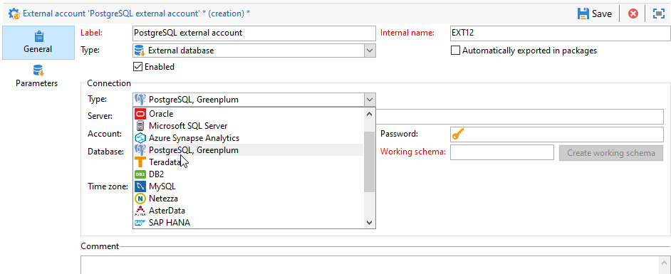

# Configure access to PostgreSQL {#configure-fda-postgresql}

Use Campaign **Federated Data Access** (FDA) option to process information stored in an external PostgreSQL database.

## PostgreSQL configuration {#postgresql-configuration}

You first need to install Libpq. Libpq allows client programs to send queries to the PostgreSQL backend server and to receive these queries' results.

Follow the steps below to configure access to [!DNL PostgreSQL]:

* For CentOS, execute the following command `sudo apt-get -y install libpq-dev`.

* For Linux, execute the following command `yum install postgresql-devel`.

* For Windows, Libpq is implemented through `libpq.dll` which is included in Adobe Campaign installation.

In Adobe Campaign, you can then configure your [!DNL PostgreSQL] external account. For more on how to configure your external account, refer to [this section](#postgresql-external).

## PostgreSQL external account {#postgresql-external}

>[!NOTE]
>
> PostgreSQL is available on CentOS 7 and 6.

You need to create a [!DNL PostgreSQL] external account to connect your Campaign instance to your [!DNL PostgreSQL] external database.

1. From Campaign **[!UICONTROL Explorer]**, click **[!UICONTROL Administration]** '>' **[!UICONTROL Platform]** '>' **[!UICONTROL External accounts]**.

1. Click **[!UICONTROL New]**.

1. Select **[!UICONTROL External database]** as your external account's **[!UICONTROL Type]**.

1. Under **[!UICONTROL Configuration]**, select [!DNL PostgreSQL, Greenplum] from the **[!UICONTROL Type]** drop-down.

    

1. Configure the **[!UICONTROL PostgreSQL]** external account authentication:

    * **[!UICONTROL Server]**: URL of the [!DNL PostgreSQL] server.

    * **[!UICONTROL Account]**: Name of the user.

    * **[!UICONTROL Password]**: User account password.

    * **[!UICONTROL Database]**: Name of the database (optional).

    * **[!UICONTROL Working schema]**: Name of your working schema. [Learn more](https://www.postgresql.org/docs/current/ddl-schemas.html)

    * **[!UICONTROL Timezone]**: Timezone set in [!DNL PostgreSQL]. [Learn more](https://www.postgresql.org/docs/7.2/timezones.html)

1. Click the **[!UICONTROL Parameters]** tab then the **[!UICONTROL Deploy functions]** button to create functions.

    >[!NOTE]
    >
    >For all functions to be available, you need to create the Adobe Campaign SQL functions in the remote database. For more information, refer to this [page](../../configuration/using/adding-additional-sql-functions.md).

1. Click **[!UICONTROL Save]** when your configuration is finished.

The connector supports the following options:

| Option   |  Description |
|:-:|:-:|
|  PGSQL_CONNECT_TIMEOUT | Maximum wait for connection, in seconds.  For more on this, refer to [PostgreSQL documentation](https://www.postgresql.org/docs/12/libpq-connect.html#LIBPQ-CONNECT-CONNECT-TIMEOUT). |
| PGSQL_KEEPALIVES_IDLE | Number of seconds of inactivity after which the TCP should send a keepalive message to the server.  For more on this, refer to [PostgreSQL documentation](https://www.postgresql.org/docs/12/libpq-connect.html#LIBPQ-KEEPALIVES-IDLE). |
| PGSQL_KEEPALIVES_INTVL | Number of seconds after which the TCP keepalive message not acknowledged by the server should be retransmitted.   For more on this, refer to [PostgreSQL documentation](https://www.postgresql.org/docs/12/libpq-connect.html#LIBPQ-KEEPALIVES-INTERVAL). |
| PGSQL_KEEPALIVES_CNT | Number of TCP keepalives that can be lost before the client's connection to the server is considered dead.  For more on this, refer to [PostgreSQL documentation](https://www.postgresql.org/docs/12/libpq-connect.html#LIBPQ-KEEPALIVES-COUNT). |
