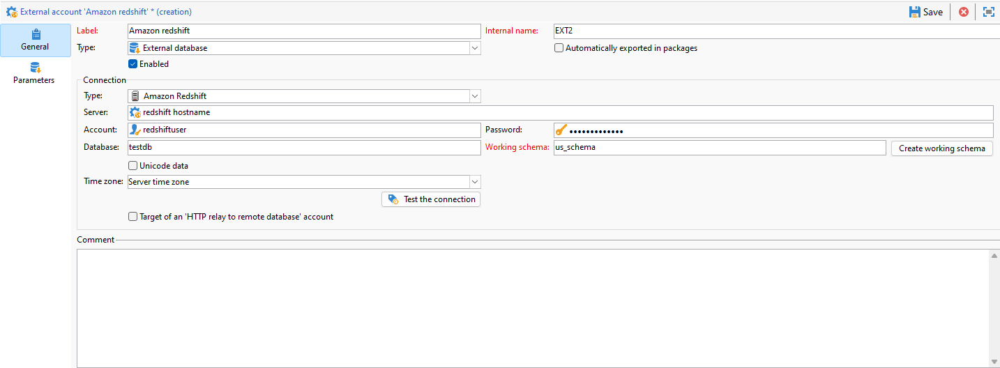

# Configure access to Amazon Redshift {#configure-access-to-redshift}

Use Campaign **Federated Data Access** (FDA) option to process information stored in an external databases. Follow the steps below to configure access to Amazon Redshift.

1. Configure [Amazon Redshift database](#configuring-redshift) 
1. Configure the Amazon Redshift [external account](#redshift-external) in Campaign

## Amazon Redshift on Linux {#redshift-linux}

To configure [!DNL Amazon Redshift] on Linux, follow the steps below:

1. Before the ODBC installation, check that the following packages are installed on your Linux distribution: 

    * For Red Hat/CentOS:

        ```
         yum update
         yum upgrade
         yum install -y grep sed tar wget perl curl
        ```

    * For Debian:

        ```
         apt-get update
         apt-get upgrade
         apt-get install -y grep sed tar wget perl curl
        ```

1. Before running the script, you can have access to more information with the `--help` option:

    ```
    cd /usr/local/neolane/nl6/bin/fda-setup-scripts/
    ./redshift_odbc-setup.sh --help
    ```

1. Access the directory where the script is located and run the following script as a root user:

    ```
      cd /usr/local/neolane/nl6/bin/fda-setup-scripts
      ./redshift_odbc-setup.sh
    ```

1. After installing the ODBC drivers, you need to restart Campaign Classic. To do so, run the following command:

    ```
    systemctl stop nlserver.service
    systemctl start nlserver.service
    ```

1. In Campaign, you can then configure your [!DNL Amazon Redshift] external account. For more on how to configure your external account, refer to [this section](#redshift-external).

## Amazon Redshift external account {#redshift-external}

The [!DNL Amazon Redshift] external account allows you to connect your Campaign instance to your Amazon Redshift external database.

1. In Campaign Classic, configure your [!DNL Amazon Redshift] external account. From the **[!UICONTROL Explorer]**, click **[!UICONTROL Administration]** / **[!UICONTROL Platform]** / **[!UICONTROL External accounts]**.

1. Click **[!UICONTROL New]**.

1. Select **[!UICONTROL External database]** as your external account's **[!UICONTROL Type]**.

1. Configure the **[!UICONTROL Amazon Redshift]** external account, you must specify:

    * **[!UICONTROL Type]**: Amazon Redshift

    * **[!UICONTROL Server]**: Name of the DNS

    * **[!UICONTROL Account]**: Name of the user

    * **[!UICONTROL Password]**: User account password

    * **[!UICONTROL Database]**: Name of your database if not specified in DSN. It can be left empty if specified in the DSN

    * **[!UICONTROL Working schema]**: Name of your working schema. [Learn more](https://docs.aws.amazon.com/redshift/latest/dg/r_Schemas_and_tables.html)

    * **[!UICONTROL Time zone]**: Server time zone

    

1. Click **[!UICONTROL Save]**.
