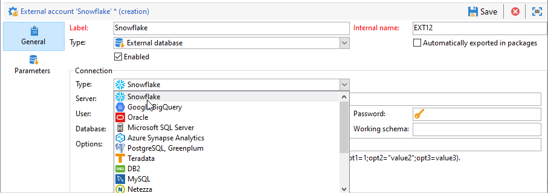
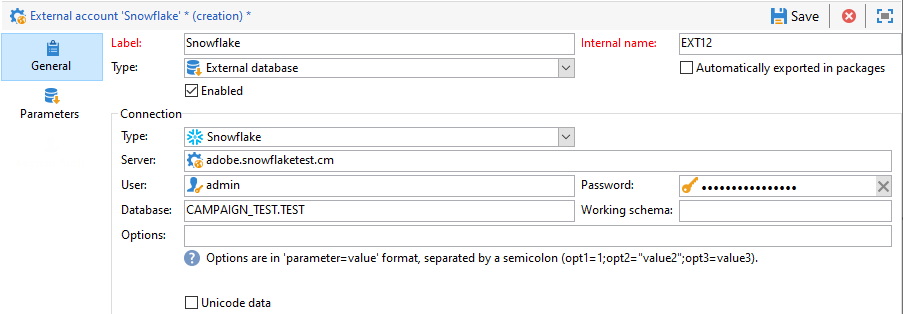
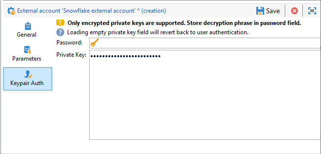
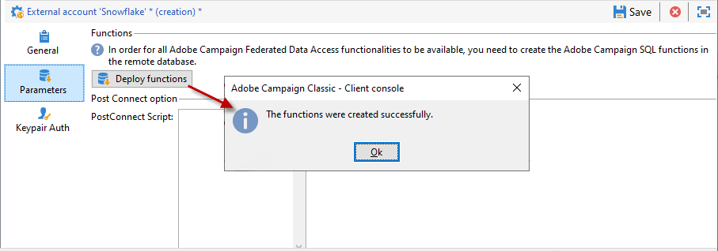

# Configure access to Snowflake {#configure-access-to-snowflake}


Use Campaign **Federated Data Access** (FDA) option to process information stored in an external database. Follow the steps below to configure access to [!DNL Snowflake].

1. Configure [!DNL Snowflake] on [Linux](#snowflake-linux).
1. Configure the [!DNL Snowflake] [external account](#snowflake-external) in Campaign

>[!NOTE]
>
>[!DNL Snowflake] connector is available for hosted and on-premise deployments. For more on this, refer to [this page](../../installation/using/capability-matrix.md).


## Snowflake on Linux {#snowflake-linux}

To configure [!DNL Snowflake] on Linux, follow the steps below:

1. Before the ODBC installation, check that the following packages are installed on your Linux distribution: 

    * For Red Hat/CentOS:

        ```
        yum update
        yum upgrade
        yum install -y grep sed tar wget perl curl
        ```

    * For Debian:

        ```
        apt-get update
        apt-get upgrade
        apt-get install -y grep sed tar wget perl curl
        ```

1. Before running the script, you can have access to more information with the `--help` option:

    ```
    cd /usr/local/neolane/nl6/bin/fda-setup-scripts/
    ./snowflake_odbc-setup.sh --help
    ```

1. Access the directory where the script is located and run the following script as a root user:

    ```
    cd /usr/local/neolane/nl6/bin/fda-setup-scripts
    ./snowflake_odbc-setup.sh
    ```

1. After installing the ODBC drivers, you need to restart Campaign Classic. To do so, run the following command:

    ```
    systemctl stop nlserver.service
    systemctl start nlserver.service
    ```

1. In Campaign, you can then configure your [!DNL Snowflake] external account. For more on how to configure your external account, refer to [this section](#snowflake-external).

## Snowflake external account {#snowflake-external}

You need to create a [!DNL Snowflake] external account to connect your Campaign instance to your [!DNL Snowflake] external database.

1. From Campaign **[!UICONTROL Explorer]**, click **[!UICONTROL Administration]** '>' **[!UICONTROL Platform]** '>' **[!UICONTROL External accounts]**.

1. Click **[!UICONTROL New]**.

1. Select **[!UICONTROL External database]** as your external account's **[!UICONTROL Type]**.

1. Under **[!UICONTROL Configuration]**, select [!DNL Snowflake] from the **[!UICONTROL Type]** drop-down.

    

1. Add your **[!UICONTROL Server]** URL and **[!UICONTROL Database]**.

1. Configure the **[!UICONTROL Snowflake]** external account authentication:

    * For Account/password authentication, you must specify:

        * **[!UICONTROL Account]**: Name of the user

        * **[!UICONTROL Password]**: User account password.

        

    * For Keypair authentication, click the **[!UICONTROL Keypair Auth]** tab to use your **[!UICONTROL Private key]** to authenticate and copy paste your **[!UICONTROL Private key]**.
        
        

1. Click the **[!UICONTROL Parameters]** tab then the **[!UICONTROL Deploy functions]** button to create functions.

    >[!NOTE]
    >
    >For all functions to be available, you need to create the Adobe Campaign SQL functions in the remote database. For more information, refer to this [page](../../configuration/using/adding-additional-sql-functions.md).

    

1. Click **[!UICONTROL Save]** when your configuration is finished.

The connector supports the following options:

| Option   |  Description |
|---|---|
|  workschema | Database schema to use for work tables |
|  warehouse | Name of the default warehouse to use. It will override the user's default. |
|  TimeZoneName |  By default empty, which means that the system time zone of the Campaign Classic app server is used. The option can be used to force the TIMEZONE session parameter. <br>For more on this, refer to [this page](https://docs.snowflake.net/manuals/sql-reference/parameters.html#timezone). |
|  WeekStart |  WEEK_START session parameter. By default set to 0. <br>For more on this, refer to [this page](https://docs.snowflake.com/en/sql-reference/parameters.html#week-start). |
|  UseCachedResult | USE_CACHED_RESULTS session parameter. By default set to TRUE. This option can be used to disable Snowflake cached results. <br>For more on this, refer to [this page](https://docs.snowflake.net/manuals/user-guide/querying-persisted-results.html). |
|  bulkThreads | Number of threads to use for Snowflake bulk-loader, more threads mean a better performance for bigger bulk-loads. By default set to 1. The number can be adjusted, depending on the machine thread count. |
|  chunkSize | Determines the file size of the bulk-loader chunk. By default set to 128MB. Can be modified for a more optimal performance, when used with bulkThreads. More concurrently active threads mean better performance. <br>For more on this, refer to [Snowflake documentation](https://docs.snowflake.net/manuals/sql-reference/sql/put.html).|
| StageName | Name of the pre-provisioned internal stage. It will be used in bulk load instead of creating a new temporary stage.|
