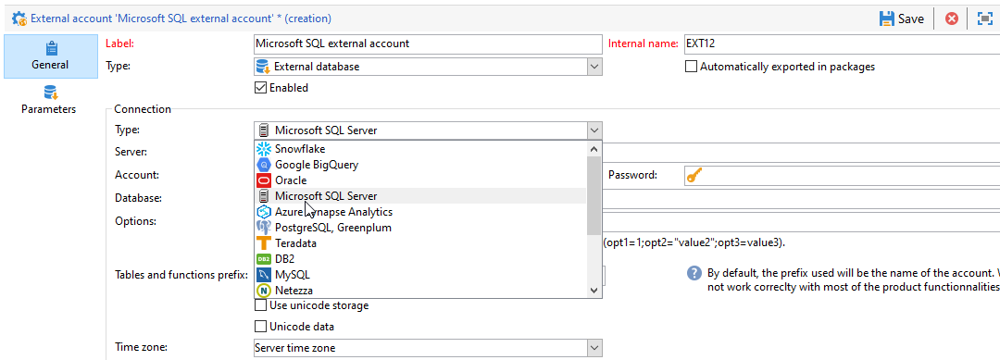

# Configure access to Microsoft SQL Server {#configure-fda-sql}


Use Campaign **Federated Data Access** (FDA) option to process information stored in an external Microsoft SQL Server database. Follow the steps below to configure access to [!DNL Microsoft SQL Server].

1. Configure [!DNL Microsoft SQL Server] on [CentOS](#sql-centos).
1. Configure [!DNL Microsoft SQL Server] on [Linux](#sql-linux).
1. Configure [!DNL Microsoft SQL Server] on [Windows](#sql-windows).
1. Configure the [!DNL Microsoft SQL Server] [external account](#sql-external) in Campaign

## Microsoft SQL Server on CentOS {#sql-centos}

>[!NOTE]
>
> [!DNL Microsoft SQL Server] is available on CentOS 7 and 6.

To configure [!DNL Microsoft SQL Server] on CentOS, follow the steps below:

1. Download and install SQL ODBC driver with the following command:

    ``` 
    sudo su
    curl https://packages.microsoft.com/config/rhel/7/prod.repo > /etc/yum.repos.d/mssql-release.repo
    exit
    sudo yum remove unixODBC-utf16 unixODBC-utf16-devel #to avoid conflicts
    sudo ACCEPT_EULA=Y yum install msodbcsql
    ``` 

1. In Adobe Campaign, you can then configure your [!DNL Microsoft SQL Server] external account. For more on how to configure your external account, refer to [this section](#sql-external).

## Microsoft SQL Server on Linux {#sql-linux}

>[!NOTE]
>
> If you are running an older version of Adobe Campaign (prior to 7.2.1), you need to install `unix ODBC drivers`.

1. Download the MS ODBC driver from [this page](https://packages.microsoft.com/ubuntu/16.04/prod/pool/main/m/msodbcsql17/).

1. Run the following command as root user:

    ``` 
    # install the mssql odbc that was downloaded
    dpkg -i msodbcsql17_17.7.1.1-1_amd64.deb
    # accept the license terms
    ``` 

1. In Adobe Campaign, you can then configure your [!DNL Microsoft SQL Server] external account. For more on how to configure your external account, refer to [this section](#sql-external).

## Microsoft SQL Server on Windows {#sql-windows}

To configure [!DNL Microsoft SQL Server] on Windows:

1. In Windows, click **[!UICONTROL Control Panel]** '>' **[!UICONTROL System and Security]** '>' **[!UICONTROL Administrative Tools]**'>' **[!UICONTROL ODBC Data Sources (64-bit)]**.

1. From the **[!UICONTROL ODBC Data Sources (64-bit)]** new window, click **[!UICONTROL Add...]**.

1. Check if SQL Server Native Client v11 is listed in the **[!UICONTROL Create New Data Source]** window.

1. If the SQL Server Native Client is not listed, you can download it in [this page](https://www.microsoft.com/en-my/download/details.aspx?id=36434).

1. In Adobe Campaign, you can then configure your [!DNL Microsoft SQL Server] external account. For more on how to configure your external account, refer to [this section](#sql-external).

## Microsoft SQL Server external account {#sql-external}

You need to create a [!DNL Microsoft SQL Server] external account to connect your Campaign instance to your [!DNL Microsoft SQL Server] external database.

1. From Campaign **[!UICONTROL Explorer]**, click **[!UICONTROL Administration]** '>' **[!UICONTROL Platform]** '>' **[!UICONTROL External accounts]**.

1. Click **[!UICONTROL New]**.

1. Select **[!UICONTROL External database]** as your external account's **[!UICONTROL Type]**.

1. Under **[!UICONTROL Configuration]**, select [!DNL Microsoft SQL Server] from the **[!UICONTROL Type]** drop-down.

    

1. Configure the **[!UICONTROL Microsoft SQL Server]** external account authentication:

    * **[!UICONTROL Server]**: URL of the [!DNL Microsoft SQL Server] server.

    * **[!UICONTROL Account]**: Name of the user.

    * **[!UICONTROL Password]**: User account password.

    * **[!UICONTROL Database]**: Name of the database (optional).

    * **[!UICONTROL Timezone]**: Timezone set in [!DNL Microsoft SQL Server]. [Learn more](https://docs.microsoft.com/en-us/sql/t-sql/functions/current-timezone-transact-sql?view=sql-server-ver15)

1. Click the **[!UICONTROL Parameters]** tab then the **[!UICONTROL Deploy functions]** button to create functions.

    >[!NOTE]
    >
    >For all functions to be available, you need to create the Adobe Campaign SQL functions in the remote database. For more information, refer to this [page](../../configuration/using/adding-additional-sql-functions.md).

1. Click **[!UICONTROL Save]** when your configuration is finished.

The connector supports the following options:

| Option   |  Description |
|---|---|
|  Authentication | Type of authentication supported by the connector. Current supported value: ActiveDirectoryMSI. <br> For more on this, refer to example 8 of [Microsoft documentation](https://docs.microsoft.com/en-us/sql/connect/odbc/using-azure-active-directory?view=sql-server-ver15#example-connection-strings).|
|  Encrypt |  Specifies whether connections use the TLS encryption over the network. Possible values are **yes/mandatory (18.0 and later)**, **no/optional (18.0 and later)**, and **strict (18.0 and later)**. The default value is set to **yes** in version 18.0 and later and **no** in previous versions. <br>For more on this, refer to [Microsoft documentation](https://docs.microsoft.com/en-us/sql/connect/odbc/dsn-connection-string-attribute?view=azure-sqldw-latest#encrypt). |
|  TrustServerCertificate | Enables encryption using a self-signed server certificate, when used with **Encrypt**. <br>Accepted values: **yes** or **no** (default value, which means that the server certificate will be validated).|
