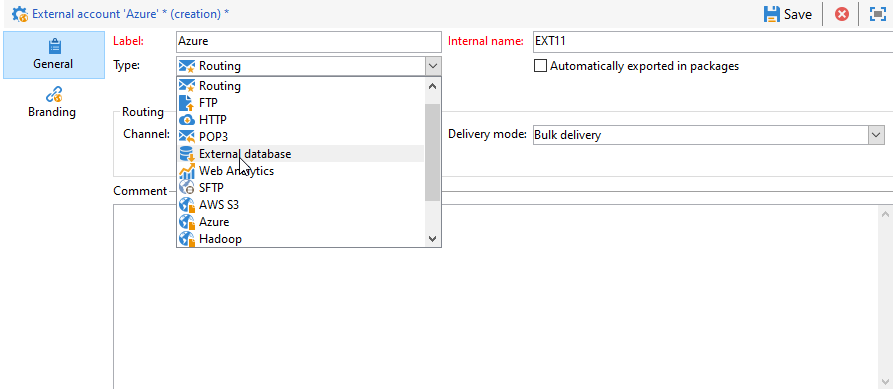

# Configure access to Azure Synapse {#configure-access-to-azure-synapse}

Use Campaign [Federated Data Access](../../installation/using/about-fda.md) (FDA) option to process information stored in an external databases. Follow the steps below to configure access to Microsoft Azure Synapse Analytics.

1. Configure Azure Synapse on [CentOS](#azure-centos), [Windows](#azure-windows) or [Debian](#azure-debian)
1. Configure the Azure Synapse [external account](#azure-external) in Campaign

## Azure Synapse on CentOS {#azure-centos}

>[!CAUTION]
>
>* You will need root privileges to install an ODBC driver.
>* Red Hat Enterprise ODBC drivers provided by Microsoft can also be used with CentOS to connect to SQL Server.
>* Version 13.0 will work with Red Hat 6 and 7.

To configure Azure Synapse on CentOS, follow the steps below:

1. First, install the ODBC Driver. You can find it in this [page](https://www.microsoft.com/en-us/download/details.aspx?id=50420).

    >[!NOTE]
    >
    >This is exclusive to version 13 of the ODBC Driver.

    ```
    sudo su
    curl https://packages.microsoft.com/config/rhel/6/prod.repo > /etc/yum.repos.d/mssql-release.repo
    exit
    # Uninstall if already installed Unix ODBC driver
    sudo yum remove unixODBC-utf16 unixODBC-utf16-devel #to avoid conflicts

    sudo ACCEPT_EULA=Y yum install msodbcsql
  
    sudo ACCEPT_EULA=Y yum install mssql-tools
    echo 'export PATH="$PATH:/opt/mssql-tools/bin"' >> ~/.bash_profile
    echo 'export PATH="$PATH:/opt/mssql-tools/bin"' >> ~/.bashrc
    source ~/.bashrc
  
    # the Microsoft driver expects unixODBC to be here /usr/lib64/libodbc.so.1, so add soft links to the '.so.2' files
    cd /usr/lib64
    sudo ln -s libodbccr.so.2   libodbccr.so.1
    sudo ln -s libodbcinst.so.2 libodbcinst.so.1
    sudo ln -s libodbc.so.2     libodbc.so.1
  
    # Set the path for unixODBC
    export ODBCINI=/usr/local/etc/odbc.ini
    export ODBCSYSINI=/usr/local/etc
    source ~/.bashrc
  
    #Add a DSN information to /etc/odbc.ini
    sudo vi /etc/odbc.ini
  
    #Add the following:
    [Azure Synapse Analytics]
    Driver      = ODBC Driver 13 for SQL Server
    Description = Azure Synapse Analytics DSN
    Trace       = No
    Server      = [insert your server here]
    ```

1. If needed, you can install unixODBC development headers by running the following command:

    ```
    sudo yum install unixODBC-devel
    ```

1. After installing the drivers, you can test and verify your ODBC Driver and query your database if needed. Run the following command:

    ```
    /opt/mssql-tools/bin/sqlcmd -S yourServer -U yourUserName -P yourPassword -q "your query" # for example -q "select 1"
    ```

1. In Campaign, you can then configure your [!DNL Azure Synapse] external account. For more on how to configure your external account, refer to [this section](#azure-external).

1. Since Azure Synapse Analytics communicates through the TCP 1433 port, you need to open up this port on your firewall. Use the following command:

    ```
    firewall-cmd --permanent --add-rich-rule='rule family="ipv4" source address="[server_ip_here]/32" port port="1433" protocol="tcp" accept'
    # you can ping your hostname and the ping command will translate the hostname to IP address which you can use here
    ```

   >[!NOTE]
   >
   >To allow communication from Azure Synapse Analytics' side you might need to add your public IP to the allowlist. To do so, refer to [Azure documentation](https://docs.microsoft.com/en-us/azure/sql-database/sql-database-firewall-configure#use-the-azure-portal-to-manage-server-level-ip-firewall-rules).

1. In case of iptables, run the following command:

    ```
    iptables -A OUTPUT -p tcp -d [server_hostname_here] --dport 1433 -j ACCEPT
    ```

## Azure Synapse on Windows {#azure-windows}

   >[!NOTE]
   >
   >This is exclusive to version 13 of the ODBC Driver but Adobe Campaign Classic can also use SQL Server Native Client drivers 11.0 and 10.0.

To configure Azure Synapse on Windows:

1. First, install the Microsoft ODBC driver. You can find it in [this page](https://www.microsoft.com/en-us/download/details.aspx?id=50420).

1. Choose the following files to install:

    ```
    your_language\your_architecture\msodbcsql.msi (i.e: English\X64\msodbcsql.msi)
    ```

1. Once your ODBC driver is installed, you can test it if needed. For more on this, refer to this [page](https://docs.microsoft.com/en-us/sql/connect/odbc/windows/system-requirements-installation-and-driver-files?view=sql-server-ver15#installing-microsoft-odbc-driver-for-sql-server).

1. In Campaign Classic, you can then configure your [!DNL Azure Synapse] external account. For more on how to configure your external account, refer to [this section](#azure-external).

1. Since Azure Synapse Analytics communicates through the TCP 1433 port, you need to open up this port on the Windows Defender Firewall. For more on this, refer to [Windows documentation](https://docs.microsoft.com/en-us/windows/security/threat-protection/windows-firewall/create-an-outbound-program-or-service-rule).

## Azure Synapse on Debian {#azure-debian}

**Prerequisites:**

* You will need root privileges to install a ODBC driver.
* Curl is needed to install the msodbcsql package. If you don't have it installed, run the following command:
  
    ```
    sudo apt-get install curl
    ```

To configure Azure Synapse on Debian:

1. First, install the Microsoft ODBC driver for SQL Server. Use the following commands to install the ODBC Driver 13.1 for SQL Server:

    ```
    sudo su
    curl https://packages.microsoft.com/keys/microsoft.asc | apt-key add -
    curl https://packages.microsoft.com/config/debian/8/prod.list > /etc/apt/sources.list.d/mssql-release.list
    exit
    sudo apt-get update
    sudo ACCEPT_EULA=Y apt-get install msodbcsql
    ```

1. If you get the following an error **"The method driver /usr/lib/apt/methods/https could not be found"** when calling **sudo apt-get update**, you should run the command:

   ```
   sudo apt-get install apt-transport-https ca-certificates
   ```

1. You now need to install mssql-tools with the following commands. Mssq-tools are needed to use the bulk copy program (or BCP) utility and to run queries.

    ```
    sudo ACCEPT_EULA=Y apt-get install mssql-tools
    echo 'export PATH="$PATH:/opt/mssql-tools/bin"' >> ~/.bash_profile
    echo 'export PATH="$PATH:/opt/mssql-tools/bin"' >> ~/.bashrc
    source ~/.bashrc
    ```

1. If needed, you can install unixODBC development headers by running the following command:

    ```
    sudo yum install unixODBC-devel
    ```

1. After installing the drivers, you can test and verify your ODBC Driver and query your database if needed. Run the following command:

    ```
    /opt/mssql-tools/bin/sqlcmd -S yourServer -U yourUserName -P yourPassword -q "your query" # for example -q "select 1"
    ```

1. In Campaign Classic, you can now configure your [!DNL Azure Synapse] external account. For more on how to configure your external account, refer to [this section](#azure-external).

1. To configure iptables on Debian to ensure the connection with Azure Synapse Analytics, enable the outbound TCP 1433 port for your hostname with the following command:

    ```
    iptables -A OUTPUT -p tcp -d [server_hostname_here] --dport 1433 -j ACCEPT
    ```

   >[!NOTE]
   >
   >To allow communication from Azure Synapse Analytics' side you might need to add your public IP to the allowlist. To do so, refer to [Azure documentation](https://docs.microsoft.com/en-us/azure/sql-database/sql-database-firewall-configure#use-the-azure-portal-to-manage-server-level-ip-firewall-rules).


## Azure Synapse external account {#azure-external}

The [!DNL Azure Synapse] external account allows you to connect your Campaign instance to your Azure Synapse external database.

To create your [!DNL Azure Synapse] external account follow the steps below:

1. From Campaign **[!UICONTROL Explorer]**, click **[!UICONTROL Administration]** '>' **[!UICONTROL Platform]** '>' **[!UICONTROL External accounts]**.

1. Click **[!UICONTROL New]**.

1. Select **[!UICONTROL External database]** as your external account's **[!UICONTROL Type]**.

    

1. Configure the [!DNL Azure Synapse] external account, you must specify:

     * **[!UICONTROL Type]**: Azure Synapse Analytics

    * **[!UICONTROL Server]**: URL of the Azure Synapse server

    * **[!UICONTROL Account]**: Name of the user

    * **[!UICONTROL Password]**: User account password

    * **[!UICONTROL Database]**: Name of the database
