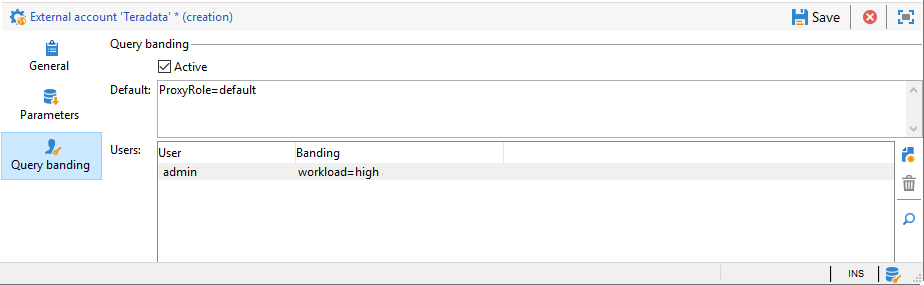

# Configure access to Teradata {#configure-access-to-teradata}

Use Campaign [Federated Data Access](../../installation/using/about-fda.md) (FDA) option to process information stored in an external databases. Follow the steps below to configure access to Teradata.

1. Install and configure [Teradata drivers](#teradata-config)
1. Configure the Teradata [external account](#teradata-external) in Campaign
1. Set up [additional configuration](#teradata-additional-configurations) for Teradata and Campaign server

## Teradata configuration {#teradata-config}

You need to install drivers for Teradata to have connection to Campaign implemented.

1. Install the [ODBC driver for Teradata](https://downloads.teradata.com/download/connectivity/odbc-driver/linux).

   It is made up of three packages that can be installed on Red Hat (or CentOS)/Suse in the following order:

    * TeraGSS
    * tdicu1510 (install it using setup_wrapper.sh)
    * tdodbc1510 (install it using setup_wrapper.sh)

1. Configure the ODBC driver. The configuration can be carried out in the standard files: **/etc/odbc.ini** for general parameters and /etc/odbcinst.ini for declaring drivers:

    * **/etc/odbc.ini**

      ```
      [ODBC]
      InstallDir=/etc/
      ```

      "InstallDir" corresponds to the location of the **odbcinst.ini** file.

    * **/etc/odbcinst.ini**

      ```
      [ODBC DRIVERS]
      teradata=Installed

      [teradata]
      Driver=/opt/teradata/client/15.10/lib64/tdata.so
      APILevel=CORE
      ConnectFunctions=YYY
      DriverODBCVer=3.51
      SQLLevel=1
      ```

1. Specify the environment variables of the Adobe Campaign server:

    * **LD_LIBRARY_PATH**: /opt/teradata/client/15.10/lib64 and /opt/teradata/client/15.10/odbc_64/lib.
    * **ODBCINI**: location of the odbc.ini file (for example /etc/odbc.ini).
    * **NLSPATH**: location of the opermsgs.cat file (/opt/teradata/client/15.10/msg/opermsgs.cat)

>[!NOTE]
>
>Connecting to a Teradata external database in FDA requires additional configurations steps on the Adobe Campaign server. [Learn more](#teradata-additional-configurations).
>

## Teradata external account{#teradata-external}

The Teradata external account allows you to connect your Campaign instance to your Teradata external database. 

1. From Campaign **[!UICONTROL Explorer]**, click **[!UICONTROL Administration]** / **[!UICONTROL Platform]** / **[!UICONTROL External accounts]**.

1. Click **[!UICONTROL New]** and select **[!UICONTROL External database]** as **[!UICONTROL Type]**.

    

1. To configure the **[!UICONTROL Teradata]** external account, you must specify:

    * **[!UICONTROL Type]**: Choose the **[!UICONTROL Teradata]** type.

    * **[!UICONTROL Server]**: URL or name of your Teradata server

    * **[!UICONTROL Account]**: Name of the account used to access the Teradata database

    * **[!UICONTROL Password]**: Password used to connect to the Teradata database

    * **[!UICONTROL Database]**: Name of the database (optional)

    * **[!UICONTROL Options]**: Options to be passed through Teradata. Use the following format: 'parameter=value'. Use a semi-column as separator between values.

    * **[!UICONTROL Timezone]**: Timezone set in Teradata. [Learn more](#timezone)

### Query banding

When multiple Adobe Campaign users connect to the same FDA Teradata external account, the **[!UICONTROL Query banding]** tab allows you to set a query band, i.e. a set of key/value pairs, on a session.



When this option is configured, each time a Campaign user performs a query on the Teradata database, Adobe Campaign will send meta data, which consists of a list of keys, associated to this user. This data can then be used by Teradata administrators for audit purposes or to manage access rights.

>[!NOTE]
>
>For more information on **[!UICONTROL Query banding]**, refer to the [Teradata documentation](https://docs.teradata.com/reader/cY5B~oeEUFWjgN2kBnH3Vw/a5G1iz~ve68yTMa24kVjVw).

To configure Query banding, follow the steps below:

1. Use the  **[!UICONTROL Default]** to enter a default query band that will be used if a user has no associated query band. If this field is left empty, the users with no query band will not be able to use Teradata.

1. Use the **[!UICONTROL Users]** field to specify a query band for each user. You can add as many key/value pairs as you need e.g. priority=1;workload=high. If the user has no query band assigned, the **[!UICONTROL Default]** field will be applied.

1. Check the **[!UICONTROL Active]** box to activate this feature

#### External account troubleshooting {#external-account-troubleshooting}

If the following error appears while testing the connection **TIM-030008 Date '2': missing character(s) (iRc=-53)** make sure that the ODBC driver is correctly installed and that the LD_LIBRARY_PATH (Linux) / PATH (Windows) is set for the Campaign server.

The error **ODB-240000 ODBC error: [Microsoft][ODBC Driver Manager] Data source name not found and no default driver specified.** occurs with Windows if you use a 16.X driver. Adobe Campaign expects the teradata to be named '{teradata}' in odbcinst.ini.

* Starting Campaign 18.10, you can add ODBCDriverName="Teradata Database ODBC Driver 16.10" in the options of the external account. The version number can change, the exact name can be found by running odbcad32.exe and accessing to the Drivers tab.

* If you are using an older Campaign version, you will have to copy the Teradata section of odbcinst.ini created by the driver installation to a new section called Teradata. Regedit can be used in this case. If your base is in latin1, you will have to add **APICharSize=1** in the options.

## Additional configurations {#teradata-additional-configurations}

<!--
### Compatibility {#teradata-compatibility}

**Based in Unicode**

| Database version | Driver version |  Minimal Campaign version required |  Note |
|:-:|:-:|:-:|:-:|
| 15  |  15 |  Campaign Classic 17.9 | Under Linux: Queries with timestamp may fail (fixed in build 8937 for 18.4 and 8977 for 18.10) In debug mode, warnings relative to bad memory usage in the driver may occur. |
| 15  | 16  | Campaign Classic 17.9  | Recommended setup for a Teradata 15 database under Linux.  |
|  16 | 16  | Campaign Classic 18.10 |  Unicode characters with surrogate pairs are not fully handled. Using surrogate characters in data should work. Using surrogates in a filtering condition of a query will not work without this change. |
| 16  |  15 |  Campaign Classic 19.0 |  &nbsp; |

**Based in Latin1**

Versions previous to Adobe Campaign Classic 17.9 only supported Teradata Latin-1 database.

Starting from Adobe Campaign Classic 17.9, we now support by default Teradata database in Unicode.

Customers with a Latin-1 Teradata database migrating to a recent Campaign Classic release will have to add the parameter APICharSize=1 in the options of the external account.
-->

### User configuration {#user-configuration}

The following rights are required on the external database: create/drop/execute custom procedures, create/drop/insert/select tables. You may also have to create user mode functions if you want to use md5 and sha2 function on your Adobe Campaign instance.

Make sure to configure the correct time zone. It should match what will be set in the external account created in the Adobe Campaign instance.

Adobe Campaign will not set a protection mode (fallback) on the objects it will create in the database. You might need to set a default on the user that Adobe Campaign will use to connect to the Teradata database using the following query:

| disable default fallback  |
| :-: |
| ```MODIFY USER $login$ AS NO FALLBACK;```  |

### MD5 installation {#md5-installation}

If you want to use md5 functions in your Adobe Campaign instance, you will have to install the user mode function on your Teradata database from this [page](https://downloads.teradata.com/download/extensibility/md5-message-digest-udf) (md5_20080530.zip).

The sha1 of the downloaded file is as follows 65cc0bb6935f72fcd84fef1ebcd64c00115dfd1e.

To install md5:

1. Unzip the md5_20080530.zip file.

1. Go to the md5/src directory.

1. Connect to your Teradata database using bteq.

1. Run the following bteq command:

    ```
    .run file = hash_md5.btq
    ```

### SHA2 installation {#sha2-installation}

If you want to use sha2 functions in your Adobe Campaign instance, you will have to install the user mode function on your Teradata database from this [page](https://github.com/akuroda/teradata-udf-sha2/archive/v1.0.zip) (teradata-udf-sha2-1.0.zip).

The sha1 of the downloaded file is as follows e87438d37424836358bd3902cf1adeb629349780.

To install sha2:

1. Unzip the teradata-udf-sha2-1.0.zip file.

1. Go to the teradata-udf-sha2-1.0/src directory.

1. Connect to your Teradata database using bteq.

1. Run the two following bteq commands:

    ```
    .run file = hash_sha256.sql
    .run file = hash_sha512.sql
    ```

### UDF_UTF16TO8 installation {#UDF-UTF16TO8-installation}

If you want to use udf_utf16to8 functions in your Adobe Campaign instance, you will have to install the user mode function on your Teradata database from the **Teradata unicode tool kit** of this [page](https://downloads.teradata.com/download/tools/unicode-tool-kit) (utk_release1.7.0.0.zip).

The sha1 of the downloaded file is as follows e58235f434f52c71316a577cb48e20b97d24f470.

To install udf_utf16to8:

1. Unzip the utk_release1.7.0.0.zip file.

1. Look for the udf_utf16to8.o in the extracted files and navigate to the directory that contains the file. It should be named utk_release1.7.0.0/utk_release1.7.0.0/04 TranslationUDFs/01 Teradata UDFs/suselinux-x8664/udf_installation/.

1. Connect to your Teradata database using bteq.

1. Type in the following bteq command:

    ```
    REPLACE FUNCTION udf_utf16to8 (
    inputString VARCHAR(8000) CHARACTER SET UNICODE
    ) RETURNS VARCHAR(16000) CHARACTER SET LATIN
    LANGUAGE C
    NO SQL
    EXTERNAL NAME 'CO!i18n103!udf_utf16to8.o!F!udf_utf16to8'
    PARAMETER STYLE SQL;
  
    -- Test: should return 410042
    SELECT CAST(Char2HexInt(UDF_UTF16to8(_UNICODE'004100000042'XC)) AS VARCHAR(100));
    ```

## Campaign server configuration for Linux {#campaign-server-linux}

The following is required for the driver installation:

* Teradata ODBC Driver, which can be found in this [page](https://downloads.teradata.com/download/connectivity/odbc-driver/linux)

* Teradata Tools and Utilities (used for the bulk load), which can be found in this [page](https://downloads.teradata.com/download/tools/teradata-tools-and-utilities-linux-installation-package-0)

File names and sha1:

* tdodbc1620__linux_indep.16.20.00.00-1.tar.gz 121fdd978b56fe1304fc5cb7819741b0847f44fd

* TeradataToolsAndUtilitiesBase__linux_indep.16.20.01.00.tar.gz b 29d0af5ffd8dcf68a9dbbaa6f8639387b19c563

If there is no package for your Linux distribution, you can install as explained on a CentOS 7 (for example using docker) and then copy the content of the /opt/teradata on your Adobe Campaign server.

### ODBC driver installation {#odbc-installation}

To install ODBC driver:

1. Extract the tdodbc1620__linux_indep.16.20.00.00-1.tar.gz file.

1. Go to the tdodbc1620 directory.

1. You might need to fix the setup script:

    ```
    "sed -i s/16.10/16.20/ setup_wrapper.sh".
    ```

1. Run the setup_wrapper.sh.

### Teradata tools and utilities installation {#teradata-tools-installation}

To install Tools:

1. Extract the TeradataToolsAndUtilitiesBase__linux_indep.16.20.01.00.tar.gz file.

1. Go to the TeradataToolsAndUtilitiesBase/Linux/i386-x8664/tdicu directory.

1. Run the setup_wrapper.sh.

1. Go to the TeradataToolsAndUtilitiesBase/Linux/i386-x8664/cliv2 directory.

1. Run the setup_wrapper.sh.

1. Go to the TeradataToolsAndUtilitiesBase/Linux/i386-x8664/tptbase directory.

1. Run the setup_wrapper.sh.

1. A libtelapi.so file should be available in /opt/teradata/client/16.20/lib64.

## Campaign server configuration for Windows {#campaign-server-windows}

You first need to download Teradata Tools and utilities for Windows. You can download it from this [page](https://downloads.teradata.com/download/tools/teradata-tools-and-utilities-windows-installation-package)

Make sure to install the ODBC driver and the Teradata Parallel Transporter Base. It will install telapi.dll used to do bulk load on Teradata database.

Make sure the path of the driver and the utilities is in the PATH variable that nlserver will have during execution. By default the path is C:\Program Files (x86)\Teradata\Client\15.10\bin on Windows 32 bits or C:\Program Files\Teradata\Client\15.10\bin on 64 bit).

## Time zone {#timezone}

Teradata uses time zone name that are not standard, you can find the list on the [Teradata site](https://docs.teradata.com/reader/rgAb27O_xRmMVc_aQq2VGw/oGKvgl7gCeBMTGrp59BnwA). Adobe Campaign will try to convert the time zone given in the external configuration to something Teradata understand. If a correspondence is not found, the closet GMT+X (or GMT-X) time zone will be found for the session, with a warning in the log.

The conversion is done reading a file called teradata_timezones.txt that should be in the following datakit directory: /usr/local/neolane/nl6/datakit under linux. If you edit this file, make sure to contact the Adobe Campaign team to make the change in the source code otherwise this file will be overwritten during next Campaign update.

The time zone used to connect will be indicated when running nlserver with the -verbose switch, for example:

```
15:04:04 >   ODB-240007 Teradata: will use 'Europe Central' as session time zone.
```

If the time zone used is not the correct one, an option named "TimeZoneName" can be added on the external account. In that case, use the Teradata Value, for example "TimeZoneName=Europe Central".

When using bulk load, or "fast load" in Teradata documents, Campaign can't indicate the time zone. Therefore, it is recommended to set the default time zone of the user that Campaign will use to connect:

```
MODIFY USER $login$ AS TIME ZONE = 'Europe Central';
```
