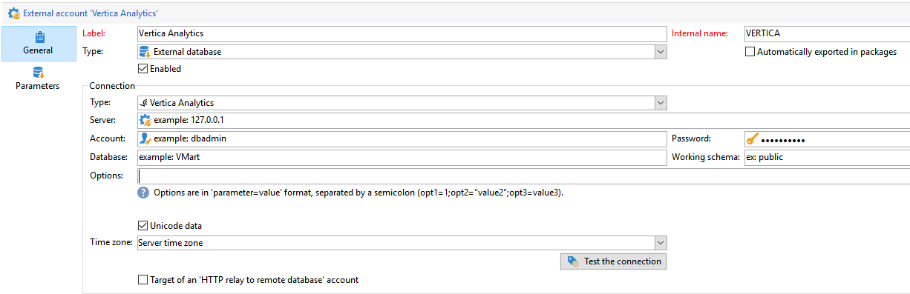

# Configure access to Vertica Analytics {#configure-fda-vertica}


Use Campaign **Federated Data Access** (FDA) option to process information stored in an external database. Follow the steps below to configure access to [!DNL Vertica Analytics].

1. Configure [!DNL Vertica Analytics] on [CentOS](#vertica-centos), [Windows](#vertica-windows) or [Debian](#vertica-debian)
1. Configure the [!DNL Vertica Analytics] [external account](#vertica-external) in Campaign


## Vertica Analytics on CentOS {#vertica-centos}

To configure [!DNL Vertica Analytics] on CentOS, follow the steps below:

1. Download the ODBC drivers for [!DNL Vertica Analytics]. [Click here](https://www.vertica.com/download/vertica/client-drivers/) and download the latest Linux RPM.

1. You then need to install unixODBC with the following command:

    ```
    yum search unixODBC
    yum install unixODBC.x86_64
    ```

1. If you have previously installed the [!DNL Vertica Analytics] Server, an ODBC driver will already be installed. In this case, update the drive as follows:

    ```
    #Switch to root
    sudo su
 
    #Install the package (add --force to update it)
    rpm -Uvh vertica-client-x.x.x-x.x86_64.rpm [--force]
 
    #Open odbcinst.ini
    vi /etc/odbcinst.ini
 
    #Add a section for Vertica Analytics and save
    [VerVertica Analyticstica]
    Description = Vertica Analytics ODBC Driver
    Driver = /opt/vertica/lib64/libverticaodbc.so
 
    #Open odbc.ini
    vi /etc/odbc.ini
 
    #Add your DSN in ODBC Data Sources section, for example:
    [ODBC Data Sources]
    VMart = "VMart database on Vertica Analytics"
 
    #Add a DSN definition section below, for example:
    [VMart]
    Description = Vmart Database
    Driver = Vertica Analytics
    Database = VMart
    Servername = # The name of the server where Vertica Analytics is installed. Use localhost if Vertica Analytics is installed on the same machine.
    UID = dbadmin
    PWD = <password>
    Port = 5433
    
    #Cleanup
    #Remove the ODBC package
    rm vertica-client-x.x.x-x.x86_64.rpm
    ```

1. In Adobe Campaign, you can then configure your [!DNL Vertica Analytics] external account. For more on how to configure your external account, refer to [this section](#vertica-external).

## Vertica Analytics on Windows {#vertica-windows}

1. Download the [ODBC driver for Windows](https://www.vertica.com/download/vertica/client-drivers/). To install the driver for Windows, you will need to enable .NET Framework 3.5 or the installation wizard will try to automatically enable and download it.

1. Configure the ODBC driver in Windows. For more on this, refer to [this page](https://www.vertica.com/docs/9.2.x/HTML/Content/Authoring/ConnectingToVertica/ClientODBC/SettingUpADSN.htm)

1. In Adobe Campaign, you can then configure your [!DNL Vertica Analytics] external account. For more on how to configure your external account, refer to [this section](#vertical-external).

## Vertica Analytics on Debian {#vertica-debian}

1. Download the ODBC drivers for [!DNL Vertica Analytics]. [Click here](https://sfc-repo.snowflakecomputing.com/odbc/linux/latest/index.html) start downloading.

1. You then need to install unixODBC with the following command:

    ```
    apt-get install unixODBC
    ```

1. If you have previously installed the [!DNL Vertica Analytics] Server, an ODBC driver will already be installed. In this case, update the drive as follows:

    ```
    #Switch to root
    sudo su
 
    #Move or copy the downloaded file and change to /root
    mv vertica_9.3..xx_odbc_x86_64_linux.tar.gz /
    cd /
 
    #Uncompress the file you downloaded
    tar vzxf vertica_9.3..xx_odbc_x86_64_linux.tar.gz
 
    #Remove the tar.gz since it is not needed anymore
    rm vertica_9.3..xx_odbc_x86_64_linux.tar.gz
 
    #Open odbcinst.ini
    vi /etc/odbcinst.ini
 
    #Add a section for Vertica Analytics and save
    [Vertica Analytics]
    Description = Vertica Analytics ODBC Driver
    Driver = /opt/vertica/lib64/libverticaodbc.so
 
    #Open odbc.ini
    vi /etc/odbc.ini
 
    #Add your DSN in ODBC Data Sources section, for example:
    [ODBC Data Sources]
    VMart = "VMart database on Vertica Analytics"
 
    #Add a DSN definition section below, for example:
    [VMart]
    Description = Vmart Database
    Driver = Vertica Analytics
    Database = VMart
    Servername = # The name of the server where Vertica Analytics is installed. Use localhost if Vertica Analytics is installed on the same machine.
    UID = dbadmin
    PWD = <password>
    Port = 5433
    ```

1. In Adobe Campaign, you can then configure your [!DNL Vertica Analytics] external account. For more on how to configure your external account, refer to [this section](#vertica-external).

## Vertica Analytics external account {#vertica-external}

You need to create a [!DNL Vertica Analytics] external account to connect your Campaign instance to your [!DNL Vertica Analytics] external database.

1. From Campaign **[!UICONTROL Explorer]**, click **[!UICONTROL Administration]** '>' **[!UICONTROL Platform]** '>' **[!UICONTROL External accounts]**.

1. Click **[!UICONTROL New]**.

1. Select **[!UICONTROL External database]** as your external account's **[!UICONTROL Type]**.

1. Configure the **[!UICONTROL Vertica Analytics]** external account, you must specify:

    * **[!UICONTROL Type]**: [!DNL Vertica Analytics]

    * **[!UICONTROL Server]**: URL of the [!DNL Vertica Analytics] server

    * **[!UICONTROL Account]**: Name of the user

    * **[!UICONTROL Password]**: User account password

    * **[!UICONTROL Database]**: Name of the database

    

The connector supports the following options:

| Option   |  Description |
|---|---|
|  TimeZoneName |  By default empty, which means that the system time zone of the Campaign Classic app server is used. The option can be used to force the TIMEZONE session parameter. |

