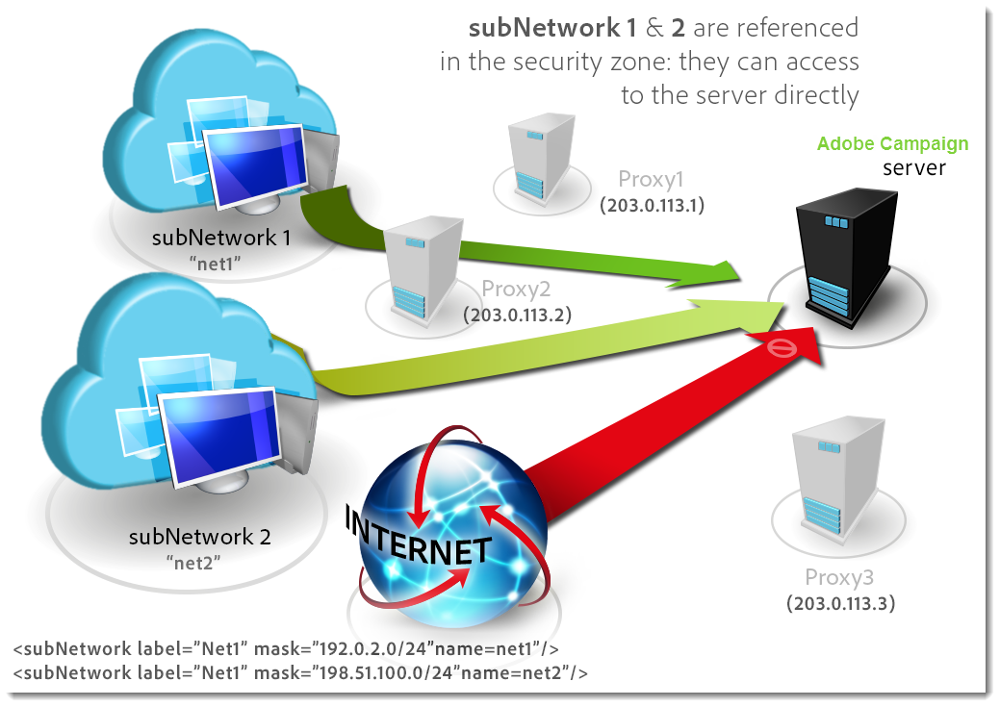
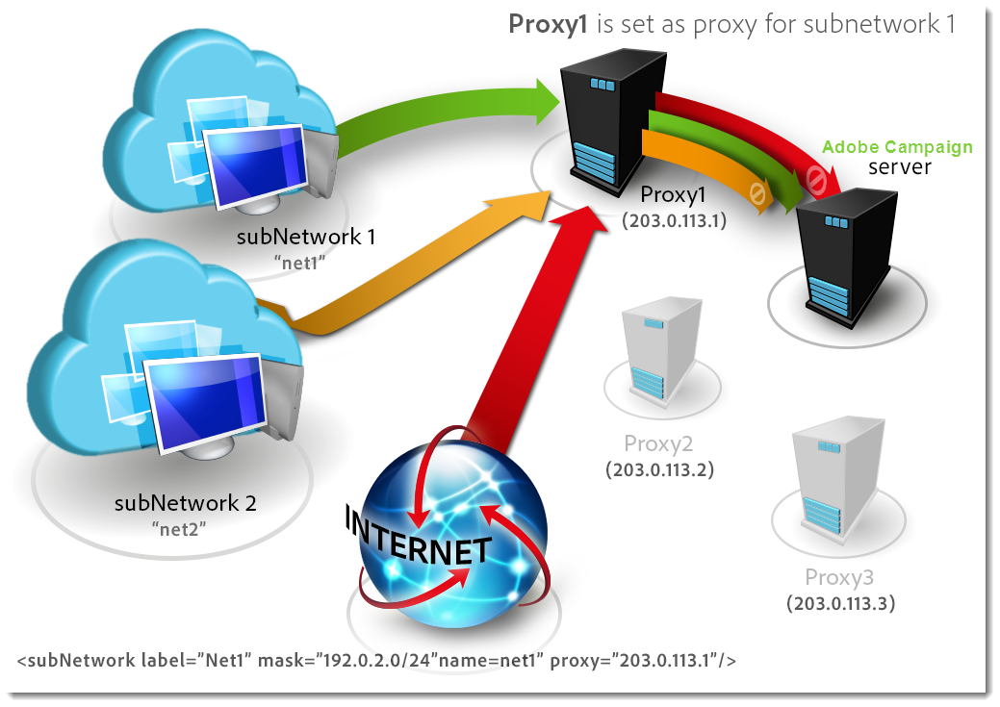
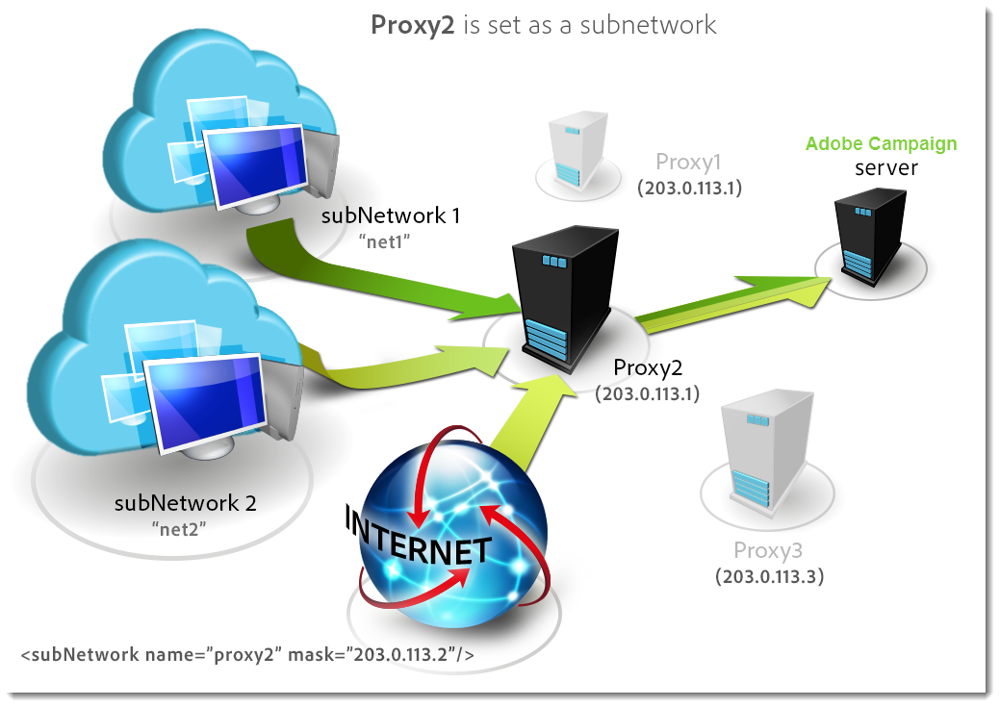
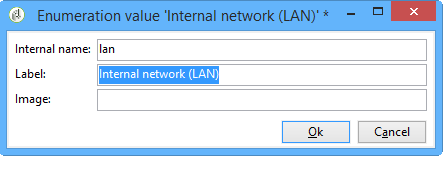
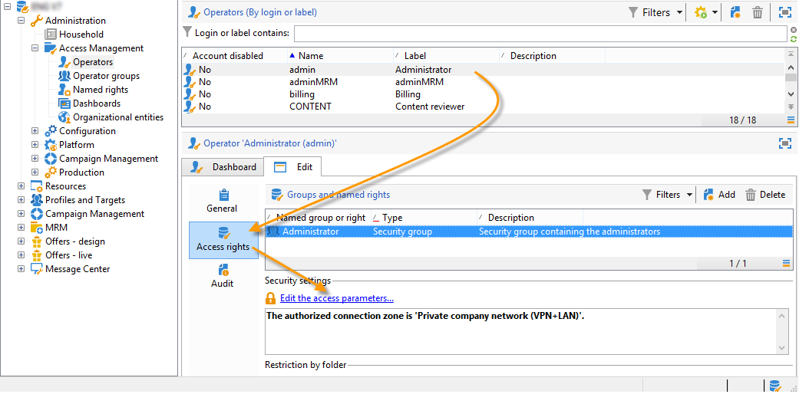
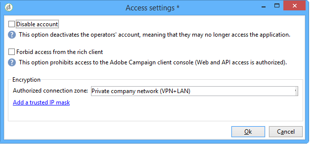

# Configuring Campaign server{#configuring-campaign-server}

The section below details server-side configurations that can be performed to match your needs and your environment specificities.

These configurations must be performed by administrators and for **On-premise** hosting models only. For **Hosted** deployments, server-side settings can be configured by Adobe only. However, some settings can be set up within the Control Panel (for example, IP whitelisting or URL permissions).

For more information, refer to these sections:

* [Control Panel documentation](https://helpx.adobe.com/campaign/kb/control-panel.html)
* [Hosting models](../../installation/using/hosting-models.md)
* [Campaign Classic On-premise & Hosted capability matrix](https://helpx.adobe.com/campaign/kb/acc-on-prem-vs-hosted.html)
* [Hybrid and hosted models configuration steps](https://docs.campaign.adobe.com/doc/AC/en/INS_Hybrid_and_Hosted_models_About_hybrid_and_hosted_models.html)

Campaign Classic configuration files are stored in the **conf** folder of the Adobe Campaign installation folder. The configuration is spread over two files:

* **serverConf.xml**: general configuration for all instances. This file combines the technical parameters of the Adobe Campaign server: these are shared by all instances. The description of some of these parameters is detailed below. The different nodes and parameters and listed in this [section](../../installation/using/the-server-configuration-file.md).
* **config-`<instance>`.xml** (where **instance** is the name of the instance): specific configuration of the instance. If you share your server among several instances, please enter the parameters specific to each instance in their relevant file.

## Defining security zones {#defining-security-zones}

### About security zones {#about-security-zones}

Each operator needs to be linked to a zone to log on to an instance and the operator IP must be included in the addresses or address sets defined in the security zone. Security zone configuration is carried out in the configuration file of the Adobe Campaign server.

Operators are linked to a security zone from its profile in the console ( **[!UICONTROL Administration > Access management > Operators]** node). Learn how to link zones to Campaign operators in [this section](../../installation/using/configuring-campaign-server.md#linking-a-security-zone-to-an-operator).

### Creating security zones {#creating-security-zones}

A zone is defined by:

* one or more ranges of IP addresses (IPv4 and IPv6)
* a technical name linked to each range of IP addresses

Security zones are interlocked, which means that defining a new zone within another zone reduces the number of operators who can log on to it while increasing the rights assigned to each operator.

Zones must be defined during server configuration, in the **serverConf.xml** file. All the parameters available in the **serverConf.xml** are listed in this [section](../../installation/using/the-server-configuration-file.md).

Each zone defines rights, such as:

* HTTP connection rather than HTTPS
* Error display (Java errors, JavaScript, C++, etc.)
* Report and webApp preview
* Authentication via login / password
* Non-secure connection mode

>[!NOTE]
>
>**Each operator must be linked to a zone**. If the IP address of the operator belongs to the range defined by the zone, the operator can log on to the instance.  
>The operator's IP address may be defined in several zones. In this case, the operator receives the **set** of available rights for each zone.

The out-of-the-box **serverConf.xml** file includes three zones: **public, VPN, and LAN**.

>[!NOTE]
>
>**The out-of-the-box configuration is secure**. However, before migrating from an earlier version of Adobe Campaign, it may be necessary to temporarily reduce security in order to migrate and approve the new rules.

Example of how to define a zone in the **serverConf.xml** file:

```
<securityZone allowDebug="false" allowHTTP="false" label="Public Network" name="public">
<subNetwork label="All addresses" mask="*" name="all"/>

<securityZone allowDebug="true" allowHTTP="false" label="Private Network (VPN)"
              name="vpn" showErrors="true">

  <securityZone allowDebug="true" allowEmptyPassword="true" allowHTTP="true"
                allowUserPassword="false" label="Private Network (LAN)" name="lan"
                sessionTokenOnly="true" showErrors="true">
    <subNetwork label="Lan 1" mask="192.168.0.0/16" name="lan1"/>
    <subNetwork label="Lan 2" mask="172.16.0.0/12" name="lan2"/>
    <subNetwork label="Lan 3" mask="10.0.0.0/8" name="lan3"/>
    <subNetwork label="Localhost" mask="127.0.0.1/16" name="locahost"/>
    <subNetwork label="Lan (IPv6)" mask="fc00::/7" name="lan6"/>
    <subNetwork label="Localhost (IPv6)" mask="::1/128" name="localhost6"/>
  </securityZone>

</securityZone>
</securityZone>
```

All of the rights defining a zone are as follows:

* **allowDebug**: enables a webApp to be executed in "debug" mode
* **allowEmptyPassword**: authorizes a connection to an instance without a password
* **allowHTTP**: a session can be created without using the HTTPS protocol
* **allowUserPassword**: the session token can have the following form "`<login>/<password>`"
* **sessionTokenOnly**: the security token is not required in the connection URL
* **showErrors**: errors on the server side are forwarded and displayed

>[!CAUTION]
>
>In a zone definition, each attribute with the **true** value reduces security.

When using Message Center, if there are several execution instances, you need to create an additional security zone with the **sessionTokenOnly** attribute defined as **true**, wherein only the necessary IP addresses are to be added. For more on configuring instances, refer to [this document](../../message-center/using/creating-a-shared-connection.md).

### Best practices for security zones {#best-practices-for-security-zones}

In the definition of the **lan** security zone, it's possible to add an IP address mask defining technical access. This add will enable access to all the instances hosted on the server.

```
<securityZone allowDebug="true" allowEmptyPassword="false" allowHTTP="true"
                    allowUserPassword="false" label="Private Network (LAN)" name="lan"
                    sessionTokenOnly="true" showErrors="true">
        <subNetwork label="Lan 1" mask="192.168.0.0/16" name="lan1"/>
        <subNetwork label="Lan 2" mask="172.16.0.0/12" name="lan2"/>
        <subNetwork label="Lan 3" mask="10.0.0.0/8" name="lan3"/>
        <subNetwork label="Localhost" mask="127.0.0.1/16" name="locahost"/>
        <subNetwork label="Lan (IPv6)" mask="fc00::/7" name="lan6"/>
        <subNetwork label="Localhost (IPv6)" mask="::1/128" name="localhost6"/>
  
        <!-- Customer internal IPs -->
        <subNetwork id="internalNetwork" mask="a.b.c.d/xx"/>

      </securityZone>

```

We recommend defining IP address ranges directly in the configuration file dedicated to the instance for operators who access only a specific instance.

In the **`config-<instance>.xml`** file:

```
  <securityZone name="public">
   ...
    <securityZone name="vpn">
      <subNetwork id="cus1" mask="a.b.c.d/xx"/>

```

### Sub networks and proxies in a security zone {#sub-networks-and-proxies-in-a-security-zone}

The **proxy** parameter can be used in a **subNetwork** element to specify proxy use in a security zone.

When a proxy is referenced and a connection enters via this proxy (visible via the HTTP X-Forwarded-For header), the verified zone is that of the clients of the proxy and not that of the proxy.

>[!CAUTION]
>
>If a proxy is configured and it is possible to override it (or it if does not exist), the IP address that will be tested will be able to be falsified.
>
>In addition, relays are now generated like proxies. You can therefore add the IP address 127.0.0.1 to the list of proxies in your security zone configuration.
>
>For example: " `<subnetwork label="Lan 1" mask="192.168.0.0/16" name="lan1" proxy="127.0.0.1,10.100.2.135" />`".

Various cases can occur:

* A sub-network is directly referenced in the security zone and no proxy is configured: users of the sub-network can directly connect to the Adobe Campaign server.

  

* A proxy is specified for a sub-network in the security zone: users from this sub-network can access the Adobe Campaign server via this proxy.

  

* A proxy is included in a security zone sub-network: users that have access through this proxy, regardless of their origin, can access the Adobe Campaign server.

  

The IP addresses of proxies that are likely to access the Adobe Campaign server must be entered in both the **`<subnetwork>`** concerned and the first level subnetwork **`<subnetwork name="all"/>`**. For example, here for a proxy whose IP address is 10.131.146.102:

```
<securityZone allowDebug="false" allowHTTP="false" label="Public Network" 
                      name="public">
    <subNetwork label="All addresses" mask="*" name="all"
                      proxy="10.131.146.102,127.0.0.1, ::1"/>

    <securityZone allowDebug="true" allowHTTP="false" label="Private Network (VPN)" 
                      name="vpn" showErrors="true">
        <securityZone allowDebug="true" allowEmptyPassword="false" allowHTTP="true" 
                      allowUserPassword="false" label="Private Network (LAN)" 
                      name="lan" sessionTokenOnly="true" showErrors="true">
            <subNetwork label="Lan proxy" mask="10.131.193.182" name="lan3" 
                      proxy="10.131.146.102,127.0.0.1, ::1"/>
            <subNetwork label="Lan 1" mask="192.168.0.0/16" name="lan1" 
                      proxy="127.0.0.1, ::1"/>

        </securityZone>
    </securityZone>
</securityZone>
```

### Linking a security zone to an operator {#linking-a-security-zone-to-an-operator}

Once zones are defined, each operator must be linked to one of them to be able to log on to an instance and the IP address of the operator must be included in the addresses or range of addresses referenced in the zone.

The technical configuration of the zones is carried out in the configuration file of the Campaign Server: **serverConf.xml**.

Prior to this, you must start by configuring the out-of-the-box **[!UICONTROL Security zone]** enumeration to link a label to the internal name of the zone defined in the **serverConf.xml** file.

This configuration is done in the Campaign explorer:

1. Click the **[!UICONTROL Administration > Platform > Enumerations]** node.
1. Select the **[!UICONTROL Security zone (securityZone)]** system enumeration.

   

1. For each security zone defined in the configuration file of the server, click the **[!UICONTROL Add]** button. 
1. In the **[!UICONTROL Internal name]** field, enter the name of the zone defined in the **serverConf.xml** file. It corresponds to the **@name** attribute of the `<securityzone>`  element. Enter the label linked to the internal name in the  **Label**field.

   

1. Click OK and save the modifications.

Once the zones are defined and the **[!UICONTROL Security zone]** enumeration is configured, you need to link each operator to a security zone:

1. Click the **[!UICONTROL Administration > Access management > Operators]** node.
1. Select the operator whom you want to link a security zone to, and click the **[!UICONTROL Edit]** tab.
1. Go to the **[!UICONTROL Access rights]** tab and click the **[!UICONTROL Edit access parameters...]** link.

   

1. Select a zone from the **[!UICONTROL Authorized connection zone]** drop-down list

   

1. Click **[!UICONTROL OK]** and save the modifications to apply these changes.

## Configuring Tomcat {#configuring-tomcat}

### Default port for Tomcat {#default-port-for-tomcat}

When the 8080 listening port of the Tomcat server is already busy with another application required for your configuration, you need to replace the 8080 port with a free one (8090 for instance). To change it, edit the **server.xml** file saved in the **/tomcat-7/conf** directory of the Adobe Campaign installation folder.

Then modify the port of the JSP relay pages. To do this, change the **serverConf.xml** file saved in the **/conf** directory of the Adobe Campaign installation directory. All the parameters available in the **serverConf.xml** are listed in this [section](../../installation/using/the-server-configuration-file.md).

```
<serverConf>
   ...
   <web controlPort="8005" httpPort="8090"...
   <url ... targetUrl="http://localhost:8090"...

```

### Mapping a folder in Tomcat {#mapping-a-folder-in-tomcat}

To define customer specific settings, you can create a **user_contexts.xml** file in the **/tomcat-7/conf** folder, which also contains the **contexts.xml** file.

This file will contain the following type of information:

```
 <Context path='/foo' docBase='../customers/foo'   crossContext='true' debug='0' reloadable='true' trusted='false'/>
```

If necessary, this operation can be reproduced on the server-side.

## Personalizing delivery parameters {#personalizing-delivery-parameters}

The delivery parameters are defined in the **serverConf.xml** configuration file. All the parameters available in the **serverConf.xml** are listed in this [section](../../installation/using/the-server-configuration-file.md).

General server configuration and commands are detailed in [Campaign server configuration](../../installation/using/campaign-server-configuration.md).

You can also carry out the following configurations depending on your needs and settings.

### SMTP relay {#smtp-relay}

The MTA module acts as a native mail transfer agent for SMTP broadcast (port 25).

It is, however, possible to replace it by a relay server if your security policy requires it. In that case, the global throughput will be the relay one (provided that the relay server throughput is inferior to the Adobe Campaign one).

In this case, these parameters are set by configuring the SMTP server in the **`<relay>`** section. You must specify the IP address (or host) of the SMTP server used to transfer mail and its associated port (25 by default).

```
<relay address="192.0.0.3" port="25"/>
```

>[!CAUTION]
>
>This operating mode implies serious limitations on deliveries, as it can greatly reduce the throughput because of the relay server intrinsic performances (latency, bandwith...). Moreover, the capacity to qualify synchronous delivery errors (detected by analyzing SMTP traffic) will be limited, and the sending will not be possible if the relay server is not available.

### MTA child processes {#mta-child-processes}

It is possible to control the population of child processes (maxSpareServers by default 2) in order to optimize broadcast performance according to the CPU power of the servers and the available network resources. This configuration is to be made in the **`<master>`** section of MTA configuration on each individual computer.

```
<master dataBasePoolPeriodSec="30" dataBaseRetryDelaySec="60" maxSpareServers="2" minSpareServers="0" startSpareServers="0">
```

Also refer to [Email sending optimization](../../installation/using/email-deliverability.md#email-sending-optimization).

### Managing outbound SMTP traffic with affinities {#managing-outbound-smtp-traffic-with-affinities}

You can improve outbound SMTP traffic through affinities with IP addresses.

To do this, apply the following steps:

1. Enter the affinities in the **`<ipaffinity>`** section of the **serverConf.xml** file.

   One affinity can have several different names: to separate them, use the **;** character.

   Example:

   ```
    IPAffinity name="mid.Server;WWserver;local.Server">
             <IP address="XX.XXX.XX.XX" heloHost="myserver.us.campaign.net" publicId="123" excludeDomains="neo.*" weight="5"/
   ```

   To view the relevant parameters, refer to the **serverConf.xml** file.

1. To enable affinity selection in the drop-down lists, you need to add the affinity name(s) in the **IPAffinity** enumeration.

   

   >[!NOTE]
   >
   >Enumerations are detailed in [this document](../../platform/using/managing-enumerations.md).

   You can then select the affinity to be used, as shown below for typologies:

   

   >[!NOTE]
   >
   >You can also refer to [Delivery server configuration](../../installation/using/email-deliverability.md#delivery-server-configuration).

## URL permissions {#url-permissions}

The default list of URLs that can be called by JavaScript codes (workflows, etc.) by your Campaign Classic instances is limited. These are URLs that allow your instances to function properly.

By default, instances are not allowed to connect to outside URLs. However, it is possible to add some outside URLs to the list of authorized URLs, so that your instance can connect to them. This allows you to connect your Campaign instances to outside systems like, for example, SFTP servers or websites in order to enable file and/or data transfer.

Once a URL is added, it is referenced in the configuration file of the instance (serverConf.xml).

They way you can manage URL permissions depends on your hosting model:

* **Hybrid** or **On-premise**: add the URLs to allow into the **serverConf.xml file**. Detailed information is available in the section below.
* **Hosted**: add the URLs to allow via the **Control Panel**. For more information, refer to the [dedicated documentation](https://helpx.adobe.com/campaign/kb/control-panel-instance-settings.html#URLpermissions).

With **Hybrid** and **On-premise** hosting models, the administrator needs to reference a new **urlPermission** in the **serverConf.xml** file. All the parameters available in the **serverConf.xml** are listed in this [section](../../installation/using/the-server-configuration-file.md).

Three connection protection modes exist:

* **Blocking**: all URLs that do not belong to the whitelist are blocked, with an error message. This is the default mode after a postupgrade.
* **Permissive**: all URLs that do not belong to the whitelist are allowed.
* **Warning**: all non-white URLs are allowed, but the JS interpreter emits a warning, so that the administrator can collect them. This mode adds JST-310027 warning messages.

```
<urlPermission action="warn" debugTrace="true">
  <url dnsSuffix="abc.company1.com" urlRegEx=".*" />
  <url dnsSuffix="def.partnerA_company1.com" urlRegEx=".*" />
  <url dnsSuffix="xyz.partnerB_company1.com" urlRegEx=".*" />
</urlPermission>
```

>[!CAUTION]
>
>By default, new customers' client use the **blocking mode**. If they need to allow a new URL, they should contact their administrator to whitelist it.
>
>Existing customers coming from a migration can use the **warning mode** for a while. Meanwhile they need to analyze the outbound traffic before authorizing the URLs. Once the list of authorized URLs defined, they should contact their administrator to whitelist the URLs and activate the **blocking mode**.

## Dynamic page security and relays {#dynamic-page-security-and-relays}

By default, all dynamic pages are automatically related to the **local** Tomcat server of the machine whose Web module has started. This configuration is entered in the **`<url>`** section of the query relay configuration for the **ServerConf.xml** file. All the parameters available in the **serverConf.xml** are listed in this [section](../../installation/using/the-server-configuration-file.md).

To relay execution of the dynamic page on a **remote** server; if the Web module is not activated on the computer. To do this, you must replace the **localhost** with the name of the remote computer for JSP and JSSP, Web applications, reports and strings.

For more on the various parameters available, refer to the **serverConf.xml** configuration file.

For JSP pages, the default configuration is:

```
<url relayHost="true" relayPath="true" targetUrl="http://localhost:8080" urlPath="*.jsp"/>
```

Adobe Campaign uses the following JSP pages:

* /nl/jsp/**soaprouter.jsp**: client console and Web services connections (SOAP APIs),
* /nl/jsp/**m.jsp**: mirror pages,
* /nl/jsp/**logon.jsp**: Web-based access to reports and to deployment of the client console,
* /nl/jsp/**s.jsp** : Using viral marketing (sponsoring and social networks).

The JSSPs used for the Mobile App Channel are as follows:

* nms/mobile/1/registerIOS.jssp
* nms/mobile/1/registerAndroid.jssp

**Example:**

It's possible to prevent client machine connections from the outside. To do this, simply restrict the execution of **soaprouter.jsp** and only authorize the execution of mirror pages, viral links, web forms and public resources.

The parameters are as follows:

```
<url IPMask="<IP_addresses>" deny=""     hostMask="" relayHost="true"  relayPath="true"  targetUrl="http://localhost:8080" timeout="" urlPath="*.jsp"/>
<url IPMask="<IP_addresses>" deny=""     hostMask="" relayHost="true"  relayPath="true"  targetUrl="http://localhost:8080" timeout="" urlPath="*.jssp"/> 
<url IPMask=""               deny=""     hostMask="" relayHost="true" relayPath="true" targetUrl="http://localhost:8080" timeout="" urlPath="m.jsp"/>
<url IPMask=""               deny=""     hostMask="" relayHost="true" relayPath="true" targetUrl="http://localhost:8080" timeout="" urlPath="s.jsp"/>
<url IPMask=""               deny=""     hostMask="" relayHost="true" relayPath="true" targetUrl="http://localhost:8080" timeout="" urlPath="webForm.jsp"/>
<url IPMask=""               deny=""     hostMask="" relayHost="true"  relayPath="true"  targetUrl="http://localhost:8080" timeout="" urlPath="/webApp/pub*"/>
<url IPMask=""               deny=""     hostMask="" relayHost="true"  relayPath="true"  targetUrl="http://localhost:8080" timeout="" urlPath="/jssp/pub*"/>
<url IPMask=""               deny=""     hostMask="" relayHost="true"  relayPath="true"  targetUrl="http://localhost:8080" timeout="" urlPath="/strings/pub*"/>
<url IPMask=""               deny=""     hostMask="" relayHost="true"  relayPath="true"  targetUrl="http://localhost:8080" timeout="" urlPath="/interaction/pub*"/>
<url IPMask=""               deny="true" hostMask="" relayHost="false" relayPath="false" targetUrl="http://localhost:8080" timeout="" urlPath="*.jsp"/>
<url IPMask=""               deny="true" hostMask="" relayHost="false" relayPath="false" targetUrl="http://localhost:8080" timeout="" urlPath="*.jssp"/>
```

In this example, the **`<IP_addresses>`** value coincides with the list of IP addresses (separated by comas) authorized to use the relay module for this mask.

>[!NOTE]
>
>Values shall be adapted according to your configuration and your network constraints, especially if specific configurations have been developed for your installation.

## Restricting authorized external commands {#restricting-authorized-external-commands}

>[!NOTE]
>
>The following configuration is only required for on-premise installations.

From build 8780, technical administrators can restrict the list of authorized external commands that can be used in Adobe Campaign.

To do that, you need to create a text file with the list of commands that you want to prevent from using, for example:

```
ln
dd
openssl
curl
wget
python
python3
perl
ruby
sh
```

>[!CAUTION]
>
>This list is not exhaustive.

In the **exec** node of the server configuration file, you need to reference the previously created file in the **blacklistFile** attribute.

**For Linux only**: in the server configuration file, we recommand that you specify a user dedicated to executing external commands to enhance your security configuration. This user is set in the **exec** node of the configuration file. All the parameters available in the **serverConf.xml** are listed in this [section](../../installation/using/the-server-configuration-file.md).

>[!NOTE]
>
>If no user is specified, all commands are executed in the user context of the Adobe Campaign instance. The user must be different than the user running Adobe Campaign.

For example:

```
<serverConf>
 <exec user="theUnixUser" blacklistFile="/pathtothefile/blacklist"/>
</serverConf>
```

This user needs to be added to the sudoer list of the 'neolane' Adobe Campaign operator.

>
>
>You should not use a custom sudo. A standard sudo needs to be installed on the system.

## Managing HTTP headers {#managing-http-headers}

By default, all HTTP headers are not relayed. You can add specific headers in the replies sent by relay. To do this:

1. Go to the **serverConf.xml** file. All the parameters available in the **serverConf.xml** are listed in this [section](../../installation/using/the-server-configuration-file.md).
1. In the **`<relay>`** node, go to the list of relayed HTTP headers.
1. Add a **`<responseheader>`** element with the following attributes:

    * **name**: header name
    * **value**: value name.

   For example:

   ```
   <responseHeader name="Strict-Transport-Security" value="max-age=16070400; includeSubDomains"/>
   ```

## Redundant tracking {#redundant-tracking}

When multiple servers are used for redirection, they must be able to communicate with each other via SOAP calls in order to share information from the URLs to be redirected. At the time of delivery start-up, it is possible that not all the redirection servers will be available; therefore they might not have the same level of information.

>[!NOTE]
>
>When using the standard or enterprise architecture, the main application server must be authorized to upload tracking information on each computer.

The URLs of the redundant servers must be specified in the redirection configuration, via the **serverConf.xml** file. All the parameters available in the **serverConf.xml** are listed in this [section](../../installation/using/the-server-configuration-file.md).

**Example:**

```
<spareserver enabledIf="$(hostname)!='front_srv1'" id="1" url="http://front_srv1:8080" />
<spareserver enabledIf="$(hostname)!='front_srv2'" id="2" url="http://front_srv2:8080" />
```

The **enableIf** property is optional (empty by default) and allows you to enable the connection only if the result is true; This lets you obtain an identical configuration on all redirection servers.

To obtain the hostname of the computer, run the following command: **hostname -s**.

## Managing public resources {#managing-public-resources}

Public resources are presented in [Managing public resources](../../installation/using/deploying-an-instance.md#managing-public-resources).

They are stored in the **/var/res/instance** directory of the Adobe Campaign installation directory.

The matching URL is: **http://server/res/instance** where **instance** is the name of the tracking instance.

You can specify another directory by adding a node to the **conf-`<instance>`.xml** file to configure storage on the server. This means adding the following lines:

```
<serverconf>
  <shared>
    <dataStore hosts="media*" lang="fra">
      <virtualDir name="images" path="/var/www/images"/>
     <virtualDir name="publicFileRes" path="$(XTK_INSTALL_DIR)/var/res/$(INSTANCE_NAME)/"/>
    </dataStore>
  </shared>
</serverconf>
```

In this case, the new URL for the public resources given in the upper part of the window of the deployment wizard should point to this folder.

## High availability workflows and affinities {#high-availability-workflows-and-affinities}

You can configure several workflow servers (wfserver) and distribute them on two or more machines. If you choose this type of architecture, configure the connection mode of the load balancers according to the Adobe Campaign access.

For access from the web, select the **load balancer** mode to limit connection times.

If accessing via the Adobe Campaign console, choose **hash** or **sticky ip** mode. This lets you maintain the connection between the rich client and the server and prevent a user session from being interrupted during an import or export operation, for example.

You can choose to force the execution of a workflow or a workflow activity on a particular machine. To do this, you must define one or more affinities for the concerned workflow or activity.

1. Create the affinities of the workflow or activity by entering them in the **[!UICONTROL Affinity]** field.

   You can freely choose the affinity names. Nevertheless, make sure you do not use spaces or punctuation marks. If you use different servers, specify different names.

   

   

   The drop-down list contains formerly used affinities. It is completed over time with the different entered values.

1. Open the **nl6/conf/config-`<instance>.xml`** file.
1. Modify the line which matches the **[!UICONTROL wfserver]** module as follows:

   ```
   <wfserver autoStart="true" affinity="XXX,"/>
   ```

   If you define several affinities, they must be separated by commas without any spaces:

   ```
   <wfserver autoStart="true" affinity="XXX,YYY,"/>
   ```

   The comma following the name of the affinity is necessary for the execution of workflows for which no affinity is defined.

   If you wish to execute only workflows for which an affinity is defined, do not add a comma at the end of the list of your affinities. For example, modify the line as follows:

   ```
   <wfserver autoStart="true" affinity="XXX"/>
   ```

## Automatic process restart {#automatic-process-restart}

By default, the different Adobe Campaign processes restart automatically at 6am (server time) every day.

However, you can change this configuration.

To do this, go to the **serverConf.xml** file, located in the **conf** repository of your installation. All the parameters available in the **serverConf.xml** are listed in this [section](../../installation/using/the-server-configuration-file.md).

Each process configured in this file has a **processRestartTime** attribute. You can modify the value of this attribute to adapt the restart time of each process according to your needs.

>[!CAUTION]
>
>Do not delete this attribute. All processes must be restarted every day.

## Limiting uploadable files {#limiting-uploadable-files}

A new attribute **uploadWhiteList** lets you restrict the file types available for upload on the Adobe Campaign server.

This attribute is available within the **dataStore** element of the **serverConf.xml** file. All the parameters available in the **serverConf.xml** are listed in this [section](../../installation/using/the-server-configuration-file.md).

The default value of this attribute is **.+** and it lets you upload any file type.

To limit the possible formats, you must replace the attribute value by a valid java regular expression. You can enter several values by separating them by a comma.

For example: **uploadWhiteList=".&#42;.png,.&#42;.jpg"** will let you upload PNG and JPG formats on the server. No other formats will be accepted.

>[!CAUTION]
>
>In Internet Explorer, the complete file path must be verified by the regular expression.

## Proxy connection configuration {#proxy-connection-configuration}

If you need to connect the Campaign server to the outside through a proxy (using a file transfer workflow activity for example), you need to configure the proxyConfig section of the serverConf via a command. The following proxy connections are possible: HTTP, HTTPS, FTP, SFTP. All the parameters available in the **serverConf.xml** are listed in this [section](../../installation/using/the-server-configuration-file.md).

>[!NOTE]
>
>SOCKS proxies are not supported.

Use the following command:

```
nlserver config -setproxy:[protocol]/[serverIP]:[port]/[login]
```

For example:

```
nlserver config -setproxy:http/198.51.100.0:8080/user
```

Then enter the password.

HTTP or FTP connections are defined in the proxyHTTP parameter:

```
<proxyConfig enabled=“1” override=“localhost*” useSingleProxy=“0”>
<proxyHTTP address=“198.51.100.0" login=“user” password=“*******” port=“8080”/>
</proxyConfig>
```

HTTPS or SFTP connections are defined in the proxyHTTPS parameter:

```
<proxyConfig enabled=“1" override=“localhost*” useSingleProxy=“0">
<proxyHTTPS address=“198.51.100.0” login=“user” password=“******” port=“8080"/>
</proxyConfig>
```

If you use the same proxy for several connection types, only the proxyHTTP will be defined with useSingleProxy set to "1" or "true".

If you have internal connections that should go through the proxy, add them in the override parameter.

If you want to tempararily disable the proxy connection, set the enabled parameter to "false" or "0". 
