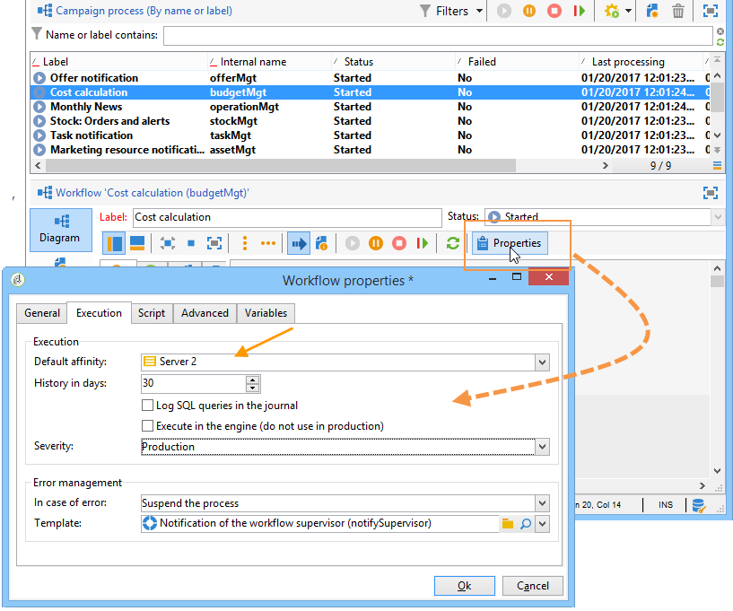
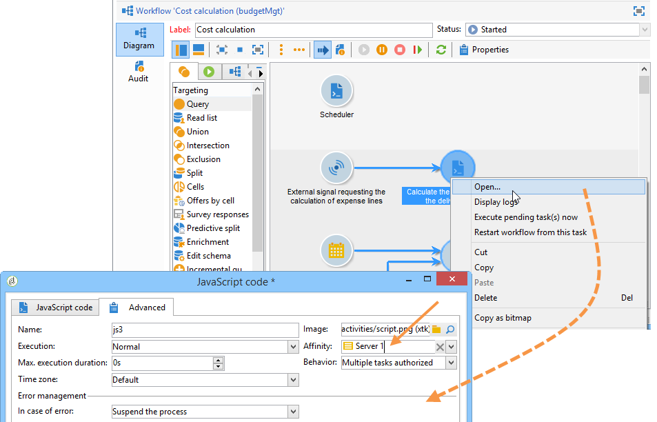

# Get started with Campaign server configuration{#gs-campaign-server-config}

This chapter details server-side configurations that can be performed to match your needs and your environment specificities.

## Restrictions

These procedures are restricted to **on-premise**/**hybrid** deployments and require Administration permissions. 

For **hosted** deployments, server-side settings can be configured by Adobe only. However, some settings can be set up within  [Campaign Control Panel](https://experienceleague.adobe.com/docs/control-panel/using/discover-control-panel/key-features.html), such as IP allowlist management or URL permissions. [Learn more](https://experienceleague.adobe.com/docs/control-panel/using/instances-settings/ip-allow-listing-instance-access.html).

For more information, refer to these sections:

* [Control Panel documentation](https://docs.adobe.com/content/help/en/control-panel/using/control-panel-home.html)
* [Hosting models](../../installation/using/hosting-models.md)
* [Campaign Classic On-premise & Hosted capability matrix](../../installation/using/capability-matrix.md)

## Configuration files

Campaign Classic configuration files are stored in the **conf** folder of the Adobe Campaign installation folder. The configuration is spread over two files:

* **serverConf.xml**: general configuration for all instances. This file combines the technical parameters of the Adobe Campaign server: these are shared by all instances. The description of some of these parameters is detailed below. The different nodes and parameters and listed in this [section](../../installation/using/the-server-configuration-file.md).
* **config-`<instance>`.xml** (where **instance** is the name of the instance): specific configuration of the instance. If you share your server among several instances, please enter the parameters specific to each instance in their relevant file.

## Configuration scope

Configure or adapt Campaign server depending on your needs and configuration. You can:

* Secure the [Internal identifier](#internal-identifier)
* Enable [Campaign processes](#enabling-processes)
* Configure [URL Permissions](url-permissions.md)
* Define [Security Zones](security-zones.md)
* Configure [Tomcat settings](configure-tomcat.md)
* Customize [Delivery parameters](configure-delivery-settings.md)
* Define [Dynamic page security and relays](#dynamic-page-security-and-relays)
* Restrict the list of [Allowed external commands](#restricting-authorized-external-commands)
* Set up [Redundant tracking](#redundant-tracking)
* Manage [High availability and workflow affinities](#high-availability-workflows-and-affinities)
* Configure file management - [Learn more](file-res-management.md)
   * Limit upload files format
   * Enable access to public resources
   * Configure Proxy connection
* [Automatic process restart](#automatic-process-restart)


## Internal identifier {#internal-identifier}

The **internal** identifier is a technical login to be used for installation, administration and maintenance purposes. This login is not associated with an instance.

Operators connected using this login will have all the rights on all instances. This login won't have a password in the case of a new installation. You must manually define this password.

Use the following command:

```
nlserver config -internalpassword
```

The following information is then displayed. Enter and confirm the password:

```
17:33:57 >   Application server for Adobe Campaign Classic (7.X YY.R build XXX@SHA1) of DD/MM/YYYY
Enter the current password.
Password:
Enter the new password.
Password: XXXX
Confirmation: XXXX
17:34:02 >   Password successfully changed for account 'internal' (authentication mode 'nl')
```

## Enable processes {#enabling-processes}

Adobe Campaign processes on the server are enabled (and disabled) via the **config-default.xml** and **`config-<instance>.xml`** files.

To apply the changes to these files, if the Adobe Campaign service is started, you must run the **nlserver config -reload** command.

There are two types of processes: multi-instance and single instance.

* **multi-instance**: one single process is started for all instances. This is the case for **web**, **syslogd** and **trackinglogd** processes.

  Enablement can be configured from the **config-default.xml** file.

  Declaring an Adobe Campaign server to access client consoles and for redirection (tracking):

  ```
  vi nl6/conf/config-default.xml
  <web args="-tomcat" autoStart="true"/>  
  <!-- to start if the machine is also a redirection server -->  
  <trackinglogd autoStart="true"/>
  ```

  In this example, the file is edited using a **vi** command in Linux. It can be edited using any **.txt** or **.xml** editor.

* **mono-instance**: one process is started for each instance (modules: **mta**, **wfserver**, **inMail**, **sms** and **stat**).

  Enablement can be configured using the configuration file of the instance:

  ```
  config-<instance>.xml
  ```

  Declaring a server for delivery, executing workflow instances and recovering bounce mail:

  ```
  <mta autoStart="true" statServerAddress="localhost"/>
  <wfserver autoStart="true"/>  
  <inMail autoStart="true"/>
  <stat autoStart="true"/>
  ```

**Campaign data storage**

You can configure the storage directory (**var** directory) of Adobe Campaign data (logs, downloads, redirections, etc.). To do this, use the **XTK_VAR_DIR** system variable:

* In Windows, indicate the following value value in the **XTK_VAR_DIR** system variable

  ```
  D:\log\AdobeCampaign
  ```

* In Linux, go to the **customer.sh** file and indicate: **export XTK_VAR_DIR=/app/log/AdobeCampaign**.

  For more on this, refer to [Personalize parameters](../../installation/using/installing-packages-with-linux.md#personalizing-parameters).


## Dynamic page security and relays {#dynamic-page-security-and-relays}

By default, all dynamic pages are automatically related to the **local** Tomcat server of the machine whose Web module has started. This configuration is entered in the **`<url>`** section of the query relay configuration for the **ServerConf.xml** file. 

You can relay execution of the dynamic page on a **remote** server; if the Web module is not activated on the computer. To do this, you must replace the **localhost** with the name of the remote computer for JSP and JSSP, Web applications, reports and strings.

For more on the various parameters available, refer to the **serverConf.xml** configuration file.

For JSP pages, the default configuration is:

```
<url relayHost="true" relayPath="true" targetUrl="http://localhost:8080" urlPath="*.jsp"/>
```

Adobe Campaign uses the following JSP pages:

* /nl/jsp/**soaprouter.jsp**: client console and Web services connections (SOAP APIs),
* /nl/jsp/**m.jsp**: mirror pages,
* /nl/jsp/**logon.jsp**: Web-based access to reports and to deployment of the client console,
* /nl/jsp/**s.jsp** : Using viral marketing (sponsoring and social networks).

The JSSPs used for the Mobile App Channel are as follows:

* nms/mobile/1/registerIOS.jssp
* nms/mobile/1/registerAndroid.jssp

**Example:**

It's possible to prevent client machine connections from the outside. To do this, simply restrict the execution of **soaprouter.jsp** and only authorize the execution of mirror pages, viral links, web forms and public resources.

The parameters are as follows:

```
<url IPMask="<IP_addresses>" deny=""     hostMask="" relayHost="true"  relayPath="true"  targetUrl="http://localhost:8080" timeout="" urlPath="*.jsp"/>
<url IPMask="<IP_addresses>" deny=""     hostMask="" relayHost="true"  relayPath="true"  targetUrl="http://localhost:8080" timeout="" urlPath="*.jssp"/> 
<url IPMask=""               deny=""     hostMask="" relayHost="true" relayPath="true" targetUrl="http://localhost:8080" timeout="" urlPath="m.jsp"/>
<url IPMask=""               deny=""     hostMask="" relayHost="true" relayPath="true" targetUrl="http://localhost:8080" timeout="" urlPath="s.jsp"/>
<url IPMask=""               deny=""     hostMask="" relayHost="true" relayPath="true" targetUrl="http://localhost:8080" timeout="" urlPath="webForm.jsp"/>
<url IPMask=""               deny=""     hostMask="" relayHost="true"  relayPath="true"  targetUrl="http://localhost:8080" timeout="" urlPath="/webApp/pub*"/>
<url IPMask=""               deny=""     hostMask="" relayHost="true"  relayPath="true"  targetUrl="http://localhost:8080" timeout="" urlPath="/jssp/pub*"/>
<url IPMask=""               deny=""     hostMask="" relayHost="true"  relayPath="true"  targetUrl="http://localhost:8080" timeout="" urlPath="/strings/pub*"/>
<url IPMask=""               deny=""     hostMask="" relayHost="true"  relayPath="true"  targetUrl="http://localhost:8080" timeout="" urlPath="/interaction/pub*"/>
<url IPMask=""               deny="true" hostMask="" relayHost="false" relayPath="false" targetUrl="http://localhost:8080" timeout="" urlPath="*.jsp"/>
<url IPMask=""               deny="true" hostMask="" relayHost="false" relayPath="false" targetUrl="http://localhost:8080" timeout="" urlPath="*.jssp"/>
```

In this example, the **`<IP_addresses>`** value coincides with the list of IP addresses (separated by comas) authorized to use the relay module for this mask.

>[!NOTE]
>
>Values shall be adapted according to your configuration and your network constraints, especially if specific configurations have been developed for your installation.

### Manage HTTP headers {#managing-http-headers}

By default, all HTTP headers are not relayed. You can add specific headers in the replies sent by relay. To do this:

1. Go to the **serverConf.xml** file.
1. In the **`<relay>`** node, go to the list of relayed HTTP headers.
1. Add a **`<responseheader>`** element with the following attributes:

    * **name**: header name
    * **value**: value name.

   For example:

   ```
   <responseHeader name="Strict-Transport-Security" value="max-age=16070400; includeSubDomains"/>
   ```

## Restrict authorized external commands {#restricting-authorized-external-commands}

From build 8780, technical administrators can restrict the list of authorized external commands that can be used in Adobe Campaign.

To do that, you need to create a text file with the list of commands that you want to prevent from using, for example:

```
ln
dd
openssl
curl
wget
python
python3
perl
ruby
sh
```

>[!IMPORTANT]
>
>This list is not exhaustive.

In the **exec** node of the server configuration file, you need to reference the previously created file in the **blacklistFile** attribute.

**For Linux only**: in the server configuration file, we recommand that you specify a user dedicated to executing external commands to enhance your security configuration. This user is set in the **exec** node of the configuration file. All the parameters available in the **serverConf.xml** are listed in this [section](../../installation/using/the-server-configuration-file.md).

>[!NOTE]
>
>If no user is specified, all commands are executed in the user context of the Adobe Campaign instance. The user must be different than the user running Adobe Campaign.

For example:

```
<serverConf>
 <exec user="theUnixUser" blacklistFile="/pathtothefile/blacklist"/>
</serverConf>
```

This user needs to be added to the sudoer list of the 'neolane' Adobe Campaign operator.

>[!IMPORTANT]
>
>You should not use a custom sudo. A standard sudo needs to be installed on the system.


## Redundant tracking {#redundant-tracking}

When multiple servers are used for redirection, they must be able to communicate with each other via SOAP calls in order to share information from the URLs to be redirected. At the time of delivery start-up, it is possible that not all the redirection servers will be available; therefore they might not have the same level of information.

>[!NOTE]
>
>When using the standard or enterprise architecture, the main application server must be authorized to upload tracking information on each computer.

The URLs of the redundant servers must be specified in the redirection configuration, via the **serverConf.xml** file.

**Example:**

```
<spareserver enabledIf="$(hostname)!='front_srv1'" id="1" url="http://front_srv1:8080" />
<spareserver enabledIf="$(hostname)!='front_srv2'" id="2" url="http://front_srv2:8080" />
```

The **enableIf** property is optional (empty by default) and allows you to enable the connection only if the result is true. This lets you obtain an identical configuration on all redirection servers.

To obtain the hostname of the computer, run the following command: **hostname -s**.


## High availability workflows and affinities {#high-availability-workflows-and-affinities}

You can configure several workflow servers (wfserver) and distribute them on two or more machines. If you choose this type of architecture, configure the connection mode of the load balancers according to the Adobe Campaign access.

For access from the web, select the **load balancer** mode to limit connection times.

If accessing via the Adobe Campaign console, choose **hash** or **sticky ip** mode. This lets you maintain the connection between the rich client and the server and prevent a user session from being interrupted during an import or export operation, for example.

You can choose to force the execution of a workflow or a workflow activity on a particular machine. To do this, you must define one or more affinities for the concerned workflow or activity.

1. Create the affinities of the workflow or activity by entering them in the **[!UICONTROL Affinity]** field.

   You can choose any affinity name, but make sure you do not use spaces or punctuation marks. If you use different servers, specify different names.

   

   

   The drop-down list contains formerly used affinities. It is completed over time with the different entered values.

1. Open the **nl6/conf/config-`<instance>.xml`** file.
1. Modify the line which matches the **[!UICONTROL wfserver]** module as follows:

   ```
   <wfserver autoStart="true" affinity="XXX,"/>
   ```

   If you define several affinities, they must be separated by commas without any spaces:

   ```
   <wfserver autoStart="true" affinity="XXX,YYY,"/>
   ```

   The comma following the name of the affinity is necessary for the execution of workflows for which no affinity is defined.

   If you wish to execute only workflows for which an affinity is defined, do not add a comma at the end of the list of your affinities. For example, modify the line as follows:

   ```
   <wfserver autoStart="true" affinity="XXX"/>
   ```

## Automatic restart {#automatic-process-restart}

By default, the different Adobe Campaign processes restart automatically at 6am (server time) every day.

However, you can change this configuration.

To do this, go to the **serverConf.xml** file, located in the **conf** repository of your installation.

Each process configured in this file has a **processRestartTime** attribute. You can modify the value of this attribute to adapt the restart time of each process according to your needs.

>[!IMPORTANT]
>
>Do not delete this attribute. All processes must be restarted every day.
