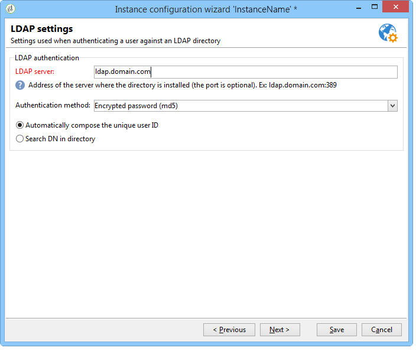
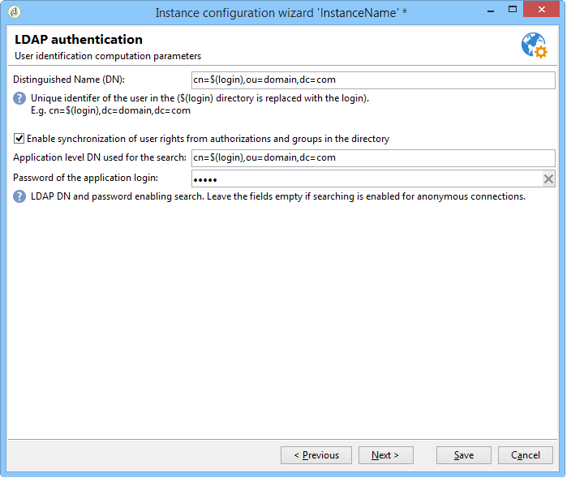
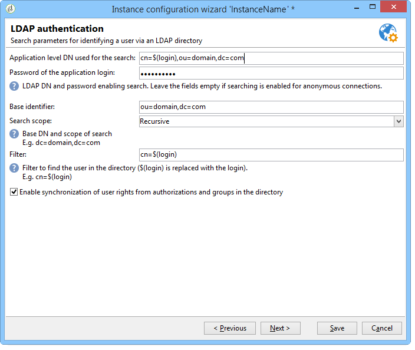
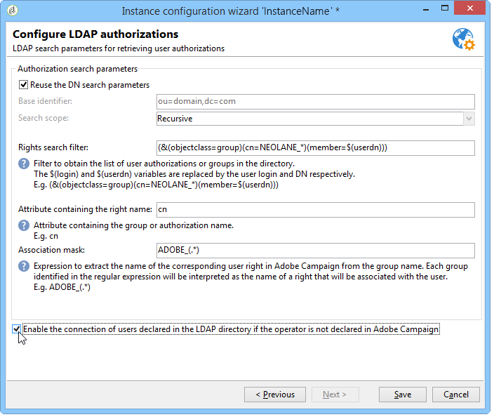
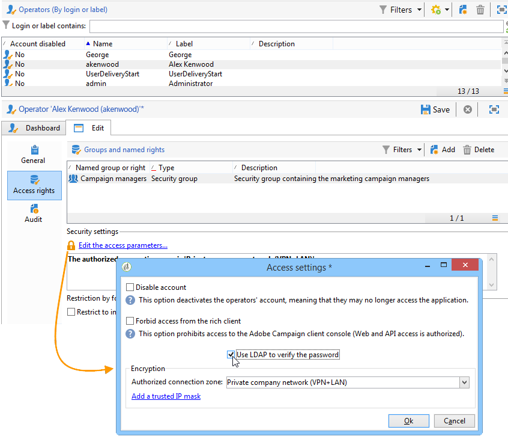

# Connecting through LDAP{#connecting-through-ldap}

## Configuring Campaign and LDAP {#configuring-campaign-and-ldap}

>[!NOTE]
>
>The LDAP configuration is only possible for on-premise or hybrid installations.

The LDAP configuration is carried out in the deployment wizard. The **[!UICONTROL LDAP integration]** option must be selected during the first configuration step. Refer to [Deployment wizard](../../installation/using/deploying-an-instance.md#deployment-wizard).

The window lets you configure the identification of Adobe Campaign users via the specified LDAP directory.

* Specify the address of the LDAP server in the **[!UICONTROL LDAP server]** field. You can add the port number. By default, the port used is 389.
* In the drop-down list, select the authentication method for users:

    * Encrypted password (**md5**)

      Default mode.
    
    * Plain text password + SSL (**TLS**)

      The entire authentication procedure (password included) is encrypted. The secure port 636 must not be used in this mode: Adobe Campaign automatically switches to secure mode.

      When you use this authentication mode, in Linux, the certificate is verified by an openLDAP client library. We recommend using a valid SSL certificate so that the authentication procedure is encrypted. Otherwise, information will be in plain text.

      The certificate is also verified in Windows.
    
    * Windows NT LAN Manager (**NTLM**)

      Proprietary Windows authentication. The **[!UICONTROL Unique identifier]** is used for the domain name only. 
    
    * Distributed Password Authentication (**DPA**)

      Proprietary Windows authentication. The **[!UICONTROL Unique identifier]** is used for the domain name only (domain.com). 
    
    * Plain text password

      No encryption (for use in test phases only).

* Select the user authentication mode: **[!UICONTROL Automatically compute the unique user identifier]** (see step [Distinguished Name calculation](#distinguished-name-calculation)) or **[!UICONTROL Search the unique user identifier in the directory]** (see step [Searching for identifiers](#searching-for-identifiers)).

## Compatibility {#compatibility}

The systems that are compatible depend on the selected authentication mechanism. The following is a compatibility matrix of operating systems and LDAP servers.

<table> 
 <thead> 
  <tr> 
   <th> </th> 
   <th> OpenLDAP  </th> 
   <th> Active Directory  </th> 
  </tr> 
 </thead> 
 <tbody> 
  <tr> 
   <td> md5  </td> 
   <td> Windows, Linux  </td> 
   <td> Linux  </td> 
  </tr> 
  <tr> 
   <td> TLS  </td> 
   <td> Linux  </td> 
   <td> Windows, Linux  </td> 
  </tr> 
  <tr> 
   <td> NTLM &amp; DPA  </td> 
   <td> </td> 
   <td> Windows  </td> 
  </tr> 
  <tr> 
   <td> plain text  </td> 
   <td> Windows, Linux  </td> 
   <td> Windows, Linux  </td> 
  </tr> 
 </tbody> 
</table>

## Distinguished Name calculation {#distinguished-name-calculation}

If you wish to compute the Distinguished Name (DN) identifiers, the next step of the deployment wizard lets you configure the calculation mode.

* Specify the unique identifier of the user in the directory (Distinguished Name - DN) in the **[!UICONTROL Distinguished Name]** field.

  **[!UICONTROL (login)]** will be replaced with the identifier of the Adobe Campaign operator.

  >[!CAUTION]
  >
  >The **[!UICONTROL dc]** setting must be in lowercase.

* Select the option **[!UICONTROL Enable synchronization of user rights from authorizations and groups in the directory]** in order to synchronize the group and user associations in the LDAP directory and the group and user associations in Adobe Campaign.

  When you select this option, the **[!UICONTROL Application level DN used for the search]** and **[!UICONTROL Password of the application login]** are enabled.

  If you populate these two fields, Adobe Campaign will connect to the LDAP server with its own login and password. If they are empty, Adobe Campaign will connect to the server anonymously.

## Searching for identifiers {#searching-for-identifiers}

If you choose to search for an identifier, the deployment wizard lets you configure the search.

* In the **[!UICONTROL Application level DN used for the search]** and **[!UICONTROL Password of the application login]** fields, provide the identifier and password with which Adobe Campaign will connect to search for the identifier. If they are empty, Adobe Campaign will connect to the server anonymously. 
* Specify the **[!UICONTROL Base identifier]** and **[!UICONTROL Search scope]** fields in order to determine a subset of the LDAP directory to start the search from.

  Select the required mode in the drop-down list: 

  

    1. **[!UICONTROL Recursive (default mode)]**.

       The LDAP directory is searched in full, starting from a given level.
    
    1. **[!UICONTROL Limited to the base]**.

       All attributes are included in the search.
    
    1. **[!UICONTROL Limited to the first sub-level of the base]**.

       The search is performed on all attributes of the directory and starting from the first level of the attribute.

* The **[!UICONTROL Filter]** field enables you to specify an element to refine the scope of the search.

## Configuring LDAP authorizations {#configuring-ldap-authorizations}

This window is displayed when you select the **[!UICONTROL Enable synchronization of user rights from authorizations and groups in the directory]** option.

You must specify several parameters in order to find the group or groups to which the user belongs and their corresponding rights, i.e.:

* the **[!UICONTROL Database identifier]** field,
* the **[!UICONTROL Search scope]** field,

  >[!NOTE]
  >
  >If you have chosen to search for the DN, you can select **[!UICONTROL Reuse the DN search parameters]** in order to carry over the selected values for the DN and search scope from the previous screen.

* the **[!UICONTROL Rights search filter]** field, based on the login and the user's distinguished name,
* the **[!UICONTROL Attribute containing the group or authorization name]** field concerning the user,
* the **[!UICONTROL Association mask]** field enabling the extraction of the group name in Adobe Campaign and its associated rights. You can use regular expressions to search for the name.
* Select **[!UICONTROL Enable the connection of users declared in the LDAP directory if the operator is not declared in Adobe Campaign]** so that the user is automatically granted access rights on connection.

Click **[!UICONTROL Save]** to finish configuring the instance.

## Managing operators {#managing-operators}

Once you have confirmed the configuration, you must define which Adobe Campaign operators are managed via the LDAP directory.

To use the LDAP directory to authenticate an operator, edit the corresponding profile and click the **[!UICONTROL Edit the access parameters]** link. Select the **[!UICONTROL Use LDAP for authentication]** option: The **[!UICONTROL Password]** field is grayed out for this operator.

## Use cases {#use-cases}

This section provides a few simple use cases to help you achieve the most appropriate configurations based on your needs.

1. A user has been created in the LDAP directory but not in Adobe Campaign.

   Adobe Campaign can be configured so that the user accesses the platform via their LDAP authentication. Adobe Campaign needs to be able to control the validity of the ID/password combination in the LDAP directory, so that the operator can be created on-the-fly in Adobe Campaign. To do this, check the **[!UICONTROL Enable the connection of users declared in the LDAP directory if the operator is not declared in Adobe Campaign]** option. In this case, group synchronization also needs to be configured: the **[!UICONTROL Enable synchronization of user rights from authorizations and groups in the directory]** option needs to be selected. 

1. The user has been created in Adobe Campaign but not in the LDAP directory.

   They won't be able to log on to Adobe Campaign.

1. There is a group in the LDAP directory which does not exist in Adobe Campaign.

   This group will not be created in Adobe Campaign. You need to create the group and synchronize the groups to enable a match-up via the **[!UICONTROL Enable synchronization of user rights from authorizations and groups in the directory]** option.

1. Groups exist in Adobe Campaign and the LDAP directory is activated after the event: user groups in Adobe Campaign aren't automatically replaced with the content of LDAP groups. Likewise, if a group only exists in Adobe Campaign, no LDAP users may be added to it until the group has been created and synchronized in LDAP.

   Groups are never created on the fly, whether by Adobe Campaign or by LDAP. They need to be created individually, both in Adobe Campaign and in the LDAP directory.

   The names of groups in the LDAP directory need to coincide with the names of Adobe Campaign groups. Their association mask is defined in the last configuration stage of the deployment wizard: Adobe Campaign_(.&#42;), for instance.
