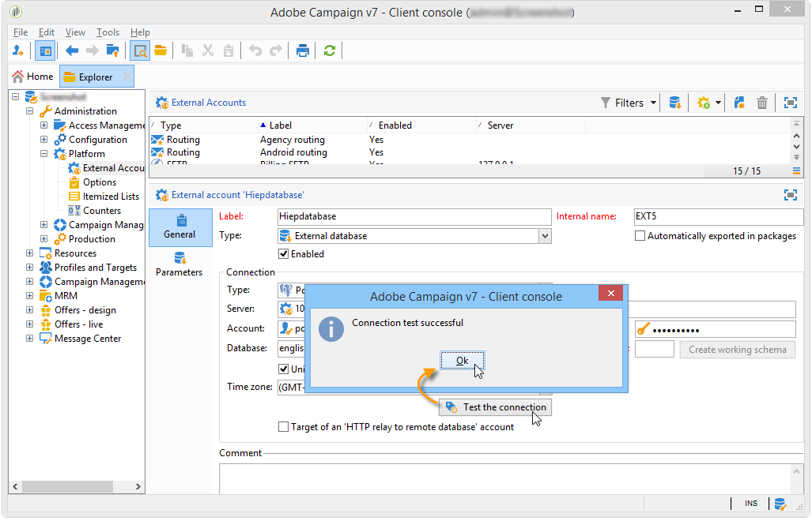
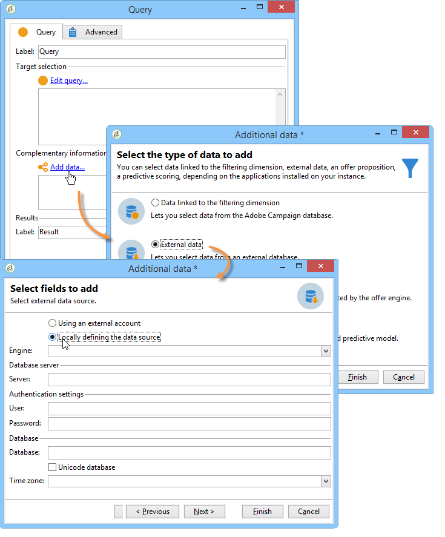
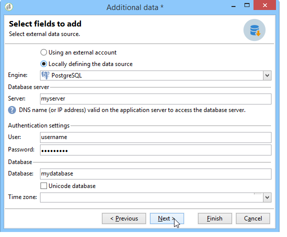

# Connecting to the database {#connecting-to-the-database}

To enable a connection to the external database, you must indicate the connection parameters, i.e. the targeted data source and the name of the table with data requiring loading.

>[!CAUTION]
>
>The Adobe Campaign user needs specific rights for the external database and the Adobe Campaign application server to process data from an external database. For more on this, refer to the [Remote database access rights](../../installation/using/remote-database-access-rights.md) section.
>
>To avoid any malfunction, operators who access remote shared data must be working from separate spaces.

## Creating a shared connection {#creating-a-shared-connection}

To enable a connection to a shared external database, as long as this connection is active, the database can be accessed via Adobe Campaign.

1. The configuration must be defined beforehand via the **[!UICONTROL Administration > Platform > External accounts]** node.
1. Click the **[!UICONTROL New]** button and select the **[!UICONTROL External database]** type.
1. Define the **[!UICONTROL Connection]** parameters of the external database.

   For connections to an **ODBC** type database the **[!UICONTROL Server]** field must contain the name of the ODBC data source and not the server name. Moreover, certain additional configurations may be necessary depending on the databases used. Refer to the [Specific configurations by database type](../../installation/using/configure-fda.md) section.

1. Once the parameters are entered, click the **[!UICONTROL Test the connection]** button to approve them.

   

1. If necessary, uncheck the **[!UICONTROL Enabled]** option to disable access to this database without deleting its configuration.
1. To allow Adobe Campaign to access this database, you must deploy the SQL functions. Click the **[!UICONTROL Parameters]** tab then the **[!UICONTROL Deploy functions]** button.

   

You can define specific work tablespaces for the tables and for the index in the **[!UICONTROL Parameters]** tab.

## Creating a temporary connection {#creating-a-temporary-connection}

You can directly define a connection to an external database from workflow activities. In this case, it will be on a local external database, reserved to be used within a current workflow: it will not be saved on the external accounts. This type of punctual connection can be created on different activities of the workflow, particularly the **[!UICONTROL Query]**, the **[!UICONTROL Data loading (RDBMS)]**, the **[!UICONTROL Enrichment]** activity or the **[!UICONTROL Split]** activity.

>[!CAUTION]
>
>This type of configuration is not recommended but may be used periodically to collect data. Nevertheless, you should create an external account, as presented in the [Creating a shared connection](#creating-a-shared-connection) section.

For example, in the query activity, the steps for creating a periodic connection to an external database are as follows:

1. Click the **[!UICONTROL Add data...]** and select the **[!UICONTROL External data]** options.
1. Select the **[!UICONTROL Locally defining the data source]** option.

   

1. Select the target database engine in the drop-down list. Enter the name of the server and provide the authentication parameters.

   Also specify the name of the external database.

   

   Click the **[!UICONTROL Next]** button.

1. Select the table where the data is stored.

   You can enter the name of the table directly in the corresponding field or click the edit icon to access the list of the database tables.

   

1. Click the **[!UICONTROL Add]** button to define one or several reconciliation fields between the external database data and the data in the Adobe Campaign database. The **[!UICONTROL Edit expression]** icons of the **[!UICONTROL Remote field]** and **[!UICONTROL Local field]** gives you access to the list of fields of each of the tables.

   

1. If necessary, specify a filtering condition and the data sorting mode.
1. Select the additional data to be collected in the external database. To do this, double click on the fields(s) that you want to add to display them in the **[!UICONTROL Output columns]**. 

   

   Click **[!UICONTROL Finish]** to confirm this configuration.

## Secure connection {#secure-connection}

>[!NOTE]
>
>Secure connection is only available for PostgreSQL.

You can secure access to an external database when configuring an external FDA account.

To do this, add "**:ssl**" after the server address and address of the port used. For example: **192.168.0.52:4501:ssl**.

The data will then be sent via the secure SSL protocol.

## Additional configurations {#additional-configurations}

If necessary, you can create the schema for processing data in an external database. Likewise, Adobe Campaign lets you define mapping on the data in an external table. These configurations are general and do not apply to workflows exclusively.

>[!NOTE]
>
>For more on creating schemas in Adobe Campaign and defining a new data mapping, refer [this page](../../configuration/using/about-schema-edition.md).
