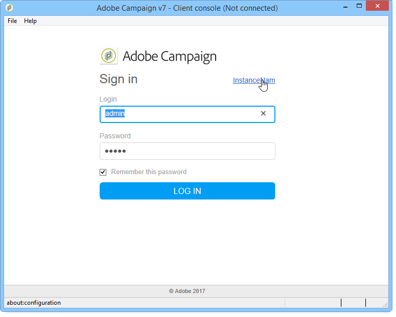
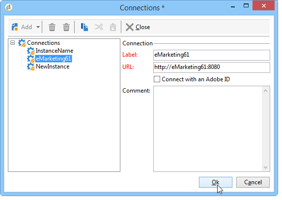
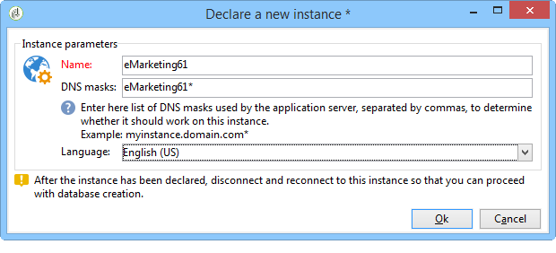

# Creating an instance and logging on{#creating-an-instance-and-logging-on}

To create a new instance and Adobe Campaign database, apply the following process:

1. Create the connection.
1. Log on to create the related instance.
1. Create and configure the database.

>[!NOTE]
>
>Only the **internal** identifier can carry out these operations. For more on this, refer to [this section](../../installation/using/configuring-campaign-server.md#internal-identifier).

When the Adobe Campaign console is started up, you access a login page.

To create a new instance, follow the steps below:

1. Click the link in the top right-hand corner of the credentials fields to access the connection configuration window. This link can be either **[!UICONTROL New...]** or an existing instance name.

   

1. Click **[!UICONTROL Add > Connection]** and enter the label and URL of the Adobe Campaign application server.

   

1. Specify a connection to your Adobe Campaign application server via a URL. Use either a DNS or an alias of the machine, or your IP address.

   For example, you can use the [`https://<machine>.<domain>.com`](https://myserver.adobe.com) type URL.

   >[!CAUTION]
   >
   >For the connection URL, only use the following characters: `[a-z]`, `[A-Z]`, `[0-9]` and dashes (-) or full stops.

1. Click **[!UICONTROL Ok]** to confirm settings: you can now begin with the instance creation process.
1. In the **[!UICONTROL Connection settings]** window, enter the **internal** login and its password to connect to the Adobe Campaign application server. Once connected, you access the instance creation wizard to declare a new instance
1. In the **[!UICONTROL Name]** field, enter the **instance name**. As this name is used to generate a configuration file **config-`<instance>`.xml** and is used in the command line parameters to identify the instance, make sure you choose a short name without special characters. For example: **eMarketing**.

   

   The name of the instance added to the domain name must not exceed 40 characters. This lets you restrict the size of "Message-ID" headers and prevents messages from being considered as spam, particularly by tools such as SpamAssassin.

1. In the **[!UICONTROL DNS masks]** fields, enter the **list of DNS masks** to which the instance should be attached. The Adobe Campaign server uses the hostname that appears in the HTTP requests to determine which instance to reach.

   The hostname is contained between the string **https://** and the first slash character **/** of the server address.

   You can define a list of values separated by commas.

   The ? and &#42; characters can be used as wildcards to replace one or various characters (DNS, port, etc.). For instance, the **demo&#42;** value will work with "https://demo" as it will with "https://demo:8080" and even "https://demo2".

   Names used must be defined in your DNS. You can also inform the correspondence between a DNS name and an IP address in the **c:/windows/system32/drivers/etc/hosts** file in Windows and in the **/etc/hosts** file in Linux. You therefore must modify the connection settings to use this DNS name in order to connect to your chosen instance.

   The server must be identified by this name, particularly for uploading images in emails.

   In addition, the server must be able to connect to itself by this name, and if possible by a loopback address - 127.0.0.1 -, particularly to allow reports to be exported in PDF format. 

1. In the **[!UICONTROL Language]** drop-down list, select the **instance language**: English (US), English (UK), French, or Japanese.

   Differences between US English and UK English are described in [this section](../../platform/using/adobe-campaign-workspace.md#date-and-time).

   >[!CAUTION]
   >
   >The instance language cannot be modified after this step. Adobe Campaign instances are not multilingual: you cannot switch the interface from a language to another.

1. Click **[!UICONTROL Ok]** to confirm instance declaration. Log off and back on to declare the database.

   >[!NOTE]
   >
   >The instance can be created from the command line. For more on this, refer to [Command lines](../../installation/using/command-lines.md).
