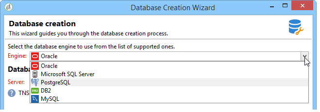
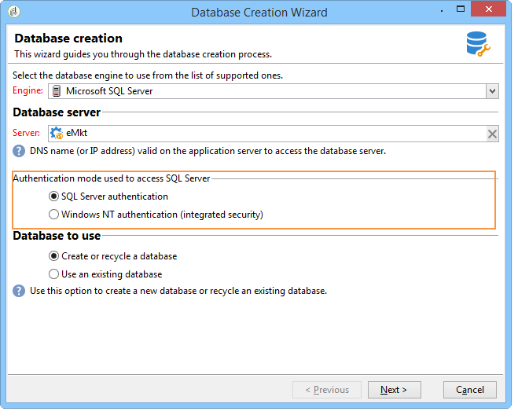
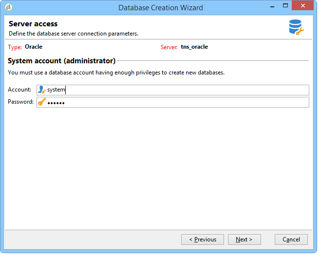
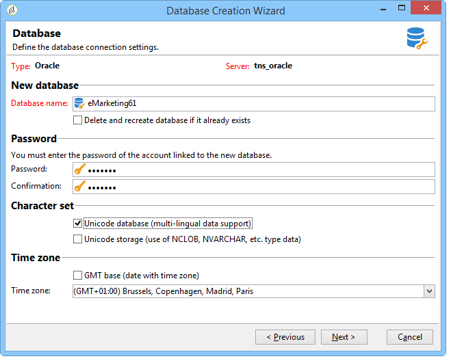
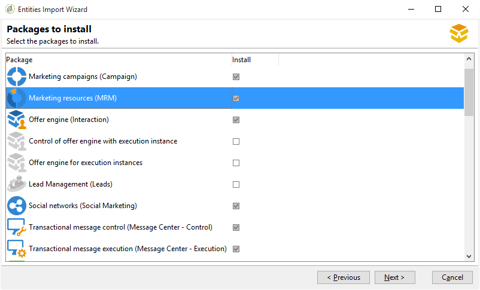
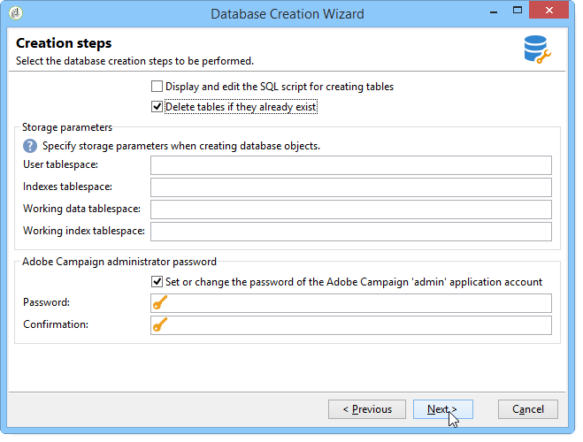
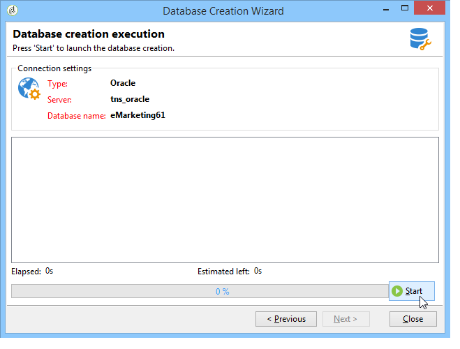
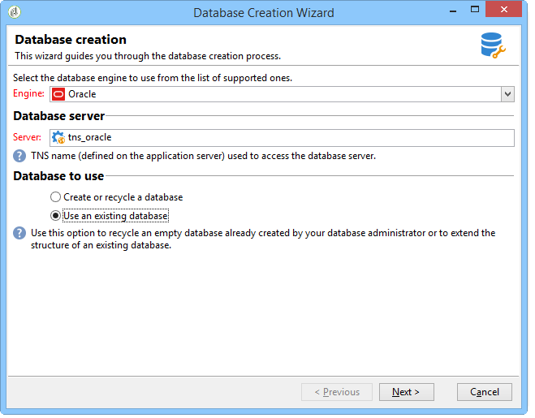
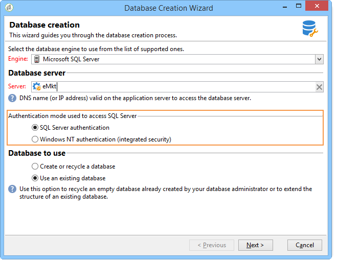
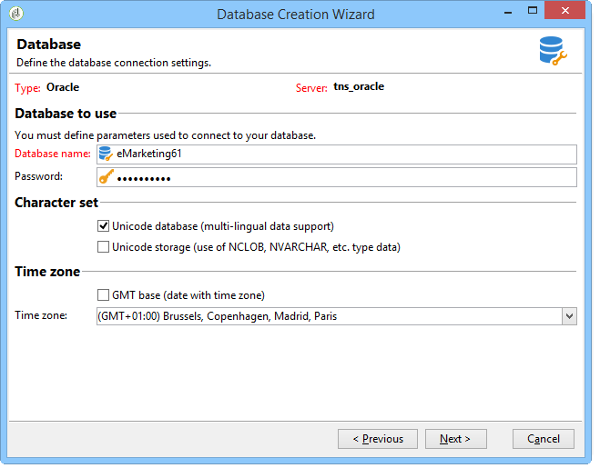

# Creating and configuring the database{#creating-and-configuring-the-database}

When you create a database, Adobe Campaign provides two different options:

1. Creating or recycling a database: choose this options if you want to create a new database or re-use an existing one. Refer to [Case 1: Creating/recycling a database](#case-1--creating-recycling-a-database).
1. Using an existing database: choose this option if an empty database has already been created by your administrator and you want to use it; or to extend the structure of an existing database. Refer to [Case 2: Using an existing database](#case-2--using-an-existing-database).

The configuration steps are detailed hereafter.

>[!CAUTION]
>
>Names of databases, users and schemas must not start with a number or include special characters.
>
>Only the **internal** identifier can carry out these operations. For more on this, refer to [this section](../../installation/using/configuring-campaign-server.md#internal-identifier).

## Case 1: Creating/recycling a database {#case-1--creating-recycling-a-database}

The steps for creating a database or recycling an existing base are presented below. Some configurations depend on the database engine used:

The following steps are involved:

* [Step 1 - Selecting the database engine](#step-1---selecting-the-database-engine),
* [Step 2 - Connecting to the server](#step-2---connecting-to-the-server),
* [Step 3 - Connection and characteristics of the database](#step-3---connection-and-characteristics-of-the-database),
* [Step 4 - Packages to install](#step-4---packages-to-install),
* [Step 5 - Creation steps](#step-5---creation-steps),
* [Step 6 - Creating the database](#step-6---creating-the-database).

### Step 1 - Selecting the database engine {#step-1---selecting-the-database-engine}

Select the database engine among those in the drop-down list.



Supported databases are listed in Campaign [Compatibility matrix](../../rn/using/compatibility-matrix.md).

Identify the server and choose the type of operation to perform. In this case, **[!UICONTROL Create or recycle a database]**.


Depending on the selected database engine, the server identification information may vary.

* For an **Oracle** engine, populate the **TNS name** defined for the application server.
* For a **PostgreSQL** or **DB2** engine, you must specify the DNS name (or IP address) defined on the application server to access the database server.
* For a **Microsoft SQL Server** engine, you must define: the DNS name (or IP address) defined on the application server to access the database server: **DNS** or **DNS `\<instance>`** (instance mode),

   >[!CAUTION]
   >
   > Starting 20.3, Windows NT authentication is decommissioned. **[!UICONTROL SQL Server authentication]** is now the only authentication mode available for Microsoft SQL Server. [Read more](../../rn/using/deprecated-features.md)

   

### Step 2 - Connecting to the server {#step-2---connecting-to-the-server}

In the **[!UICONTROL Server access]** window, define the database server access. 



To do this, enter the name and password of an **Administration system account** which has permission to access the databases, i.e.:

* **system** for an Oracle database,
* **sa** for a Microsoft SQL Server database,
* **postgres** for a PostgreSQL database,
* **db2inst1** for a DB2 database.

### Step 3 - Connection and characteristics of the database {#step-3---connection-and-characteristics-of-the-database}

The following step lets you configure the settings for logging on to the database.



You need to define the following settings:

* Specify the name of the database to be created.

  >[!NOTE]
  >
  >For a DB2 database, the name of the database must not exceed 8 characters.

* Enter the password of the account linked to this database.
* Indicate whether or not the database must be in Unicode.

  The **[!UICONTROL Unicode database]** option lets you store all character types in Unicode regardless of language.

  >[!NOTE]
  >
  >With an Oracle database, the **[!UICONTROL Unicode storage]** option lets you use **NCLOB** and **NVARCHAR** type fields. 
  > 
  >If you do not select this option, the character set (charset) of the Oracle database must enable data storage in all languages (AL32UTF8 is recommended).

* Choose a time zone for the database and specify whether you want it to be in UTC (if available).

  For more on this, refer to [Time zone management](../../installation/using/time-zone-management.md).

### Step 4 - Packages to install {#step-4---packages-to-install}

Select the packages you wish to install.

Refer to your license agreement to check which solutions and options you are entitled to install, such as "Interaction" or "Social Marketing".



### Step 5 - Creation steps {#step-5---creation-steps}

The **[!UICONTROL Creation steps]** window enables you to display and edit the SQL script used to create the tables.



* For an Oracle, Microsoft SQL Server or PostgreSQL database, the administrator may also define the **storage parameters** to be used when creating database objects.

  These parameters receive the exact tablespace names (warning: case sensitive). They are respectively stored in the **[!UICONTROL Administration > Platform > Options]** node in the following options (see [this section](../../installation/using/configuring-campaign-options.md#database)):

    * **WdbcOptions_TableSpaceUser**: user tables based on a schema
    * **WdbcOptions_TableSpaceIndex**: index of user tables based on a schema
    * **WdbcOptions_TableSpaceWork**: work tables with no schema
    * **WdbcOptions_TableSpaceWorkIndex**: index of work tables with no schema

* For an Oracle database, the Adobe Campaign user must have access to the Oracle libraries, typically as a member of the **oinstall** group.
* The **[!UICONTROL Set or change the administrator password]** option lets you enter the password linked to the Adobe Campaign operator with administrator rights.

  We recommend defining an Adobe Campaign account administrator password for security purposes.

### Step 6 - Creating the database {#step-6---creating-the-database}

The final stage of the wizard enables you to create the database. Click **[!UICONTROL Start]** to confirm.



Once the database is created, you can re-connect to finalize instance configuration.

You must now start the deployment wizard to finish configuring the instance. Refer to [Deployment wizard](../../installation/using/deploying-an-instance.md#deployment-wizard).

The connection settings for the database linked to the instance are stored in the file **`/conf/config-<instance>.xml`** found in the Adobe Campaign installation directory.

Example of a Microsoft SQL Server configuration on the base61 database linked to the 'campaign' account with its encrypted password:

```
<dbcnx encrypted="1" login="campaign:myBase" password="myPassword" provider="DB" server="dbServer"/>
```

## Case 2: Using an existing database {#case-2--using-an-existing-database}

The database, as well as the user, must have been created by the database administrator and the access rights correctly configured.

For instance, for an Oracle database, the minimum required rights are: GRANT CONNECT, RESOURCE and UNLIMITED TABLESPACE.

To use an existing database, the configuration steps are as follows:

* [Step 1 - Choosing the database engine](#step-1---choosing-the-database-engine),
* [Step 2 - Database connection settings](#step-2---database-connection-settings),
* [Step 3 - Packages to install](#step-3---packages-to-install),
* [Step 4 - Creation steps](#step-4---creation-steps),
* [Step 5 - Creating the database](#step-5---creating-the-database).

### Step 1 - Choosing the database engine {#step-1---choosing-the-database-engine}

Choose the database engine from the drop-down list.


Identify the server and choose the type of operation you want to carry out. In this case, **[!UICONTROL Use an existing database]**.



Depending on the selected database engine, the server identification information may vary.

* For an **Oracle** engine, populate the **TNS name** defined for the application server.
* For a **PostgreSQL** or **DB2** engine, you must specify the DNS name (or IP address) defined on the application server to access the database server.
* For a **Microsoft SQL Server** engine, you must define:

    1. the DNS name (or IP address) defined on the application server to access the database server,
    1. the security method used to access Microsoft SQL Server: **[!UICONTROL SQL Server authentication]** or **[!UICONTROL Windows NT authentication]**.
    
       

### Step 2 - Database connection settings {#step-2---database-connection-settings}

In the **[!UICONTROL Database]** window, define the database connection settings. 



You need to define the following settings:

* Enter the name of the database to be used,
* Enter the name and password of the account associated with this database,

  >[!NOTE]
  >
  >Make sure that both the schema name and user name match. Recommended way of creating database is through campaign console client.
  >For an Oracle database, you do not need to enter the account name.

* Indicate whether the database should be Unicode or not.

### Step 3 - Packages to install {#step-3---packages-to-install}

Select the packages you wish to install.

Refer to your license agreement to check which solutions and options you are entitled to install, such as "Interaction" or "Leads".


### Step 4 - Creation steps {#step-4---creation-steps}

The **[!UICONTROL Creation steps]** window enables you to display and edit the SQL script used to create the tables.


* For Oracle, Microsoft SQL Server or PostgreSQL databases, the administrator can define the **storage parameters** to be used when creating database objects.
* For an Oracle database, the Adobe Campaign user must have access to the Oracle libraries, typically as a member of the **oinstall** group.
* The **[!UICONTROL Set or change the administrator password]** option lets you enter the password linked to the Adobe Campaign operator with administrator rights.

  We recommend defining an Adobe Campaign account administrator password for security purposes.

### Step 5 - Creating the database {#step-5---creating-the-database}

The final stage of the wizard enables you to create the database. Click **[!UICONTROL Start]** to confirm.


Once database creation is complete, you can reconnect to finalize instance configuration.

You must now start the deployment wizard to finish configuring the instance. Refer to [Deployment wizard](../../installation/using/deploying-an-instance.md#deployment-wizard).

The connection settings for the database linked to the instance are stored in the file **`/conf/config-<instance>.xml`** found in the Adobe Campaign installation directory.

Example of a Microsoft SQL Server configuration on the base61 database linked to the 'campaign' account with its encrypted password:

```
<dbcnx encrypted="1" login="campaign:myBase" password="myPassword" provider="DB" server="dbServer"/>
```
