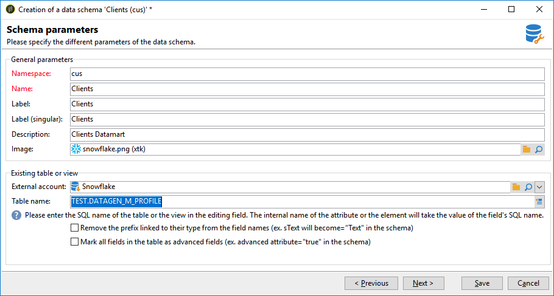
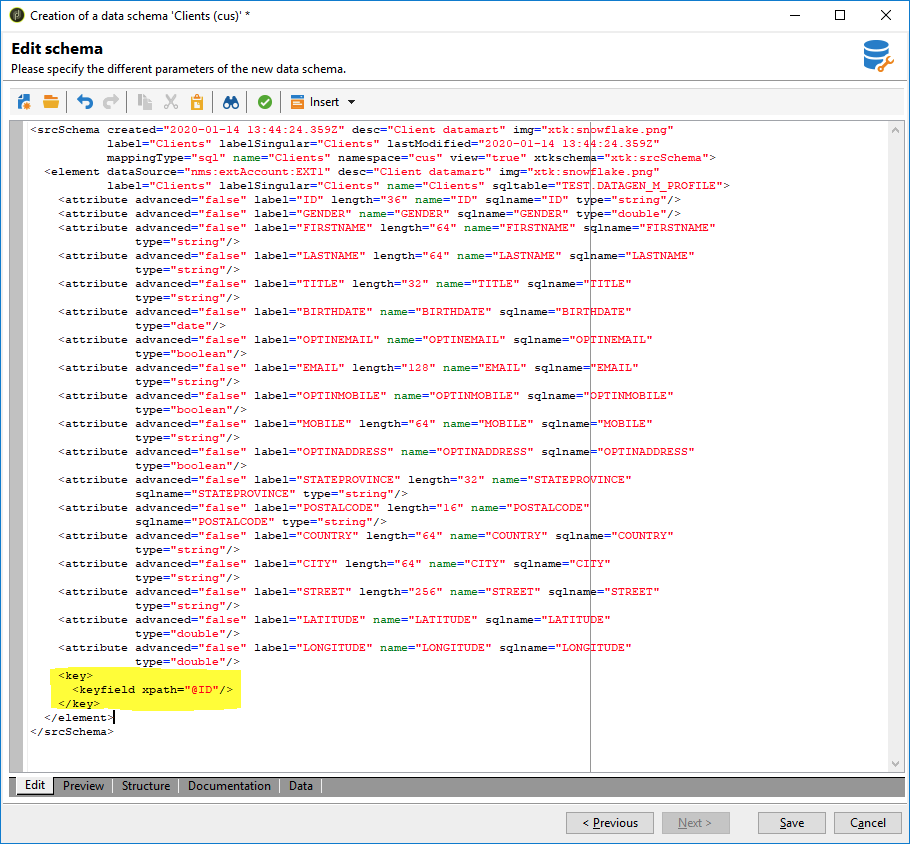

# Creating the data schema {#creating-the-data-schema}

To create a schema on an external database:

1. Click the **[!UICONTROL New]** button above the list of data schemas and choose **[!UICONTROL Access external data]**.

    

1. Enter a name and a description for the schema and select the external account which will enable connection to the database. This enables access to the list of tables available in the external base. Choose the table which contains the data to be collected.

    

1. Click **[!UICONTROL OK]** to confirm. Adobe Campaign automatically detects the structure of the selected table and generates the logical schema. Please note that Adobe Campaign does not generate links.

1. Click **[!UICONTROL Save]** to confirm creation.

    >[!CAUTION]
    >
    >With Snowflake, a primary key is mandatory.

    

The indexes are created automatically when mapping a table (standard or FDA mapping).
