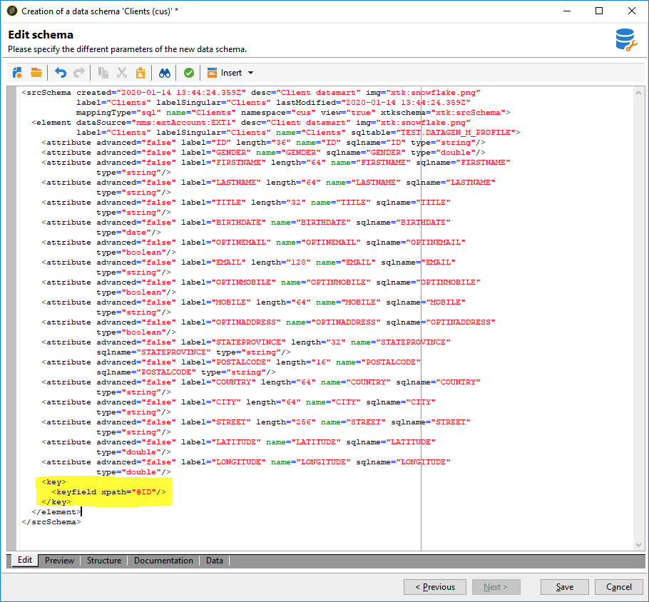

# Creating the data schema {#creating-the-data-schema}

To create a schema on an external database:

1. Click the **[!UICONTROL New]** button above the list of data schemas and choose **[!UICONTROL Access external data]**.

    

1. Enter a **[!UICONTROL Namespace]** and  **[!UICONTROL Name]** for the schema and select the **[!UICONTROL External account]** which will enable connection to the database. This enables access to the list of tables available in the external base.

    

1. From the **[!UICONTROL Table name]** field, choose the table which contains the data to be collected. 

    With Snowflake, you can select here your views if the database user has been granted the correct privileges. Note that when using views, Adobe Campaign will not be able to automatically generate the XML schema, you will have to create it yourself. For more information on views, refer to [Snowflake documentation](https://docs.snowflake.com/en/user-guide/views-introduction.html).

    

1. Click **[!UICONTROL OK]** to confirm. Adobe Campaign automatically detects the structure of the selected table and generates the logical schema. Please note that Adobe Campaign does not generate links.

1. Click **[!UICONTROL Save]** to confirm creation.

    >[!CAUTION]
    >
    >With Snowflake, a primary key is mandatory.

    

The indexes are created automatically when mapping a table (standard or FDA mapping).
