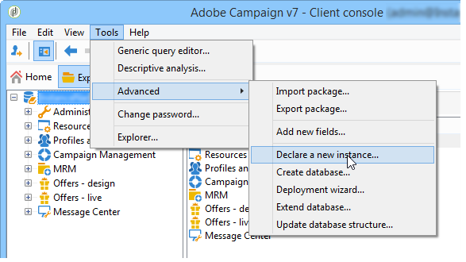

# Creating new instances{#creating-new-instances}

Once Adobe Campaign is installed and the instance created, you can add a new instance from the console. This creation mode lets you create tracking instances without accessing the console.

To do this, log on to an existing database and apply the following steps:

1. Declare a new instance

   Go to **[!UICONTROL Tools > Advanced > Declare a new instance...]** to start the wizard.

   

   Specify the parameters of the new instance. For more on this, refer to [Creating an instance and logging on](../../installation/using/creating-an-instance-and-logging-on.md).
