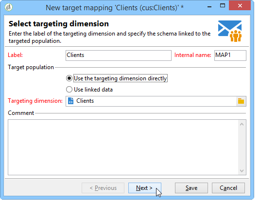
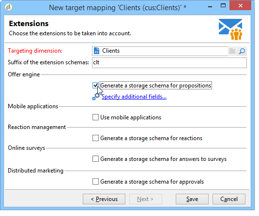

# Defining data mapping {#defining-data-mapping}

Adobe Campaign lets you define mapping on the data in an external table.

To do this, once the schema of the external table has been created, you need to create a new delivery mapping to use the data in this table as a delivery target.

To do this, apply the following steps:

1. Create a new delivery mapping and choose the targeting dimension, the schema you just created, for example.

   

1. Indicate the fields where the delivery information is stored (last name, first name, email, address, etc.).

   

1. Specify the parameters for information storage, including the suffix of the extension schemas in order for them to be easily identifiable.

   

   You can choose whether to store exclusions (**excludelog**), with messages (**broadlog**) or in a separate table.

   You can also choose whether to manage tracking for this delivery mapping (**trackinglog**).

1. Then select the extensions to be taken into account. The extension type depends on your platform's parameters and options (view your license contract).

   

   Click the **[!UICONTROL Save]** button to launch delivery mapping creation: all linked tables are created automatically based on the selected parameters.
