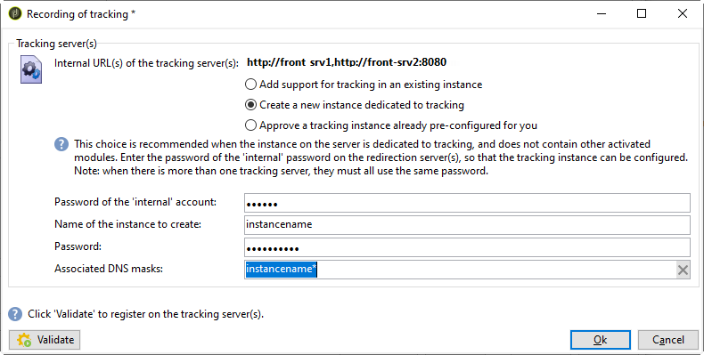
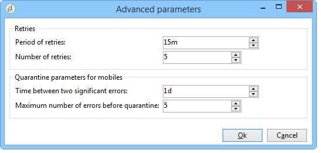

# Deploying an instance{#deploying-an-instance}

>[!NOTE]
>
>Server side configurations can only be performed by Adobe for deployments hosted by Adobe. To learn more about the different deployments, refer to the [Hosting models](../../installation/using/hosting-models.md) section or to [this page](../../installation/using/capability-matrix.md).

## Deployment wizard {#deployment-wizard}

A graphical wizard, available in the Adobe Campaign client console, enables you to define the parameters of the instance to which you are going to connect.

To start the deployment wizard, select **Tools > Advanced > Deployment wizard**.


The configuration steps are as follows:

1. [General parameters](#general-parameters)
1. [Email channel parameters](#email-channel-parameters)
1. [Managing bounced emails](#managing-bounced-emails)
1. [Tracking configuration](#tracking-configuration)
1. [Mobile channel parameters](#mobile-channel-parameters)
1. [Regional settings](#regional-settings)
1. [Access from the Internet](#access-from-the-internet)
1. [Managing public resources](#managing-public-resources)
1. [Purging data](#purging-data)

## General parameters {#general-parameters}

The first step of the deployment wizard lets you enter general information on the instance.


### General information {#general-information}

The lower section of the window enables you to select the options to be activated.

* **[!UICONTROL Customer identifier used in billing]** : this can be the name of the instance and the version number.
* **[!UICONTROL Common name of the customer]** : Enter a character string with the name of your company. This information can be used in the unsubscription links.
* **[!UICONTROL Namespace]** : Enter a short identifier in lowercase. The aim is to distinguish between your specific configuration and the factory configuration in case of an upgrade. The default namespace is **cus** - for customer.

### Technical options {#technical-options}

The lower section of the window enables you to select the options to be activated.

The following options are available:

* **[!UICONTROL Email channel]** : to activate e-mail delivery. Refer to [Email channel parameters](#email-channel-parameters).
* **[!UICONTROL Tracking]** : To enable tracking of the target population (opens and clicks). Refer to [Tracking configuration](#tracking-configuration).
* **[!UICONTROL Managing bounced emails]** : To define the POP account used to pick up incoming e-mail. Refer to [Managing bounced emails](#managing-bounced-emails).
* **[!UICONTROL LDAP integration]** : To configure user authentication via an LDAP directory. Refer to [Connecting through LDAP](../../installation/using/connecting-through-ldap.md).

## Email channel parameters {#email-channel-parameters}

The following step lets you define the information to be displayed in message headers.

These parameters can be overloaded in delivery templates, and individually for each delivery (if the users have the required rights).

### Parameters for delivered emails {#parameters-for-delivered-emails}


Indicate the following parameters:

* **[!UICONTROL Sender name]** : Name of the sender,
* **[!UICONTROL Sender address]** : The address of the sender,
* **[!UICONTROL Reply address text]** : The name, which is customizable, that will be used when the recipient clicks the **[!UICONTROL Reply]** button in their e-mail client software,
* **[!UICONTROL Reply address]** : The email address to use when the recipient clicks the **[!UICONTROL Reply]** button in their e-mail client software,
* **[!UICONTROL Error address]** : Email address of messages with errors. This is the technical address used to handle bounce mail, including emails received by the Adobe Campaign server due to non-existent target addresses.

In addition to this, you can specify the **masks** authorized for the sender address and the error address. If necessary, these masks can be separated using commas. This configuration is optional. When fields are entered, Adobe Campaign checks at the time of delivery (during analysis, if the address does not include any variables) that the addresses are valid. This operating mode ensure that no addresses are used that could trigger delivery issues. Delivery addresses must be configured on the delivery server.

### Characters authorized in addresses {#characters-authorized-in-addresses}

<!--This window enables you to define, for all email campaigns, the delivery and address-quality management options.-->

In the Adobe Campaign database, all email addresses must be created as follows: `x@y.z`. The **x**, **y** and **z** characters must not be empty and must not include non-authorized characters.

You can define here the characters authorized ('data policy') in the email field of the database. Characters not included in the list will be forbidden and therefore refused when entering information in the database via the interface, via a Web form and also importing data.

Two lists are available: **European only** or **US only**. Other characters can be added if necessary.

### Delivery parameters {#delivery-parameters}

The **Advanced parameters...** link enables you to access delivery options, parameters linked to retry and quarantines.


This window enables you to define, for all email campaigns, the delivery and address-quality management options.

The following options are available:

* **[!UICONTROL Delivery duration of messages]** : Beyond this time, the delivery is stopped (by default, 5 days),
* **[!UICONTROL Online resources validity duration]** : Time for which information from the recipient profile is kept in order to generate mirror pages,
* **[!UICONTROL Exclude recipients who no longer wish to be contacted]** : When this option is selected, on denylist recipients will not be contacted,
* **[!UICONTROL Automatically ignore doubles]** : When this option is selected, delivery will not be made to duplicate addresses.

### Retry parameters {#retry-parameters}

The information on recoveries is provided in the **Recovery periods** and **Number of recoveries** fields: when a recipient is unreachable, for instance if their inbox is full, by default the program will try contacting them 5 times, with a one-hour interval between each attempt (during the maximum delivery time). These values can be changed to suit your needs.

### Quarantine parameters {#quarantine-parameters}

Configuration options for quarantines are as follows:

* **[!UICONTROL Duration between two significant errors]** : enter a value ("1d" by default: 1 day) to define the time the application waits before incrementing the error counter in case of failure,
* **[!UICONTROL Maximum number of errors before quarantine]** : once this value is reached, the email address is quarantined (by default "5": the address will be quarantined on the sixth error). This means that the contact will be automatically excluded from subsequent deliveries.

## Managing bounced emails {#managing-bounced-emails}

Bounce mail is extremely important to qualify delivery errors. These errors are categorized in the NP@I once the rules have determined their cause.

This step is only available if the **Email channel** and **Bounce mail** management options are selected in the first stage of the deployment wizard. Refer to [General parameters](#general-parameters).

This stage lets you define settings for managing bounce mails.


### POP account used to retrieve incoming mails {#pop-account-used-to-retrieve-incoming-mails}

Indicate the parameters to connect to the account for retrieving incoming emails.

* **[!UICONTROL Label]** : Name which includes all the parameters given below,
* **[!UICONTROL Server]** : Server used to retrieve bounce mail (incoming mail),
* **[!UICONTROL Security]** : If necessary, select **[!UICONTROL SSL]** from the drop-down list,
* **[!UICONTROL Port]** : server port (generally 110),
* **[!UICONTROL Account]** : Name of the account used for bounce mail,
* **[!UICONTROL Password]** : Password associated with the account.

Once the POP settings are specified, click **Test** to make sure they are correct.

### Unprocessed bounce mails {#unprocessed-bounce-mails}

Bounces are handled automatically by Adobe Campaign, applying the rules listed in the **Administration > Campaign Management > Non deliverables Management > Delivery log qualification** node. For more on this, refer to [Bounce mail management](../../delivery/using/understanding-delivery-failures.md#bounce-mail-management).

Unprocessed bounces are not displayed in the Adobe Campaign interface. They are automatically deleted unless they are transferred to a third party mailbox using the following fields:

* **[!UICONTROL Forwarding address]** : Fill in this field to transfer to a third party address all the error messages (processed or unprocessed ) collected by the Adobe Campaign platform.
* **[!UICONTROL Address for errors]** : Fill in this field to transfer to a third party address only the error messages that the inMail process was not able to qualify.
* **[!UICONTROL SMTP server]** : Server used to send the unprocessed bounce emails.

>[!IMPORTANT]
>
>To forward unprocessed bounce emails, Adobe recommends only filling in the **[!UICONTROL Address for errors]** field. However, make sure the address that is used is checked regularly, as this could put a heavy load on your mail server. Contact your account executive for more information.

## Tracking configuration {#tracking-configuration}

The next step lets you configure tracking for the instance. The instance must be declared and registered with the tracking server(s).

This step is only offered when the **Email channel** and **Tracking** options are selected in the first page of the deployment wizard. Refer to [General parameters](#general-parameters).

For more detailed information on web tracking (tracking mode, creating and inserting tags...), refer to [this document](../../configuration/using/about-web-tracking.md).

### Operating principle {#operating-principle}

When you activate tracking on an instance, the URLs in the deliveries are changed during sending to enable tracking.

* The information on external URLs (whether secure or not) entered on this page of the deployment wizard is used to build the new URL. As well as this information, the modified link contains: the identifiers of the delivery, the recipient and the URL.

  Tracking information is collected by Adobe Campaign on the tracking server(s) to enrich recipient profiles and the data linked to the delivery ( **[!UICONTROL Tracking]** tabs).

  Information on internal URLs is only used by the Adobe Campaign application server to contact the tracking server(s).

  For more on this, refer to [Tracking server](#tracking-server).

* Once the URLs are configured, you need to enable tracking. To do this, the instance must be registered on the tracking server(s).

  For more on this, refer to [Saving tracking](#saving-tracking).

### Tracking server {#tracking-server}


To guarantee the efficiency of tracking on this instance, the following information must be displayed:
<!--With Mid-sourcing architecture, you can externalize tracking management. To do this:-->

* **[!UICONTROL External URL]** and/or **[!UICONTROL Secure external URL]** : Enter the redirection URL to be used in the email to be sent.
* **[!UICONTROL Internal URL(s)]** : URLs used only by the Adobe Campaign server to contact the tracking server(s) to collect logs and upload the URLs. It is not necessary to associate it with the instance.

  If you do not specify a URL, the tracking URL will be used by default.

With Mid-sourcing architecture, you can externalize tracking management. To do this:

1. Select the option **[!UICONTROL Externalize tracking management]** : this lets you use a mid-sourcing server as a tracking server.
1. Populate the **[!UICONTROL External account]** and **[!UICONTROL Instance name]** fields to be able to connect to the mid-sourcing server.

   For more information, refer to [Mid-sourcing server](../../installation/using/mid-sourcing-server.md).

1. Click the **[!UICONTROL Enable the tracking instance]** button to approve connection to the server.

   

### Saving tracking {#saving-tracking}

Once the URLs are populated, you must register the tracking server.

Click the link **Registration on the tracking server(s)** and then select one of the available options.


There are three possible types of architecture for implementing tracking:

1. **Add support for tracking in an existing instance**

   This choice applies if the instance was already created for other needs (MTA server, etc.) on servers that will be used as tracking servers. 

   

   Enter the password for the **internal** account on the redirection server(s) in order to configure the tracking instance.

   >[!NOTE]
   >
   >If multiple tracking servers are used, they must all use the same name and password.

   Specify the name of the instance and the password.

1. **Create a new instance dedicated to tracking**

   This option is useful when tracking instances are reserved for tracking and do not have any other application modules.

   

   Enter the password for the **internal** account on the redirection server(s) in order to configure the tracking instance.

   >[!NOTE]
   >
   >If multiple tracking servers are configured, they must all use the same password.

   Specify the name of the instance, the password and any associated DNS masks, such as **[!UICONTROL Campaign*]**.

1. **Validate a tracking instance already pre-configured for you**

   This option is used when you do not have the password for the **internal** account; In this case, a tracking account is preconfigured for you on the tracking server(s). Enter the password of the tracking account of the redirection server(s) to validate the tracking instance.

   

   Specify the name of the instance to validate.

Click **Approve** to start the recording process with the tracking server.

Back in the previous window, a message confirms the registration at the tracking server level:


The parameters linked to URL searches **must not be modified** for a standard installation. For all other parameters, please contact Adobe.

## Mobile channel parameters {#mobile-channel-parameters}

The next step lets you define default settings for deliveries to mobiles (SMS and WAP Push).

>[!NOTE]
>
>The mobile channel is optional: this stage will only appear if it has been purchased. Please check your license agreement.


### Default account for SMS delivery {#default-account-for-sms-delivery}

Enter the following information:

* **[!UICONTROL Label]** : Enter a name for this SMS/Wap Push account. For example, you may wish to use the name of your router.
* For the **[!UICONTROL Server]**, **[!UICONTROL Port]**, **[!UICONTROL Account]**, **[!UICONTROL Password]**, **[!UICONTROL Connector]**, **[!UICONTROL Send Endpoint]**, **[!UICONTROL Reception Endpoint]**, **[!UICONTROL Notification Endpoint]** fields: Contact your service provider for the required settings.

### Parameters of SMS sent {#parameters-of-sms-sent}

In the **Priority** drop-down list: Select "Normal", "High" or "Urgent" to apply it to the messages to be sent.

### Advanced parameters {#advanced-parameters}

The **Advanced parameters...** link enables you to access the retry and quarantine options. 



Information on retries is available in the **Period of retries** and **Number of retries** fields: When a mobile is unreachable, by default, the program will try again 5 times at intervals of at least 15 minutes (for the maximum delivery period). These values can be adapted to suit your needs.

Configuration options for quarantines are as follows:

* **[!UICONTROL Time between two significant errors]** : Enter a default value (by default "1d": day) to define the time the application waits before incrementing the error counter for a failure.
* **[!UICONTROL Maximum number of errors before quarantine]** : Once this value is reached, the mobile number is quarantined (by default "5": the number will be quarantined upon the sixth error). This means that the contact will automatically excluded from future deliveries.

## Regional settings {#regional-settings}

This stage lets you include data policy preferences.


* **[!UICONTROL Consider all phone numbers as international ones]** : When this option is selected, the application applies the international format to telephone numbers (the country prefix is then mandatory because the number of digits will not be checked before applying the formatting). If this option is not selected, you must prefix the international phone number with "+" or "00" yourself.
* **[!UICONTROL Store all phone numbers using the international format]** : This option only concerns **domestic** phone numbers that are imported or edited. Define whether you wish to use a domestic format (such as 425 555 0150) or the international format (e.g. +1 425 555 0150)

## Access from the Internet {#access-from-the-internet}

>[!IMPORTANT]
>
>For privacy reasons, we recommend to use HTTPS for all external resources.

This step lets you define access URLs for Adobe Campaign pages exposed on the internet.

You must also indicate here the publication options linked to Web forms.


### Servers exposed on the Web {#servers-exposed-on-the-web}

Use this page to populate the server URLs to:

1. Access the application server exposed on the internet: subscription/unsubscription forms, extranet, etc.
1. Access the application server for resources not exposed on the web: forms, intranet, confirmation pages.
1. Access the mirror pages of deliveries.

   A mirror page is a dynamic page that displays the contents of the email. It is accessed via a link inserted into the message sent to the recipient and can contain personalized elements. The mirror page gives the recipient the possibility of reading the message in an internet browser instead of the e-mail software, regardless of the delivery format (text or HTML). However, mirror pages are only generated for a given delivery if the required HTML content has been defined.

Adobe Campaign lets you differentiate these three URLs to spread the load over multiple platforms.

## Managing public resources {#managing-public-resources}

>[!IMPORTANT]
>
>For privacy reasons, we recommend to use HTTPS for all external resources.

To be seen from the outside, the images used in emails and public resources linked to campaigns must be present on an externally accessible server. They can then be available to external recipients or operators. 


For this step, you need to enter:

1. The new public resource URL. For more information refer to the [Public resources URL](#public-resources-url) section.
1. The image detection mode in a delivery. For more information, refer to the [Delivery image detection](#delivery-image-detection) section.
1. Publishing options. For more information, refer to the [Publication modes](#publication-modes) section.

Public resources are accessible via the **Administration > Resources > Online > Public resources** node of the Adobe Campaign tree. They are collected in a library and can be included in e-mails but also used in campaigns or tasks, and in content management.


### Public resources URL {#public-resources-url}

The first field enables you to specify the start of the URL used for the resources once uploaded. When uploaded, the resources are accessible via this new URL.

In a delivery, you can use images stored in the public resource library or any other local image or image stored on a server.

* For e-mail images, the **https://**server**/res/img** URL.

  This value can be overridden for each delivery.

* For public resources, the URL **https://**server**/res/**instance**** where **instance** is the name of the tracking instance.

### Delivery image detection {#delivery-image-detection}

In a delivery, you can use images stored in the public resource library or any other local image or image stored on a server.

The field **URL masks** lets you specify the list of URL masks to be skipped when uploading images automatically. For example, if you use images that are stored on a site accessible from the outside, in particular on an internet site, you can enter the site URL in this field. 


You can specify multiple URL masks by using a comma to separate each of them.

* For information on using and managing images in emails, refer to [this section](../../delivery/using/defining-the-email-content.md#adding-images).
* In the delivery wizard, the images called from these URLs will have the status "Ignored".

### Publication modes {#publication-modes}

The lower section of the wizard enables you to select the publication options of public resources and images.

The following publication modes are available:

* Tracking server(s)

  The resources will be automatically copied to the different tracking servers. They are configured in the step [Tracking configuration](#tracking-configuration).

* Other Adobe Campaign servers

  You can use one more other Adobe Campaign servers where the resources will be copied.

  Server side, to use a dedicated Adobe Campaign server, you must create a new instance with the following command:

  ```
  nlserver config -addtrackinginstance:<trackingA>/<trackingA*>
  ```

  Then enter the password.

  The parameters of the dedicated server(s) are given in the **[!UICONTROL Media URL(s)]**, **[!UICONTROL Password]** and **[!UICONTROL Instance name]** fields.

  

* Manual publication script (for public resources only)

  

  You can publish the images using a script:

    * You must create this script: Its contents depend on your configuration.
    * The script will be called by the following command:

      ```
      [INSTALL]/copyToFrontal.vbs "$(XTK_INSTALL_DIR)\var\<instance>\upload\" "img1,img2,img3"
      ```

      where `[INSTALL]` is the access path to the Adobe Campaign installation folder. 

    * In Unix, make sure that the script is executable. 

For images, it must copy them from the "images" folder specified via the **NmsDelivery_ImageSubDirectory** option to one or more frontal servers. These servers will store the images to make them accessible via the new configured URL.

In the event of publication on an Adobe Campaign server without a manual publication script, by default, the images of a delivery are stored in the `$(XTK_INSTALL_DIR)/var/res/img/ directory`. The corresponding URL is the following: **`https://server/res/img`**.

`XTK_INSTALL_DIR)/var/res/$(INSTANCE_NAME)`. The corresponding URL is as follows: **`https://server/res/instance`** where instance is the name of the tracking instance.

>[!NOTE]
>
>It's possible to change the public resource storage directory. For more on this, refer to [Managing public resources](#managing-public-resources).

### Synchronizing public resources {#synchronizing-public-resources}

This functionality allows you to **synchronize public resources** on multiple spare-servers.

If a public resource is not present on the tracking server or if the resource returns a 404 error, the tracking server will try to find the resource on one of the spare-servers.

Declaring and configuring spare-servers must be done in the Marketing server's **serverConf.xml** file. All the parameters available in the **serverConf.xml** are listed in this [section](../../installation/using/the-server-configuration-file.md).

**Declaration**

```
<redirection>
<spareServer enabledIf="" id="" url=""/>
</redirection>
```

**Configuration**

For each public resource that has to be synchronized, you have to add a status attribute to the `<url>` element in the `<relay>` part:

The status attribute can be one of three values:

* spare: The public resource is synchronized

* normal: Existing behavior (without synchronization)

* blacklist: The URL is added to the denylist if it returns a 404 error. The duration (in seconds) of the URL being in the denylist is defined by a **timeout** attribute whose default value is 60s.

The out-of-the-box configuration of the synchronization is:

``` 
(extracted from the serverConf.xml file)

<redirection P3PCompactPolicy="CAO DSP COR CURa DEVa TAIa OUR BUS IND UNI COM NAV"
databaseId="" defLogCount="30" expirationURL="" maxJobsInCache="100"
startRedirection="true" startRedirectionInModule="true" trackWebVisitors="false" trackingPassword="">
<spareServer enabledIf="" id="1" url=""/>
</redirection>

....


<relay debugRelay="false" forbiddenCharsInAuthority="?#.@/:" forbiddenCharsInPath="?#/"
           modDir="index.html" startRelay="false" startRelayInModule="true" timeout="60">
   <url IPMask="" deny="" hostMask="" relayHost="true" relayPath="true" status="normal" targetUrl="https://localhost:8080" timeout="" urlPath="/view/*"/>
      <url IPMask="" deny="" hostMask="" relayHost="true" relayPath="true" status="blacklist" targetUrl="https://localhost:8080" timeout="" urlPath="*.jsp"/>
      <url IPMask="" deny="" hostMask="" relayHost="true" relayPath="true" status="blacklist" targetUrl="https://localhost:8080" timeout="" urlPath="*.jssp"/>
      <url IPMask="" deny="" hostMask="" relayHost="true" relayPath="true" status="blacklist" targetUrl="https://localhost:8080" timeout="" urlPath="/webApp/*"/>
      <url IPMask="" deny="" hostMask="" relayHost="true" relayPath="true" status="blacklist" targetUrl="https://localhost:8080" timeout="" urlPath="/report/*"/>
      <url IPMask="" deny="" hostMask="" relayHost="true" relayPath="true" status="blacklist" targetUrl="https://localhost:8080" timeout="" urlPath="/jssp/*"/>
      <url IPMask="" deny="" hostMask="" relayHost="true" relayPath="true" status="normal" targetUrl="https://localhost:8080" timeout="" urlPath="/strings/*"/>
      <url IPMask="" deny="" hostMask="" relayHost="true" relayPath="true" status="normal" targetUrl="https://localhost:8080" timeout="" urlPath="/interaction/*"/>
      <url IPMask="" deny="" hostMask="" relayHost="true" relayPath="true" status="normal" targetUrl="https://localhost:8080" timeout="" urlPath="/barcode/*"/>

      <url IPMask="" deny="" hostMask="" relayHost="false" relayPath="false" status="spare" targetUrl="" timeout="" urlPath="/favicon.*"/>
      <url IPMask="" deny="" hostMask="" relayHost="false" relayPath="false" status="spare" targetUrl="" timeout="" urlPath="/*.html"/>
      <url IPMask="" deny="" hostMask="" relayHost="false" relayPath="false" status="spare" targetUrl="" timeout="" urlPath="/*.png"/>
      <url IPMask="" deny="" hostMask="" relayHost="false" relayPath="false" status="spare" targetUrl="" timeout="" urlPath="/*.jpg"/>

 </relay>
```

## Purging data {#purging-data}

The last stage of the deployment wizard lets you configure the automatic purging of obsolete data. The values are expressed in days.


Data is deleted automatically via the Database cleanup workflow. For more on how to configure and operate this workflow and details on the deleted items, refer to this [document](../../production/using/database-cleanup-workflow.md).
