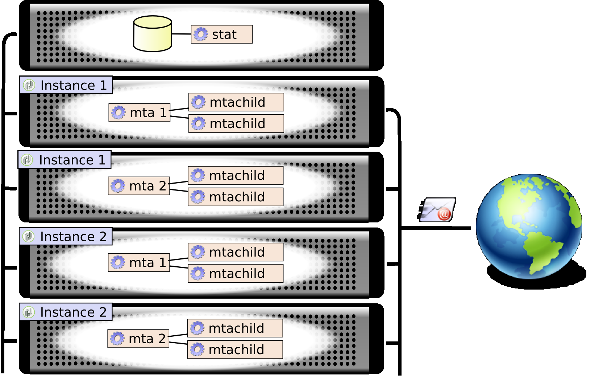
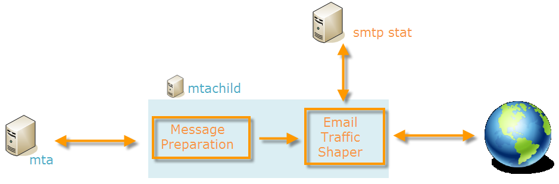
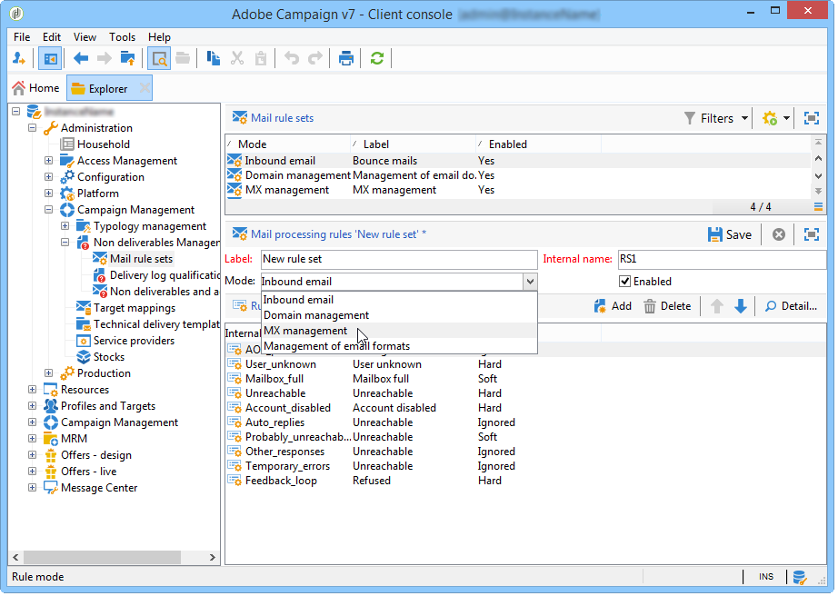
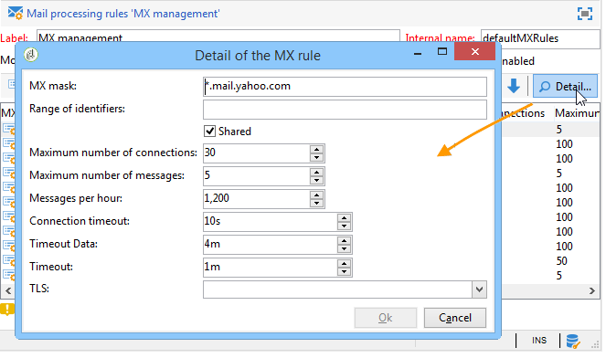
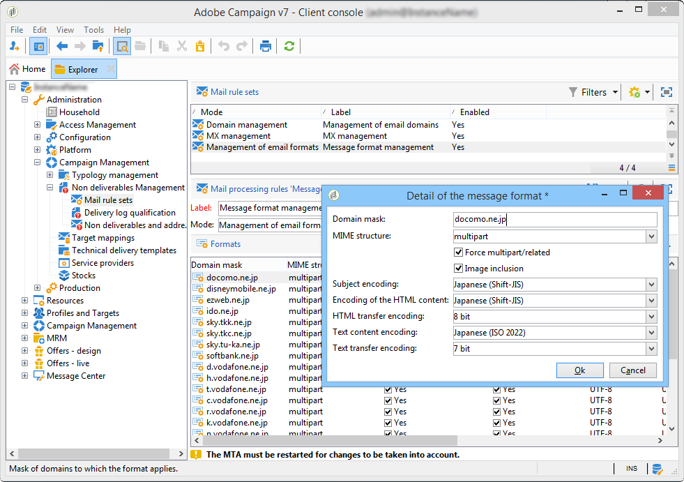
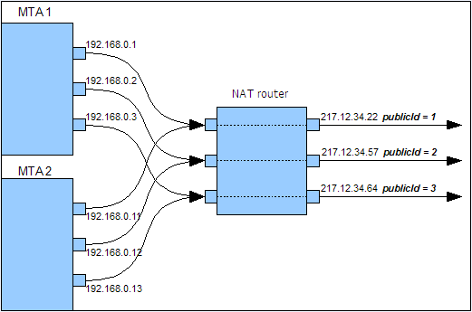

# Email deliverability{#email-deliverability}

## Overview {#overview}

The following section provides an overview of the configuration required for controlling the output of Adobe Campaign instances when delivering messages.

>[!NOTE]
>
>All technical recommendations concerning the efficient sending and receiving of messages by an Adobe Campaign platform are available in the **Deliverability** Technical Note.
>
>Some configurations can only be performed by Adobe for deployments hosted by Adobe. For example, to access the server and instance configuration files. To learn more about the different deployments, refer to the [Hosting models](../../installation/using/hosting-models.md) section or to [this article](https://helpx.adobe.com/campaign/kb/acc-on-prem-vs-hosted.html).  
>Refer to the [getting started guide](https://docs.campaign.adobe.com/doc/AC/getting_started/EN/deliverability.html) that presents the concepts and best practices related to deliverability.

## Operating principle {#operating-principle}

It is possible to control the output of one or more Adobe Campaign instances to restrict the number of emails sent depending on a domain. For example, you can restrict the output to 20,000 per hour for **yahoo.com** addresses, while configuring 100,000 messages per hour for all other domains.

Message output needs to be controlled for each IP address used by the delivery servers (**mta**). Several **mta** broken down over several machines and belonging to various Adobe Campaign instances can share the same IP address for email delivery: a process needs to be set up to coordinate the use of these IP addresses.

This is what the **stat** module does: it forwards all connection requests and messages to be sent to the mail servers for a set of IP addresses. The statistics server keeps track of deliveries and can enable or disable sending based on set quotas.



* The statistics server (**stat**) is linked to an Adobe Campaign base to load its configuration.
* The delivery servers (**mta**) use a UDP to contact a statistics server which does not always belong to their own instance.

### Delivery servers {#delivery-servers}

The **mta** module distributes messages to its **mtachild** child modules. Each **mtachild** prepares messages before requesting an authorization from the statistics server, and sending them.

The steps are as follows:

1. The **mta** selects eligible messages and assigns them an available **mtachild**.
1. The **mtachild** loads all information required for building the message (content, personalization elements, attachments, images, etc.) and forwards the message to the **Email Traffic Shaper**.
1. As soon as the email traffic shaper receives the statistics server's authorization (**smtp stat**), the message is sent to the recipient.



### Email server statistics and limitations {#email-server-statistics-and-limitations}

The statistics server maintains the following statistics for each email server which receives messages:

* Number of point-in-time connections open,
* Number of messages sent in the last hour,
* Rate of successful/rejected connections,
* Rate of connections to unreachable servers.

At the same time, the module loads a list of limitations for certain email servers:

* Maximum number of simultaneous connections,
* Maximum number of messages per hour, 
* Maximum number of messages per connection.

### Managing IP addresses {#managing-ip-addresses}

The statistics server can combine several instances or several machines with the same public IP address. It is therefore not linked to a specific instance, but it does have to contact an instance to recover limitations per domain.

Delivery statistics are kept for each target MX and for each source IP. For example, if the targeted domain has 5 MX and the platform can use 3 different IP addresses, the server can manage up to 15 series of indicators for this domain.

The source IP address matches the public IP address, i.e. the address as it is seen by the remote email server. This IP address can be different from the address of the machine which hosts the **mta**, if an NAT router is provided. This is why the statistics server uses an identifier which matches the public IP (**publicId**). The association between the local address and this identifier is declared in the **serverConf.xml** configuration file. All the parameters available in the **serverConf.xml** are listed in this [section](../../installation/using/the-server-configuration-file.md).

## Delivery output controlling {#delivery-output-controlling}

To deliver messages to email servers, the **Email Traffic Shaper** component requests a connection from the statistics server. Once the request is accepted, the connection is opened.

Before sending messages, the module requests 'tokens' from the server. These are generally sets of at least 10 tokens, which reduces the number of queries to the server.

The server saves all the statistics related to connections and deliveries. In case of rebooting, the information is temporarily lost: each client keeps a local copy of their sending statistics and returns them to the server on a regular basis (every 2 minutes). The server may then re-aggregate the data.

The following sections describe the processing of a message by the **Email Traffic Shaper** component.

### Message delivery {#message-delivery}

When a message is sent, there are 3 possible results:

1. **Success**: the message was sent successfully. The message is updated.
1. **Message Failed**: the contacted server rejected the message for the chosen recipient. This result matches return codes 550 to 599, but exceptions can be defined.
1. **Session Failed** (for 5.11 upward): if the **mta** receives an answer for this message, the message is abandoned (refer to [Message abandonment](../../installation/using/email-deliverability.md#message-abandonment)). The message is sent to another path or set to pending if no other paths are available (refer to [Message pending](../../installation/using/email-deliverability.md#message-pending)).

   >[!NOTE]
   >
   >A **path** is a connection between the Adobe Campaign **mta** and the target **mta**. The Adobe Campaign **mta** can choose from several start IPs and several target domain IPs.

### Message abandonment {#message-abandonment}

Abandoned messages are returned to the **mta** and are no longer managed by the **mtachild**.

The **mta** decides on the procedure for this message (recovery, abandonment, quarantine, etc.) depending on the response code and the rules.

### Message pending {#message-pending}

A message is pended when it arrives in the active queue and there are no available paths.

A path is generally marked as unavailable for a variable amount of time after a connection error. The unavailability period depends on the frequency and age of errors.

## Statistics server configuration {#statistics-server-configuration}

The statistics server can be used by several instances: it has to be configured independently from the instances that will use it.

Start by defining the Adobe Campaign database that will host the configuration.

### Start configuration {#start-configuration}

By default, the **stat** module is started for each instance. When the instances are mutualized on the same machine, or when instances share the same IP address, a single statistics server is used: the others have to be disabled.

### Definition of the server port {#definition-of-the-server-port}

By default, the statistics server listens on port 7777. This port can be modified in the **serverConf.xml** file. All the parameters available in the **serverConf.xml** are listed in this [section](../../installation/using/the-server-configuration-file.md).

```
<stat port="1234"/>
```

### MX configuration {#mx-configuration}

MX configuration is carried out in the database via the Adobe Campaign console.

The rules to be complied with for MX are defined in the **[!UICONTROL MX management]** document of the **[!UICONTROL Campaign execution > Administration > Non deliverables Management > Mail rule sets]** document of the tree.

In order for changes to be taken into account, you need to restart the statistics server.

To reload the configuration without restarting the statistics server, use the following command on the machine which hosts the server:

```
nlserver stat -reload
```

If this document does not exist, you can create it manually.

To do this:

1. Create a new set of mail rules.
1. Choose the **[!UICONTROL MX management]** mode.

   

1. Enter **defaultMXRules** in the **[!UICONTROL Internal name]** field.

Each rule defines an address mask for the MX. Any MX whose name matches this mask is therefore eligible. The mask can contain "&#42;" and "?" generic characters.

For example, the following addresses:

* a.mx.yahoo.com 
* b.mx.yahoo.com 
* c.mx.yahoo.com

are compatible with the following masks:

* &#42;.yahoo.com
* ?.mx.yahoo.com

Configuration example:



These rules are applied in sequence: the first rule whose MX mask is compatible with the targeted MX is applied.

The following parameters are available for each rule:

* **[!UICONTROL Range of identifiers]** : this option lets you indicate the ranges of identifiers (publicID) for which the rule applies. You can specify:

    * A number: the rule will only apply to this publicId, 
    * A range of numbers (**number1-number2**): the rule will apply to all publicIds between these two numbers.

  If the field is empty, the rule applies to all identifiers.

* **[!UICONTROL Shared]** : this option indicates that the highest number of messages per hour and the number of connections apply to all MXs linked to this rule. 
* **[!UICONTROL Maximum number of connections]** : maximum number of simultaneous connections to an MX from a given address. 
* **[!UICONTROL Maximum number of messages]** : maximum number of messages that can be sent on a connection. When the messages exceed this number, the connection is closed and a new one is opened. 
* **[!UICONTROL Messages per hour]** : maximum number of messages that can be sent in one hour for an MX via a given address. 
* **[!UICONTROL Connection time out]** : time threshold for connecting to an MX.

  >[!NOTE]
  >
  >Windows can issue a **timeout** before this threshold, which depends on your version of Windows.

* **[!UICONTROL Timeout Data]** : maximum wait time after sending message content (DATA section of the SMTP protocol). 
* **[!UICONTROL Timeout]** : maximum wait time for other exchanges with the SMTP server. 
* **[!UICONTROL TLS]** : The TLS protocol, which allows you to encrypt email deliveries, can be enabled selectively. For each MX mask, the following options are available:

    * **[!UICONTROL Default configuration]** : This is the general configuration specified in the serverConf.xml configuration file which is applied.

      >[!CAUTION]
      >
      >It is not recommended to modify the default configuration.

    * **[!UICONTROL Disabled]** : The messages are systematically sent without encryption.
    * **[!UICONTROL Opportunistic]** : Message delivery is encrypted if the receiving server (SMTP) can generate the TLS protocol.

### Managing email formats {#managing-email-formats}

You can define the format of sent messages, so that the content displayed automatically adapts according to the domain of each recipient's address.

To do this, go to the **[!UICONTROL Management of email formats]** document, which is located in **[!UICONTROL Administration]** > **[!UICONTROL Campaign management]** > **[!UICONTROL Non deliverables management]** > **[!UICONTROL Mail rule sets]**.

This document contains a list of all of the predefined domains that correspond to the Japanese formats managed by Adobe Campaign. For more information, refer to [this document](../../delivery/using/defining-the-email-content.md#sending-emails-on-japanese-mobiles).



The **MIME structure** (Multipurpose Internet Mail Extensions) parameter allows you to define the message structure that will be sent to the different mail clients. There are three options available:

* **Multipart**: The message is sent in text or HTML format. If the HTML format is not accepted, the message will still be able to be displayed in text format.

  By default, the multipart structure is **multipart/alternative**, but it automatically becomes **multipart/related** when an image is added to the message. Certain providers expect the **multipart/related** format by default, the **[!UICONTROL Force multipart/related]** option imposes this format even if no image is attached.

* **HTML**: An HTML only message is sent. If the HTML format is not accepted, the message will not be displayed.
* **Text**: A message in text only format is sent. The advantage of text format messages is their very small size.

If the **[!UICONTROL Image inclusion]** option is enabled, these are displayed directly in the body of the email. The images will then be uploaded and the URL links will be replaced by their content.

This option is particularly used by the Japanese market for **Deco-mail**, **Decore Mail** or **Decoration Mail**. For more information, consult [this document](../../delivery/using/defining-the-email-content.md#sending-emails-on-japanese-mobiles).

>[!CAUTION]
>
>Inserting images in an email increases its size considerably.

## Delivery server configuration {#delivery-server-configuration}

### Clock synchronization {#clock-synchronization}

The clocks of all the servers that make up the Adobe Campaign platform (including the database) must be synchronized, and their systems set to the same time-zone.

### Coordinates of the statistics server {#coordinates-of-the-statistics-server}

The address of the statistics server has to be provided in the **mta**.

The **statServerAddress** property of the **mta** element of the configuration lets you specify the address and number of the port to be used.

```
<mta statServerAddress="emailStatServer:7777">
   [...]
 </mta>
```

To use the statistics server on the same machine, you must enter at least the name of the machine with the **localhost** value:

```
 <mta statServerAddress="localhost">
```

>[!CAUTION]
>
>If this field is not populated, the **mta** will not start.

### List of IP addresses to use {#list-of-ip-addresses-to-use}

The configuration concerning traffic management is located in the **mta/child/smtp** element of the configuration file.

For each **IPAffinity** element, you need to declare the IP addresses that can be used for the machine.

Example:

```
<IPAffinity localDomain="<domain>" name="default">
  <IP address="192.168.0.11" publicId="1" weight="5"/>
  <IP address="192.168.0.12" heloHost="revdns1.campaign.com" publicId="2" weight="5"/>
  <IP address="192.168.0.13" publicId="3" weight="1"/>
</IPAffinity>
```

The parameters are as follows:

* **address**: this is the IP address of the MTA host machine to be used. 
* **heloHost**: this identifier represents the IP address as it will be seen by the SMTP server. 
* **publicId**: this information is useful when an IP address is shared by several Adobe Campaign **mtas** behind an NAT router. The statistics server uses this identifier to memorize connection and sending statistics between this starting point and the target server. 
* **weight**: lets you define the relative frequency of use of the address. By default, all addresses have a weight equal to 1.

  In the previous example, with normal conditions, the addresses will be distributed as follows:

    * "1": 5 / (5+5+1) = 45% 
    * "2": 5 / (5+5+1) = 45% 
    * "3": 1 / (5+5+1) = 10%

  If, for example, the first address cannot be used towards a given MX, messages will be sent as follows:

    * "2": 5 / (5+1) = 83% 
    * "3": 1 / (5+1) = 17%

* **includeDomains**: lets you reserve this IP address for emails belonging to a specific domain. This is a list of masks that can contain one or more wildcards ('&#42;'). If the attribute is not specified, all domains can use this IP address.

  Example: **includeDomains="wanadoo.com,orange.com,yahoo.&#42;"**

* **excludeDomains**: excludes a list of domains for this IP address. This filter is applied after the **includeDomains** filter. 

  

## Email sending optimization {#email-sending-optimization}

The internal architecture of the Adobe Campaign **mta** has an impact on the configuration for optimizing email delivery. Here are a few tips on improving your deliveries.

### Adjust the maxWaitingMessages parameter {#adjust-the-maxwaitingmessages-parameter}

The **maxWaitingMessages** parameter indicates the highest number of messages prepared in advance by the **mtachild**. Messages are only deleted from this list once they have been sent or abandoned.

This parameter is very important and particularly critical if messages are not sorted by domain.

Once the **maxWorkingSetMb** (256) threshold is reached, the delivery server stops sending messages. Performance will decrease significantly until the **mtachild** starts up again. To sidestep this issue, you can either increase the threshold of the **maxWorkingSetMb** parameter, or decrease the threshold of the **maxWaitingMessages** parameter.

The **maxWorkingSetMb** parameter is calculated empirically by multiplying the maximum number of messages by the average message size and multiplying the result by 2.5. For instance, if a message has an average size of 50 kB and the **maxWaitingMessages** parameter equals 1,000, the memory used will average 125 MB.

### Adjust the number of mtachild {#adjust-the-number-of-mtachild}

The number of children should not exceed the number of processors in the machine (approx. 1000 sessions). We recommend that you do not exceed 8 **mtachild**. You may then increase the number of messages per **child** (**maxMsgPerChild**) to achieve a sufficient life-span.
