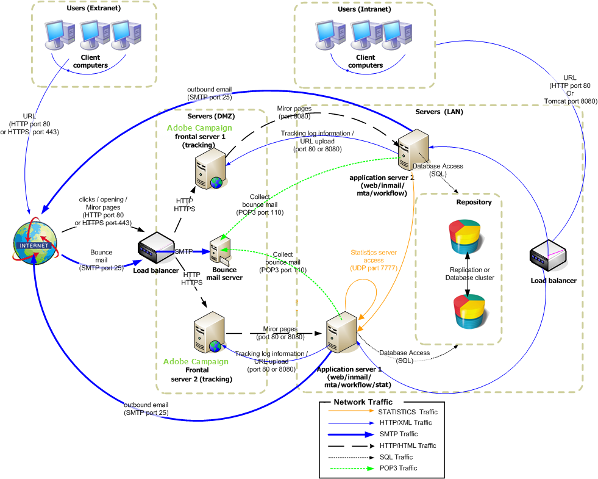

# Enterprise deployment{#enterprise-deployment}

This is the most complete configuration. It builds on the standard configuration for greater security and availability:

* dedicated redirection servers behind a HTTP or TCP load balancer, for scalability and availability,
* two application servers for improved throughput and failover capability (fault tolerance) and which are isolated in the LAN.

General communication between servers and processes is carried out according to the following schema:



With this type of configuration, the expected throughput can exceed 100,000 mails per hour with appropriate bandwidth and tuning.

## Features {#features}

### Advantages {#advantages}

* Optimized security: Only those servers that need to be exposed to the outside are installed on the computer in the DMZ.
* High availability easier to ensure: Only the computer visible from the outside needs to be managed with high availability in mind.

### Disadvantages {#disadvantages}

Higher hardware and administration costs.

### Recommended equipment {#recommended-equipment}

* Application servers: 2 Ghz quad-core CPU, 4 GB RAM, software RAID 1 80 GB SATA hard drive.
* Redirection servers: 2 Ghz quad-core CPU, 4 GB RAM, software RAID 1 80 GB SATA hard drive.

>[!NOTE]
>
>It is possible to reuse an existing load balancer for traffic to the redirection servers.

## Installation and configuration steps {#installation-and-configuration-steps}

### Prerequisites {#prerequisites}

* JDK on both application servers,
* Web server (IIS, Apache) on both frontals,
* Access to a database server on both application servers,
* Bounce mailbox accessible via POP3,
* Creation of two DNS aliases on the load balancer:

    * the first exposed to the public for tracking and pointing to the load balancer on a virtual IP address (VIP) and which is then distributed to the two frontal servers,
    * the second exposed to the internal users for access via the console and pointing to a load balancer on a virtual IP address (VIP) and which is then distributed to the two application servers.

* Firewall configured to open STMP (25), DNS (53), HTTP (80), HTTPS (443), SQL (1521 for Oracle, 5432 for PostgreSQL, etc.) ports. For further information, refer to section [Database access](../../installation/using/network-configuration.md#database-access).

>[!CAUTION]
>
>If your application servers point to a single database instance, after importing a standard package on one instance, the schema contained in the package is not loaded on the other instance. 
>  
>If your application servers point to a single database instance, after changing schema on one instance, the schema is not loaded on the other instance.
>
>To recover these issues, you need to reboot ‘web@default‘ process on the second instance where error occurred.

### Installing and configuring the application server 1 {#installing-and-configuring-the-application-server-1}

In the following examples, the parameters of the instance are:

* Name of the instance: demo
* DNS mask: tracking.campaign.net&#42;, console.campaign.net&#42; (the application server handles the URLs for client console connections and reports and for mirror pages and unsubscription pages)
* Language: English
* Database: campaign:demo@dbsrv

The steps for installing the first server are:

1. Follow the installation procedure for the Adobe Campaign server: **nlserver** package on Linux or **setup.exe** on Windows.

   For more on this, refer to [Prerequisites of Campaign installation in Linux](../../installation/using/prerequisites-of-campaign-installation-in-linux.md) (Linux) and [Prerequisites of Campaign installation in Windows](../../installation/using/prerequisites-of-campaign-installation-in-windows.md) (Windows).

1. Once the Adobe Campaign server is installed, start the application server (web) using the command **nlserver web -tomcat** (the Web module enables you to start Tomcat in standalone Web server mode listening on port 8080) and to make sure Tomcat starts correctly:

   ```
   12:08:18 >   Application server for Adobe Campaign Classic (7.X YY.R build XXX@SHA1) of DD/MM/YYYY
   12:08:18 >   Starting Web server module (pid=28505, tid=-1225184768)...
   12:08:18 >   Tomcat started
   12:08:18 >   Server started
   ```


   >[!NOTE]
   >
   >The first time the Web module is executed it creates the **config-default.xml** and **serverConf.xml** files in the **conf** directory under the installation folder. All the parameters available in the **serverConf.xml** are listed in this [section](../../installation/using/the-server-configuration-file.md).

   Press **Ctrl+C** to stop the server.

   For more on this, refer to the following sections:

    * For Linux: [First start-up of the server](../../installation/using/installing-packages-with-linux.md#first-start-up-of-the-server)
    * For Windows: [First start-up of the server](../../installation/using/installing-the-server.md#first-start-up-of-the-server)

1. Change the **internal** password using the command:

   ```
   nlserver config -internalpassword
   ```

   For more on this, refer to [this section](../../installation/using/configuring-campaign-server.md#internal-identifier).

1. Create the **demo** instance with the DNS masks for tracking (in this case, **tracking.campaign.net**) and access to client consoles (in this case, **console.campaign.net**). There are two ways of doing this:

    * Create the instance via the console: 
    
      

      For more on this, refer to [Creating an instance and logging on](../../installation/using/creating-an-instance-and-logging-on.md).

      or
    
    * Create the instance using command lines:

      ```    
      nlserver config -addinstance:demo/tracking.campaign.net*,console.campaign.net*
      ```    
    
      For more on this, refer to [Creating an instance](../../installation/using/command-lines.md#creating-an-instance).

1. Edit the **config-demo.xml** file (created via the previous command and located next to the **config-default.xml** file), check that the **mta** (delivery), **wfserver** (workflow), **inMail** (rebound mails) and **stat** (statistics) processes are enabled, then configure the address of the **app** statistics server:

   ```
   <?xml version='1.0'?>
   <serverconf>  
     <shared>    
       <!-- add lang="eng" to dataStore to force English for the instance -->    
       <dataStore hosts="tracking.campaign.net*,console.campaign.net*">      
         <mapping logical="*" physical="default"/>    
       </dataStore>  </shared>  
       <mta autoStart="true" statServerAddress="app">
       <wfserver autoStart="true"/>  
       <inMail autoStart="true"/>  
       <sms autoStart="false"/>  
       <listProtect autoStart="false"/>
   </serverconf>
   ```

   For more on this, refer to [this section](../../installation/using/configuring-campaign-server.md#enabling-processes).

1. Edit the **serverConf.xml** file and specify the delivery domain, then specify the IP (or host) addresses of the DNS servers used by the MTA module to answer MX type DNS queries.

   ```
   <dnsConfig localDomain="campaign.com" nameServers="192.0.0.1, 192.0.0.2"/>
   ```

   >[!NOTE]
   >
   >The **nameServers** parameters is only used in Windows.

   For more on this, refer to [Campaign server configuration](../../installation/using/configuring-campaign-server.md).

1. Copy the client console setup program (**setup-client-7.XX**, **YYYY.exe** for v7 or **setup-client-6.XX**, **YYYY.exe** for v6.1) to the **/datakit/nl/eng/jsp** folder. [Learn more](../../installation/using/client-console-availability-for-windows.md).

1. Start the Adobe Campaign server (**net start nlserver6** in Windows, **/etc/init.d/nlserver6 start** in Linux) and run the command **nlserver pdump** once more to check for presence of all enabled modules.

   >[!NOTE]
   >
   >Starting 20.1, we recommend using the following command instead (for Linux): **systemctl start nlserver**


   ```
   12:09:54 >   Application server for Adobe Campaign Classic (7.X YY.R build XXX@SHA1) of DD/MM/YYYY
   syslogd@default (7611) - 9.2 MB
   stat@demo (5988) - 1.5 MB
   inMail@demo (7830) - 11.9 MB
   watchdog (27369) - 3.1 MB
   mta@demo (7831) - 15.6 MB
   wfserver@demo (7832) - 11.5 MB
   web@default (28671) - 40.5 MB
   ```

   This command also lets you know the version and build number of the Adobe Campaign server installed on the computer.

1. Test the **nlserver web** module using the URL: [https://console.campaign.net/nl/jsp/logon.jsp](https://tracking.campaign.net/r/test).

   This URL enables you to access the download page for the client setup program. [Learn more](../../installation/using/client-console-availability-for-windows.md).

   Enter the **internal** login and associated password when you reach the access control page.

   

### Installing and configuring the application server 2 {#installing-and-configuring-the-application-server-2}

Apply the following steps:

1. Install the Adobe Campaign server.
1. Copy the files of the instance you created onto application server 1.

   We keep the same instance name as the application server 1.

1. Change the **internal** to the same as application server 1.
1. Link the database to the instance:

   ```
   nlserver config -setdblogin:PostgreSQL:campaign:demo@dbsrv -instance:demo
   ```

1. Edit the **config-demo.xml** file (created via the previous command and located next to the **config-default.xml** file), check that the **mta** (delivery), **wfserver** (workflow), **inMail** (rebound mails) and **stat** (statistics) processes are enabled, then configure the address of the **app** statistics server:

   ```
   <?xml version='1.0'?>
   <serverconf>  
     <shared>    
       <!-- add lang="eng" to dataStore to force English for the instance -->    
       <dataStore hosts="tracking.campaign.net*,console.campaign.net*">      
         <mapping logical="*" physical="default"/>    
       </dataStore>  </shared>  
       <mta autoStart="true" statServerAddress="app">
       <wfserver autoStart="true"/>  
       <inMail autoStart="true"/>  
       <sms autoStart="false"/>  
       <listProtect autoStart="false"/>
   </serverconf>
   ```

   For more on this, refer to [this section](../../installation/using/configuring-campaign-server.md#enabling-processes).

1. Edit the **serverConf.xml** file and populate the DNS configuration of the MTA module:

   ```
   <dnsConfig localDomain="campaign.com" nameServers="192.0.0.1, 192.0.0.2"/>
   ```

   >[!NOTE]
   >
   >The **nameServers** parameter is only used in Windows.

   For more on this, refer to [Campaign server configuration](../../installation/using/configuring-campaign-server.md).

1. Start the Adobe Campaign servers.

   For more on this, refer to the following sections:

    * For Linux: [First start-up of the server](../../installation/using/installing-packages-with-linux.md#first-start-up-of-the-server)
    * For Windows: [First start-up of the server](../../installation/using/installing-the-server.md#first-start-up-of-the-server)

### Installing and configuring the frontal servers {#installing-and-configuring-the-frontal-servers}

Installation and configuration procedures are identical on both computers.

The steps are as follows:

1. Install the Adobe Campaign server,
1. Comply with the Web server integration procedure (IIS, Apache) described in the following sections:

    * For Linux: [Integration into a Web server for Linux](../../installation/using/integration-into-a-web-server-for-linux.md),
    * For Windows: [Integration into a Web server for Windows](../../installation/using/integration-into-a-web-server-for-windows.md).

1. Copy the **config-demo.xml** and **serverConf.xml** files created during installation. In the **config-demo.xml** file, activate the **trackinglogd** process and deactivate the **mta**, **inmail**, **wfserver** and **stat** processes.
1. Edit the **serverConf.xml** file and populate the redundant tracking servers in the parameters of the redirection:

   ```
   <spareServer enabledIf="$(hostname)!='front_srv1'" id="1" url="https://front_srv1:8080"/>
   <spareServer enabledIf="$(hostname)!='front_srv2'" id="2" url="https://front_srv2:8080"/>
   ```

1. Start the website and test the redirection from the URL: [https://tracking.campaign.net/r/test](https://tracking.campaign.net/r/test)

   The browser should display the following messages (depending on the URL redirected by the load balancer):

   ```
   <redir status="OK" date="AAAA/MM/JJ HH:MM:SS" build="XXXX" host="tracking.campaign.net" localHost="front_srv1"/>
   ```

   or

   ```
   <redir status="OK" date="AAAA/MM/JJ HH:MM:SS" build="XXXX" host="tracking.campaign.net" localHost="front_srv2"/>
   ```

   For more on this, refer to the following sections:

    * For Linux: [Launching the Web server and testing the configuration](../../installation/using/integration-into-a-web-server-for-linux.md#launching-the-web-server-and-testing-the-configuration),
    * For Windows: [Launching the Web server and testing the configuration](../../installation/using/integration-into-a-web-server-for-windows.md#launching-the-web-server-and-testing-the-configuration).

1. Start the Adobe Campaign server.
