# External accounts{#external-accounts}

Adobe Campaign comes with a set of pre-defined external accounts. In order to set up connections with external systems, you can create new external accounts.

External accounts are used by technical processes such as technical workflows or campaign workflows. For example, when setting up a file transfer in a workflow or a data exchange with any other application (Adobe Target, Experience Manager, etc.), you need to select an external account.

## Create an external account {#creating-an-external-account}

To create a new external account, follow the steps below. Detailed settings depend on the type of external account.

1. From Campaign **[!UICONTROL Explorer]**, select **[!UICONTROL Administration]** '>' **[!UICONTROL Platform]** '>' **[!UICONTROL External accounts]**.

   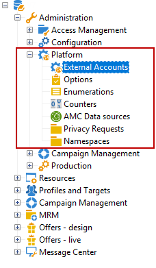

1. Click the **[!UICONTROL New]** button.

   

1. Enter a **[!UICONTROL Label]** and an **[!UICONTROL Internal Name]**. 
1. Select your external account **[!UICONTROL Type]** which one you want to create.
1. Configure the access to the account by specifying credentials depending on the chosen external account type.

   The necessary information is usually provided by the provider of the server you are connecting to.

1. Check the **[!UICONTROL Enabled]** option to activate the connection.
1. Click **[!UICONTROL Save]**.

The external account is created and added to the external accounts list. 

## Campaign-specific External Accounts

### Bounce mails {#bounce-mails-external-account}

The **Bounce mails** external account specifies the external POP3 account to be used to connect to the email service. For more on this external account, refer to this [page](../../workflow/using/inbound-emails.md).

All servers configured for POP3 access can be used to receive return mail.

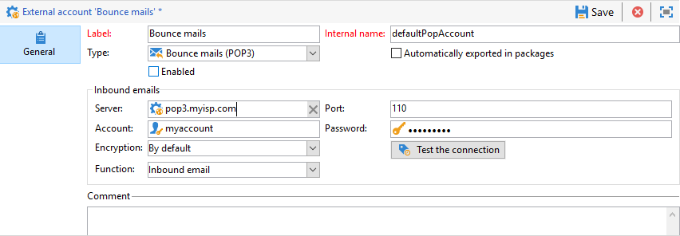

To configure the **[!UICONTROL Bounce mails (defaultPopAccount)]** external account:

* **[!UICONTROL Server]**

  URL of the POP3 server.

* **[!UICONTROL Port]**

  POP3 connection port number. The default port is 110.

* **[!UICONTROL Account]**

  Name of the user.

* **[!UICONTROL Password]**

  User account password.

* **[!UICONTROL Encryption]**

  Type of chosen encryption between **[!UICONTROL By default]**, **[!UICONTROL POP3 + STARTTLS]**, **[!UICONTROL POP3]** or **[!UICONTROL POP3S]**.

### Routing{#routing-external-account}

The **[!UICONTROL Routing]** external account allows you to configure each channel available in Adobe Campaign depending on the packages installed.

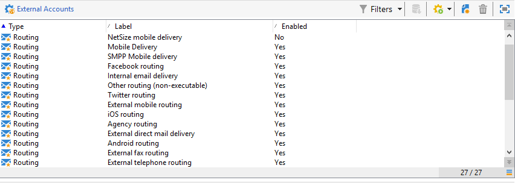

The following channels can be configured:

* [Email](../../installation/using/deploying-an-instance.md#email-channel-parameters)
* [Mobile (SMS)](../../delivery/using/sms-set-up.md#creating-an-smpp-external-account)
* [Phone](../../delivery/using/steps-about-delivery-creation-steps.md#other-channels)
* [Direct mail](../../delivery/using/about-direct-mail-channel.md)
* [Agency](../../delivery/using/steps-about-delivery-creation-steps.md#other-channels)
* [Facebook](../../social/using/publishing-on-facebook-walls.md#delegating-write-access-to-adobe-campaign)
* [Twitter](../../social/using/configuring-publishing-on-twitter.md)
* [iOS channel](../../delivery/using/configuring-the-mobile-application.md)
* [Android channel](../../delivery/using/configuring-the-mobile-application-android.md)


### Execution instance  {#execution-instance-external-account}

If you have a broken-down architecture, you need to specify the execution instances linked to the control instance and connect them. Transactional message templates are deployed to the execution instance

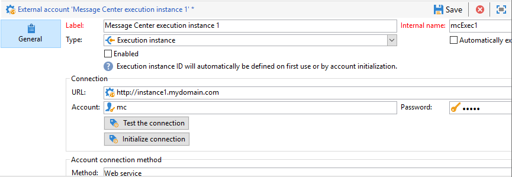

* **[!UICONTROL URL]**

  URL of the server on which the execution instance is installed.

* **[!UICONTROL Account]**

  Name of the account, it must match the Message Center Agent as defined in the operator folder.

* **[!UICONTROL Password]**

  Password of the account as defined in the operator folder.

For more information on this configuration, refer to this [page](../../message-center/using/configuring-instances.md#control-instance).


## Access to External Systems External Accounts 

### FTP {#ftp-external-account}

The FTP external account lets you configure and test access to a server outside of Adobe Campaign. To set up connections with external systems such as FTP servers 898 used for file transfers, you can create your own external accounts. For more on this, refer to this [page](../../workflow/using/file-transfer.md).

To do so, specify in this external account the address and credentials used to establish the connection to the FTP server


* **[!UICONTROL Server]**

  Name of the FTP server.

* **[!UICONTROL Port]**

  FTP connection port number. The default port is 21.

* **[!UICONTROL Account]**

  Name of the user.

* **[!UICONTROL Password]**

  User account password.

* **[!UICONTROL Encryption]**

  Type of chosen encryption between **[!UICONTROL None]** or **[!UICONTROL SSL]**.

To know where to locate these credentials, refer to this [page](https://help.dreamhost.com/hc/en-us/articles/115000675027-FTP-overview-and-credentials).

### SFTP {#sftp-external-account}

The SFTP external account lets you configure and test access to a server outside of Adobe Campaign. To set up connections with external systems such as SFTP used for file transfers, you can create your own external accounts. For more on this, refer to this [page](../../workflow/using/file-transfer.md).


* **[!UICONTROL Server]**

  URL of the SFTP server.

* **[!UICONTROL Port]**

  FTP connection port number. The default port is 22.

* **[!UICONTROL Account]**

  Account name used to connect to the SFTP server.

* **[!UICONTROL Password]**

  Password used to connect to the SFTP server.

### External database (FDA) {#external-database-external-account}

Use the **External database** type external account to connect to external an database. Learn more about Federated Data Access (FDA) option in [this section](../../installation/using/about-fda.md).

External databases compatible with Campaign are listed in the [Compatibility matrix](../../rn/using/compatibility-matrix.md)

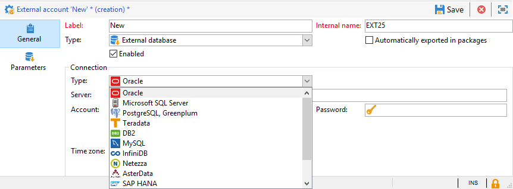

External account configuration settings depend on the database engine. Learn more in the following sections:

* Configure access to [Vertica](../../installation/using/configure-fda-vertica.md)
* Configure access to [Snowflake](../../installation/using/configure-fda-snowflake.md)
* Configure access to [Google BigQuery](../../installation/using/configure-fda-google-big-query.md)
* Configure access to [Azure Synapse](../../installation/using/configure-fda-synapse.md)
* Configure access to [Hadoop](../../installation/using/configure-fda-hadoop.md)
* Configure access to [Oracle](../../installation/using/configure-fda-oracle.md)
* Configure access to [Netezza](../../installation/using/configure-fda-netezza.md)
* Configure access to [SAP HANA](../../installation/using/configure-fda-sap-hana.md)
* Configure access to [Snowflake](../../installation/using/configure-fda-snowflake.md)
* Configure access to [Sybase IQ](../../installation/using/configure-fda-sybase.md)
* Configure access to [Teradata](../../installation/using/configure-fda-teradata.md)

### Facebook connect {#facebook-connect-external-account}

The **[!UICONTROL Facebook Connect]** external account lets you display personalized content in your Facebook applications, making it easier to acquire prospects via this social network.

For each Facebook application, you need to create a **[!UICONTROL Facebook Connect]** type external account. For more on this, refer to [page](../../social/using/creating-a-facebook-application.md#configuring-external-accounts).

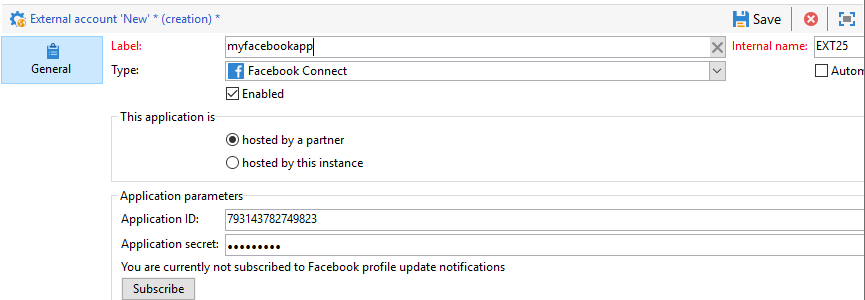

* **[!UICONTROL Hosting mode]**

  Hosting mode of the application between **[!UICONTROL hosted by a partner]** or **[!UICONTROL hosted by this instance]**.

* **[!UICONTROL Application ID]**

  App ID of your Facebook application.

* **[!UICONTROL Application secret]**

  App secret of your Facebook application.

If you chose the hosted by this instance mode, the Secure Canvas URL needs to be paste into the **Facebook Web games (https)** field on Facebook

To know where to locate these credentials, refer to this [page](https://developers.facebook.com/docs/facebook-login/access-tokens).

## Adobe Solution Integration External Accounts

### Adobe Experience Cloud {#adobe-experience-cloud-external-account}

To connect to the Adobe Campaign console using an Adobe ID, you must configure the **[!UICONTROL Adobe Experience Cloud (MAC)]** external account.


* **[!UICONTROL IMS server]**

  URL of your IMS server. Make sure both stage and production instances point to the same IMS production end point.

* **[!UICONTROL IMS scope]**

  Scopes defined here must be a subset of those provisioned by IMS.

* **[!UICONTROL IMS client identifier]**

  ID of your IMS client.

* **[!UICONTROL IMS client secret]**

  Credential of your IMS client secret.

* **[!UICONTROL Callback server]**

  Access URL of your Adobe Campaign instance.

* **[!UICONTROL IMS organization ID]**

  ID of your IMS organization. To find your organization ID, refer to [this page](https://experienceleague.adobe.com/docs/core-services/interface/manage-users-and-products/faq.html) (**Where can I find my IMS organization ID?**).

* **[!UICONTROL Association mask]**

  Syntax which will allow configuration names in Enterprise Dashboard to be synced with the groups in Adobe Campaign.

* **[!UICONTROL Server]**

  URL of your Adobe Experience Cloud instance.

* **[!UICONTROL Tenant]**

  Name of your Adobe Experience Cloud Tenant.

For more information on this configuration, refer to [this page](../../integrations/using/configuring-ims.md).

## Web Analytics {#web-analytics-external-account}

The **[!UICONTROL Web Analytics]** external account allows you to forward data from Adobe Analytics to Adobe Campaign in the form of segments. Conversely, it sends indicators and attributes of email campaigns delivered by Adobe Campaign to Adobe Analytics connector.

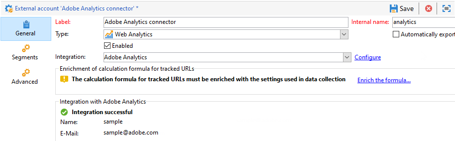

For this external account, the calculation formula for tracked URLs must be enriched and connection between the two solutions must be approved. For more on this, refer to this [page](../../platform/using/adobe-analytics-connector.md#external-account-classic).

### Adobe Experience Manager {#adobe-experience-manager-external-account}

The **[!UICONTROL AEM (AEM instance)]** external account allows you to manage the content of your email deliveries as well as your forms directly in Adobe Experience Manager.

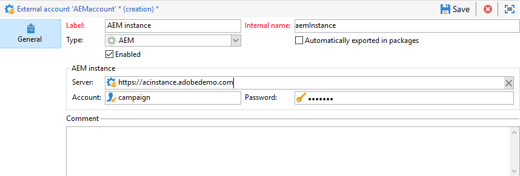

* **[!UICONTROL Server]**

  URL of the Adobe Experience Manager server.

* **[!UICONTROL Port]**

  Account name used to connect to the Adobe Experience Manager authoring instance.

* **[!UICONTROL Password]**

  Password used to connect to the Adobe Experience Manager authoring instance.

For more on this, refer to this [section](../../integrations/using/about-adobe-experience-manager.md).


## CRM Connector External Accounts 

### Microsoft Dynamics CRM {#microsoft-dynamics-crm-external-account}

The **[!UICONTROL Microsoft Dynamics CRM]** external account allows you to import and export Microsoft Dynamics data into Adobe Campaign.

Learn more about Campaign - Microsoft Dynamics CRM connector in this [page](../../platform/using/crm-ms-dynamics.md).

>[!NOTE]
>
> **[!UICONTROL On-premise]** and **[!UICONTROL Office 365]** deployment types are now deprecated. [Learn more](../../rn/using/deprecated-features.md).

With **[!UICONTROL Web API]** deployment type and **[!UICONTROL Password credentials]** authentication, you need to provide the following details:

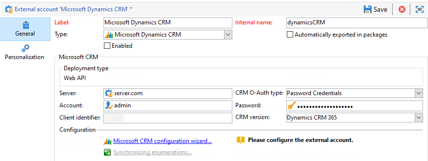

* **[!UICONTROL Account]**

  Account used to sign in to Microsoft CRM.

* **[!UICONTROL Server]**

  URL of your Microsoft CRM server.

* **[!UICONTROL Client identifier]**

  Client ID which can be found from Microsoft Azure management portal in the **[!UICONTROL Update your code]** category, **[!UICONTROL Client ID]** field.

* **[!UICONTROL CRM version]**

  Version of the CRM between **[!UICONTROL Dynamics CRM 2007]**, **[!UICONTROL Dynamics CRM 2015]** or **[!UICONTROL Dynamics CRM 2016]**.

With **[!UICONTROL Web API]** deployment type and **[!UICONTROL Certificate]** authentication, you need to provide the following details:

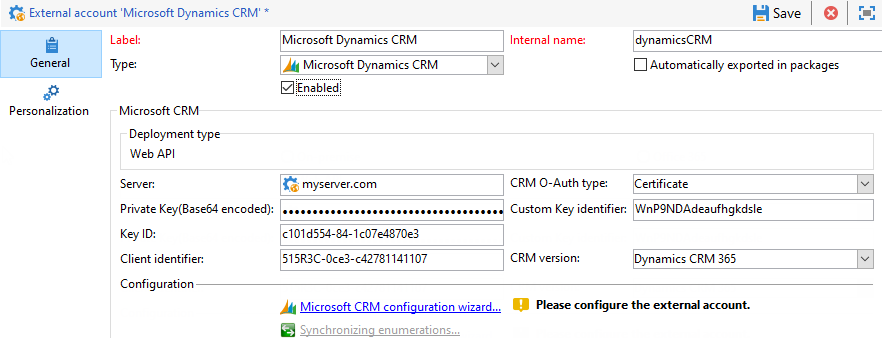

* **[!UICONTROL Server]**

  URL of your Microsoft CRM server.

* **[!UICONTROL Private Key (Base64 encoded)]**

  Private key encoded to Base64

* **[!UICONTROL Custom Key identifier]**

* **[!UICONTROL Key ID]**

* **[!UICONTROL Client identifier]**

  Client ID which can be found from Microsoft Azure management portal in the **[!UICONTROL Update your code]** category, **[!UICONTROL Client ID]** field.

* **[!UICONTROL CRM version]**

  Version of the CRM between **[!UICONTROL Dynamics CRM 2007]**, **[!UICONTROL Dynamics CRM 2015]** or **[!UICONTROL Dynamics CRM 2016]**.

For more information on this configuration, refer to this [page](../../platform/using/crm-connectors.md).

### Salesforce.com CRM  {#salesforce-crm-external-account}

The **[!UICONTROL Salesforce CRM]** external account allows you to import and export Salesforce data into Adobe Campaign.

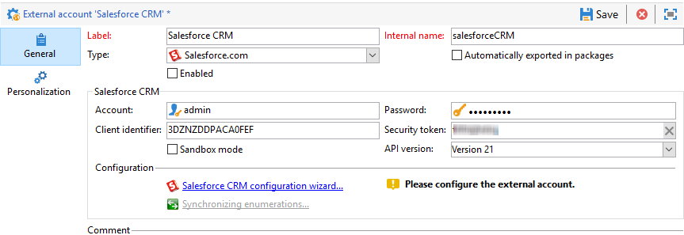

To configure the Salesforce CRM external account to work with Adobe Campaign, you need to provide the following details:

* **[!UICONTROL Account]**

  Account used to sign in to Salesforce CRM.

* **[!UICONTROL Password]**

  Password used to sign in to Salesforce CRM.

* **[!UICONTROL Client identifier]**

  To know where to find your client identifier, refer to this [page](https://help.salesforce.com/articleView?id=000205876&type=1).

* **[!UICONTROL Security token]**

  To know where to find your security token, refer to this [page](https://help.salesforce.com/articleView?id=000205876&type=1).

* **[!UICONTROL API version]**

  Select the version of the API.

For this external account, you need to configure you Salesforce CRM with the configuration wizard.

For more information on this configuration, refer to this [page](../../platform/using/crm-connectors.md).

## Transfer Data External Accounts

### Amazon Simple Storage Service (S3) {#amazon-simple-storage-service--s3--external-account}

The Amazon Simple Storage Service (S3) connector can be used to import or export data to Adobe Campaign. It can be set up in a workflow activity. For more on this, refer to this [page](../../workflow/using/file-transfer.md).

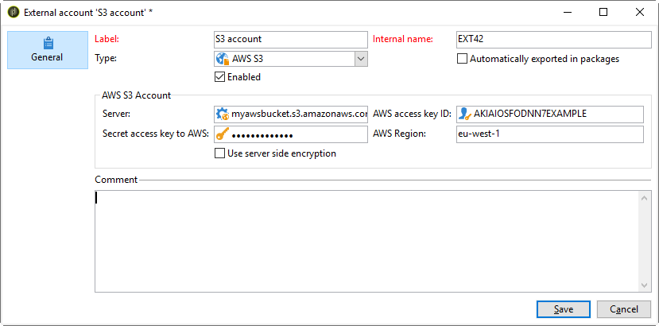

As you are setting up this new external account, you need to provide the following details:

* **[!UICONTROL AWS S3 Account Server]**

  URL of your server, it should be filled as follows:

  ```
  <S3bucket name>.s3.amazonaws.com/<s3object path>
  ```

* **[!UICONTROL AWS access key ID]**

  To know where to find your AWS access key ID, refer to this [page](https://docs.aws.amazon.com/general/latest/gr/aws-sec-cred-types.html#access-keys-and-secret-access-keys) .

* **[!UICONTROL Secret access key to AWS]**

  To know where to find your secret access key to AWS, refer to this [page](https://aws.amazon.com/fr/blogs/security/wheres-my-secret-access-key/).

* **[!UICONTROL AWS Region]**

  To learn more on AWS region, refer to this [page](https://aws.amazon.com/about-aws/global-infrastructure/regions_az/).

* The **[!UICONTROL Use server side encryption]** checkbox allows you to store your file in S3 encrypted mode.

To learn where to find the access key ID and secret access key, refer to Amazon Web services [documentation](https://docs.aws.amazon.com/general/latest/gr/aws-sec-cred-types.html#access-keys-and-secret-access-keys).

### Azure Blob Storage {#azure-blob-external-account}

The **Azure Blob storage** external account can be used to import or export data to Adobe Campaign using a **[!UICONTROL Transfer file]** workflow activity. For more on this, refer to this [section](../../workflow/using/file-transfer.md).

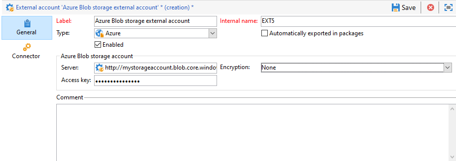

To configure the **[!UICONTROL Azure external account]** to work with Adobe Campaign, you need to provide the following details:

* **[!UICONTROL Server]**

  URL of your Azure Blob storage server.

* **[!UICONTROL Encryption]**

  Type of chosen encryption between **[!UICONTROL None]** or **[!UICONTROL SSL]**.

* **[!UICONTROL Access key]**

  To know where to find your **[!UICONTROL Access key]**, refer to this [page](https://docs.microsoft.com/en-us/azure/storage/common/storage-account-keys-manage?tabs=azure-portal).
