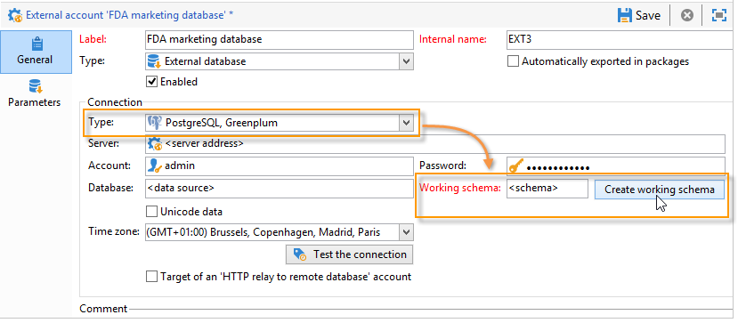

# Best practices and limitations 

## Create temporary schemas {#create-temporary-schemas}

You can manage several accesses to Greenplum external database throuhgh FDA. A dedicated option lets you create a working schema directly when configuring the external account.

>[!NOTE]
>
>This option is only available with PostgreSQL Greenplum.

## Optimize email personalization with external data {#optimizing-email-personalization-with-external-data}

You can pre-process message personalization in a dedicated workflow. To perform this, use the **[!UICONTROL Prepare the personalization data with a workflow]** option, available in the **[!UICONTROL Analysis]** tab of the delivery properties.

During the delivery analysis, this option automatically creates and executes a workflow that stores all of the data linked to the target in a temporary table, including data from tables linked in an external database.

This option significantly improves performances when executing the personalization step.

## Use data from an external database in a workflow {#using-data-from-an-external-database-in-a-workflow}

In multiple Adobe Campaign workflow activities, you can use the data stored in an external database.

* **Filter on external data** -  The [Query](../../workflow/using/targeting-data.md#selecting-data) activity allows you to add external data and use it in the defined filter configurations. For more on this, refer to [this page](../../workflow/using/targeting-data.md#selecting-data).

* **Create sub-sets** - The [Split](../../workflow/using/split.md) activity allows you to create sub-sets. You can use external data to define the filtering criteria to use. For more on this, refer to [this page](../../workflow/using/split.md).

* **Load external database** - You can use the external data in the [Data loading](../../workflow/using/data-loading--rdbms-.md) (RDBMS) activity. Learn more in [this page](../../workflow/using/data-loading--rdbms-.md).

* **Adding information and links** - The [Enrichment](../../workflow/using/enrichment.md) activity lets you to add additional data to the worktable of the workflow, and links to an external table. In this context, it can use data from an external database. Learn more in [this page](../../workflow/using/enrichment.md).

## FDA limitations {#limitations}

The FDA option is made to manipulate the data in external databases in batch mode in workflows. To avoid performance issues, it is not recommended to use the FDA module in the context of unitary operations, such as: personalization, interaction, real-time messaging, etc.

Avoid the operations that need to use both the Adobe Campaign and the external database as much as possible. To do this, you can:

* Export the Adobe Campaign database to the external database and execute the operations only from the external database before re-importing the results into Adobe Campaign.

* Collect the data from the external Adobe Campaign database and execute the operations locally.

If you want to carry out personalization in your deliveries using data from the external database, collect the data to use in a workflow to make it available in a temporary table. Then use the data from the temporary table to personalize your delivery.

The FDA option is subject to the limitations of the external database system that you use.
