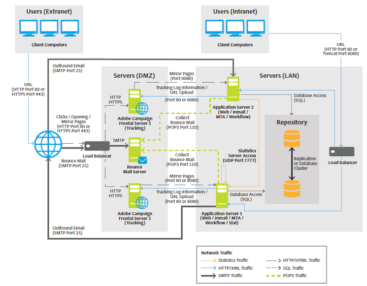

# General architecture{#general-architecture}

The typical Adobe Campaign solution deployment consists of the following components:

* **Personalized Client Environment**

  Intuitive graphical interface in which users can communicate and track marketing offers, create campaigns, review and manage all marketing activities, programs and plans - including emails, workflows and landing pages -, create and manage customer profiles, and define customer audience types.

* **Development Environment**

  Server-side software that executes the marketing campaigns through chosen communication channels, including emails, SMS, push notifications, direct mail, web or social, based on the rules and workflows defined in the user interface.

* **Database Containers**

  Based on relational database technology, the Adobe Campaign database stores all customers information, campaign components, offers and workflows, as well as campaign results in customer database containers.

Adobe Campaign is based on a service-oriented architecture (SOA) and comprises several functional modules. These modules can be deployed on one or more computers, in single or multiple instances, depending on constraints in terms of scalability, availability and service isolation. The scope of deployment configurations is therefore very broad, and spans a single, central computer through to configurations including multiple dedicated servers over multiple sites.

>[!NOTE]
>
>As a software vendor, we specify compatible hardware and software infrastructures. The hardware recommendations given here are for informational purposes only and are based on our experience. Adobe shall not be liable for any decisions made based on them. It will also depend on your business rules and practices and the criticality and required performance levels of the project.

>[!CAUTION]
>
>If not explicitly stated otherwise, installation, updates and maintenance on all components of an Adobe Campaign platform are the responsibility of the machine administrator(s) hosting them. This includes implementing the prerequisites for Adobe Campaign applications as well as complying with Campaign [Compatibility matrix](../../rn/using/compatibility-matrix.md) between components.

## Presentation layer {#presentation-layer}

The application can be accessed in different ways, depending on the users' needs: Rich client, Thin client or API integration.

* **Rich client**: The main user interface of the application is a rich client, in other words, a native application (Windows) that communicates with the Adobe Campaign application server solely with standard internet protocols (SOAP, HTTP, etc.). This console provides great user-friendliness for productivity, uses very little bandwidth (through the use of a local cache) and is designed for easy deployment. This console can be deployed from an internet browser, can be updated automatically and does not require any specific network configuration because it only generates HTTP(S) traffic.
* **Thin client**: Certain parts of the application can be accessed via a simple web browser using an HTML user interface, including the reporting module, delivery approval stages, functionalities of the Distributed Marketing module (central/local), instance monitoring, etc. This mode makes it possible to include Adobe Campaign functionalities in an intranet or an extranet.
* **Integration via the APIs**: In certain cases, the system can be called from external application using the Web Services APIs exposed via the SOAP protocol.

## Logical application layer {#logical-application-layer}

Adobe Campaign is a single platform with different applications that combine to create an open and scalable architecture. The Adobe Campaign platform is written on a flexible application layer and is easily configurable to meet a company’s business needs. This accommodates the growing needs of the enterprise from a functional perspective as well as from a technical perspective. The distributed architecture ensures linear system scalability scaling from thousands of messages to millions of messages.

Adobe Campaign relies on a set of server-side processes that work together.

The main processes are:

**Application server** (nlserver web)

This process exposes the full range of Adobe Campaign functionality via Web Services APIs (SOAP - HTTP + XML). Furthermore, it can dynamically generate the Web pages used for HTML-based access (reports, Web forms, etc). To achieve this, this process includes an Apache Tomcat JSP server. This is the process to which the console connects.

**Workflow engine** (nlserver wfserver)

It executes the workflow processes defined in the application.

It also handles periodically executed technical workflows, including:

* Tracking: Recovering and consolidating tracking logs. It enables you retrieve the logs from the redirection server and create the aggregate indicators used by the reporting module.
* Cleanup: Database cleaning. Used to purge old records and avoid the database growing exponentially.
* Billing: Automatic sending of an activity report for the platform (database size, number of marketing actions, number of active profiles etc.).

**Delivery Server** (nlserver mta)

Adobe Campaign has native email broadcast functionality. This process functions as an SMTP mail transfer agent (MTA). It performs "one-to-one" personalization of messages and handles their physical delivery. It functions using delivery jobs and handles automatic retries. In addition, when tracking is enabled, it automatically replaces the URLs so that they point to the redirection server.

This process can handle the customization and automatic sending to a third-party router for SMS, fax and direct mail.

**Redirection server** (nlserver webmdl)

For email, Adobe Campaign automatically handles open and click tracking (transactional tracking at the Web site level is a further possibility). To achieve this, the URLs incorporated in the email messages are rewritten in order to point to this module, which registers the passing of the internet user before redirecting them to the required URL.

To guarantee highest availability, this process is fully independent from the database: the other server processes communicate with it using SOAP calls (HTTP, HTTP(S) and XML) only. Technically, this functionality is implemented in an extension module of a HTTP server (ISAPI extension in IIS, or a DSO Apache module, etc.) and is available in Windows only.

Other more technical processes are also available:

**Managing bounce emails** (nlserver inMail)

This process enables you to automatically pick up email from mailboxes configured to receive bounced messages that are returned in case of delivery failure. These messages then undergo rule-based processing to determine the reasons for non-delivery (unknown recipient, quota exceeded, etc.) and to update the delivery status in the database.

All these operations are fully automatic and preconfigured.

**SMS delivery status** (nlserver sms)

This process polls the SMS router to collect progress status and update the database.

**Writing log messages** (nlserver syslogd)

This technical process captures log messages and traces generated by the other processes and writes them to the hard disk. This makes ample information available for diagnosis in case of problems.

**Writing tracking logs** (nlserver trackinglogd)

This process saves to disk the tracking logs generated by the redirecting process.

**Writing inbound events** (nlserver interactiond)

This process ensures the recording to the disk of inbound events, within the framework of Interaction.

**Supervising modules** (nlserver watchdog)

This technical process acts as a primary process which spawns the others. It also monitors them and relaunches them automatically in case of incidents, thus maintaining maximum system uptime.

**Statistics server** (nlserver stat)

This process maintains statistics on the number of connections, the messages sent for each mail server which messages are sent to, as well as their limitations (highest number of simultaneous connections, messages per hour/ and or connection). It also lets you federate several instances or machines if they share the same public IP addresses.

>[!NOTE]
>
>The complete list of Adobe Campaign modules is available in [this document](../../production/using/operating-principle.md).

## Persistence layer {#persistence-layer}

The database is used as a persistence layer and contains almost all the information managed by Adobe Campaign. This includes both functional data (profiles, subscriptions, content, etc.), technical data (delivery jobs and logs, tracking logs, etc.) and work data (purchases, leads).

The reliability of the database is of utmost importance because the majority of Adobe Campaign components require access to the database in order to perform their tasks (with the notable exception of the redirection module).

The platform comes predefined with a marketing centered data mart or can easily sit atop an existing data mart and schema using any of the major Relational Database Management Systems (RDBMS). All data within the data mart is accessed by the Adobe Campaign platform via SQL calls from Adobe Campaign to the database. Adobe Campaign also provides a full complement of Extract Transform and Load (ETL) tools to perform data import and export of data into and out of the system.
