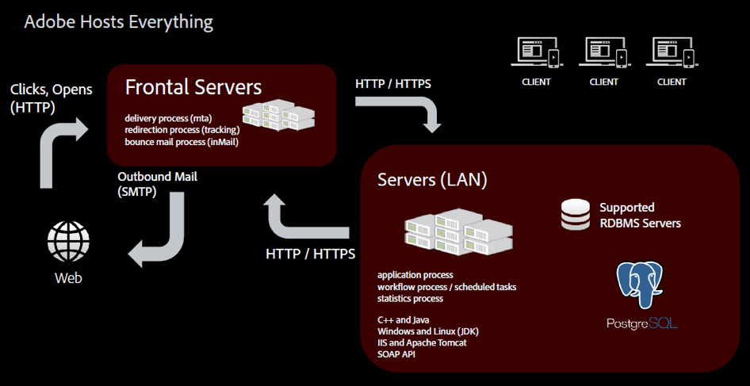
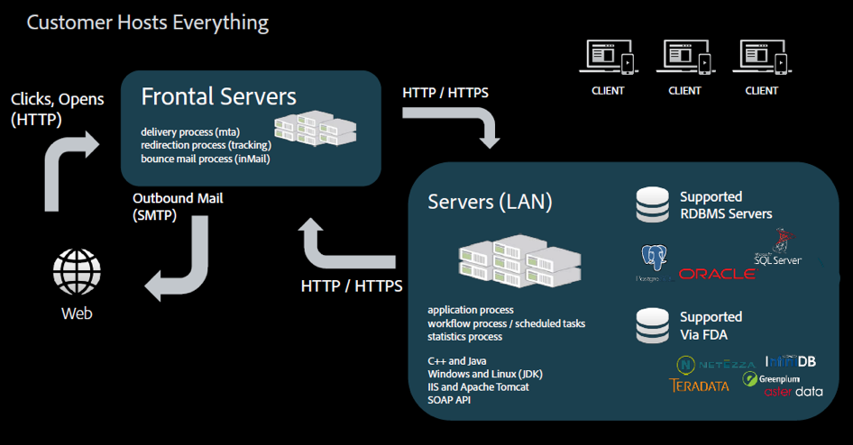
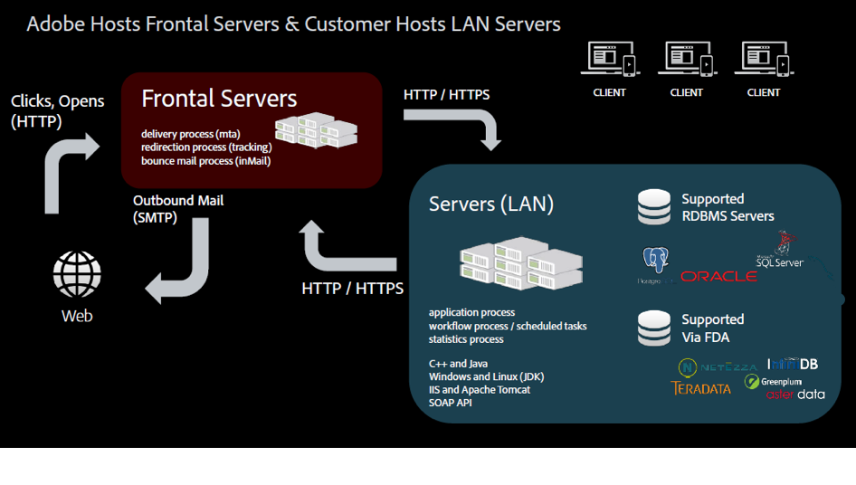

# Hosting models{#hosting-models}

Adobe Campaign offers a choice of three hosting models, providing flexibility and freedom to choose the best model, or models to suit business needs.

>[!NOTE]
>
>Main installation and configuration steps can only be performed by Adobe for deployments hosted by Adobe. For example, to configure the server and instance configuration files. To learn more about the main differences between deployment modes, refer to [this article](https://helpx.adobe.com/campaign/kb/acc-on-prem-vs-hosted.html). If you have a hosted or hybrid model, please refer to this [section](https://helpx.adobe.com/campaign/classic/installation/using/introduction.html).

* **Managed Services (Hosted)**

  Adobe Campaign can be deployed as a Managed Service: all components of Adobe Campaign, including the user interface, the execution management engine, and the customer's Campaign database are fully hosted by Adobe, including email execution, mirror pages, tracking server, and externally-facing web components such as unsubscribe page/preference center and landing pages. Adobe allocates up to three instances in the Cloud---Development, Test/Stage, and Production. The installation and configuration steps for this hosting model are presented in this [section](https://helpx.adobe.com/campaign/classic/installation/using/hosted-model.html).

  

* **On-premise**

  Adobe Campaign can be deployed on-premise: all components of Adobe Campaign, including the user interface, execution management engine and database reside on-site in the customer's data center. In this deployment model, the customer manages all software and hardware updates and upgrades, and a dedicated database administrator needs to perform maintenance and optimization tasks to ensure Campaign instance management.

  

* **Hybrid**

  When deployed as a hybrid model, the Adobe Campaign solution software resides on-premise at the customer site, and execution management is delivered as a cloud service by Adobe. Adobe Campaign marketing instance is installed inside a customer's firewall, so personally identifiable information (PII) remains in-house and only data required to personalize emails is sent to the Cloud for email execution. The execution instance, hosted in the Cloud, receives the requests from the On-Premise instance to deliver emails. This instance personalizes all the emails and delivers them. No data of any kind is permanently stored in the cloud. The installation and configuration steps for this hosting model are presented in this [section](https://helpx.adobe.com/campaign/classic/installation/using/hybrid-model.html).

  

