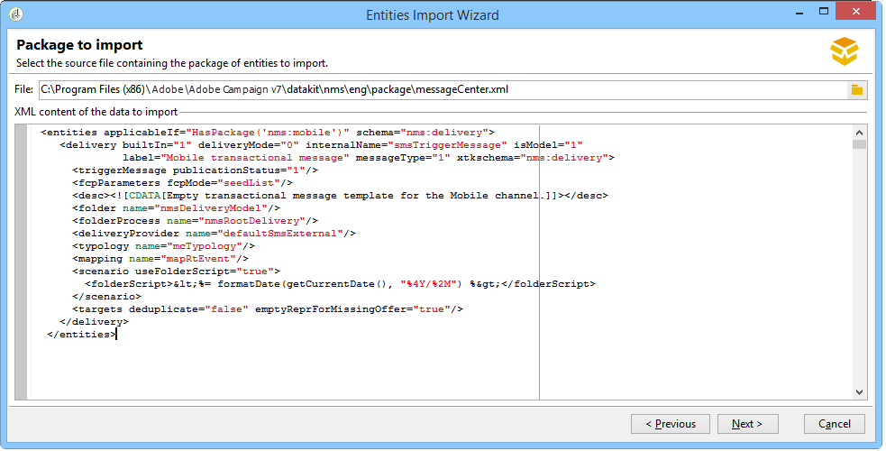
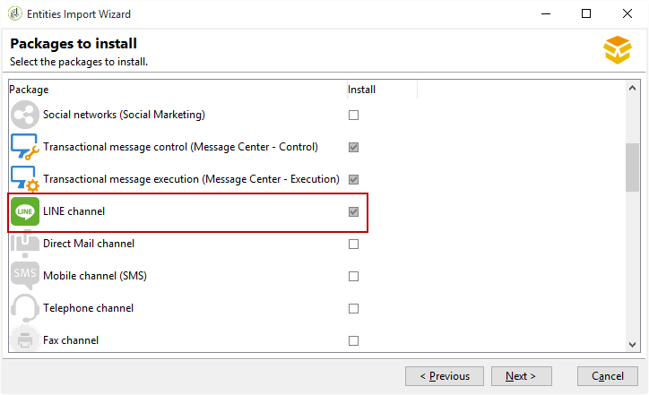

# Installing Campaign Classic standard packages{#installing-campaign-standard-packages}

## About standard Packages {#campaign-standard-packages}

Packages are a set of features that can be installed according to your needs. They will allow you to add more options to your instance.

>[!CAUTION]
>
>You may only install packages corresponding the options mentioned in your license contract.
>
>Once a package is installed, you cannot uninstall it. Installing a new package can impact all your platform: it must be tested and validated before final deployment.

To install a standard package:

1. Access the package import wizard from **[!UICONTROL Tools > Advanced > Package import...]** in the Adobe Campaign client console.
1. Select **[!UICONTROL Install a standard package]**.
1. In the list that appears, check the packages you want to install.
   >[!NOTE]
   >
   >If a package is greyed out, you cannot install it. It means that is already installed or it is not compatible with your instance. For example, you cannot install the **Mid-sourcing platform** package on a marketing instance. You will find this information in the table below.
1. Click **[!UICONTROL Next]**, then **[!UICONTROL Start]** to start the package installation.

   Once the packages are installed, the progress bar shows **100%** and you can see the following message in the installation logs: **[!UICONTROL Installation of packages successful]**.

1. **[!UICONTROL Close]** the installation window.

The packages are now installed.

### List of out-of-the-box Packages {#list-of-standard-packages}

The following table lists all standard packages with their description, the instance type they can be installed on (Marketing, Mid, etc.) and additional information.

<table> 
 <thead> 
  <tr> 
   <th> Package </th> 
   <th> Description </th> 
   <th> Instance type </th> 
   <th> More info </th> 
  </tr> 
 </thead> 
 <tbody> 
  <tr> 
   <td> Delivery<br /> </td> 
   <td> Monitors deliveries and eventual issues encountered when messages are sent.<br /> </td> 
   <td> All</td> 
   <td> <a href="../../delivery/using/monitoring-a-delivery.md">Learn more</a></td> 
  </tr> 
  <tr> 
   <td> Marketing campaigns (Campaign)<br /> </td> 
   <td> Defines, optimizes, executes and analyzes communications and marketing campaigns.<br /> </td> 
   <td> Marketing</td> 
   <td> <a href="../../campaign/using/designing-marketing-campaigns.md">Learn More</a> </td> 
  </tr> 
  <tr> 
   <td> Marketing resources (MRM)<br /> </td> 
   <td> Controls marketing actions in a collaborative mode by providing management and tracking of the tasks, budgets and marketing resources.<br /> </td> 
   <td> Marketing</td> 
   <td> <a href="../../campaign/using/about-marketing-resource-management.md">Learn More</a> </td> 
  </tr> 
  <tr> 
   <td> Offer engine (interaction)<br /> </td> 
   <td> Responds in real time during an interaction with a given contact (a customer or target) by making them a single or several adapted offers. <br /> </td> 
   <td> All<br /> </td> 
   <td> Optional, <a href="../../interaction/using/interaction-and-offer-management.md">Learn More</a></td> 
  </tr> 
  <tr> 
   <td> Control of offer engine with execution instance<br /> </td> 
   <td> </td> 
   <td> Marketing<br /> </td> 
   <td> Optional</td> 
  </tr> 
  <tr> 
   <td> Offer engine for execution instances<br /> </td> 
   <td> </td> 
   <td> Mid, Execution <br /> </td> 
   <td> Optional</td> 
  </tr> 
  <!--tr> 
   <td> Lead Management (Leads) (deprecated)<br /> </td> 
   <td> Simplifies the process of building and maintaining the entire leads management life cycle. <br /> </td> 
   <td> Yes<br /> </td> 
   <td> Optional, <a href="https://helpx.adobe.com/campaign/kb/deprecated-and-removed-features.html">Learn More</a> </td> 
  </tr--> 
  <tr> 
   <td> Social networks (Social Marketing) <br /> </td> 
   <td> Synchronizes Adobe Campaign with Twitter and Facebook.<br /> </td> 
   <td> All</td> 
   <td> <a href="../../social/using/starting-workflows.md">Learn More</a> </td> 
  </tr> 
  <tr> 
   <td> Transactional message control (Message Center - Control)<br /> </td> 
   <td> Manages trigger messages generated from events triggered from information systems.<br /> </td> 
   <td> Marketing<br /> </td> 
   <td> Optional, <a href="../../message-center/using/about-transactional-messaging.md">Learn More</a> </td> 
  </tr> 
  <tr> 
   <td> Transactional message execution (Message Center - Execution) <br /> </td> 
   <td> Ensures higher availability and better load management.<br /> </td> 
   <td> Execution<br /> </td> 
   <td> Optional, <a href="../../message-center/using/about-transactional-messaging.md">Learn More</a> </td> 
  </tr> 
  <tr> 
   <td> LINE channel<br /> </td> 
   <td> Sends deliveries using the LINE channel with Adobe Campaign,<br /> </td> 
   <td> All<br /> </td> 
   <td> Optional, message center mandatory</td> 
  </tr> 
  <tr> 
   <td> Direct Mail channel<br /> </td> 
   <td> Sends deliveries using the direct mail channel with Adobe Campaign.<br /> </td> 
   <td> All<br /> </td> 
   <td> Optional, <a href="../../delivery/using/about-direct-mail-channel.md">Learn More</a> </td> 
  </tr> 
  <tr> 
   <td> Mobile channel (SMS) <br /> </td> 
   <td> Sends deliveries using the Mobile/SMS channel with Adobe Campaign.<br /> </td> 
   <td> All<br /> </td> 
   <td> Optional, <a href="../../delivery/using/sms-channel.md">Learn More</a> </td> 
  </tr> 
  <tr> 
   <td> Telephone channel<br /> </td> 
   <td> Sends deliveries using the Telephone channel with Adobe Campaign.<br /> </td> 
   <td> All<br /> </td> 
   <td> Optional</td> 
  </tr> 
  <tr> 
   <td> Fax channel<br /> </td> 
   <td> Sends deliveries using the fax channel with Adobe Campaign.<br /> </td> 
   <td> All<br /> </td> 
   <td> Optional</td> 
  </tr> 
  <tr> 
   <td> Mobile App Channel<br /> </td> 
   <td> Uses the Adobe Campaign platform to send personalized notifications to iOS and Android terminals via apps. <br /> </td> 
   <td> All<br /> </td> 
   <td> Optional, <a href="../../delivery/using/about-mobile-app-channel.md">Learn More</a> </td> 
  </tr> 
  <tr> 
   <td> Content Manager<br /> </td> 
   <td> Creates recurrent newsletters or website then validate and publish your messages.<br /> </td> 
   <td> Marketing</td> 
   <td> <a href="../../delivery/using/content-manager-resources-and-principles.md">Learn More</a> </td> 
  </tr> 
  <tr> 
   <td> Online surveys (Survey Manager)<br /> </td> 
   <td> Creates and manages online forms to add or modify profile information, to subscribe, to unsubscribe or a competition entry form.<br /> </td> 
   <td> Marketing<br /> </td> 
   <td> Optional, <a href="../../web/using/about-surveys.md">Learn More</a> </td> 
  </tr> 
  <tr> 
   <td> Marketing Analytics<br /> </td> 
   <td> Enables you to analyze and measure data, calculate statistics, simplify and optimize report creation and calculation. Also, you can create reports and build target populations. <br /> </td> 
   <td> Marketing<br /> </td> 
   <td> Optional, <a href="../../reporting/using/about-cubes.md">Learn More</a> </td> 
  </tr> 
  <tr> 
   <td> Response Manager<br /> </td> 
   <td> Measures the success and profitability of marketing campaigns or offer propositions for all communication channels.<br /> </td> 
   <td> Marketing<br /> </td> 
   <td> Optional, <a href="../../campaign/using/about-response-manager.md">Learn More</a> </td> 
  </tr> 
  <tr> 
   <td> Access to external data (Federated Data Access)<br /> </td> 
   <td> Provides the Federated Data Access (FDA) option in order to process information stored in one or more external databases so that you can access external data without changing the structure of Adobe Campaign data.<br /> </td> 
   <td> All<br /> </td> 
   <td> Optional, <a href="../../workflow/using/accessing-an-external-database--fda-.md">Learn More</a> </td> 
  </tr> 
  <tr> 
   <td> Campaign Optimization<br /> </td> 
   <td> Controls, filters and monitors the sending of deliveries so that the messages sent best meet the needs and expectations of customers, in keeping with company communication policies. <br /> </td> 
   <td> Marketing<br /> </td> 
   <td> Optional, <a href="../../campaign/using/about-campaign-typologies.md">Learn More</a> </td> 
  </tr> 
  <tr> 
   <td> Deliverability monitoring (Email Deliverability)<br /> </td> 
   <td> Measures the success of your campaigns reaching your recipients' inbox without bouncing, or being marked as spam.<br /> </td> 
   <td> All </td> 
   <td> Optional, <a href="https://docs.campaign.adobe.com/doc/AC/getting_started/EN/deliverability.html">Learn More</a> </td> 
  </tr> 
  <tr> 
   <td> Coupon Management<br /> </td> 
   <td> Creates a set of coupons to add to upcoming marketing offers.<br /> </td> 
   <td> Marketing<br /> </td> 
   <td> Optional, <a href="../../delivery/using/personalized-coupons.md">Learn More</a> </td> 
  </tr> 
  <tr> 
   <td> Inbox Rendering (IR)<br /> </td> 
   <td> Enables you to preview the message sent in the different contexts in which it may be received and check the compatibility in major desktops and applications. You need a Litmus account.<br /> </td> 
   <td> Marketing<br /> </td> 
   <td> Optional, <a href="../../delivery/using/about-deliverability.md#inbox-rendering">Learn More</a> </td> 
  </tr> 
  <tr> 
   <td> Central/local Marketing (Distributed Marketing)<br /> </td> 
   <td> Implements cooperative campaigns between central entities (headquarters, marketing departments, etc.) and local entities (sales points, regional agencies, etc.).<br /> </td> 
   <td> Marketing </td> 
   <td> Optional, <a href="../../campaign/using/about-distributed-marketing.md">Learn More</a> </td> 
  </tr> 
  <tr> 
   <td> CRM connectors<br /> </td> 
   <td> Provides various CRM connectors for linking your Adobe Campaign platform to your third-party systems.<br /> </td> 
   <td> Marketing</td> 
   <td> <a href="../../platform/using/crm-connectors.md">Learn More</a> </td> 
  </tr> 
  <tr> 
   <td> Web Analytics connectors<br /> </td> 
   <td> Allows Adobe Campaign and Adobe Analytics to interact through the Web Analytics connectors package.<br /> </td> 
   <td> Marketing </td> 
   <td> Not compatible with Transactional messaging, <a href="../../platform/using/adobe-analytics-data-connector.md">Learn More</a> </td> 
  </tr> 
  <tr> 
   <td> AEM integration<br /> </td> 
   <td> Allows you to manage the content of your email deliveries as well as your forms directly in Adobe Experience Manager in order to benefit from AEM's content editing functionalities as well as Adobe Campaign's delivery capacities.<br /> </td> 
   <td> Marketing</td> 
   <td> <a href="../../integrations/using/about-adobe-experience-manager.md">Learn More</a> </td> 
  </tr> 
  <tr> 
   <td> Adobe Marketing Cloud Shared Audiences Integration<br /> </td> 
   <td> Allows you to exchange and share audiences/segments with Adobe Experience Cloud solutions and core services.<br /> </td> 
   <td> Marketing<br /> </td> 
   <td> Requires IMS, <a href="../../integrations/using/sharing-audiences-with-adobe-experience-cloud.md">Learn More</a> </td> 
  </tr> 
  <tr> 
   <td> Integration with Adobe Marketing Cloud<br /> </td> 
   <td> Enables you to import and export audiences/segments from different Adobe Marketing Cloud solutions into Adobe Campaign. </td> 
   <td> Marketing</td> 
   <td> Optional, <a href="../../integrations/using/configuring-ims.md#installing-the-package">Learn More</a> </td> 
  </tr> 
  <tr> 
   <td> Privacy Data Protection Regulation<br /> </td> 
   <td> Contains additional functionality to help projects become GDPR compliant in Campaign Classic.<br /> </td> 
   <td> All</td> 
   <td> <a href="https://helpx.adobe.com/campaign/kb/how-to-install-gdpr-package-on-legacy-versions.html">Learn More</a> </td> 
  </tr> 
  <tr> 
   <td> Transfer to Mid-Sourcing <br /> </td> 
   <td> Details the installation and configuration of a mid-sourcing server, as well as the deployment of an instance which enables third parties to send messages in mid-sourcing mode.<br /> </td> 
   <td> Marketing </td> 
   <td> Optional, <a href="../../installation/using/mid-sourcing-server.md">Learn More</a> </td> 
  </tr> 
  <tr> 
   <td> Mid-sourcing platform<br /> </td> 
   <td> This configuration is an optimal intermediate solution between a hosted (ASP) configuration and internalization. The outward-facing execution components are carried out on a "mid-sourcing" server hosted at Adobe Campaign.<br /> </td> 
   <td> Mid-sourcing </td> 
   <td> Optional, <a href="../../installation/using/mid-sourcing-server.md">Learn More</a> </td> 
  </tr> 
  <tr> 
   <td> ACS Connector<br /> </td> 
   <td> Bridges Adobe Campaign v7 and Adobe Campaign Standard. It is an integrated feature in Campaign v7 that automatically replicates data to Campaign Standard, uniting the best of both applications. <br /> </td> 
   <td> Marketing </td> 
   <td> Optional, <a href="../../integrations/using/acs-connector-principles-and-data-cycle.md">Learn More</a> </td> 
  </tr> 
 </tbody> 
</table>

### Message Center package {#message-center-package}

To add a delivery channel (Mobile channel, Mobile App channel, etc.), this must be carried out before installing the Message Center package. If you have started a Message Center project on the email channel, then, in the middle of the project, you decide to add a new channel, you must follow these steps:

1. Install the channel you wish, for example the **Mobile channel**, using the package import wizard ( **[!UICONTROL Tools > Advanced > Import package > Adobe Campaign package]**).
1. Import the file ( **[!UICONTROL Tools > Advanced > Import package > File]**), and select:

   ```
   \datakit\nms\[Your language]\package\messageCenter.xml
   ```

1. In the **[!UICONTROL XML data content to import]**, keep only the Message Center delivery template corresponding to the attached channel. For example, if you have added the **Mobile channel**, keep only the **entities** element corresponding to the **[!UICONTROL Mobile transactional message]** (smsTriggerMessage) template. If you have added the **Mobile App Channel**, keep only the **iOS transactional message** templates (iosTriggerMessage) and **Android transactional message** (androidTriggerMessage).

   

### LINE package {#line-package}

To be able to send deliveries using the LINE channel with Adobe Campaign, you have to install the LINE package.

Installing the LINE package is a standard installation detailed in the [Importing packages](../../platform/using/working-with-data-packages.md#importing-packages) section.



>[!CAUTION]
>
>The Message Center delivery templates for LINE will not be available if the Message Center packages are installed before LINE.
