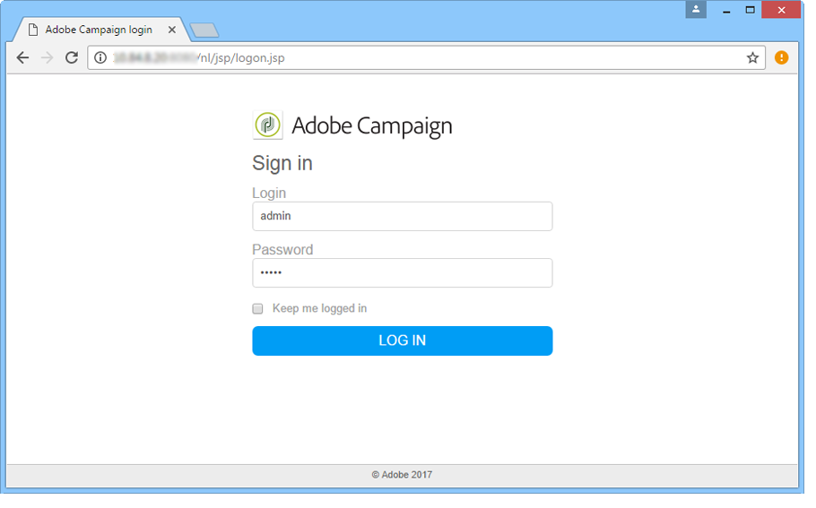

# Installing & Updating the Campaign client console{#installing-the-client-console}

   
Campaign Client Console is a rich client which enables you to connect to your Campaign application server(s).

Before starting, you need to check Campaign [Compatibility matrix](https://helpx.adobe.com/campaign/kb/compatibility-matrix.html), get your Campaign server URL and user credentials.

>[!CAUTION]
>
>Campaign Client console and Campaign application server must run on the same product version. Adobe also recommends to use the same product build.

 Discover how to install and setup the Adobe Campaign Client in [video](#video)

The process to install or update the client console differs depending on your implementation of Adobe Campaign Classic. 
Please review the details below to understand what is required for your implementation.


## Adobe Hosted Implementations {#hosted-customers}

To install or update your client console(s):

1. Adobe can deploy directly. Once the console is updated, users will be prompted to download the latest client console version in a pop-up window. 

1. You can download to your client console(s) from [Software Distribution](https://experience.adobe.com/#/downloads/content/software-distribution/en/campaign.html) 

   **Users will require admin access to complete the update. If the users do not have admin rights, a system administrator will need to deploy to all client consoles**


## Hybrid & Fully On-Premise Implementations {#hybrid-onprem-customers}

For Adobe Campaign users to be able to log on to the instance you have created and configured, they need to use the client console.

### Making the console available to users {#make-console-available}
 
When the computer used to start an Adobe Campaign application server (nlserver web) receives user connections from the client console, you can configure it to make the setup program for the Adobe Campaign rich client available via an HTML interface. Whenever a new version of the client console is available, users are invited to download it when launching their client console.

To do this, you must:

1. Select the package that contains the console installation program.

     This file is called setup-client-7.X.XXXX.exe for v7 or setup-client-6.X.XXXX.exe for v6.1, where X is the sub-version of Adobe Campaign and XXXX is the build   number.

1. Copy and paste this package into the Adobe Campaign installation folder (on the marketing server for hybrid installations), under /datakit/nl/eng/jsp.

1. Start Adobe Campaign server.

>[!CAUTION]
>
>  Adobe recommends leaving the option **[!UICONTROL No longer ask this question]** unselected to make sure that all users are alerted when a new version of the console is available.  If this option is selected the user will not be informed of new available versions.

If **[!UICONTROL No longer ask this question]**  has been selected, you can reset this prompt. Only system administrators comfortable with editing Windows Registry should make these changes:

1. Open Registry Editor using the **regedit** command from the **[!UICONTROL Start > Run]** menu.

1. Search for the node and expand it.

   ```
   \HKEY_CURRENT_USER\Software\Neolane\NL_6\nlclient
   ```

1. Delete the **confAdvisedUpgrade** entry and close Registry Editor.

>[!NOTE]
>
>If you are applying an updated console to an existing implementation, the users will automatically recieve a prompt to update their client console. If you are implementing Campaign for the first time, users will need to download the console. Please see below for details on both options

### Update the console - existing implementation{#update-the-client-console}

Once the console is available in the Campaign server folder, users will be prompted to download the latest client console version in a pop-up window. 
   
   **Users will require admin access to complete the update. If the users do not have admin rights, a system administrator will need to deploy to all client consoles**


### Download the console - new implementation{#download-the-client-console}

Users should now download and install the console by following the steps below:

1. Open a web browser and download the console from the following address:

   [`https://<your adobe campaign server>:<port number>/nl/jsp/logon.jsp`](https://myserver.adobe.com/nl/jsp/logon.jsp).

1. In the identification window, enter your login and password. 

   

   If necessary, use the credentials of the internal account defined during instance creation.

1. Click the **[!UICONTROL Download]** link on the installation page.
1. Download and save the client setup file.
1. Execute the downloaded file on a computer on Windows: The installation starts up. The default installation path of the client console is **$PROGRAMFILES$/Adobe/Adobe Campaign Classic vX Client**, where 'X' is '6' or '7', according to your Adobe Campaign version.

### Create the connection - first time users only{#create-the-connection}

Once the client console is installed, follow the steps below to create the connection to the application server:

1. Start the console from the Windows **[!UICONTROL Start]** menu, in the **Adobe Campaign** program group.

1. Click the link in the top right-hand corner of the credentials fields to access the connection configuration window.

   

1. Click **[!UICONTROL Add > Connection]** and enter the label and URL of the Adobe Campaign application server.

   

1. Specify a connection to your Adobe Campaign application server via a URL. Use either a DNS or an alias of the machine, or your IP address.

   For example, you can use the [`https://<machine>.<domain>.com`](https://myserver.adobe.com) type URL.

1. If Adobe IMS is configured for your organization, check the option **[!UICONTROL Connect with an Adobe ID]** 

1. Click **[!UICONTROL Ok]** to save your settings.

You can add as many connections as needed to connect to your test, stage and production environments for example.

>[!NOTE]
>
>The **[!UICONTROL Add]** button lets you create **[!UICONTROL folders]** to organize all your connections. Simply drag and drop each connection into a folder.

### Log on to Adobe Campaign 

To log on to an existing instance, follow the steps below:

1. Start the console from the Windows **[!UICONTROL Start]** menu, in the **Adobe Campaign** program group.

1. Click the link in the top right-hand corner of the credentials fields to access the connection configuration window.

1. Select the Campaign instance you need to log in to.

1. Click **[!UICONTROL Ok]**

1. Enter your user login credentials and click **[!UICONTROL Log in]**


**Related topics**

* [Creating an instance and logging on](../../installation/using/creating-an-instance-and-logging-on.md).
* [Compatibility matrix](https://helpx.adobe.com/campaign/kb/compatibility-matrix.html) 

## Tutorial video

This video shows how to install and setup the Adobe Campaign Client.

>[!VIDEO](https://video.tv.adobe.com/v/35124?quality=12)

Additional Campaign Classic how-to videos are available [here](https://experienceleague.adobe.com/docs/campaign-classic-learn/tutorials/overview.html).
