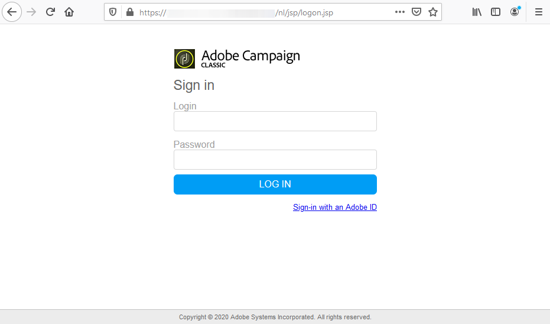

# Installing Campaign client console{#installing-the-client-console}

Campaign Client console is a rich client which enables you to connect to your Campaign application server(s).

Before starting, you need to check Campaign [Compatibility matrix](https://helpx.adobe.com/campaign/kb/compatibility-matrix.html), get your Campaign server URL and user credentials.

>[!CAUTION]
>
>Campaign Client console and Campaign application server must run on the same product version. Adobe also recommends to use the same product build.

 Discover how to install and setup the Adobe Campaign Client in [video](#video)

## Download the console{#download-the-client-console}

To download and in install the Adobe Campaign client console, follow the steps below:

1. Open a web browser and download the console from the following address:

   [`https://<your adobe campaign server>:<port number>/nl/jsp/logon.jsp`](https://myserver.adobe.com/nl/jsp/logon.jsp).

1. In the identification window, enter your login and password. 

   

   If necessary, use the credentials of the internal account defined during instance creation.

1. Click the **[!UICONTROL Download]** link on the installation page.
1. Download and save the client setup file.
1. Execute the downloaded file on a computer on Windows: The installation starts up. The default installation path of the client console is **$PROGRAMFILES$/Adobe/Adobe Campaign Classic vX Client**, where 'X' is '6' or '7', according to your Adobe Campaign version.

>[!NOTE]
>
>On Windows, you can launch the **nlclient.exe** file directly from the `[INSTALL]/bin` directory on a Windows server, where `[INSTALL]` is the access path for the Adobe Campaign installation folder.  

## Create the connection{#create-the-connection}

Once the client console is installed, follow the steps below to create the connection to the application server:

1. Start the console from the Windows **[!UICONTROL Start]** menu, in the **Adobe Campaign** program group.

1. Click the link in the top right-hand corner of the credentials fields to access the connection configuration window.

   

1. Click **[!UICONTROL Add > Connection]** and enter the label and URL of the Adobe Campaign application server.

   

1. Specify a connection to your Adobe Campaign application server via a URL. Use either a DNS or an alias of the machine, or your IP address.

   For example, you can use the [`https://<machine>.<domain>.com`](https://myserver.adobe.com) type URL.

1. If Adobe IMS is configured for your organization, check the option **[!UICONTROL Connect with an Adobe ID]** 

1. Click **[!UICONTROL Ok]** to save your settings.

You can add as many connections as needed to connect to your test, stage and production environments for example.

>[!NOTE]
>
>The **[!UICONTROL Add]** button lets you create **[!UICONTROL folders]** to organize all your connections. Simply drag and drop each connection into a folder.

## Log on to Adobe Campaign 

To log on to an existing instance, follow the steps below:

1. Start the console from the Windows **[!UICONTROL Start]** menu, in the **Adobe Campaign** program group.

1. Click the link in the top right-hand corner of the credentials fields to access the connection configuration window.

1. Select the Campaign instance you need to log in to.

1. Click **[!UICONTROL Ok]**

1. Enter your user login credentials and click **[!UICONTROL Log in]**

**Related topics**

* [Creating an instance and logging on](../../installation/using/creating-an-instance-and-logging-on.md).
* [Compatibility matrix](https://helpx.adobe.com/campaign/kb/compatibility-matrix.html) 

## Tutorial video

This video shows how to install and setup the Adobe Campaign Client.

>[!VIDEO](https://video.tv.adobe.com/v/35124?quality=12)

Additional Campaign Classic how-to videos are available [here](https://experienceleague.adobe.com/docs/campaign-classic-learn/tutorials/overview.html).
