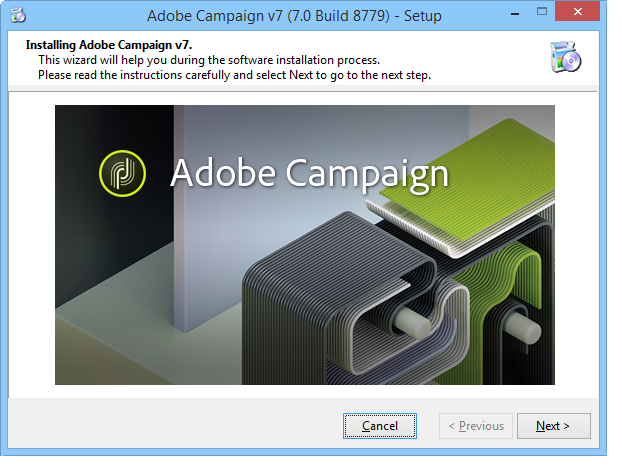
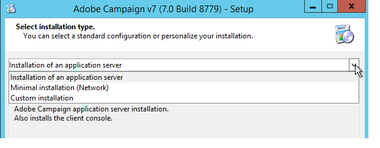
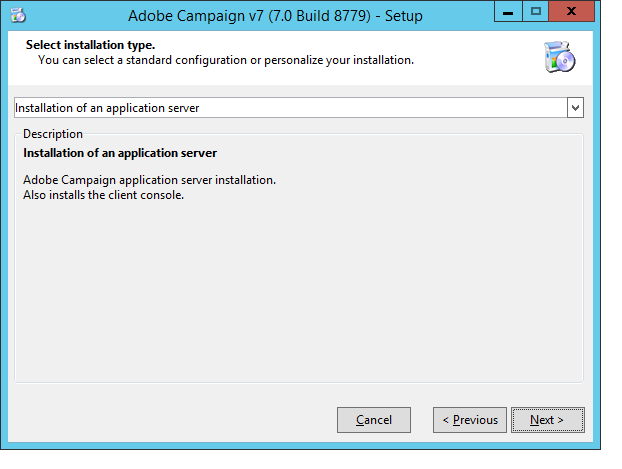
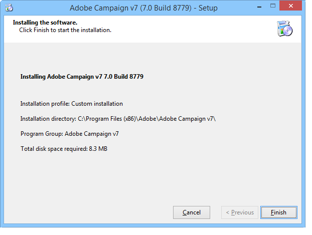
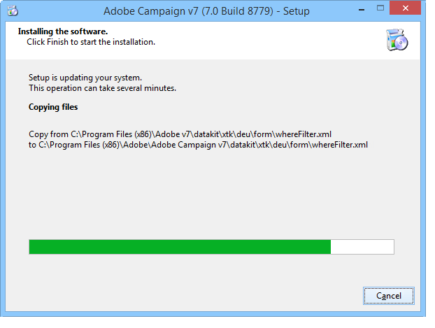
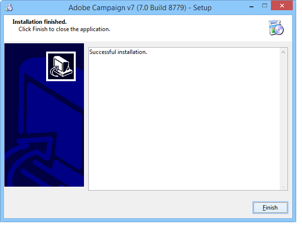
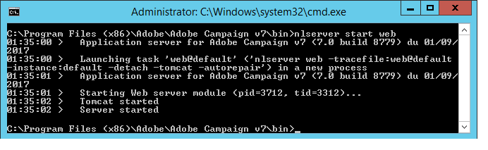

# Installing the server{#installing-the-server}


## Executing the installation program {#executing-the-installation-program}

For a Windows 32 bit platform, install Adobe Campaign 32 bit. For a Windows 64 bit platform, install Adobe Campaign 64 bit.

The installation steps for the Adobe Campaign server are the following:

1. Execute the file **setup.exe**.

   

1. Select the installation type.

   

   Several installation types are available:

    * **[!UICONTROL Installation of an application server]** : Install the Adobe Campaign application server and the client console.
    * **[!UICONTROL Minimal installation (Network)]** : Installation of the client computer from the network. Only a limited number of DLLs will be installed on the computer, if necessary, and all the other components will be used from a network drive.
    * **[!UICONTROL Installation of a client]** : Installation of the required components for the Adobe Campaign client.
    * **[!UICONTROL Custom installation]** : The user chooses the elements to be installed.

   Select **Installation of an application server**, and go through the different steps as shown below:

   

1. Select the installation directory:

   

1. Click **[!UICONTROL Finish]** to start the installation:

   

   The progress bar shows how far the installation is:

   

   Once the installation is complete, a message appears to let you know:

   

   >[!NOTE]
   >
   >Once the server installation is complete a reboot of the server is required to avoid possible network issue.

   Once the installation is complete, start Adobe Campaign to create the configuration files. Refer to [First start-up of the server](#first-start-up-of-the-server).

## Summary installation testing {#summary-installation-testing}

You can test the initial installation using the following command:

```
nlserver pdump
```

If Adobe Campaign is not started, the response is:

```
No task
```

## First start-up of the server {#first-start-up-of-the-server}

Once the installation test is complete, open a command prompt via the **[!UICONTROL Start > Programs > Adobe Campaign]** menu and enter the following command:

```
nlserver web
```



The files in the installation directory are used to configure the Adobe Campaign server modules.

The following information is displayed:

```
15:30:12 >   Application server for Adobe Campaign Classic (7.X YY.R build XXX@SHA1) of DD/MM/YYYY
15:30:12 >   Web server start (pid=664, tid=4188)...
15:30:12 >   Creation of server configuration file '[INSTALL]bin..confserverConf.xml' server via '[INSTALL]bin..conffraserverConf.xml.sample
15:30:12 >   Creation of server configuration file '[INSTALL]bin..confconfig-default.xml' server via '[INSTALL]bin..confmodelsconfig-default.xml
15:30:12 >   Server started
15:30:12 >   Stop requested (pid=664)
15:30:12 >   Web server stop (pid=664, tid=4188)...
```

Press **Ctrl+C** to stop the process, then enter the following command:

```
nlserver start web
```

The following information is displayed:

```
12:17:21 >   Application server for Adobe Campaign Classic (7.X YY.R build XXX@SHA1) of DD/MM/YYYY
12:17:21 >   Start of the 'web@default' ('nlserver web -tracefile:web@default -instance:default -detach -tomcat -autorepair') task in a new process 
12:17:21 >   Application server for Adobe Campaign Classic (7.X YY.R build XXX@SHA1) of DD/MM/YYYY
12:17:21 >   Web server start (pid=29188, tid=-1224824320)...
12:17:21 >   Generation of configuration changes '[INSTALL]bin..confserverConf.xml.diff' between '[INSTALL]bin..confserverConf.xml' and '[INSTALL]bin..conffraserverConf.xml.sample'
12:17:22 >   Tomcat started
12:17:22 >   Server started
```

To stop it, enter:

```
nlserver stop web
```

The following information is displayed:

```
12:18:31 >   Application server for Adobe Campaign Classic (7.X YY.R build XXX@SHA1) of DD/MM/YYYY
12:18:31 >   Stop requested for 'web@default' ('nlserver web -tracefile:web@default -instance:default -detach -tomcat -autorepair', pid=29188, tid=-1224824320)...
12:18:31 >   Stop requested (pid=29188)
12:18:31 >   Web server stopped (pid=29188, tid=-1224824320)...
```

## Password for the internal identifier {#password-for-the-internal-identifier}

The Adobe Campaign server defines a technical login called **internal** that has all rights on all instances. Just after installation the login does not have a password. It is mandatory to define one.

Learn more in [this section](../../installation/using/configuring-campaign-server.md#internal-identifier).

## Starting Adobe Campaign services {#starting-adobe-campaign-services}

To start the Adobe Campaign services, you can use the service manager or enter the following at the command line (with the appropriate rights):

```
net start nlserver6
```

If you need to stop the Adobe Campaign processes later on, use the command:

```
net stop nlserver6
```

## Installing LibreOffice {#installing-libreoffice}

Download LibreOffice, for example from [https://www.libreoffice.org/download/libreoffice-fresh/](https://www.libreoffice.org/download/libreoffice-fresh/) and follow the regular installation steps.

Add the following environment variable:

```
OOO_BASIS_INSTALL_DIR="C:\Program Files (x86)\LibreOffice 6\"
```
