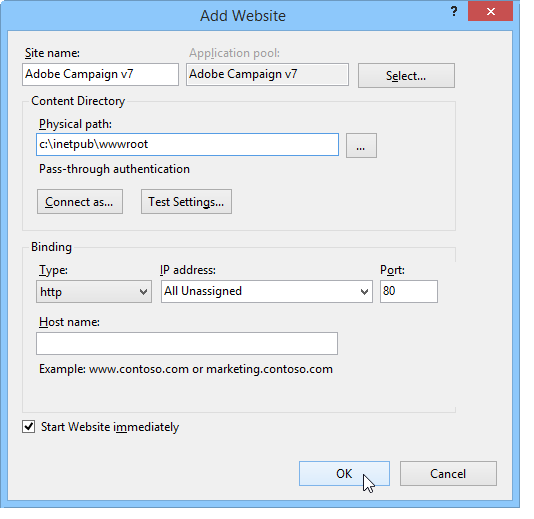
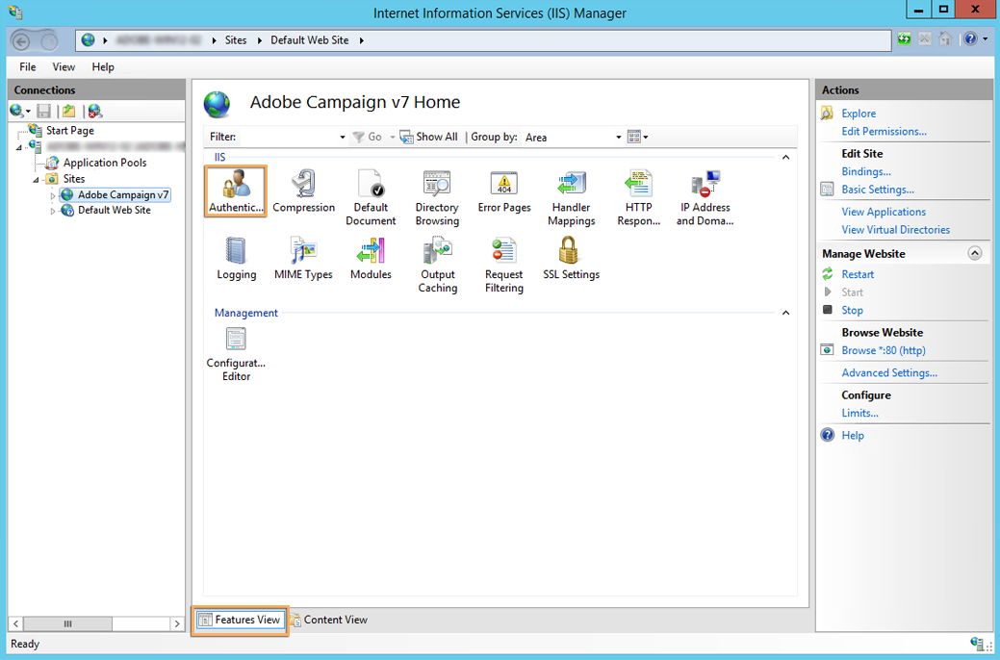
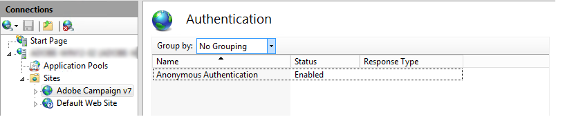

# Integration into a Web server for Windows {#integration-into-a-web-server-for-windows}

Adobe Campaign includes Apache Tomcat which acts as the entry point in the application server via HTTP (and SOAP).

You can use this integrated Tomcat server to serve HTTP requests.

In this case:

* the default listening port is 8080. To change it, refer to [this section](../../installation/using/configure-tomcat.md).
* The client consoles then connect using a URL such as ```https:// `<computer>`:8080```.

However, for security and administration reasons, we recommend using a dedicated Web server as the main entry point for HTTP traffic when the computer that is running Adobe Campaign is exposed on the Internet and you wish to open access to the console outside of your network.

A Web server also lets you guarantee data confidentiality with the HTTPs protocol.

Likewise, you must use a Web server when you wish to use the tracking functionality, which is only available as a Web server extension module.

## Configuring the IIS Web server {#configuring-the-iis-web-server}

The configuration procedure for a Microsoft IIS Web server is mostly graphical. It involves using a Web site to access the resources of the Adobe Campaign server: Java (.jsp) files, stylesheets (.css, .xsl), images (.png), the ISAPI DLL for redirection, etc.


### Configuration steps {#configuration-steps}

To integrate Adobe Campaign with Microsoft IIS web server, follow these steps:

1. Open Microsoft IIS.
1. Create and configure the site (Adobe Campaign, for example) depending on the parameters of your network (TCP connection port, DNS host, IP address). 

   You must at least specify the name of the site and the access path to the virtual directory. Since the path for accessing the Website directory is not used, you can use the following directory.

   ```
   C:\inetpub\wwwroot
   ```

   

1. A **VBS** script enables you to automatically configure the resources used by the Adobe Campaign server on the virtual directory we have just created. To launch it, double click the **iis_neolane_setup.vbs** file located in the `[INSTALL]\conf` folder, where `[INSTALL]` is the path for accessing the Adobe Campaign installation folder.

   >[!NOTE]
   >
   >You must be logged in as an administrator to run the VBS script or execute the script as administrator.

   Click **[!UICONTROL OK]** if the Web server is used as a tracking redirection server, otherwise click **[!UICONTROL Cancel]**.

   When multiple sites are already configured on the Web server, an intermediate page is displayed to specify to which Web site the installation applies: enter the number linked to the site and click **[!UICONTROL OK]**.

1. In the **[!UICONTROL Content View]** tab, make sure the Web site is correctly configured with the Adobe Campaign resources:

   If the tree is not displayed, restart Microsoft IIS.

### Managing rights {#managing-rights}

You must next configure the security settings for the ISAPI DLL and for the resources in the Adobe Campaign installation directory.

To do this, apply the following steps:

1. Select the **[!UICONTROL Features View]** tab and double-click the **Authentication** link.

   

1. In the **Directory Security** tab of the Web site, make sure that anonymous access is enabled. If necessary, click the **[!UICONTROL Edit]** link to change the settings.

   

### Launching the Web server and testing the configuration {#launching-the-web-server-and-testing-the-configuration}

You must now test whether the configuration is correct.

To do this, apply the following procedure:

1. Restart the Microsoft IIS server using the **iisreset** command line.

1. Start the Adobe Campaign service, then ensure it is running.

1. Test the tracking module by inserting the following URL into a Web browser:

   ```
   https://<computer>/r/test
   ```

   The browser should display the following response:

   ```
   <redir status='OK' date='YYYY/MM/DD HH:MM:SS' build='XXXX' host='myserver.mydomain.com' localHost='localhost'/>
   ```

To test for the presence of the redirection module, run the following command line:

```
nlserver pdump
```

It must return the following information:

```sql
HH:MM:SS >   Application server for Adobe Campaign Classic (7.X YY.R build XXX@SHA1) of DD/MM/YYYY
webmdl@default (1644) - 18.2 Mo
```

You can also make sure the ISAPI DLL is correctly loaded.

To do this, apply the following steps:

1. Edit the ISAPI filters for the Adobe Campaign site by clicking the **[!UICONTROL Driver mapping]** icon.
1. The check the content of the ISAPI filter.
## Changing the upload file size limit {#changing-the-upload-file-size-limit}

When configuring the IIS Web server, a limit of approximately 28 MB is automatically for set files that are uploaded to the server.

This may have an impact in Adobe Campaign, particularly if you would like to upload files that are larger than this limit.

For example, if you use a **Data loading (file)** type activity in a workflow to import a 50 MB file, an error will stop the workflow from executing correctly.

In this case, you must increase this limit.

For more information on this Microsoft IIS option, refer to the "HowTo" section of the [Microsoft documentation](https://learn.microsoft.com/en-us/iis/configuration/system.webServer/security/requestFiltering/requestLimits/){target="_blank"}.

