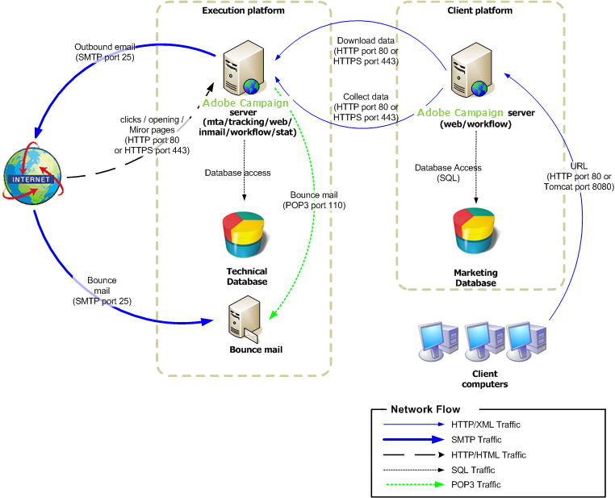

# Mid-sourcing deployment{#mid-sourcing-deployment}

This configuration is an optimal intermediate solution between a hosted (ASP) configuration and internalization. The outward-facing execution components are carried out on a "mid-sourcing" server hosted at Adobe Campaign.

>[!NOTE]
>
>To set up this type of deployment, you need to acquire the appropriate option. Please check your license contract.

General communication between servers and processes is carried out according to the following schema:

* The execution and bounce management modules are disabled on the instance.
* The application is configured to perform message execution on a remote "mid-sourced" server that is driven using SOAP calls (over HTTP or HTTPS).

## Features {#features}

### Advantages {#advantages}

* Simplified server configuration: It is not necessary for the customer to configure outward-facing modules (mta and inMail).
* Limited use of bandwidth: Since execution is performed by the mid-sourcing server, only sufficient bandwidth is required to send personalization data to the mid-sourcing server.
* High availability is no longer an internal issue: The problem is shifted to the mid-sourcing server (redirection, mirror pages, execution servers, etc.).
* The database does not leave the company: Only data necessary to assemble the messages are sent to the mid-sourcing server (HTTPS can be used for this).
* This type of deployment can be a solution for high volume architectures (many recipients in the database), with a significant delivery throughput.

### Disadvantages {#disadvantages}

* Slight delay in viewing message-execution information and for reporting functionality due to the time it takes to get information back from the mid-sourcing server.
* Surveys and web forms remain on the client platform.

### Recommended equipment {#recommended-equipment}

* Application server: 2 Ghz quad-core CPU, 4 GB RAM, software RAID 1 80 GB SATA hard drive.
* Database server: 3 GHz bi-quad core CPUs, minimum 4 GB RAM, hardware RAID 10 15000RPM SAS hard drive, the number depending on the size and expected performance of the database.

>[!NOTE]
>
>Redirection and mid-sourcing are separate elements, however the tracking server will, in general, be shared with the mid-sourcing servers.

## Installation and configuration steps {#installation-and-configuration-steps-}

### Prerequisites {#prerequisites}

* JDK on the application server.
* Access to a database server on the application server.
* Firewall configured to open HTTP (80) or HTTPS (443) ports to the mid-sourcing server.

### Installing and configuring (mid-sourcing deployment) {#installing-and-configuring--mid-sourcing-deployment-}

Refer to [Mid-sourcing server](../../installation/using/mid-sourcing-server.md).
