# Mid-sourcing server{#mid-sourcing-server}

This section details the installation and configuration of a mid-sourcing server, as well as the deployment of an instance which enables third parties to send messages in **mid-sourcing** mode.

The "mid-sourcing" architecture is presented in [Mid-sourcing deployment](../../installation/using/mid-sourcing-deployment.md).

Installing a mid-sourcing server follows the same process as installing a server in the normal way (refer to the standard configuration). It is an independent instance with its own database which can be used to run deliveries. Simply put, it contains an extra configuration to allow remote instances execute deliveries through it in mid-sourcing mode.

>[!CAUTION]
>
>Once the mid-sourcing server has been setup and the [sync workflows](../../workflow/using/about-technical-workflows.md) have run for the first time, make sure you do not update the internal name of the mid-sourcing external accounts.

## Steps for installing and configuring an instance {#steps-for-installing-and-configuring-an-instance}

### Prerequisites for installing and configuring an instance {#prerequisites-for-installing-and-configuring-an-instance}

* JDK on the application server.
* Access to a database server on the application server.
* Firewall configured to open HTTP (80) or HTTPS (443) ports to the mid-sourcing server.

The following procedure details a configuration using a single mid-sourcing server. It is also possible to use multiple servers. Likewise it is also possible to send certain messages (such as workflow notifications, for example) from an internal configuration.

### Installing and configuring the application server for mid-sourcing deployment {#installing-and-configuring-the-application-server-for-mid-sourcing-deployment}

The installation procedure is identical to that of standalone instance. Refer to [Installing and configuring (single machine)](../../installation/using/standalone-deployment.md#installing-and-configuring--single-machine-).

However, you must apply the following:

* At step **5**, You must disable the **mta** (delivery) and **inMail** (bounce mails) modules. The **wfserver** (workflow) module however, must stay activated.

  ```
  <?xml version='1.0'?>
  <serverconf>  
    <shared>    
      <!-- add lang="eng" to dataStore to force English for the instance -->    
      <dataStore hosts="console.campaign.net*">      
        <mapping logical="*" physical="default"/>    
      </dataStore>  </shared>  
      <mta autoStart="false"/>  
      <wfserver autoStart="true"/>  
      <inMail autoStart="false"/>  
      <sms autoStart="false"/>  
      <listProtect autoStart="false"/>
  </serverconf>
  ```

  For more on this, refer to [this section](../../installation/using/configuring-campaign-server.md#enabling-processes).

* Steps **6**, **9** and **10** aren't necessary.
* During steps **12** and **13**, you need to indicate the 8080 port in the connection URL (since the console communicates with Tomcat directly, not via the Web server). The URL becomes [http://console.campaign.net:8080](http://console.campaign.net). During step **13**, select the **[!UICONTROL Issue towards Mid-sourcing]** package as well as those to install.

  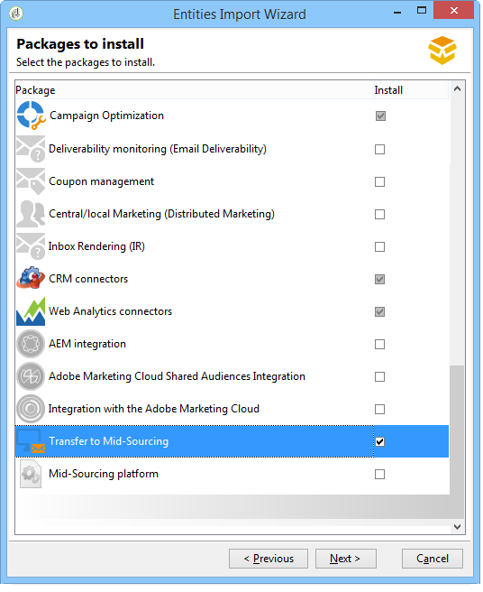

  >[!CAUTION]
  >
  >The default routing of technical deliveries is automatically replaced with email routing via Mid-sourcing.

### Installing and configuring the mid-sourcing server {#installing-and-configuring-the-mid-sourcing-server}

From the client console, locate the **Email routing using mid-sourcing** mid-sourcing account (in the **/Administration/External accounts/** folder). Populate the **URL of server**, **account**, **password** and **Mirror page URL** settings with the information provided by the server provider hosting the mid-sourcing server. Test the connection.

>[!NOTE]
>
>The **mid-sourcingEmitter** option creates two **Mid-sourcing** workflows. It is a process that runs by default every 1 hour and 20 minutes and collects delivery information on the mid-sourcing server.

## Deploying a mid-sourcing server {#deploying-a-mid-sourcing-server}

1. Installing the application server:

   >[!CAUTION]
   >
   >If you install the mid-sourcing server and want to install extra Adobe Campaign modules, we recommend using the Delivery module and not the Campaign module.

   Follow the same procedure as for the standard deployment, selecting only the **[!UICONTROL Mid-sourcing platform]** option.

   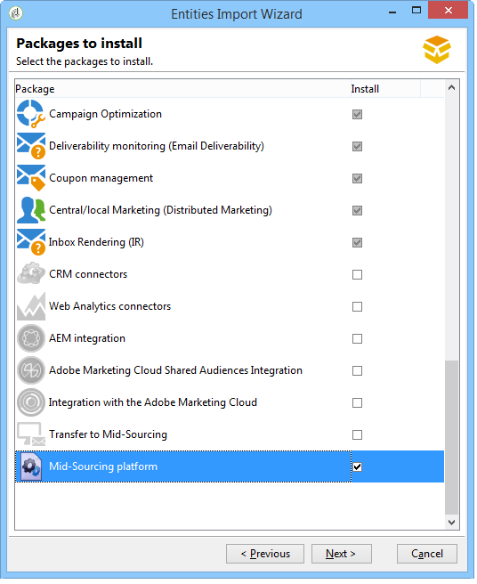

1. Configuration for receiving in mid-sourcing mode

   Set the submission account password: In the **/Mid-sourcing/Access Management/Operators/** folder, the **mid** operator is used by the remote instance for submissions in mid-sourcing mode. You must set a password for this operator and give it to the administrator of the submission instance.

   The **Mid-sourcing platform** option creates the default folders for storing the deliveries submitted and the default operator performing the submissions.

## Multiplexing the mid-sourcing server {#multiplexing-the-mid-sourcing-server}

>[!CAUTION]
>
>Multiplexing is only supported for on-premise environments.

It is possible for a mid-sourcing instance to be shared by multiple submitting instances. Each of these instances needs to be associated with an operator in the mid-sourcing database. To create a second account on the mid-sourcing server:

1. Create a folder in the **[!UICONTROL Mid-sourcing > Deliveries]** node that will be associated with the default mid-sourcing account (for example: prod). 
1. Create a folder in the **[!UICONTROL Mid-sourcing > Deliveries]** node with the same name as the account (for example: acceptance_test). 

   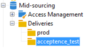

1. In **[!UICONTROL Mid-sourcing > Access Management > Operators]**, create a new account.

   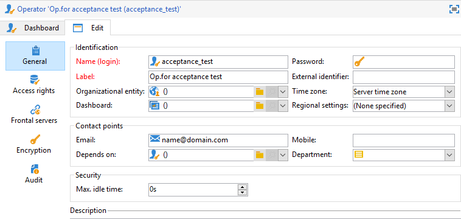

1. In the **[!UICONTROL Access rights]** tab, give this operator the rights of the **Mid-sourcing submissions** group. This access right is available in **[!UICONTROL Mid-sourcing > Access Management > Operator groups]**.

   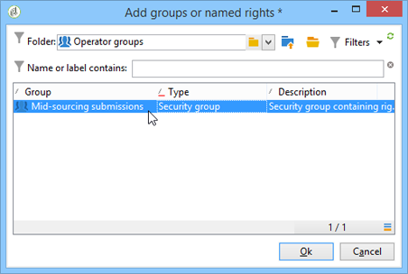

1. Select the **[!UICONTROL Restrict to data in the sub-folders of]** option and select the deliveries folder to restrict this operator to the mid-sourcing deliveries folder.

   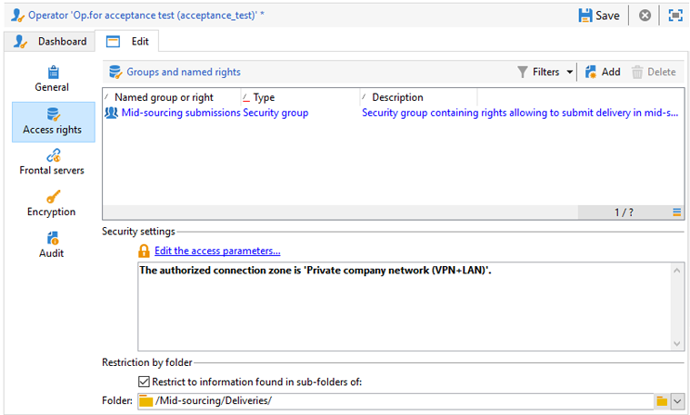

1. Restart the Web module using the following command: **nlserver restart web**.

You must change the mid-sourcing server setting in the serverConf.xml file. The following line must be added to the "Management of affinities with IP addresses" section, under the existing line:

```
<IPAffinity IPMask="" localDomain="" name=""/>
```

The '@name' attribute must respect the following rules:

**'marketing_account_operator_name'.'affinity_name'.'affinity_group'**

'marketing_account_operator_name' relates to the internal name of the mid-sourcing account declared in the mid-sourcing instance.

'affinity_name' relates to the arbitrary name given to the affinity. This name must be unique. Authorized characters are `[a-z]``[A-Z]``[0-9]`. The aim is to declare a group of public IP addresses.

'affinity_group' relates the Sub-affinity declared in the target mapping used in each of the deliveries. The last part including the '.' is ignored if there is no Sub-affinity. Authorized characters are `[a-z]``[A-Z]``[0-9]`.

You must stop and then restart the server in order for the modification to be taken into account.

## Configuring tracking on a mid-sourcing server {#configuring-tracking-on-a-mid-sourcing-server}

**Configuring the mid-sourcing server**

1. Go to 'operators' and select the operator **[!UICONTROL mid]**.
1. In the **[!UICONTROL Frontal servers]** tab, enter the tracking server connection parameters.

   To create a tracking instance, enter the URL of the tracking server, the tracking server internal account password and the name of the instance, its password, and the DNS masks associated with it. 

   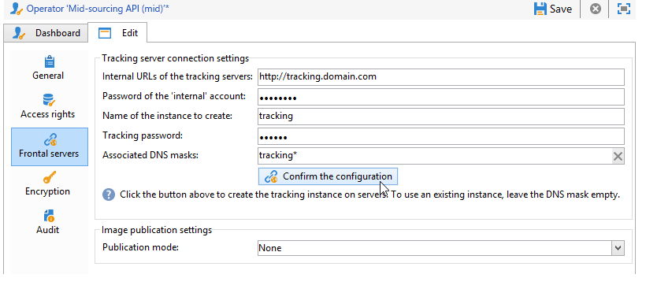

1. When you have entered the connection parameters, click **[!UICONTROL Confirm the configuration]**.
1. If necessary, specify the location where images contained in deliveries are to be stored. To do this, select one of the publication modes from the drop-down list. 

   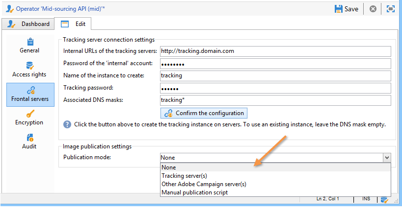

   If you choose the **[!UICONTROL Tracking server(s)]** option, the images will be copied on the mid-sourcing server.

**Configuring the customer platform**

1. Go to the external mid-sourcing routing account.
1. In the **[!UICONTROL Mid-Sourcing]** tab, specify the mid-sourcing server connection parameters.

   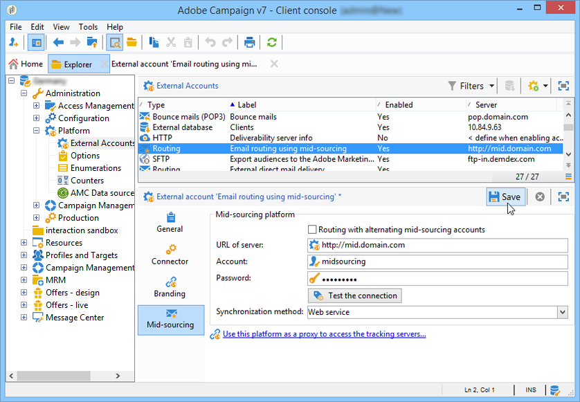

1. Confirm your configuration by clicking **[!UICONTROL Test the connection]**.
1. Declare the tracking instance referenced on the mid-sourcing server:

   Click the link **[!UICONTROL Use this platform as a proxy to access the tracking servers]**,

   Specify the name of the tracking instance and then confirm the connection with the tracking server.

   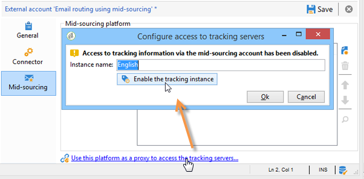

If the delivery of messages is to be managed by several mid-sourcing servers, select the option **[!UICONTROL Routing with alternating mid-sourcing accounts]** and specify the different servers.

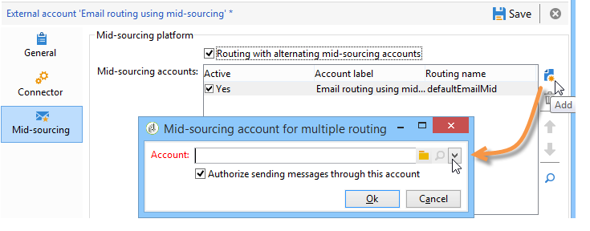
