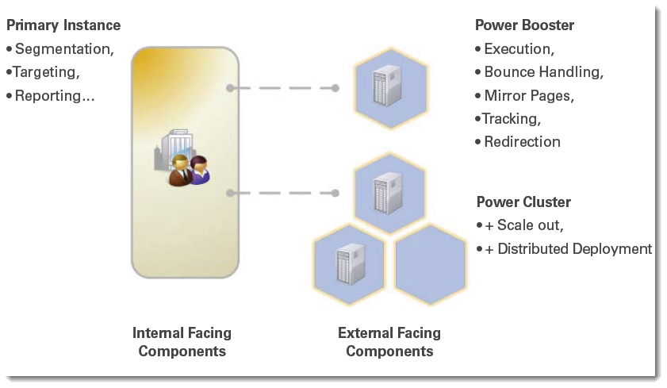

# Power Booster and Power Cluster{#power-booster-and-power-cluster}

## Overview {#overview}

Adobe Campaign provides you with two sets of pre-packaged architectural options for dimensioning your deployment:

* **Power Booster**

  This option provides support for a single additional execution instance decoupled from the primary Adobe Campaign application instance. Dedicated execution instances can be hosted remotely or by a third party. When implemented, email execution, tracking, mirror pages, and bounce messages are handled independently of the central application functions.

* **Power Cluster**

  This option provides support for 2 to N clustered execution instances decoupled from the primary Adobe Campaign application instance in relation to a given application. Clusters can be hosted remotely, in distributed deployments, and by third parties. In addition to the benefits of process isolation, the Adobe Campaign Power Cluster option enables redundancy and scale out strategies using commodity hardware for simplified evolution of SLA or performance.

## Eligible applications {#eligible-applications}

The Power Booster and Power Cluster options can be used by the following applications:

* Campaign
* Delivery
* Message Center

## Matrix of architectural recommendations {#matrix-of-architectural-recommendations}

<table> 
 <tbody> 
  <tr> 
   <td> </td> 
   <td> <strong>Standard architecture</strong>  </td> 
   <td> <strong>Power Booster</strong>  </td> 
   <td> <strong>Power Cluster</strong>  </td> 
  </tr> 
  <tr> 
   <td> Email campaigns and outbound interactions  </td> 
   <td> Up to approximately 30 million emails per month  </td> 
   <td> 30 to 100 million emails per month  </td> 
   <td> Over 100 million emails per month  </td> 
  </tr> 
  <tr> 
   <td> Transactional messages  </td> 
   <td> 50,000 per hour per execution server  </td> 
   <td> 50,000 per hour per execution server  </td> 
   <td> 50,000 per hour per execution server  </td> 
  </tr> 
  <tr> 
   <td> Availability  </td> 
   <td> That of the primary database  </td> 
   <td> 24/7 except maintenance windows and downtimes for the execution instance  </td> 
   <td> 24/7/365 service possible  </td> 
  </tr> 
  <tr> 
   <td> Security  </td> 
   <td> Data mart is potentially accessible from the public internet  </td> 
   <td> Data mart is isolated from frontal, internet-facing components  </td> 
   <td> Data mart is isolated from frontal, internet-facing components  </td> 
  </tr> 
  <tr> 
   <td> Deployment template  </td> 
   <td> All on one site (can be on premise or in the cloud)  </td> 
   <td> Marketing on premise with execution in the cloud possible  </td> 
   <td> Marketing on premise with execution in the cloud; execution in different geos possible  </td> 
  </tr> 
 </tbody> 
</table>

## Recommendations {#recommendations}

* An execution instance must be dedicated to a service. You cannot install a package for a service which you haven't subscribed to. For instance, if you subscribe to the **Power Booster** option for the **Message Center** service, you may only install the **[!UICONTROL Execution of transactional messages]** package on the dedicated execution instance. Please check your license agreement.
* Since dedicated instances (or clusters) are Adobe Campaign instances, recommendations are the same as for a main instance. For more on this, refer to [this document](../../production/using/foreword.md).
* To properly configure the instance from a database/hardware components point of view, please contact Adobe Campaign Professional Services.
