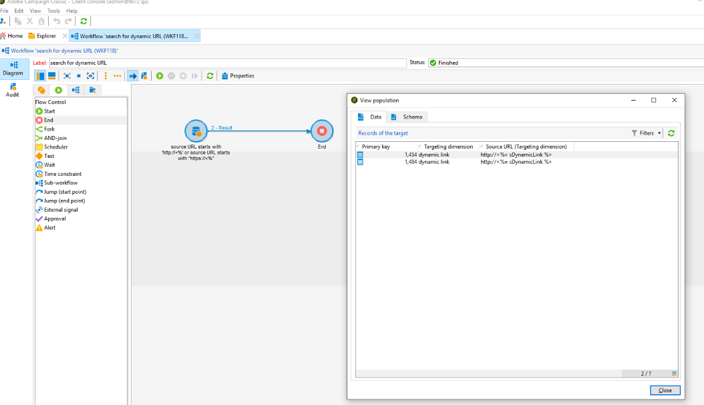
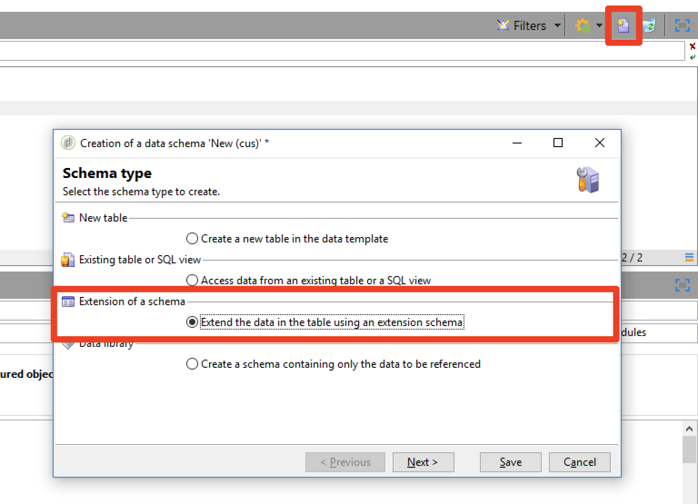

# Privacy {#privacy}

## Privacy Requests

Adobe Campaign offers a set of tools to help you with your Privacy Compliance for GDPR and CCPA.

Refer to [this page](../../platform/using/privacy-management.md) for general information on what Privacy Management is and the implementation steps in Adobe Campaign. You will also find best practices and an overview of the user process and personas.  

## URL Personalization {#url-personalization}

When adding personalized links to your content, always avoid having any personalization in the hostname part of the URL to avoid potential security gaps. The following examples should never be used in all URL attributes <`a href="">` or ``:

* `<%= url >`
* `https://<%= url >`
* `https://<%= domain >/path`
* `https://<%= sub-domain >.domain.tld/path`
* `https://sub.domain<%= main domain %>/path`

### Recommendation

To validate and ensure that you are not using above, run a query on tracking URL table via [Campaign Generic Query Editor](../../platform/using/steps-to-create-a-query.md) or create a workflow with filter criteria in the [query activity](../../workflow/using/query.md).

Example:

1. Create a workflow and add a Query activity. Learn more.

1. Open the Query activity and create a filter on the nmsTrackingUrl table as follows: source URL starts with http://<% or source URL starts with https://<%.

1. Run the workflow and check if there are result.

1. If so, open the output transition to view the list of URLs.



### Signature mechanism

To improve security, a new signature mechanism for tracking links in emails has been introduced in Build 19.1.4 (9032@3a9dc9c), and is available in Build 19.1.4 (9032@3a9dc9c) and Campaign 20.2. This option is enabled by default for all customers.

>[!NOTE]
>
>When a malformed signed URL is clicked, it will return the following error: "Requested URL '… ' was not found."

In addition, starting Campaign 20.2 and [!DNL Gold Standard] release, hosted and hybrid customers can use an enhancement to disable URLs generated from previous builds. This option is disabled by default. You can reach out to [Customer Care](https://helpx.adobe.com/enterprise/admin-guide.html/enterprise/using/support-for-experience-cloud.ug.html) to enable this feature.

To activate this new mechanism, on-premise customers need to follow these steps on all Campaign servers:

1. In the server configuration file (serverConf.xml), change **blockRedirectForUnsignedTrackingLink** to **true**.
1. Restart the **nlserver** service.
1. On the tracking server, restart the web server (apache2 on Debian, httpd on CentOS/RedHat, IIS on Windows).

Customers running on [!DNL Gold Standard] 19.1.4 can experience issues with push notification deliveries using tracking link, or deliveries using anchor tags. If so, Adobe recommends to disable the new signature mechanism for tracking links:

**Hosted and hybrid customers** must reach out to [Customer Care](https://helpx.adobe.com/enterprise/using/support-for-experience-cloud.html) to have this mechanism disabled.

**On-premise customers** can follow the step below :

1. In the server configuration file (serverConf.xml), change **signEmailLinks** to **false**.
1. Restart the **nlserver** service.
1. On the tracking server, restart the web server (apache2 on Debian, httpd on CentOS/RedHat, IIS on Windows).

## Data restriction

You have to make sure that the encrypted passwords will not be accessible by a low privilege authenticated user. To do that, there are two main way: restrict access to password fields only or to the entire entity (need a build >= 8770).

This restriction allows you to remove passwords fields but let the external account accessible from the interface for all users. Refer to [this page](../../configuration/using/restricting-pii-view.md).

1. Go in **[!UICONTROL Administration]** > **[!UICONTROL Configuration]** > **[!UICONTROL Data schemas]**.

1. Create a new **[!UICONTROL Extension of a schema]**.

    

1. Choose **[!UICONTROL External Account]** (extAccount).

1. In the last wizard screen, you can edit your new srcSchema to restrict access to all password fields:

    You can replace the main element (`<element name="extAccount" ... >`) by:

    ```
    <element name="extAccount">
        <attribute accessibleIf="$(loginId) = 0 or $(login) = 'admin'" name="password"/>
        <attribute accessibleIf="$(loginId) = 0 or $(login) = 'admin'" name="clientSecret"/>
   
        <element name="s3Account">
            <attribute accessibleIf="$(loginId) = 0 or $(login) = 'admin'" name="awsSecret"/>
        </element>
        <element name="wapPush">
            <attribute accessibleIf="$(loginId) = 0 or $(login) = 'admin'" name="password"/>
            <attribute accessibleIf="$(loginId) = 0 or $(login) = 'admin'" name="clientSecret"/>
        </element>
        <element name="mms">
            <attribute accessibleIf="$(loginId) = 0 or $(login) = 'admin'" name="password"/>
            <attribute accessibleIf="$(loginId) = 0 or $(login) = 'admin'" name="clientSecret"/>
        </element>
    </element>
    ```

    So your extended srcSchema can look like:

    ```
    <srcSchema _cs="External Accounts (cus)" created="2017-05-12 07:53:49.691Z" createdBy-id="0"
                desc="Definition of external accounts (Email, SMS...) used by the modules"
                entitySchema="xtk:srcSchema" extendedSchema="nms:extAccount" img="" label="External Accounts"
                labelSingular="External account" lastModified="2017-05-12 08:33:49.365Z"
                mappingType="sql" md5="E9BB0CD6A4375F500027C86EA854E101" modifiedBy-id="0"
                name="extAccount" namespace="cus" xtkschema="xtk:srcSchema">
        <createdBy _cs="Administrator (admin)"/>
        <modifiedBy _cs="Administrator (admin)"/>
        <element name="extAccount">
            <attribute accessibleIf="$(loginId) = 0 or $(login) = 'admin'" name="password"/>
            <attribute accessibleIf="$(loginId) = 0 or $(login) = 'admin'" name="clientSecret"/>
  
            <element name="s3Account">
                <attribute accessibleIf="$(loginId) = 0 or $(login) = 'admin'" name="awsSecret"/>
            </element>
            <element name="wapPush">
                <attribute accessibleIf="$(loginId) = 0 or $(login) = 'admin'" name="password"/>
                <attribute accessibleIf="$(loginId) = 0 or $(login) = 'admin'" name="clientSecret"/>
            </element>
            <element name="mms">
                <attribute accessibleIf="$(loginId) = 0 or $(login) = 'admin'" name="password"/>
                <attribute accessibleIf="$(loginId) = 0 or $(login) = 'admin'" name="clientSecret"/>
            </element>
        </element>
    </srcSchema>    
    ```

    >[!NOTE]
    >
    >You can remplace `$(loginId) = 0 or $(login) = 'admin'` by `hasNamedRight('admin')` to let all users with admin right see these passwords.

## Protecting pages containing PII

We strongly advise on-premise customers to protect the pages that might contain personal information such as mirror pages, web applications, etc.

The goal of this procedure is to prevent these pages from being indexed, thus avoiding a potential security risk. Here are a few useful articles:

* [https://developers.google.com/search/reference/robots_txt](https://developers.google.com/search/reference/robots_txt)
* [https://developers.google.com/search/reference/robots_meta_tag](https://developers.google.com/search/reference/robots_meta_tag)
* [https://www.google.com/webmasters/tools/robots-testing-tool](https://www.google.com/webmasters/tools/robots-testing-tool
)

To protect your pages, follow these steps:

1. Add a robots.txt file at the root of your web server (Apache or IIS). Here is the content of the file:

    ```
    # Make changes for all web spiders
    User-agent:
    *Disallow: /
    ```

    For IIS, refer to [this page](https://docs.microsoft.com/en-us/iis/extensions/iis-search-engine-optimization-toolkit/managing-robotstxt-and-sitemap-files).

    For Apache, you can place the file in **/var/www/robots.txt** (Debian).

1. Sometimes adding a **robots.txt** file is not sufficient in terms of security. For example, if another website contains a link to your page, it might appear in a search result.

In addition to the **robots.txt** file, it is advised to add a **X-Robots-Tag** header. You can do it in Apache or IIS and in the **serverConf.xml** configuration file.

For more information, refer to [this article](https://developers.google.com/search/reference/robots_meta_tag).
