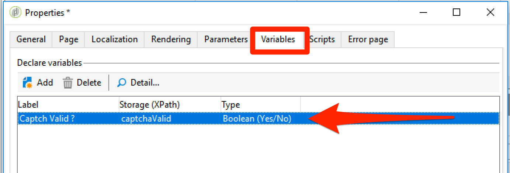
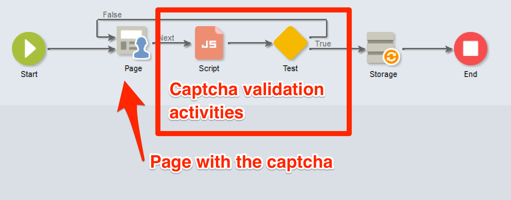
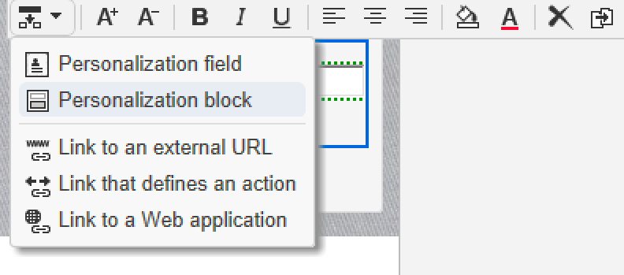
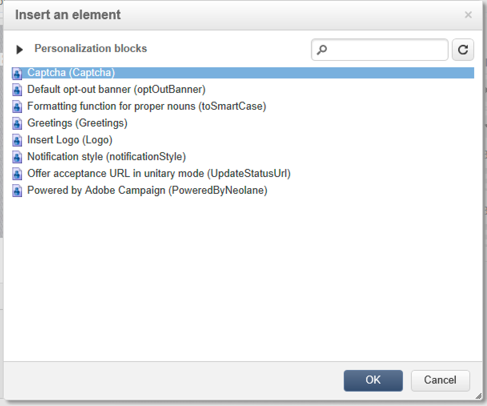
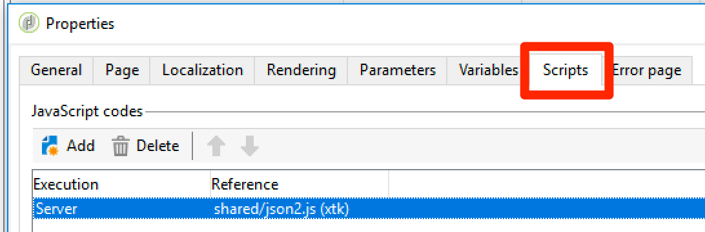

# Scripting and coding guidelines {#scripting-coding-guidelines}

## Scripting

For more details, refer to [Campaign JSAPI documentation](https://docs.adobe.com/content/help/en/campaign-classic/technicalresources/api/index.html).

If you script using workflow, web applications, jssp, follow these best practices:

* Try to avoid using SQL statements as much as you can.

* If you need to, use parameterized (prepare statement) functions instead of string concatenation.

    Bad practice:

    ```
    sqlGetInt( "select iRecipientId from NmsRecipient where sEmail ='" + request.getParameter('email') +  "'  limit 1" )
    ```

    Good practice:

    ```
    sqlGetInt( "select iRecipientId from NmsRecipient where sEmail = $(sz) limit 1", request.getParameter('email'));
    ```

    >[!IMPORTANT]
    >
    >sqlSelect doesn't support this feature, so you have to use the query function of DBEngine class:

    ```
    var cnx = application.getConnection()
    var stmt = cnx.query("SELECT sFirstName, sLastName FROM NmsRecipient where sEmail = $(sz)", request.getParameter('email'))
    for each(var row in stmt) logInfo(row[0] + " : " + row[1])
    cnx.dispose()
    ```

To avoid SQL injections, SQL functions must be added to the allow list to be used in Adobe Campaign. Once they are added to the allow list, they become visible to your operators in the expression editor. Refer to [this page](../../configuration/using/adding-additional-sql-functions.md).

>[!IMPORTANT]
>
>If you are using a build that is older than 8140, the **XtkPassUnknownSQLFunctionsToRDBMS** option might be set to '1'. If you want to secure your database, delete this option (or set it to '0').

If you are using user input to build filters in queries or SQL statements, you always have to escape them (refer to [Campaign JSAPI documentation](https://docs.adobe.com/content/help/en/campaign-classic/technicalresources/api/index.html) - Data protection: escaping functions). These functions are:

* NL.XML.escape(data)
* NL.SQL.escape(data)
* NL.JS.escape(data)
* NL.XML.escapeAttribute(data)

## Securing your new data model

### Folder base

Refer to these pages:

* [Folder access properties](../../platform/using/access-management.md)
* [Linked folder](../../configuration/using/configuration.md#linked-folder)

### Named rights

In addition to the folder-based security model, you can use named rights to limit operator actions:

* You can add some system filters (sysFilter) to prevent reading/writing to your data (see [this page](../../configuration/using/filtering-schemas.md)).

    ```
    <sysFilter name="writeAccess">    
        <condition enabledIf="hasNamedRight('myNewRole')=false" expr="FALSE"/>  
    </sysFilter>
    ```

* You can also protect some actions (SOAP method) defined in schemas. Just set the access attribute with the corresponding named right as the value.

    ```
    <method name="grantVIPAccess" access="myNewRole">
        <parameters>
    ...
        </parameters>
    </method>
    ```

    For more on this, refer to [this page](../../configuration/using/implementing-soap-methods.md).

>[!IMPORTANT]
>
>You can use named rights in the command node in a navtree. It gives a better user experience but doesn't provide any protection (use only client side to hide / disable them). You have to use the access attribute.

### Overflow table

If you need to protect confidential data (part of a schema) depending on the operator access level, do not hide them in the form definition (enabledIf/visibleIf conditions).

The full entity is loaded by the screen, you can also display them in column definition. To do this, you have to create an overflow table. Refer [this page](../../configuration/using/examples-of-schemas-edition.md#overflow-table).

## Adding captchas in web applications

It is a good practice to add a captcha in public landing pages/subscription pages. Unfortunately, adding a captcha in DCE (Digital Content Editor) pages is not easy. We will show you how to add a v5 captcha or a Google reCAPTCHA.

The general way to add a captcha in the DCE is to create a personalization block to include it easily within the page content. You will have to add a **Script** activity and a **Test**.

### Personalization block

1. Go to **[!UICONTROL Resources]** > **[!UICONTROL Campaign Management]** > **[!UICONTROL Personalization blocks]** and create a new one.

1. Use the **[!UICONTROL Web application]** content type and check **[!UICONTROL Visible in the customization menus]**.

    For more information, refer to [this page](../../delivery/using/personalization-blocks.md).

    Here is an example of a **Campaign captcha**:

    ```javascript
    <%
    var captchaID = CaptchaIDGen();
    %>
    &width=200&height=50&minWordSize=8&maxWordSize=8"/>
    <input id="captchaValue" name="captchaValue" <%= String(ctx.vars.captchaValid) === "false" ? class="ui-state-error" : "" %>>
    <input type="hidden" name="captchaID" value="<%=captchaID%>"/>
    <%
    if( serverForm.isInputErroneous("captchaValue") ) {
    %>
    <script type="text/javascript"> 
    $("#captchaValue").addClass("ui-state-error")
    </script>
    <%
    }
    %>
    ```

    * Lines 1 to 6 generate all needed inputs.
    * Lines 7 to the end handle errors.
    * Line 4 allows you to change captcha gray box size (width/height) and the length of generated word (minWordSize/maxWordSize).
    * Before using Google reCAPTCHA, you must register on Google and create a new reCAPTCHA site.

        `<div class="g-recaptcha" data-sitekey="YOUR_SITE_KEY"></div>`

    You should be able to disable the validation button, but as we don't have any standard button/link, it's better to do it in the HTML itself. To learn how to do it, refer to [this page](https://developers.google.com/recaptcha/).

### Updating your web application

1. Access the properties of your web application to add a boolean variable named **captchaValid**.

    

1. Between the last page and the **[!UICONTROL Storage]** activity, add a **[!UICONTROL Script]** and a **[!UICONTROL Test]**.

    Plug the branch **[!UICONTROL True]** to the **[!UICONTROL Storage]** and the other one to the page which will have the captcha.

    

1. Edit the condition of the branch True with `"[vars/captchaValid]"` equals True.

    

1. Edit the **[!UICONTROL Script]** activity. The content will depend on the chosen captcha engine. 

1. Finally, you can add your personalized block in the page: refer to [this page](../../web/using/editing-content.md). 

    

    

>[!IMPORTANT]
>
>For reCAPTCHA integration, you have to add client-side JavaScript in the HTML (in `<head>...</head>`):
>
>`<script src="https://www.google.com/recaptcha/api.js" async defer></script>`

### Campaign captcha

```javascript
var captchaID = request.getParameter("captchaID");
var captchaValue = request.getParameter("captchaValue");
  
if( !CaptchaValidate(captchaID, captchaValue) ) {
  serverForm.logInputError("captchaValue",
                           "The characters you typed for the captcha must match the image ones.",
                           "captchaValue")
  ctx.vars.captchaValid = false
}
else
  ctx.vars.captchaValid = true
```

Line 6: you can put any kind of error message.

### Google recaptcha

Please refer to the [official documentation](https://developers.google.com/recaptcha/docs/verify).

```javascript
ctx.vars.captchaValid = false
var gReCaptchaResponse = request.getParameter("g-recaptcha-response");
  
// Call reCaptcha API to validate it
var req = new HttpClientRequest("https://www.google.com/recaptcha/api/siteverify")
req.method = "POST"
req.header["Content-Type"] = "application/x-www-form-urlencoded"
req.body = "secret=YOUR_SECRET_HERE&response=" + encodeURIComponent(gReCaptchaResponse)
req.execute()
var response = req.response
if( response.code == 200 ) {
  captchaRes = JSON.parse(response.body.toString(response.codePage));
  ctx.vars.captchaValid = captchaRes.success
}
  
if( ctx.vars.captchaValid == false ) {
  serverForm.logInputError("reCaptcha",
                           "Please validate the captcha",
                           "reCaptcha")
  logInfo("reCaptcha not validated")
}
```

To use JSON.parse you have to include "shared/json2.js" in your webApp:



Since build 8797, in order to use the verification API URL, you have to add it to the allow list in the serverConf file by adding in urlPermission node:

`<url dnsSuffix="www.google.com" urlRegEx="https://www.google.com/recaptcha/api/siteverify"/>`
