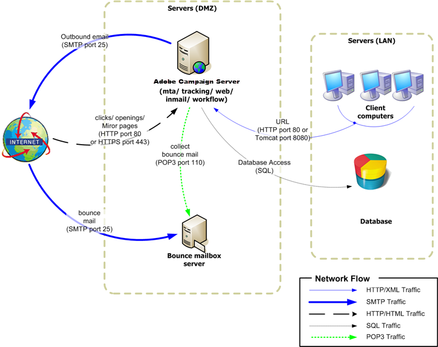
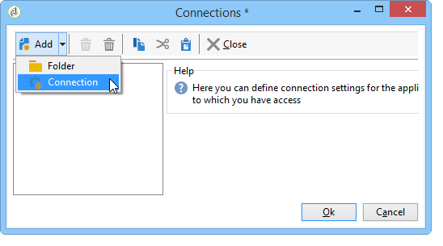
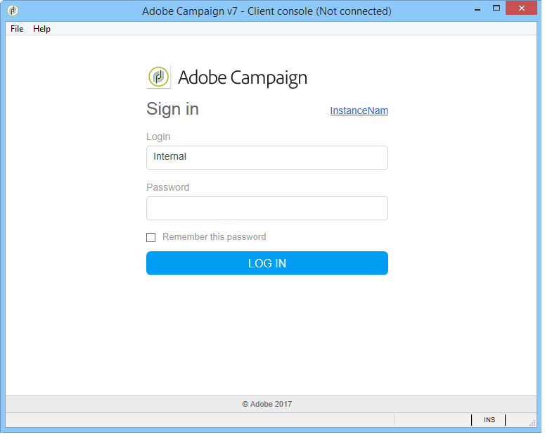
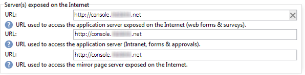

# Standalone deployment{#standalone-deployment}

This configuration includes all components on the same computer:

* application process (web),
* delivery process (mta),
* redirection process (tracking),
* workflow process and scheduled tasks (wfserver),
* bounce mail process (inMail),
* statistics process (stat).

Overall communication between the processes is carried out according to the following schema:



This type of configuration can be run when managing lists of fewer than 100,000 recipients and with, for example, the following software layers:

* Linux,
* Apache,
* PostgreSQL,
* Qmail.

As the volume grows, a variant of this architecture moves the database server to another computer for better performance.

>[!NOTE]
>
>An existing database server may also be used if it has sufficient resources.

## Features {#features}

### Advantages {#advantages}

* Fully standalone and low configuration cost (no billable licenses required if the open-source software listed below is used).
* Simplified installation and network configuration.

### Disadvantages {#disadvantages}

* A critical computer in case of incident.
* Limited bandwidth when broadcasting messages (in our experience, around several tens of thousands of mails per hour).
* Potential slowing of the application when broadcasting.
* The application server must be available from the outside (whilst being located in the DMZ, for example) since it hosts the redirection server.

## Installation and configuration steps {#installation-and-configuration-steps}

### Prerequisites {#prerequisites}

* JDK,
* Web server (IIS, Apache),
* Access to a database server,
* Bounce mailbox accessible via POP3,
* Creation of two DNS aliases:

    * the first exposed to the public for tracking and pointing to the computer on its public IP;
    * the second alias exposed to internal users for console access and pointing to the same computer.

* Firewall configured to open SMTP (25), DNS (53), HTTP (80), HTTPS (443), SQL (1521 for Oracle, 5432 for PostgreSQL, etc.) ports. For further information, refer to [Network configuration](../../installation/using/network-configuration.md).

In the following examples, the parameters of the instance are:

* Name of the instance: **demo**
* DNS mask: **console.campaign.net&#42;** (only for client console connections and for reports)
* Database: **campaign:demo@dbsrv**

### Installing and configuring (single machine) {#installing-and-configuring--single-machine-}

Apply the following steps:

1. Follow the installation procedure for the Adobe Campaign server: **nlserver** package on Linux or **setup.exe** on Windows.

   For more on this, refer to [Prerequisites of Campaign installation in Linux](../../installation/using/prerequisites-of-campaign-installation-in-linux.md) (Linux) and [Prerequisites of Campaign installation in Windows](../../installation/using/prerequisites-of-campaign-installation-in-windows.md) (Windows).

1. Once the Adobe Campaign server is installed, start the application server (web) using the command **nlserver web -tomcat** (the Web module enables you to start Tomcat in standalone Web server mode listening on port 8080) and to make sure Tomcat starts correctly:

   ```
   12:08:18 >   Application server for Adobe Campaign Classic (7.X YY.R build XXX@SHA1) of DD/MM/YYYY
   12:08:18 >   Starting Web server module (pid=28505, tid=-1225184768)...
   12:08:18 >   Tomcat started
   12:08:18 >   Server started
   ```

   >[!NOTE]
   >
   >The first time the Web module is executed it creates the **config-default.xml** and **serverConf.xml** files in the **conf** directory under the installation folder. All the parameters available in the **serverConf.xml** are listed in this [section](../../installation/using/the-server-configuration-file.md).

   Press **Ctrl+C** to stop the server.

   For more on this, refer to the following sections:

    * For Linux: [First start-up of the server](../../installation/using/installing-packages-with-linux.md#first-start-up-of-the-server),
    * For Windows: [First start-up of the server](../../installation/using/installing-the-server.md#first-start-up-of-the-server).

1. Change the **internal** password using the command:

   ```
   nlserver config -internalpassword
   ```

   For more on this, refer to [this section](../../installation/using/configuring-campaign-server.md#internal-identifier).

1. Create the **demo** instance with the DNS masks for tracking (in this case, **tracking.campaign.net**) and access to client consoles (in this case, **console.campaign.net**). There are two ways of doing this:

    * Create the instance via the console: 
    
      

      For more on this, refer to [Create an instance and log on](../../installation/using/creating-an-instance-and-logging-on.md).

      or
    
    * Create the instance using command lines:

      ```    
      nlserver config -addinstance:demo/tracking.campaign.net*,console.campaign.net*
      ```    
    
      For more on this, refer to [Creating an instance](../../installation/using/command-lines.md#creating-an-instance).

1. Edit the **config-demo.xml** file (created in the previous step next to **config-default.xml**) and make sure the **mta** (delivery), **wfserver** (workflow), **inMail** (bounce mails) and **stat** (statistics) processes are enabled. Then configure the address of the statistics server:

   ```
   <?xml version='1.0'?>
   <serverconf>  
     <shared>    
       <!-- add lang="eng" to dataStore to force English for the instance -->    
       <dataStore hosts="tracking.campaign.net*,console.campaign.net*">      
         <mapping logical="*" physical="default"/>    
       </dataStore>  </shared>  
       <mta autoStart="true" statServerAddress="localhost"/>
       <wfserver autoStart="true"/>  
       <inMail autoStart="true"/>  
       <sms autoStart="false"/>  
       <listProtect autoStart="false"/>
   </serverconf>
   ```

   For more on this, refer to [this section](../../installation/using/configuring-campaign-server.md#enabling-processes).

1. Edit the **serverConf.xml** file and specify the delivery domain, then specify the IP (or host) addresses of the DNS servers used by the MTA module to answer MX type DNS queries.

   ```
   <dnsConfig localDomain="campaign.com" nameServers="192.0.0.1, 192.0.0.2"/>
   ```

   >[!NOTE]
   >
   >The **nameServers** parameter is only used in Windows.

   For more on this, refer to [Campaign server configuration](../../installation/using/configuring-campaign-server.md).

1. Copy the client console setup program (**setup-client-7.XX**, **YYYY.exe** for v7 or **setup-client-6.XX**, **YYYY.exe** for v6.1) to the **/datakit/nl/eng/jsp** folder. [Learn more](../../installation/using/client-console-availability-for-windows.md).

1. Follow the Web server integration procedure (IIS, Apache) described in the following sections:

    * For Linux: [Integration into a Web server for Linux](../../installation/using/integration-into-a-web-server-for-linux.md)
    * For Windows: [Integration into a Web server for Windows](../../installation/using/integration-into-a-web-server-for-windows.md)

1. Start the website and test redirection using the URL: https://tracking.campaign.net/r/test.

   The browser must display the following message:

   ```
   <redir status="OK" date="AAAA/MM/JJ HH:MM:SS" build="XXXX" host="tracking.campaign.net" localHost="localhost"/>
   ```

   For more on this, refer to the following sections:

    * For Linux: [Launching the Web server and testing the configuration](../../installation/using/integration-into-a-web-server-for-linux.md#launching-the-web-server-and-testing-the-configuration)
    * For Windows: [Launching the Web server and testing the configuration](../../installation/using/integration-into-a-web-server-for-windows.md#launching-the-web-server-and-testing-the-configuration)

1. Start the Adobe Campaign server (**net start nlserver6** in Windows, **/etc/init.d/nlserver6 start** in Linux) and run the command **nlserver pdump** once more to check for presence of all enabled modules.

   >[!NOTE]
   >
   >Starting 20.1, we recommend using the following command instead (for Linux): **systemctl start nlserver**

   ```
   12:09:54 >   Application server for Adobe Campaign Classic (7.X YY.R build XXX@SHA1) of DD/MM/YYYY
   syslogd@default (7611) - 9.2 MB
   stat@demo (5988) - 1.5 MB
   inMail@demo (7830) - 11.9 MB
   watchdog (27369) - 3.1 MB
   mta@demo (7831) - 15.6 MB
   wfserver@demo (7832) - 11.5 MB
   web@default (28671) - 40.5 MB
   ```

   This command also lets you know the version and build number of the Adobe Campaign server installed on the computer.

1. Test the **nlserver web** module using the URL: https://console.campaign.net/nl/jsp/logon.jsp

   This URL enables you to access the download page for the client setup program.

   Enter the **internal** login and associated password when you reach the access control page. [Learn more](../../installation/using/client-console-availability-for-windows.md).

   

1. Start the Adobe Campaign client console (from the previous download page or launched directly on the server for a Windows installation), set the server connection URL to https://console.campaign.net and connect using the **internal** login.

   Refer to [this page](../../installation/using/creating-an-instance-and-logging-on.md) and [this section](../../installation/using/configuring-campaign-server.md#internal-identifier).

   The database creation wizard appears when you log in for the first time:

   

   Follow the steps in the wizard and create the database associated with the connection instance.

   For more on this, refer to [Creating and configuring the database](../../installation/using/creating-and-configuring-the-database.md).

   Once the database is created, log off.

1. Log back on to the client console using the **admin** login without a password and start the deployment wizard ( **[!UICONTROL Tools > Advanced]** menu) to finish configuring the instance.

   For more on this, refer to [Deploying an instance](../../installation/using/deploying-an-instance.md).

   The main parameters to set are the following:

    * Email delivery: sender and reply addresses and the error mailbox for bounce mail. 
    * Tracking: Populate the external URL used for redirection and the internal URL, click **Registration on the tracking server(s)** and then validate it on the **demo** instance of the tracking server.

      For more on this, refer to [Tracking configuration](../../installation/using/deploying-an-instance.md#tracking-configuration).
    
      

      As the Adobe Campaign server is used both as the application server and the redirection server, the internal URL used to collect tracking logs and transfer URLs is a direct internal connection to Tomcat (https://localhost:8080).
    
    * Bounce management: Enter the parameters to handle bounce mail (do not take the **Unprocessed bounce mails** section into account).
    * Access from: Provide the two URLs for reports, Web forms and mirror pages.
    
      
