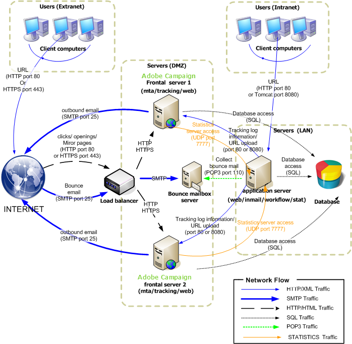
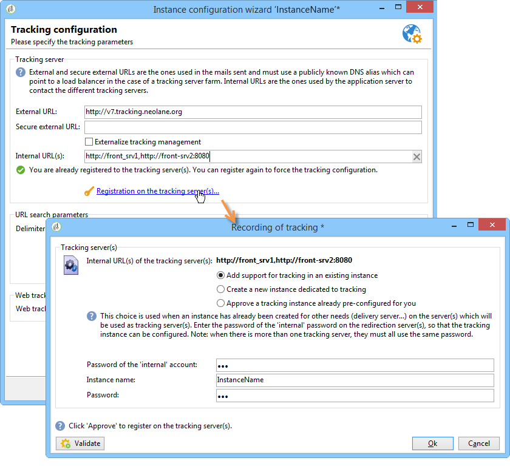

# Standard deployment{#standard-deployment}

For this configuration, three computers are required:

* An application server inside the LAN for the end users (preparing campaigns, reporting, etc.),
* Two frontal servers in the DMZ behind a load balancer.

The two servers in the DMZ handle tracking, mirror pages and delivery and are redundant for high availability.

The application server in the LAN serves the end users and performs all recurrent processes (workflow engine). Thus, when peak loads are reached on the frontal servers, the application users are not impacted.

The database server can be hosted on a separate computer from these three. It is otherwise for the application server and database server to share the same computer within the LAN as long as the operating system is supported by Adobe Campaign (Linux or Windows).

General communication between servers and processes is carried out according to the following schema:



This type of configuration can handle a large number of recipients (500,000 to 1,000,000) as the database server (and the available bandwidth) is the main limiting factor.

## Features {#features}

### Advantages {#advantages}

* Failover functionality: the ability to switch processes to one computer in case of a hardware problem on the other.
* Better overall performance, since the MTA and redirection functions can be deployed on both of the computers behind a load balancer. With two active MTAs and enough bandwidth, it is possible to achieve broadcast rates in the region of 100,000 mails per hour.

## Installation and configuration steps {#installation-and-configuration-steps}

### Prerequisites {#prerequisites}

* JDK on all three computers,
* Web server (IIS, Apache) on both frontals,
* Access to a database server on all three computers,
* Bounce mailbox accessible via POP3,
* Creation of two DNS aliases:

    * the first exposed to the public for tracking and pointing to the load balancer on a virtual IP address (VIP) and which is then distributed to the two frontal servers,
    * the second exposed to the internal users for access via the console and pointing to the same application server.

* Firewall configured to open STMP (25), DNS (53), HTTP (80), HTTPS (443), SQL (1521 for Oracle, 5432 for PostgreSQL, etc.) ports. For further information, refer to section [Database access](../../installation/using/network-configuration.md#database-access).

### Installing the application server {#installing-the-application-server}

Follow the steps to install a standalone instance from the Adobe Campaign application server to the creation of the database (step 12). Refer to [Installing and configuring (single machine)](../../installation/using/standalone-deployment.md#installing-and-configuring--single-machine-).

Since the computer is not a tracking server, do not take the integration with the Web server into account.

In the following examples, the parameters of the instance are:

* Name of the instance: **demo**
* DNS mask: **console.campaign.net&#42;** (only for client console connections and for reports)
* Language: English
* Database: **campaign:demo@dbsrv**

### Installing the two frontal servers {#installing-the-two-frontal-servers}

The installation and configuration procedure is identical on both computers.

The steps are as follows:

1. Install the Adobe Campaign server.

   For more on this, refer to [Prerequisites of Campaign installation in Linux](../../installation/using/prerequisites-of-campaign-installation-in-linux.md) (Linux) and [Prerequisites of Campaign installation in Windows](../../installation/using/prerequisites-of-campaign-installation-in-windows.md) (Windows).

1. Follow the Web server integration procedure (IIS, Apache) described in the following sections:

    * For Linux: [Integration into a Web server for Linux](../../installation/using/integration-into-a-web-server-for-linux.md)
    * For Windows: [Integration into a Web server for Windows](../../installation/using/integration-into-a-web-server-for-windows.md)

1. Create the **demo** instance. There are two ways of doing this:

    * Create the instance via the console: 
    
      

      For more on this, refer to [Creating an instance and logging on](../../installation/using/creating-an-instance-and-logging-on.md).

      or
    
    * Create the instance using command lines:

      ```    
      nlserver config -addinstance:demo/tracking.campaign.net*
      ```    
    
      For more on this, refer to [Creating an instance](../../installation/using/command-lines.md#creating-an-instance).

   The name of the instance is the same as that of the application server.

   The connection to the server with the **nlserver web** module (mirror pages, unsubscription) will be made from the URL of the load balancer (tracking.campaign.net).

1. Change the **internal** to the same as the application server.

   For more on this, refer to [this section](../../installation/using/configuring-campaign-server.md#internal-identifier).

1. Link the database to the instance:

   ```
   nlserver config -setdblogin:PostgreSQL:campaign:demo@dbsrv -instance:demo
   ```

1. In the **config-default.xml** and **config-demo.xml** files, enable the **web**, **trackinglogd** and **mta** modules.

   For more on this, refer to [this section](../../installation/using/configuring-campaign-server.md#enabling-processes).

1. Edit the **serverConf.xml** file and populate:

    * the DNS configuration of the MTA module:

      ```    
      <dnsConfig localDomain="campaign.com" nameServers="192.0.0.1, 192.0.0.2"/>
      ```

      >[!NOTE]
      >
      >The **nameServers** parameter is only used in Windows.

      For more on this, refer to [Delivery settings](configure-delivery-settings.md).
    
    * the redundant tracking servers in the redirection parameters:

      ```    
      <spareServer enabledIf="$(hostname)!='front_srv1'" id="1" url="https://front_srv1:8080"/>
      <spareServer enabledIf="$(hostname)!='front_srv2'" id="2" url="https://front_srv2:8080"/>
      ```    
    
      For more on this, refer to [Redundant tracking](configuring-campaign-server.md#redundant-tracking).

1. Start the website and test the redirection from the URL: [https://tracking.campaign.net/r/test](https://tracking.campaign.net/r/test).

   The browser should display the following messages (depending on the URL redirected by the load balancer):

   ```
   <redir status="OK" date="AAAA/MM/JJ HH:MM:SS" build="XXXX" host="tracking.campaign.net" localHost="front_srv1"/>
   ```

   or

   ```
   <redir status="OK" date="AAAA/MM/JJ HH:MM:SS" build="XXXX" host="tracking.campaign.net" localHost="front_srv2"/>
   ```

   For more on this, refer to the following sections:

    * For Linux: [Launching the Web server and testing the configuration](../../installation/using/integration-into-a-web-server-for-linux.md#launching-the-web-server-and-testing-the-configuration)
    * For Windows: [Launching the Web server and testing the configuration](../../installation/using/integration-into-a-web-server-for-windows.md#launching-the-web-server-and-testing-the-configuration)

1. Start the Adobe Campaign server.
1. In the Adobe Campaign console, connect using the **admin** login without a password and launch the deployment wizard.

   For more on this, refer to [Deploying an instance](../../installation/using/deploying-an-instance.md).

   Configuration is identical to a standalone instance apart from the configuration of the tracking module.

1. Populate the external URL (that of the load balancer) used for redirection and the internal URLs of the two frontal servers.

   For more on this, refer to [Tracking configuration](../../installation/using/deploying-an-instance.md#tracking-configuration).

   

   >[!NOTE]
   >
   >We use the existing instance of the two tracking servers created previously and use the **internal** login.
