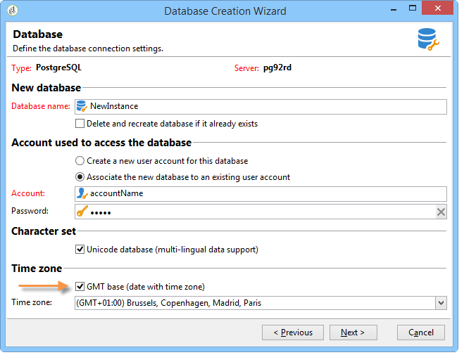
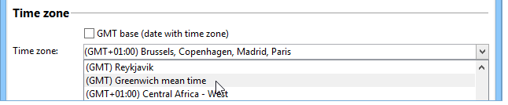

# Time zone management{#time-zone-management}

## Operating principle {#operating-principle}

Adobe Campaign lets you express dates as a function of their time zone: this enables international users to work worldwide on various time zones. Each country using the same instance can manage the execution of campaigns, tracking, archiving, etc. depending on local time.

In order to enable the use of the Adobe Campaign platform on an international scale, all dates used by the systems must be linkable to a time zone. A date whose time zone is known can thus be imported into any other time zone, or regardless of time zone.

Adobe Campaign lets you store dates/times in UTC (Coordinated Universal Time) format. When data is exposed, it is converted into the local date/time of the operator. Conversion is carried out automatically when the database is configured in UTC (refer to [Configuration](#configuration)). If the database is not configured in UTC, information on the time zone of the dates in the platform is stored in an option.

The main platform functionalities regarding time zone management are: import/export data and operator and Workflow management. The **inheritance concept** is available for imports/exports or Workflows. By default, they are configured for the database server time zone, however you can redefine new time zones for a workflow and even for a single activity.

**Operators** can modify time zones during **delivery configuration** and can specify the particular time zone in which the delivery will be executed.

>[!IMPORTANT]
>
>If the database does not manage multiple time zones, for all data filtering manipulations, SQL queries must be executed in the time zone of the database server.

Each Adobe Campaign operator is linked to a time zone: this information is configured in their profile. For more on this, refer to [this document](../../platform/using/access-management.md).

When the Adobe Campaign platform does not require time zone management, you can keep a storage mode in local format with a specific linked time zone.

## Recommendations {#recommendations}

Time zones combine several realities: the expression may describe a constant time-lag with the UTC date, or the times of a region which may change times twice a year (daylight saving time).

For example, in postgreSQL, the **SET TIME ZONE 'Europe/Paris';** command will take summer and winter times into account: the date will be expressed in UTC+1 or UTC+2 depending on the time of year.

However, if you use the **SET TIME ZONE 0200;** command, the time-lag will always be UTC+2.

## Configuration {#configuration}

The storage mode for dates and times is selected during database creation (refer to [Creating a new instance](#creating-a-new-instance)). In case of a migration, the hours linked to dates are converted into local dates and hours (refer to [Migration](#migration)).

From a technical point of view, there are two ways of storing **Date+time** type information in the database:

1. TIMESTAMP WITH TIMEZONE format: the database engine stores dates in UTC. Each session opened will have a time zone, and the dates will be converted according to it.
1. Local format + local time zone: all dates are stored in the local format (no time-lag management) and a single time zone is assigned to them. The time zone is stored in the **WdbcTimeZone** option of the Adobe Campaign instance and can be changed via the **[!UICONTROL Administration > Platform > Options]** menu of the tree.

>[!IMPORTANT]
>
>Please be aware that this modification can result into data consistency and synchronization issues. 

### Creating a new instance {#creating-a-new-instance}

In order for several international users to work on the same instance, you need to configure time zones when creating the instance to manage time-lags between countries. During instance creation, select the date and time management mode in the **[!UICONTROL Time zone]** section of the database configuration stage.

Check the **[!UICONTROL UTC database (date fields with time zone)]** option to store all the data with dates and times in UTC format (SQL fields and XML fields). 

>[!IMPORTANT]
>
>If you are using **Oracle**, the timezone files (.dat) of the Oracle client layers must be compatible with the timezones files installed on the server.

If the database is not UTC, you can select one of the time zones offered in the drop-down list. You can also use the time zone of the server or select the UTC (Coordinated Universal Time) option.

When the **[!UICONTROL UTC Database (date fields with time zone)]** option is selected, the SQL fields are stored in TIMESTAMP WITH TIMEZONE format.

Otherwise, they are stored in the local format and you will need to select the time zone to apply to the database.

### Migration {#migration}

When migrating to an earlier version (without time zone management), you will need to define the date storage mode in the database.

To guarantee compatibility with external tools accessing the Adobe Campaign database, the **Date+time** type SQL fields remain stored in local format by default.

XML fields containing dates are now stored in UTC. During loading, fields not in UTC format are converted automatically using the servers' time zone. This means that all XML fields will progressively be converted into UTC format.

To use an existing instance, add the **WdbcTimeZone** option and enter the instance's time zone.

>[!IMPORTANT]
>
>Please make sure the correct value is configured for the WdbcTimeZone option: changes carried out later may lead to inconsistencies.

Example of possible values:

* Europe/Paris,
* Europe/London,
* America/New_York, etc.

  These values are taken from the tz (Olson) database. For more information, refer to [https://en.wikipedia.org/wiki/List_of_tz_database_time_zones](https://en.wikipedia.org/wiki/List_of_tz_database_time_zones).
