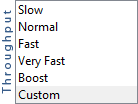

# Using MX servers with Campaign {#using-mx-servers}

Learn how MX servers work with Adobe Campaign Classic.

## MX servers {#mx-servers}

### What is an MX server?

A mail exchanger record (MX record) is a type of resource record in the Domain Name System (DNS) that specifies a mail server responsible for accepting email messages on behalf of a domain.

### How does an MX server work?

When you send an email, the software server will establish a connection with the recipient domain server. The communication between the two servers uses SMTP language and a domain can have more than one MX server. The connection to this domain will start from the highest priority (smallest figure) and other servers are called "back-up" servers. The connection protocol must be respected.

### How does an MX server work with Adobe Campaign?

In the connection protocol, rules have to be respected to prevent spamming and monopolizing servers. The most important are the following: 

* **Maximum number of connections allowed**: When this number is respected, IPs are not on the denylist and emails are not refused due to extra connections. 
* **Maximum number of messages**: During the connection, the number of messages allowed to be sent must be defined. If this number is not defined, the server will send as many as possible. This results in being identified as a spammer and being added to the denylist by the ISP.
* **Messages per hour**: In order to match with your e-reputation, Adobe Campaign will control the number of emails your IPs are able to send per hour. This system will protect you against email refusal or/and denylist.

## Inbounce emails

### What is an Inbounce email?

It is the process used by Adobe Campaign to process errors during server communications.

### How does an Inbounce email work?

The error address will process bounces sent back by ISPs. The process will analyze different SMTP error codes and apply the right action according to the RegEx standard.

For example, an email address has a feedback "550 User Unknown" sent by an ISP. This error code is processed by the Adobe Campaign error address (returnpath address). This error is then compared to the RegEx standard and the right rule will be apply. The email is considered a *Hard bounce* (matching the type) and then *User Unknown* (matching the reason) and pushed in quarantine after the first loop into the system.

### How is Adobe Campaign managing it?

Adobe Campaign manages this process with a match between an error type and a reason: 

* **[!UICONTROL User Unknown]**: Address which is syntactically correct but does not exist. This error is categorized as a hard bounce and pushed into quarantine within the first error. 
* **[!UICONTROL Mailbox full]**: Mailbox which has reached maximum capacity. This error may also indicate that the user is not using this mailbox any more. This error is categorized as a soft bounce and pushed into quarantine within the third error and removed from the quarantine after a period of 30 days. 
* **[!UICONTROL Inactive User]**: The mailbox has been deactivated by the ISP due to an inactive user in the last 6 months. This error is categorized as a soft bounce and pushed into quarantine within the third error. 
* **[!UICONTROL Invalid domain]**: The domain in the email address does not exist. This error is categorized as a soft bounce and pushed into quarantine within the third error. 
* **[!UICONTROL Refused]**: The ISP refused to deliver the email to its users. This error is categorized as a soft bounce and not pushed into quarantine as the error is not linked to the email address but IP or/an domain reputation.

>[!NOTE]
>
>To learn more about delivery failure types and reasons, refer to this [section](../../delivery/using/understanding-delivery-failures.md#delivery-failure-types-and-reasons).

## Deliverability instance

A daily update of the MX rules and inbounces rules are managed by a specific workfow in the client instance which is connected to the Deliverability instance owner of these rules.

This daily update is running for all clients who wish to keep their instance up to date through a transparency process.

The MX rules has 6 different levels of throughput which are mainly used during the ramp-up process:

The Custom mode is for advanced clients who wish to set their own MX rules. When the Custom mode is activated, the client will not be updated by the Deliverability instance as the synchronization will be turned off.

## Bounce examples

* **User unknown** (hard bounce): 550 5.1.1 ... User is unknown {mx003}
* **Mailbox full** (soft bounce): 550 5.2.2 User quota exceeded
* **Inactive Mailbox** (soft bounce): 550 5.7.1 : Recipient address rejected: Inactive MailBox, not poped for more than 6 months
* **Domain invalid** (soft bounce): DNS query failed for 'ourdan.com'
* **Refused** (soft bounce): Inbound email bounce (rule 'Feedback_loop_Hotmail' has matched this bounce)
* **Unreachable** (soft bounce): 421 4.16.55 [TS01] Messages from x.x.x.x temporarily deferred due to excessive user complaints

**Related topics:**
* [MX configuration](../../installation/using/email-deliverability.md#mx-configuration)
* [Technical email configuration](../../installation/using/email-deliverability.md)
* [Understand Delivery Failures](../../delivery/using/understanding-delivery-failures.md)
* [Campaign Classic - Technical Recommendations](https://experienceleague.adobe.com/docs/deliverability-learn/deliverability-best-practice-guide/additional-resources/product-specific-resources/campaign/acc-technical-recommendations.html)
