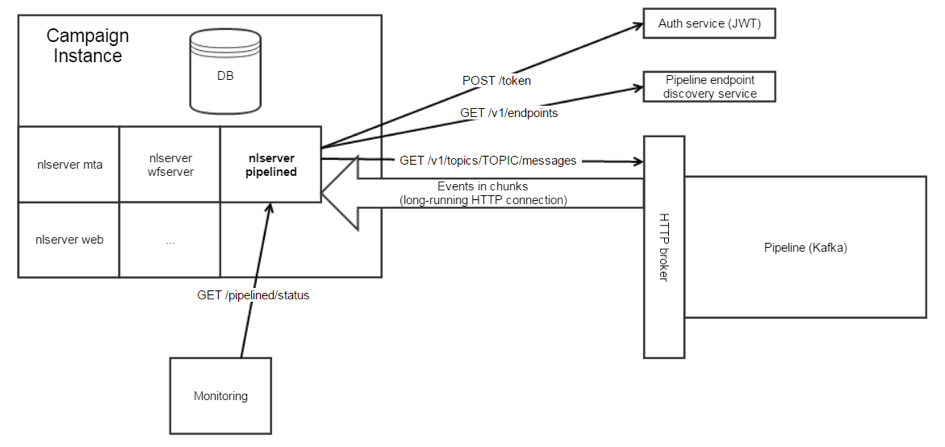

# Get started with Adobe Experience Cloud Triggers{#about-adobe-experience-triggers}

[!DNL Triggers] is an integration between Adobe Campaign and Adobe Analytics using the pipeline. The pipeline retrieves users' actions or triggers from your website. A cart abandonment is an example of trigger. Triggers are processed in Adobe Campaign to send emails in near real time.

>[!CAUTION]
>
>This capability is not available out of the box as part of the product. The implementation requires Adobe Consulting to be engaged. Please reach out to your Adobe representative to find out more

[!DNL Triggers] run marketing actions within a short range of time following a user’s action. The typical response time is less than one hour.

It allows for more agile integrations since the configuration is minimal and a third party is not involved.
It also supports high volumes of traffic without impacting the performance of marketing activities. As an example, the integration can process a million triggers per hour.

## [!DNL Triggers] architecture {#triggers-architecture}

The [!DNL pipelined] process is always running on the Adobe Campaign marketing server. It connects to the pipeline, retrieves the events, and processes them immediately.

The [!DNL pipelined] process logs in to the Experience Cloud using an authentication service and sends a private key. The authentication service returns a token. The token is used to authenticate when retrieving the events.

For more information on authentication, refer to this [page](../../integrations/using/configuring-adobe-io.md).
