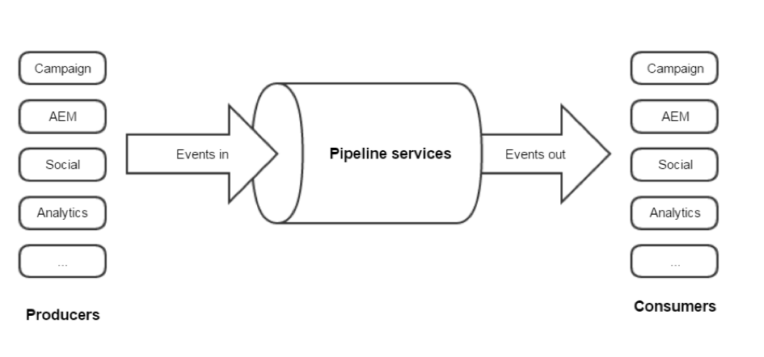

# About Adobe Experience Cloud Triggers{#about-adobe-experience-triggers}

Triggers is an integration between Adobe Campaign and Adobe Analytics using the pipeline. The pipeline retrieves users' actions or triggers from your website. A cart abandonment is an example of trigger. Triggers are processed in Adobe Campaign to send emails in near real time.

Triggers run marketing actions within a short range of time following a user’s action. The typical response time is less than one hour.

It allows for more agile integrations since the configuration is minimal and a third party is not involved.
It also supports high volumes of traffic without impacting the performance of marketing activities. As an example, the integration can process a million triggers per hour.

Here are a few Triggers best practices:

* The trigger data needs to be stored as it comes in Campaign. It should not be processed directly as it would create latency.
* Timestamp should be checked from the message and not from the data base.
* Use TriggerTimestamp and trigger ID to remove duplicates.

## Triggers architecture {#triggers-architecture}

### What is Pipeline? {#pipeline-explanation}

>[!CAUTION]
>
>Only Adobe Cloud solutions can produce and consume events from Adobe’s Pipeline services. Systems that are external to Adobe cannot.

Pipeline is a messaging system hosted in the Experience Cloud that uses Apache Kafka. It is a way to easily pass data between solutions. Further, Pipeline is a message queue rather than a database. Producers push events in the pipeline and the consumers listen to the flow and do what they want with the event. Events are kept for a few days but no more. The purpose is to listen 24/7 and process events immediately.

   

### How does Pipeline work? {#how-pipeline-work}

The "pipelined" process is always running on the Adobe Campaign marketing server. It connects to the pipeline, retrieves the events, and processes them immediately. 

   

The pipelined process logs in to the Experience Cloud using an authentication service and sends a private key. The authentication service returns a token. The token is used to authenticate when retrieving the events. Triggers are retrieved from a REST web service using a simple GET request. The response is JSON format. Parameters to the request include the name of the trigger and a pointer that indicates the last message retrieved. The pipelined process handles it automatically.

