# ACS Connector principles and data cycle{#acs-connector-principles-and-data-cycle}

## Introduction {#introduction}

ACS Connector bridges Adobe Campaign v7 and Adobe Campaign Standard. It is an integrated feature in Campaign v7 that automatically replicates data to Campaign Standard, uniting the best of both applications. Campaign v7 has advanced tools to manage the primary marketing database. The data replication from Campaign v7 allows Campaign Standard to leverage the rich data in a user-friendly environment.

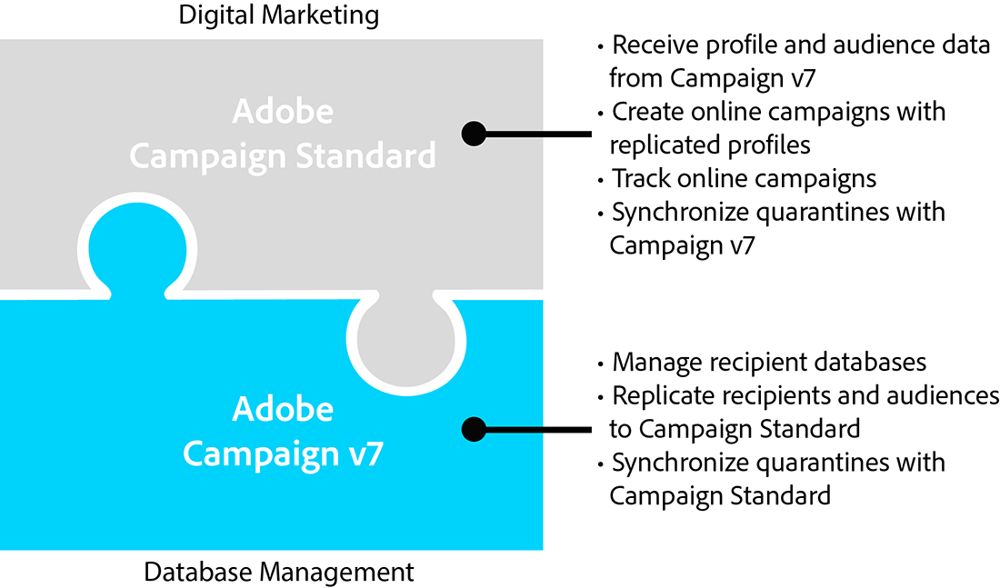

With ACS Connector, Campaign Standard continues to be used by digital marketers to design, target, and execute campaigns while Campaign v7 is tailor-made for data-oriented users such as database marketers.

>[!IMPORTANT]
>
>ACS Connector is only available as part of the Adobe Campaign Prime offering. For more information on how to license Adobe Campaign Prime, contact your account manager.
>
>ACS Connector is only available for hosted and hybrid architectures. It is not available for full on-premise installations.
>
>To use this feature, you must connect to Campaign with an Adobe ID (IMS). See [Connecting via an Adobe ID](../../integrations/using/about-adobe-id.md).

This document presents the ACS Connector capabilities. The sections below provide information on how the feature replicates data and instructions on how to work with replicated profiles.

* [Process](#process): Overview of ACS Connector and how data replication is managed.
* [Implementation](#implementation): Overview of how to get started with ACS Connector as well as instructions on how to replicate basic and advanced data.
* [Synchronizing profiles](../../integrations/using/synchronizing-profiles.md): Instructions on how to replicate profiles and how to create deliveries with them.
* [Synchronizing audiences](../../integrations/using/synchronizing-audiences.md): Instructions on how to target a list of recipients in Campaign v7 and then replicate the list to Campaign Standard as an audience.
* [Synchronizing web applications](../../integrations/using/synchronizing-web-applications.md): Instructions on how to link Campaign v7 web applications to Campaign Standard.
* [Troubleshooting the ACS Connector](../../integrations/using/troubleshooting-the-acs-connector.md): Review answers to common problems.

>[!NOTE]
>
>ACS Connector is included with Campaign v7 under licence agreement. To use ACS Connector, make certain that you can switch between Campaign v7 and Campaign Standard. If you are uncertain of your version and its included features, please contact your administrator.

## Process {#process}

### Data replication {#data-replication}

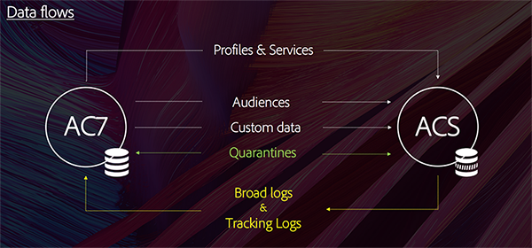

ACS Connector replicates the following items on a periodic basis from Campaign v7 to Campaign Standard:

* **Recipients**
* **Subscriptions**
* **Services**
* **Landing pages**

By default, the periodic replication for ACS Connector is once every 15 minutes. The span of the periodic replication can be adjusted to suit your needs. Contact your consultant if changes are required.

Data replication for recipients, subscriptions, services, and landing pages is incremental, which means that only new recipients and modifications to existing recipients are replicated from Campaign v7 to Campaign Standard. However, replication for an audience occurs in a single instance. You can create an audience in Campaign v7 and then replicate it one time to Campaign Standard. The replication is immediate and cannot be configured for regular updates. For instructions, see [Synchronizing audiences](../../integrations/using/synchronizing-audiences.md).

>[!NOTE]
>
>Please be patient with the initial replication of a large database as it can take several hours. However, subsequent replications are incremental and much faster.

ACS Connector replicates the following items on a periodic basis from Campaign Standard to Campaign v7:

* **[!UICONTROL Delivery IDs]** 
* **[!UICONTROL Email broad logs]** 
* **[!UICONTROL Email tracking logs]**

Replicating delivery IDs and email logs allows to access the history of deliveries and tracking data for your v7 recipients from Campaign v7.

>[!IMPORTANT]
>
>Only email broadlogs and tracking logs are replicated from Campaign Standard to Campaign v7.

### Data synchronization {#data-synchronization}

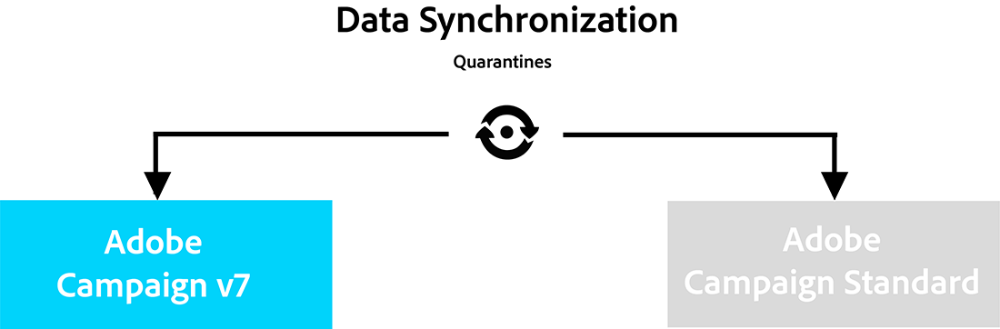

ACS Connector synchronizes quarantines between Campaign v7 and Campaign Standard.

For example, a profile that has been replicated from Campaign v7 to Campaign Standard includes an email address. If the email address is quarantined by Campaign Standard, the data is passed to Campaign v7 during the next synchronization. For more information on quarantines, see [Quarantine management](../../delivery/using/understanding-quarantine-management.md) and [Campaign Standard Quarantines](https://docs.adobe.com/content/help/en/campaign-standard/using/testing-and-sending/monitoring-messages/understanding-quarantine-management.html).

### Using replicated profiles {#using-replicated-profiles}

Replicated profiles can be used by Campaign Standard and Campaign v7 for targeting workflows in marketing campaigns.

For instruction on how to send a delivery in Campaign Standard using replicated profiles, see [Synchronizing profiles](../../integrations/using/synchronizing-profiles.md). Additional instructions are provided for sharing the unsubscription data between Campaign v7 and Campaign Standard.

### Limitations {#limitations}

Replicated profiles are readily available for deliveries but have certain limitations in Campaign Standard. Review the items below to learn how best to manage them.

* **Read-only profiles for Campaign Standard**: Replicated profiles are read-only in Campaign Standard. However, you can edit recipients in Campaign v7 and the modifications are automatically updated in Campaign Standard by ACS Connector. 
* **Profiles created in Campaign Standard**: ACS Connector replicates recipient data in one direction, from Campaign v7 to Campaign Standard. Therefore, profiles that originate in Campaign Standard do not replicate to Campaign v7.
* **Basic recipient data for Campaign Standard**: ACS Connector replicates recipient data that is suitable for Campaign Standard. It includes recipients' names, addresses, email addresses, mobile phone numbers, home phone numbers, and other pertinent contact information. If additional recipient fields and custom targeting tables available in Campaign v7 are critical to your workflow, please speak to your consultant.
* **Importing quarantined profiles**: Lists of profiles who do not want to be contacted can be imported into Campaign v7 or Campaign Standard as quarantined profiles. The status for the profiles is included in the quarantine synchronization between the applications and they will not be used in deliveries.
* **Unsubscribe to a service in Campaign Standard**: The choice to unsubscribe to a delivery is not synchronized from Campaign Standard to Campaign v7. However, you can configure a Campaign Standard delivery to direct its unsubscription link to Campaign v7. The profile for a recipient who clicks the unsubscription link is updated in Campaign v7 and the data is replicated to Campaign Standard. See [Changing the unsubscription link](../../integrations/using/synchronizing-profiles.md#changing-the-unsubscription-link).
* Only email broadlogs and tracking logs are replicated from Campaign Standard to Campaign v7.

### Billing {#billing}

Billing is not impacted by your choice of application to send deliveries, Campaign v7 or Campaign Standard. Billing information is reconciled between Campaign v7 and Campaign Standard. Therefore, if you send deliveries to the same recipient using both applications, it is still counted as one active profile.

## Implementation {#implementation}

Two types of implementation exist for ACS Connector. Both of them are always performed by the Adobe Campaign Consulting team.

>[!IMPORTANT]
>
>This section is intended for expert users only, to provide them with a global view of the implementation process and its main steps.
>
>Do not try, by any means, to perform any of these implementations yourselves. It is strictly reserved to the Adobe Campaign consultants.

The **basic implementation** allows you to replicate recipients (out-of-the-box fields), services and subscriptions, web applications and audiences. This is a one-way replication from Campaign v7 to Campaign Standard.

The **advanced implementation** will allow you to perform more complex use cases, for example if you have additional recipient fields or custom recipient tables (transaction table for example). See [Advanced implementation](#advanced-implementation).

### Installing the package {#installing-the-package}

To use the feature, the **[!UICONTROL ACS Connector]** package needs to be installed. This is always performed by the Adobe technical administrator or consultant.

All the technical elements related to ACS Connector are available in the **[!UICONTROL Administration > ACS Connector]** node of the explorer.

### Technical and replication workflows {#technical-and-replication-workflows}

After the installation of the package, two technical workflows are available under **[!UICONTROL Administration > ACS Connector > Process]**.

>[!IMPORTANT]
>
>Never try to modify these workflows. They should never be in error or paused. If this happens, please contact your Adobe Campaign consultant.

* **[!UICONTROL `[ACS] Quarantine synchronization`]** (quarantineSync): this workflow synchronizes all quarantine information. All new quarantines in Campaign v7 are replicated into Campaign Standard. All new quarantines from Campaign Standard are replicated into Campaign v7. This guarantees that all exclusion rules are synchronized between Campaign v7 and Campaign Standard.
* **[!UICONTROL `[ACS] Security group synchronization`]** (securityGroupSync): this workflow is used for rights conversion. See [Rights conversion](#rights-conversion).

The following replication workflows are available as "ready to be used" templates. They need to be implemented by your Adobe Campaign consultant.

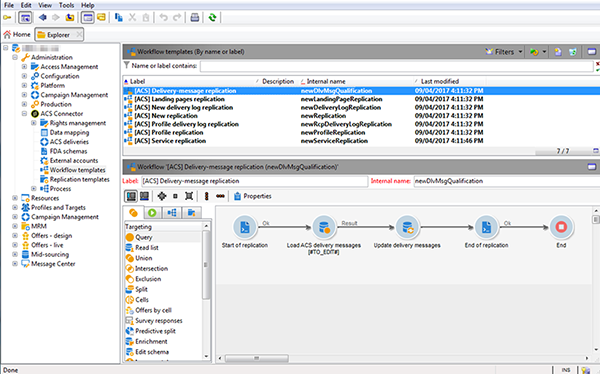

* **[!UICONTROL `[ACS] Profile replication`]** (newProfileReplication): this incremental workflow replicates recipients to Campaign Standard. By default, it replicates all the out-of-the-box recipient fields. See [Default recipient fields](#default-recipient-fields).
* **[!UICONTROL `[ACS] Service replication`]** (newServiceReplication): this incremental workflow replicates the chosen services to Campaign Standard. See the use case [Synchronizing web applications](../../integrations/using/synchronizing-web-applications.md).
* **[!UICONTROL `[ACS] Landing pages replication`]** (newLandingPageReplication): this incremental workflow replicates the chosen web applications to Campaign Standard. The Campaign v7 web applications will appear as landing pages in Campaign Standard. See the use case [Synchronizing web applications](../../integrations/using/synchronizing-web-applications.md).
* **[!UICONTROL `[ACS] New replication`]** (newReplication): this incremental workflow is an example that can be used to replicate a custom table. See [Advanced implementation](#advanced-implementation).
* **[!UICONTROL `[ACS] Delivery-mesage replication`]** (newDlvMsgQualification): this incremental workflow replicates delivery messages from Campaign Standard to Campaign v7.
* **[!UICONTROL `[ACS] Profile delivery log replication`]** (newRcpDeliveryLogReplication): this incremental workflow replicates delivery IDs, email broad logs and email tracking logs from Campaign Standard to Campaign v7. It only takes into account deliveries sent from Campaign Standard to profiles that are part of the nms:recipients table of Campaign v7.
* **[!UICONTROL `[ACS] New delivery log replication`]** (newRcpDeliveryLogReplication): this incremental workflow replicates delivery IDs, email broad logs and email tracking logs from Campaign Standard to Campaign v7. It only takes into account deliveries sent from Campaign Standard to profiles that are part of a specific table (to define, other than nms:recipients) of Campaign v7.

### Default recipient fields {#default-recipient-fields}

If you have any additional fields or custom tables (transaction table, for example), they will not be replicated by default. Advanced configuration needs to be performed. See [Advanced implementation](#advanced-implementation).

You will find below the list of recipient fields that are replicated with the basic implementation. These are the out-of-the-box fields:

<table> 
 <tbody> 
  <tr> 
   <td> <strong>Label</strong>  </td> 
   <td> <strong>Internal name</strong>  </td> 
  </tr> 
  <tr> 
   <td> Source Id  </td> 
   <td> @sourceId  </td> 
  </tr> 
  <tr> 
   <td> Creation date  </td> 
   <td> @created  </td> 
  </tr> 
  <tr> 
   <td> Modification date  </td> 
   <td> @lastModified  </td> 
  </tr> 
  <tr> 
   <td> Email  </td> 
   <td> @email  </td> 
  </tr> 
  <tr> 
   <td> Last name  </td> 
   <td> @lastName  </td> 
  </tr> 
  <tr> 
   <td> First name  </td> 
   <td> @firstName  </td> 
  </tr> 
  <tr> 
   <td> Middle name  </td> 
   <td> @middleName  </td> 
  </tr> 
  <tr> 
   <td> Mobile  </td> 
   <td> @mobilePhone  </td> 
  </tr> 
  <tr> 
   <td> Birth date  </td> 
   <td> @birthDate  </td> 
  </tr> 
  <tr> 
   <td> Gender  </td> 
   <td> @gender  </td> 
  </tr> 
  <tr> 
   <td> Salutation  </td> 
   <td> @salutation  </td> 
  </tr> 
  <tr> 
   <td> No longer contact (by any channel)  </td> 
   <td> @blackList  </td> 
  </tr> 
  <tr> 
   <td> No longer contact by email  </td> 
   <td> @blackListEmail  </td> 
  </tr> 
  <tr> 
   <td> No longer contact by SMS  </td> 
   <td> @blackListMobile  </td> 
  </tr> 
  <tr> 
   <td> Phone  </td> 
   <td> @phone  </td> 
  </tr> 
  <tr> 
   <td> Fax  </td> 
   <td> @fax  </td> 
  </tr> 
  <tr> 
   <td> Address 1 (apartment)  </td> 
   <td> [location/@address1]  </td> 
  </tr> 
  <tr> 
   <td> Address 2  </td> 
   <td> [location/@address2]  </td> 
  </tr> 
  <tr> 
   <td> Address 3 (Number and street)  </td> 
   <td> [location/@address3]  </td> 
  </tr> 
  <tr> 
   <td> Address 4 (county)  </td> 
   <td> [location/@address4]  </td> 
  </tr> 
  <tr> 
   <td> Zip/Postcode  </td> 
   <td> [location/@zipCode]  </td> 
  </tr> 
  <tr> 
   <td> City  </td> 
   <td> [location/@city]  </td> 
  </tr> 
  <tr> 
   <td> State/Province code  </td> 
   <td> [location/@stateCode]  </td> 
  </tr> 
  <tr> 
   <td> Country code  </td> 
   <td> [location/@countryCode]  </td> 
  </tr> 
 </tbody> 
</table>

### Rights conversion {#rights-conversion}

The rights are handled differently in Campaign v7 and Campaign Standard. In Campaign v7, the rights management is folder-based, whereas in Campaign Standard it is based on unit access (organizational/geographical units). A Campaign Standard user belongs to security group which contains the restriction context. Therefore, the Campaign v7 rights system needs to be converted to match the Campaign Standard one. There are several ways to perform the rights conversion. You will find below an example of implementation.

1. Under **[!UICONTROL Administration > ACS Connector > Rights management > Security groups]**, use the **[!UICONTROL Synchronize]** button to retrieve all the Campaign Standard security groups. Out-of-the-box Campaign Standard groups are excluded.

   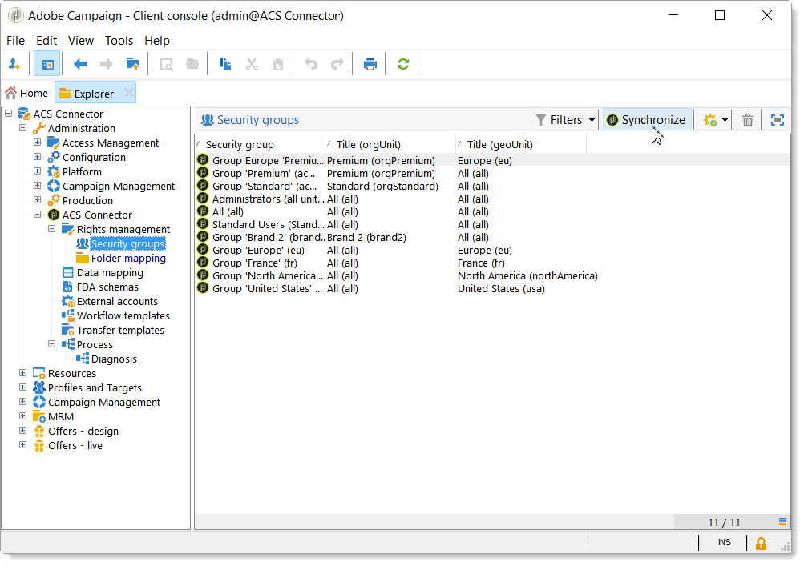

1. If your rights management is folder-base, go to **[!UICONTROL Administration > ACS Connector > Rights management > Folder mapping]** and map each needed folder with a security group.

   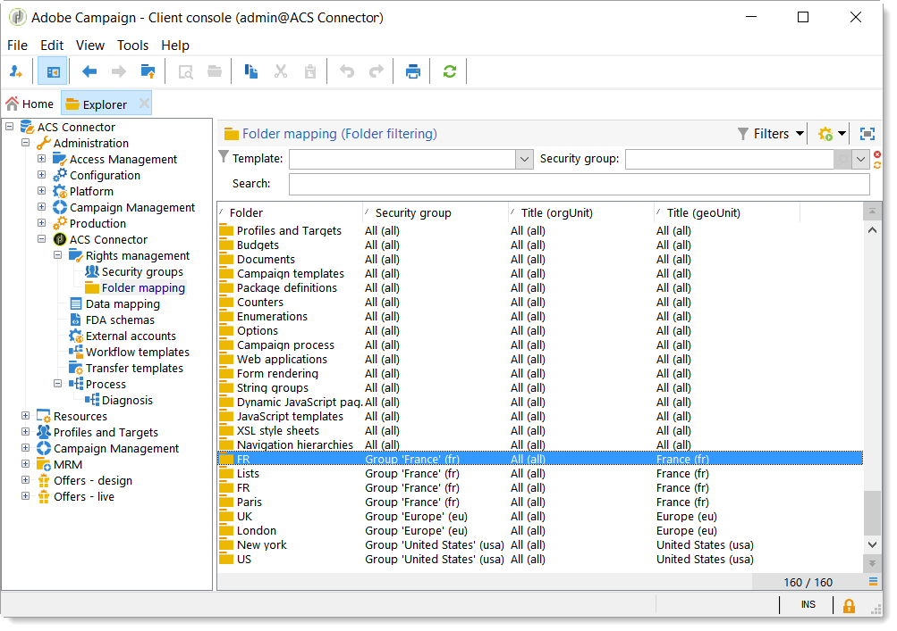

1. The replication workflows will then use this information and add the corresponding organizational/geographical units to each object to replicate.

### Advanced implementation {#advanced-implementation}

This section describes some of the possibilities in terms of advanced implementation.

>[!IMPORTANT]
>
>This information can only be used as general guidelines. Reach out to your Adobe Campaign consultant for the implementation.

The advanced implementation will add custom replication workflows, depending on the customer's needs. Here are a few examples:

* Delivery replication
* Campaign replication
* Program replication
* Seed members replication
* Transactional replication
* etc.

**Replicating extended fields on recipients**

With the basic implementation, the out-of-the-box recipient fields are replicated. If you want to replicate custom fields that you added to the recipient schema, you need to identify them.

1. Under **[!UICONTROL Administration > ACS Connector > Data mapping]**, create a targeting mapping on the **[!UICONTROL nms:recipient]** table.

   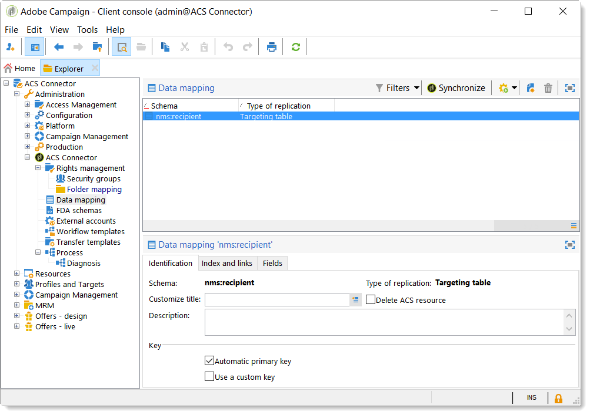

1. Select the additional fields you want to replicate and other needed information (index, links, identification keys).

   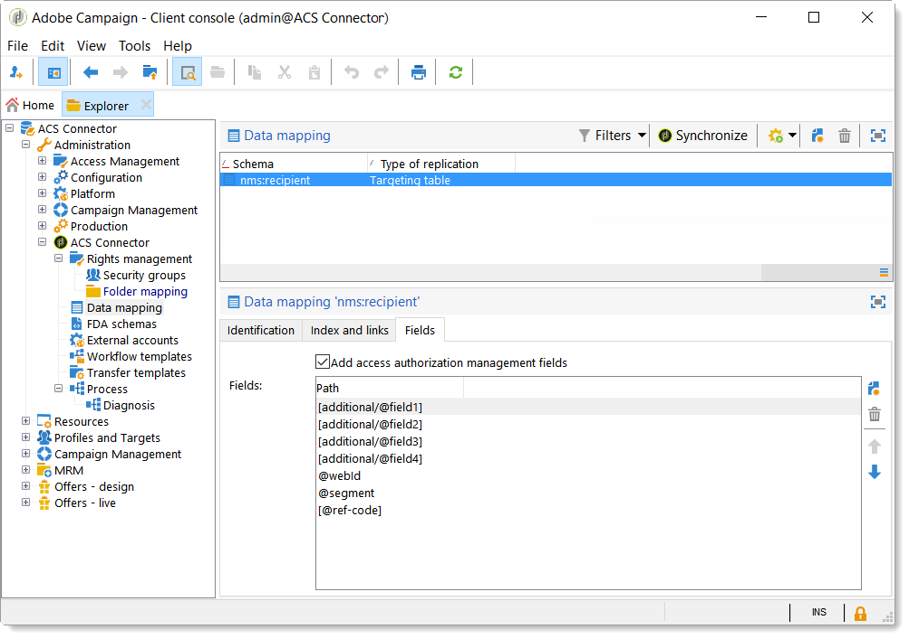

1. Open the dedicated profile replication workflow (not the template, but the workflow instance itself). Modify the **[!UICONTROL Query]** and **[!UICONTROL Update data]** activities to include these fields. See [Technical and replication workflows](#technical-and-replication-workflows).

   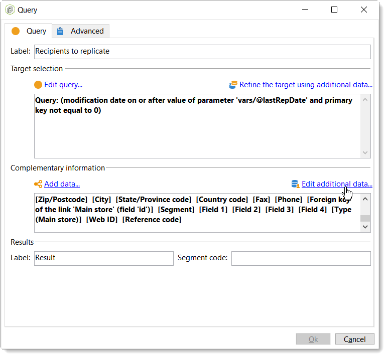

   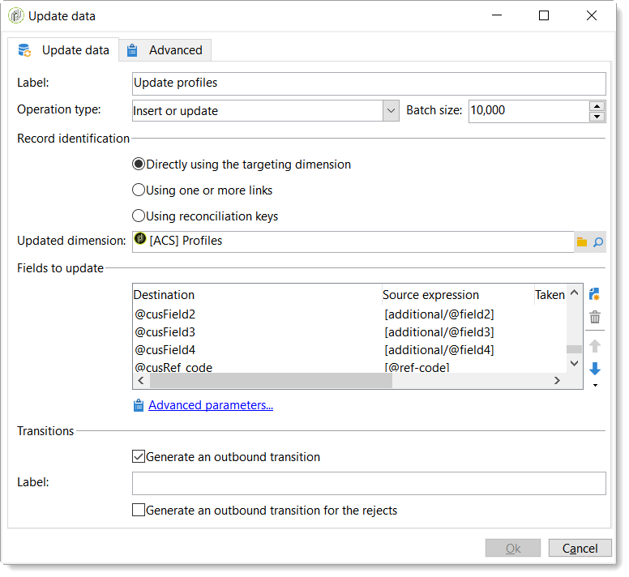

**Replicating custom profile tables**

With the basic implementation, the out-of-the-box recipient table is replicated. If you added custom recipient tables, here is how you identify them.

1. Under **[!UICONTROL Administration > ACS Connector > Data mapping]**, create a targeting mapping on your custom profile table.

   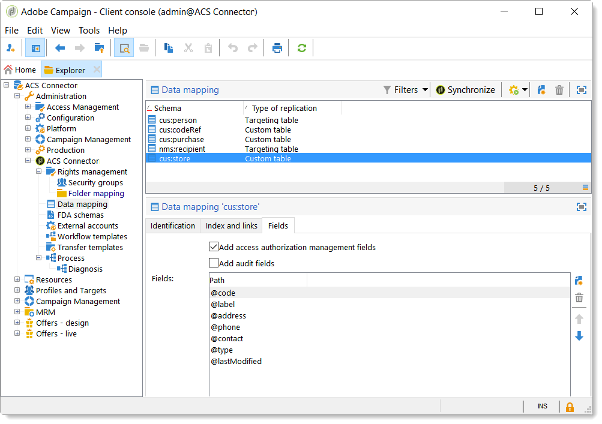

1. Define the identification data, index, links and fields you want to replicate.

   

1. If your rights management is folder-based, go to **[!UICONTROL Administration > ACS Connector > Rights management > Folder mapping]**, and define a security group for the folders linked to your custom tables. See [Rights conversion](#rights-conversion).
1. Use the **[!UICONTROL New replication]** workflow (not the template, but the workflow instance itself) to include the custom table and the fields to replicate. See [Technical and replication workflows](#technical-and-replication-workflows).
