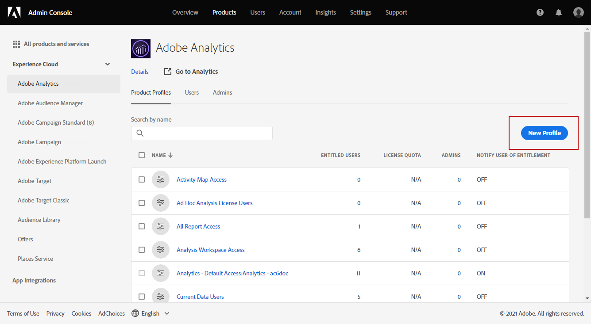

# Adobe Analytics Connector provisioning {#adobe-analytics-connector-provisioning}

>[!CAUTION]
>
> These steps should only be carried out by Hybrid and On-Premise implementations.
>
>For Hosted and Campaign Managed Services implementations, please contact [Adobe Customer Care](https://helpx.adobe.com/enterprise/admin-guide.html/enterprise/using/support-for-experience-cloud.ug.html) team. 

The integration between Adobe Campaign Classic and Adobe Analytics authentication supports Adobe Identity Management Service (IMS):

* If you are managing a migrated external account, you must implement Adobe IMS and connect to Adobe Campaign via an Adobe ID. 

    Please note that the user logged in via Adobe ID IMS must be the owner of the **Data connector** account in Adobe Analytics and have permissions for the **Product profile** mentioned [below](#analytics-product-profile). 

The problem was that the owner of the Data connector was a different user than the user who was logged into Campaign and trying out the integration with Analytics.

* If you are implementing a new connector, implementing Adobe IMS is optional. Without an Adobe ID User, Adobe Campaign will use a technical user to sync with Adobe Analytics.

For this integration to work, you have to create an Adobe Analytics product profile which will be used exclusively for the Analytics connector. Then, you will need to create a Developer console project.

>[!AVAILABILITY]
>
> The Service Account (JWT) credential is being deprecated by Adobe, Campaign integrations with Adobe solutions and apps must now rely on OAuth Server-to-Server credential.  
>
> * If you have implemented inbound integrations with Campaign, you must migrate your Technical Account as detailed in [this documentation](https://developer.adobe.com/developer-console/docs/guides/authentication/ServerToServerAuthentication/migration/#_blank). Existing Service Account (JWT) credentials will continue to work until January 27, 2025. 
>
> * If you have implemented outbound integrations, such as Campaign-Analytics integration or Experience Cloud Triggers integration, they will continue to work until until January 27, 2025. However, before that date, you must upgrade your Campaign environment to v7.4.1 and migrate your Technical Account to OAuth.

## Create an Adobe Analytics Product profile {#analytics-product-profile}

Product Profile determines the level of access a user has on your different Analytics Components.

If you already have an Analytics Product Profile, you should still create a new Adobe Analytics product profile used exclusively for the Analytics connector. This will ensure that your Product profile is set with the correct permissions for this integration. 

For more information on Product profiles, refer to the [Admin console documentation](https://helpx.adobe.com/mt/enterprise/admin-guide.html).

1. From the [Admin console](https://adminconsole.adobe.com/), select your Adobe Analytics **[!UICONTROL Product]**.

    

1. Click **[!UICONTROL New Profile]**.

    

1. Add a **[!UICONTROL Product profile name]**, we suggest using the following syntax: `reserved_campaign_classic_<Company Name>`. Then, click **[!UICONTROL Next]**.
   
   This **[!UICONTROL Product profile]** should be used exclusively for the Analytics Connector to prevent misconfiguration errors.

1. Open your newly created **[!UICONTROL Product profile]** and select the **[!UICONTROL Permissions]** tab.

    

1. Configure the different capabilities clicking **[!UICONTROL Edit]** and select the permissions to assign to your **[!UICONTROL Product profile]** by clicking the plus (+) icon. 

   For more information on how to manage permissions, refer to the [Admin console documentation](https://helpx.adobe.com/mt/enterprise/using/manage-permissions-and-roles.html).

1. For the **[!UICONTROL Report Suites]** capability, add the **[!UICONTROL Report Suites]** you need to use later on.
      
      If you don't have any report suites, you can create it following [these steps](../../integrations/using/gs-aa.md).

    

1. For the **[!UICONTROL Metrics]** capability, add the **[!UICONTROL Metrics]** you will need to configure later on. 

    If needed, you can switch on the Auto-include option which will add every permissions item into the included list and will automatically add new permission items. 

    

1. For the **[!UICONTROL Dimensions]** capability, add the **[!UICONTROL Dimensions]** needed for future configuration. 

    Ensure the chosen Dimensions match those to be configured in the External Account and align with the corresponding eVars number from Adobe Analytics.

1. For the **[!UICONTROL Report Suite Tools]** capability, add the following permissions:

   * **[!UICONTROL Report suite Mgmt]**
   * **[!UICONTROL Conversion variables]**
   * **[!UICONTROL Success events]**
   * **[!UICONTROL Custom data Warehouse report]**
   * **[!UICONTROL Data sources manager]**
   * **[!UICONTROL Classifications]**

1. For the **[!UICONTROL Analytics Tools]** capability, add the following permissions:

   * **[!UICONTROL Code Manager - Web services]**
   * **[!UICONTROL Logs - Web services]**
   * **[!UICONTROL Web services]**
   * **[!UICONTROL Web service access]**
   * **[!UICONTROL Calculated metric creation]**
   * **[!UICONTROL Segment creation]**

Your Product profile is now configured. You then need to create the OAuth project.

## Create OAuth project {#create-adobe-io}

To proceed with configuring your Adobe Analytics connector, access the Adobe Developer console and create your OAuth Server-to-Server project.

Refer to [this page](oauth-technical-account.md#oauth-service) for the detailed documentation.

## Configuration and usage {#adobe-analytics-connector-usage}

Learn how to work with Adobe Campaign and Adobe Analytics in [Adobe Campaign v8 documentation](https://experienceleague.adobe.com/en/docs/campaign/campaign-v8/connect/ac-aa){target="_blank"}.