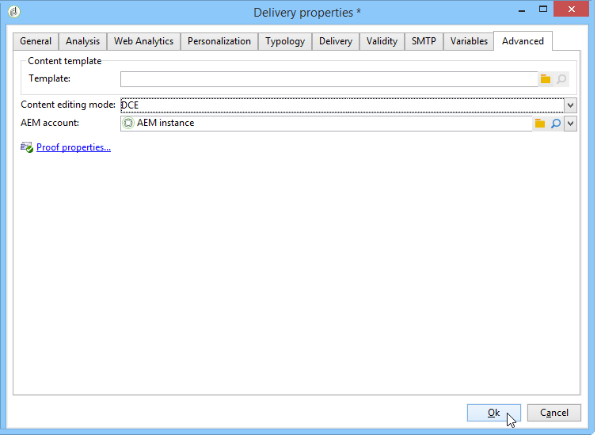

# Configuring access to Assets{#configuring-access-to-assets}

This section details the necessary configuration steps in Adobe Campaign to use the integration functionalities with Assets core service or Adobe Experience Manager assets library.

>[!CAUTION]
>
>These integrations are concurrent. Read the following information carefully before making any configuration.

* Integration with **Experience Cloud Assets**: this integration allows you to insert images from your Adobe Experience Cloud library. Depending on your configuration and licencing model, this library can be Assets core service or Assets on Demand. This integration must be set up by installing the **[!UICONTROL Integration with the Adobe Experience Cloud]** built-in package in Adobe Campaign.
* Integration with **AEM Assets**: this integration allows you to insert images from your Adobe Experience Manager assets library. This integration must be set up by installing the **[!UICONTROL AEM Integration]** built-in package in Adobe Campaign.

>[!NOTE]
>
>If the two packages (**[!UICONTROL AEM Integration]** and **[!UICONTROL Integration with the Adobe Experience Cloud]** ) are installed, only the assets available in the Adobe Experience Cloud library can be used. To also access the assets in your AEM Assets library, you must synchronize AEM Assets and Adobe Experience Cloud. The assets in AEM Assets will then also be available in the Adobe Experience Cloud library. For more information on synchronizing AEM Assets and Adobe Experience Cloud, refer to the [detailed documentation](https://docs.adobe.com/docs/en/aod/overview/collaborating/aem-assets-aod-sync.html).

## Integrating with Experience Cloud Assets {#integrating-with-experience-cloud-assets}

In order to use the integration between Adobe Campaign and Experience Cloud Assets, you must have:

* An Adobe Experience Cloud organization
* The Adobe IMS authentification mode enabled

To enable the connection between Adobe Campaign and Adobe Experience Cloud, configure the connection via IMS (Adobe ID connection service). This configuration is detailed in the [Connecting via an Adobe ID](../../integrations/using/about-adobe-id.md) document. It involves:

* Installing the **[!UICONTROL Integration with the Adobe Experience Cloud]** package.
* Configuring an Adobe Experience Cloud external account.

>[!NOTE]
>
>The functionalities linked to this integration are only available for users connected with their Adobe ID via IMS.

## Integrating with AEM Assets {#integrating-with-aem-assets}

To integrate AEM Assets with Adobe Campaign, you must first configure the integration between Adobe Experience Manager and Adobe Campaign. This configuration mainly requires:

* Installing the **[!UICONTROL AEM Integration]** built-in package
* Configuring an external account that is specific to Adobe Experience Manager

Learn how to integrate Adobe Campaign and Adobe Experience Manager in the [detailed documentation](../../integrations/using/about-adobe-experience-manager.md).

Once this integration is set up, you can configure a new delivery template in Adobe Campaign to use AEM Assets library. To do this, follow the steps below:

1. Create a new delivery template - or duplicate an existing one. For more on Delivery templates, refer to [this page](../../delivery/using/about-templates.md).
1. Edit the **Properties** of this template.
1. In the **[!UICONTROL Advanced]** tab, set the **[!UICONTROL Content editing mode]** to **DCE**. 
1. Select the external **[!UICONTROL AEM account]** that you need to use to access your AEM Assets library.

   

When you insert images into a delivery's content based on this template, the **[!UICONTROL Select a shared asset]** option will then allow you to browse images in the AEM Assets library. Learn more in [this section](../../integrations/using/inserting-a-shared-asset.md).

>[!NOTE]
>
>If the **[!UICONTROL Integration with the Adobe Experience Cloud]** package is also installed on your Adobe Campaign instance, you will only be able to use the assets available in the Adobe Experience Cloud library. To also access the assets in your AEM Assets library, you must synchronize AEM Assets and Adobe Experience Cloud. The assets in AEM Assets will then also be available in the Adobe Experience Cloud library. In this case, you do not need to create a specific delivery template. For more information on synchronizing between AEM Assets and Adobe Experience Cloud, refer to the [detailed documentation](https://experienceleague.adobe.com/docs/experience-manager-65/administering/integration/configure-assets-cc-integration.html#integration).
