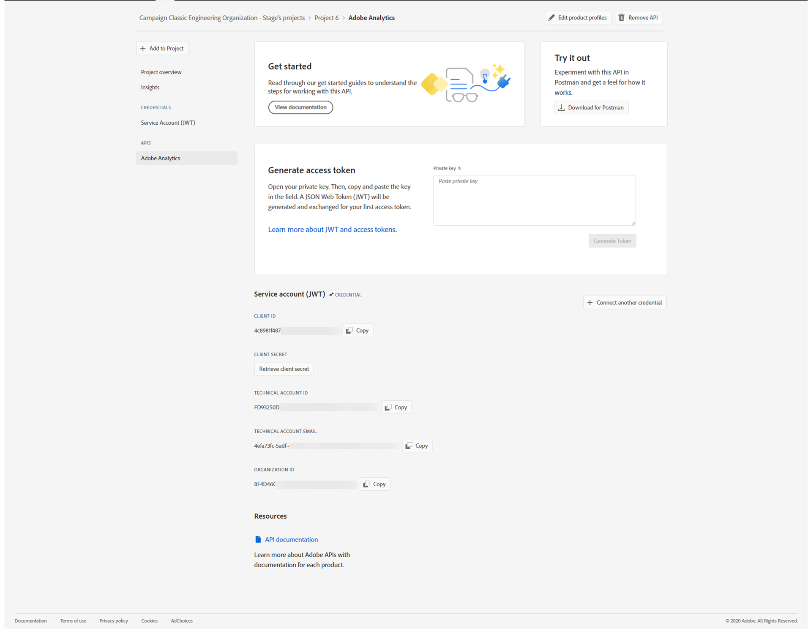

# Configuring Adobe IO for Adobe Experience Cloud Triggers {#configuring-adobe-io}

Prerequisite configurations are:

* Adobe Campaign Classic build ACC-19.1.9 or ACC-20.2.1 and above.
* a valid IMSOrgID.
* a Developer access to the IMS Org. You need to request the System Administrator privileges of the IMS Org to follow the procedure detailed in this [page](https://helpx.adobe.com/ca/enterprise/admin-guide.html/ca/enterprise/using/manage-developers.ug.html) to provide this access for the all Product Profiles.

## Step 1: Create/update Adobe IO Project {#creating-adobe-io-project}

1. Access Adobe IO and log in using a System Administrator for the IMSorg.

    >[!NOTE]
    >
    > Make sure you are logged into the correct IMSorg portal.

1. Extract existing integration client ID from Adobe Campaign.

    * For Build Version 20.2.1, extract the client Id from the instance configuration file ims/authIMSTAClientId.
    <br>Non existing or empty attribute indicates client Id is not configured.

    * Build Version 19.1.9 and 20.3.1 or above, use SOAP call and replace <&nbsp;INSTANCE_URI&nbsp;> and <&nbsp;SESSION_TOKEN&nbsp;>

        ```
        curl --location --request POST '<INSTANCE_URI>/nl/jsp/soaprouter.jsp' \
            --header 'SOAPAction: xtk:session#GetTAClientId' \
            --header 'Content-Type: application/xml' \
            --data-raw '<soapenv:Envelope xmlns:soapenv="http://schemas.xmlsoap.org/soap/envelope/" 
            xmlns:urn="urn:xtk:session">
        <soapenv:Header/>
        <soapenv:Body>
            <urn:GetTAClientId>
                <urn:sessiontoken><SESSION_TOKEN></urn:sessiontoken>
         </urn:GetTAClientId>
        </soapenv:Body>
        </soapenv:Envelope>
        ```

    >[!NOTE]
    >
    >If your Client ID is empty, you can directly **[!UICONTROL Create a New project]** in Adobe IO.

1. You know need to identify the existing project using the extracted client ID.

    1. Create an API key from the [gateway console](https://admin.adobe.io/) linked to any IMSOrgID.
    1. Subscribe this API key to DevManagentAPISDK and JIL.
    1. Get the user token by logging-in to Adobe IO console with System administrator role for the IMSOrg and open the developer console and type: copy(adobeIMS.getAccessToken()).
    This token has the following scopes: AdobeID, openid, adobeio_api, gnav, read_organizations, additional_info.projectedProductContext, unified_dev_portal, additional_info.roles, read_pc.dma_bullseye, session, adobeio.appregistry.read, adobeio.appregistry.write, sao.creative_cloud.
    1. Use the user token and API key to call Console APIs.
    1. Setup the environment as follows:

        ```
        export API_KEY='<API Key created in step 1 of Prerequisite Steps>'
        export TOKEN='Bearer <copied from developer console in step 3 of Prerequisite Steps>'
        export IMS_ORG_ID='<Org id of the customer for which integration is needed>'
        export CLIENT_ID='<Project Client ID extracted from Campaign>'
       
        ```

    1. Run the following script to extract the project details:

        ```    
        #!/bin/sh

        alias jq='~/Downloads/jq-win64.exe'
        export ENDPOINT='https://developers.adobe.io'

        #Get Org Id
        export ORG_ID=$(curl -H "x-api-key: $API_KEY" -H "Authorization: $TOKEN" "$ENDPOINT/console/organizations" | \
        jq '.[] | select(.code=="'$IMS_ORG_ID'") | .id' | \
        sed -e 's|"||g'\
        )
        #Get Integration Id
        export INTEGRATION_ID=$(curl -H "x-api-key: $API_KEY" -H "Authorization: $TOKEN" "$ENDPOINT/console/organizations/$ORG_ID/integrations" | \
        jq '.content | .[] | select(.apiKey=="'$CLIENT_ID'") | .id'
        )
        #Get Project Id
        export PROJECT_ID=$(curl -H "x-api-key: $API_KEY" -H "Authorization: $TOKEN" "$ENDPOINT/console/organizations/$ORG_ID/projects_workspaces/credentials/$INTEGRATION_ID" | \
        jq '.projectId'| \
        sed -e 's|"||g'\
        )
        #Get Project Name
        export PROJECT_TITLE=$(curl -H "x-api-key: $API_KEY" -H "Authorization: $TOKEN" "$ENDPOINT/console/organizations/$ORG_ID/projects/$PROJECT_ID" | \
        jq '.title'| \
        sed -e 's|"||g'\
        )
        echo $'\n\n'
        echo "Project Title: "$PROJECT_TITLE
        echo 'Project URL:   https://console.adobe.io/projects/'$ORG_ID'/'$PROJECT_ID'/overview'
        ```

    1. Open the extracted Project.

1. Select **[!UICONTROL + Add to Project]** and choose **[!UICONTROL API]**.

    

1. In the window **[!UICONTROL Add an API]**, select **[!UICONTROL Adobe Analytics]**.

    

1. Choose **[!UICONTROL Service Account (JWT)]** as the authentication type.

    

1. If you're Client ID was empty, select **[!UICONTROL Generate a key pair]** to create a Public and Private keypair.

    

1. Upload your public key and click **[!UICONTROL Next]**.

    

1. Choose the product profile called **Analytics-<&nbsp;Org Name&nbsp;>** and click **[!UICONTROL Save configured API]**.

    

1. From your project, select **[!UICONTROL Service Account (JWT)]** and copy the following information:
    * **[!UICONTROL Client ID]**
    * **[!UICONTROL Client Secret]**
    * **[!UICONTROL Technical account ID]**
    * **[!UICONTROL Organization ID]**

    

## Step 2: Add the project credentials in Adobe Campaign {#add-credentials-campaign}

To add the project credentials in Adobe Campaign, run the following command as neolane user on all the containers of the campaign instance command to insert the Technical Account credentials in the instance configuration file.

```
nlserver config -instance:<instance name> -setimsjwtauth:Organization_Id/Client_Id/Technical_Account_ID[/Client_Secret[/Base64_encoded_Private_Key]]
```

>[!NOTE]
>
>You should encode the private key in base64 UTF-8 format. Remember to remove the new line from the key before encoding it except for the private key. The private key needs to be the same that was used to create the integration.

## Step 3: Update pipelined tag {#update-pipelined-tag}

To update pipelined tag, you need to update the authentication type to Adobe IO project in the configuration file **config-<&nbsp;instance-name&nbsp;>.xml** as follows:

```
<pipelined ... authType="imsJwtToken"  ... />
```

>[!NOTE]
>
>If you are using the older version of Triggers Integration using Legacy JWT tokens, you should also add the Adobe IO API for [!DNL Adobe Analytics] detailed in the first step to automatically migrate to the new Triggers Authentication.
