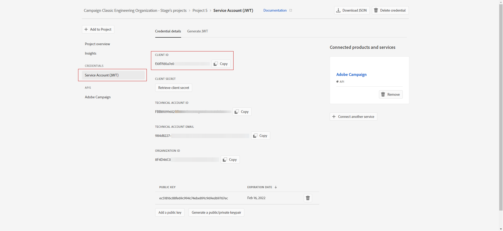
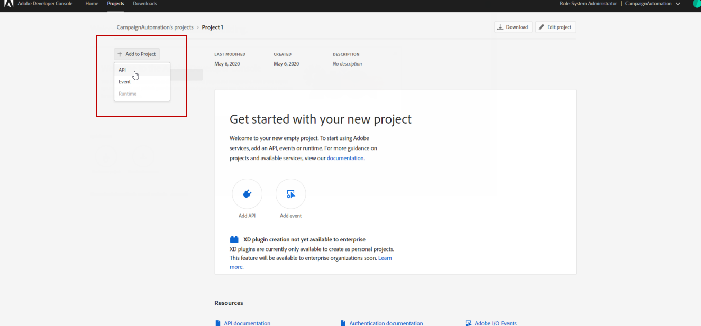
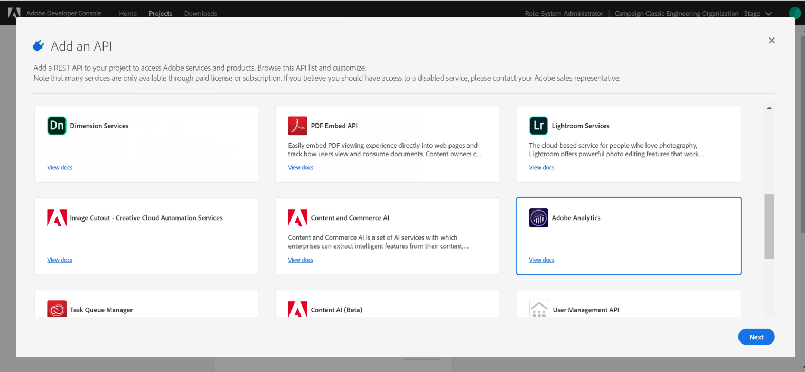
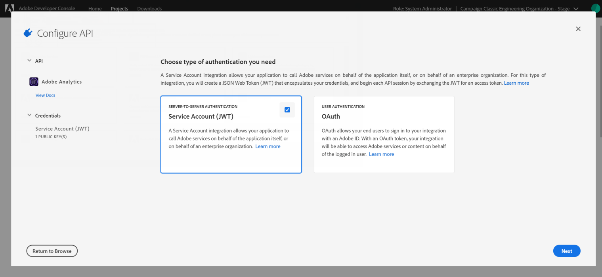
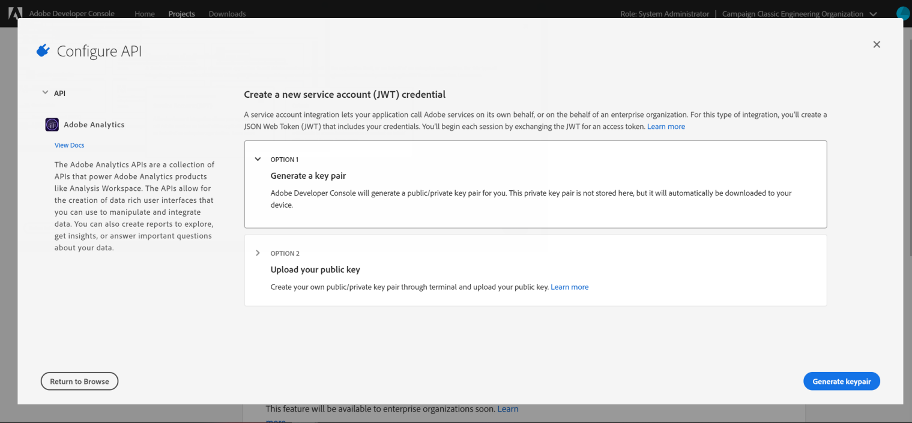
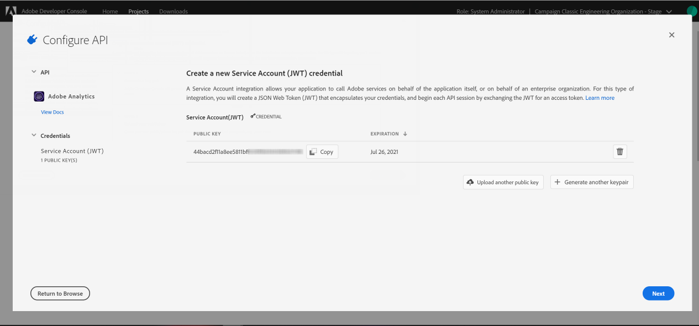
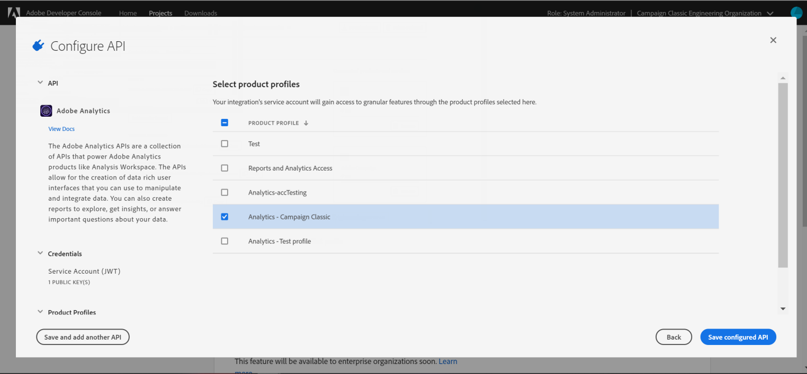
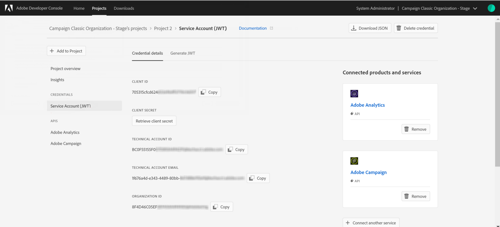

# Configuring Adobe I/O for Adobe Experience Cloud Triggers {#configuring-adobe-io}

>[!CAUTION]
>
>If you are using an older version of Triggers integration through oAuth authentication, **you need to move to Adobe I/O as described below**. Legacy oAuth authentication mode with Campaign with Campaign will be retired on November 30, 2021. [Learn more](https://experienceleaguecommunities.adobe.com/t5/adobe-analytics-discussions/adobe-analytics-legacy-api-end-of-life-notice/td-p/385411)
>
>Note that during this move to [!DNL Adobe I/O], some incoming triggers may be lost.

## Prerequisites {#adobe-io-prerequisites}

This integration only applies starting **Campaign Classic 20.3, 19.1.8 and [!DNL Gold Standard] 11 releases**.

Before starting this implementation, please check you have:

* a valid **Organization identifier**: the Identity Management System (IMS) organization identifier is the unique identifier within the Adobe Experience Cloud, used for example for the VisitorID service and the IMS Single-Sign On (SSO). [Learn more](https://experienceleague.adobe.com/docs/core-services/interface/manage-users-and-products/organizations.html)
* a **Developer access** to your Organization. The System administrator of the IMS Org needs to follow the **Add developers to a single product profile**
procedure detailed [in this page](https://helpx.adobe.com/enterprise/admin-guide.html/enterprise/using/manage-developers.ug.html) to provide developer access for the `Analytics - {tenantID}` Product Profile of the Adobe Analytics Product associated with Triggers.

## Step 1: Create/update Adobe I/O Project {#creating-adobe-io-project}

1. Access [!DNL Adobe I/O] and log in with the Developer access of the IMS Organization.

    >[!NOTE]
    >
    > Make sure you are logged into the correct Organization portal.

1. Extract existing integration Client identifier (Client ID) from the instance configuration file ims/authIMSTAClientId. Non-existing or empty attribute indicates Client identifier is not configured.

    >[!NOTE]
    >
    >If your Client identifier is empty, you can directly **[!UICONTROL Create a New project]** in Adobe I/O.

1. Identify the existing project using the extracted client identifier. Look for existing projects with the same Client identifier as the one extracted in previous step.

    

1. Select **[!UICONTROL + Add to Project]** and choose **[!UICONTROL API]**.

    

1. In the **[!UICONTROL Add an API]** window, select **[!UICONTROL Adobe Analytics]**.

    

1. Choose **[!UICONTROL Service Account (JWT)]** as the authentication type.

    

1. If your Client ID was empty, select **[!UICONTROL Generate a key pair]** to create a public and private key pair.

    The keys will then be automatically downloaded with a default expiry date of 365 days. Once expired, you will need to create a new key pair and update the integration in the configuration file. Using the Option 2, you can choose to manually create and upload your **[!UICONTROL Public key]** with a longer expiry date.

    >[!CAUTION]
    >
    >You should save the config.zip file when the download prompt comes up since you will not be able to download it again.

    

1. Click **[!UICONTROL Next]**.

    

1. Choose any existing **[!UICONTROL Product profile]** or create a new one if needed. No permission is required for this **[!UICONTROL Product profile]**. For more information on [!DNL Analytics] **[!UICONTROL Product Profiles]**, refer to [Adobe Analytics documentation](https://experienceleague.adobe.com/docs/analytics/admin/admin-console/home.html#admin-console).
    
    Then, click **[!UICONTROL Save configured API]**. 

    

1. From your project, select **[!UICONTROL Adobe Analytics]** and copy the following information under **[!UICONTROL Service Account (JWT)]**:

    * **[!UICONTROL Client ID]**
    * **[!UICONTROL Client Secret]**
    * **[!UICONTROL Technical account ID]**
    * **[!UICONTROL Organization ID]**

    

>[!CAUTION]
>
>Adobe I/O certificate will expire after 12 months. You need to generate a new key pair every year.

## Step 2: Add the project credentials in Adobe Campaign {#add-credentials-campaign}

>[!NOTE]
>
>This step is not required if your Client identifier was not empty in [Step 1: Create/update Adobe I/O Project](#creating-adobe-io-project).

The private key should be encoded in base64 UTF-8 format. To do so:

1. Use the private key generated in the [Step 1: Create/update Adobe I/O Project section](#creating-adobe-io-project). The private key needs to be the same as the one used to create the integration.

1. Encode the private key using the following command: `base64 ./private.key > private.key.base64`. This will save the base64 content to a new file `private.key.base64`.

    >[!NOTE]
    >
    >Extra lines can sometimes be automatically added when copy/pasting the private key. Remember to remove it before encoding your private key.

1. Copy the contents from the file `private.key.base64`.

1. Login via SSH to each container where the Adobe Campaign instance is installed and add the Project credentials in Adobe Campaign by running the following command as `neolane` user. This will insert the **[!UICONTROL Technical Account]** credentials in the instance configuration file.

    ```
    nlserver config -instance:<instance name> -setimsjwtauth:Organization_Id/Client_Id/Technical_Account_ID/<Client_Secret>/<Base64_encoded_Private_Key>
    ```

## Step 3: Update pipelined tag {#update-pipelined-tag}

>[!NOTE]
>
>This step is not required if your Client identifier was not empty in [Step 1: Create/update Adobe I/O Project](#creating-adobe-io-project).

To update [!DNL pipelined] tag, you need to update the authentication type to Adobe I/O project in the configuration file **config-<&nbsp;instance-name&nbsp;>.xml** as follows:

```
<pipelined ... authType="imsJwtToken"  ... />
```

Then, run a `config -reload` and a restart of the [!DNL pipelined] for the changes to be taken into account.
