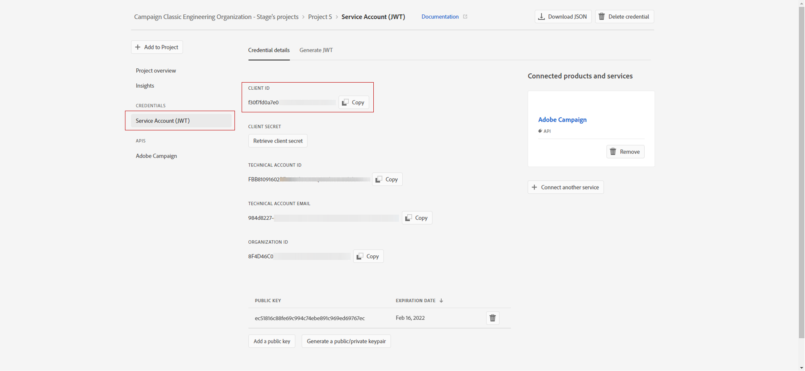

# Configuring Adobe IO for Adobe Experience Cloud Triggers {#configuring-adobe-io}

Prerequisite configurations are:

* Adobe Campaign Classic build ACC-19.1.9 or ACC-20.2.1 and above.
* a valid IMSOrgID.
* a Developer access to the IMS Org. You need to request the System Administrator privileges of the IMS Org to follow the procedure detailed in this [page](https://helpx.adobe.com/ca/enterprise/admin-guide.html/ca/enterprise/using/manage-developers.ug.html) to provide this access for the all Product Profiles.

## Step 1: Create/update Adobe IO Project {#creating-adobe-io-project}

1. Access Adobe IO and log in with the System Administrator right for the IMSorg.

    >[!NOTE]
    >
    > Make sure you are logged into the correct IMSorg portal.

1. Extract existing integration client ID from the instance configuration file ims/authIMSTAClientId. Non existing or empty attribute indicates client Id is not configured.

    >[!NOTE]
    >
    >If your Client ID is empty, you can directly **[!UICONTROL Create a New project]** in Adobe IO.

1. You now need to identify the existing project using the extracted client ID. Look for existing projects with the same client ID as the one extracted in previous step.

    

1. Select **[!UICONTROL + Add to Project]** and choose **[!UICONTROL API]**.

    

1. In the window **[!UICONTROL Add an API]**, select **[!UICONTROL Adobe Analytics]**.

    

1. Choose **[!UICONTROL Service Account (JWT)]** as the authentication type.

    

1. If you're Client ID was empty, select **[!UICONTROL Generate a key pair]** to create a Public and Private keypair.

    

1. Upload your public key and click **[!UICONTROL Next]**.

    

1. Choose the product profile called **Analytics-<&nbsp;Org Name&nbsp;>** and click **[!UICONTROL Save configured API]**.

    

1. From your project, select **[!UICONTROL Service Account (JWT)]** and copy the following information:
    * **[!UICONTROL Client ID]**
    * **[!UICONTROL Client Secret]**
    * **[!UICONTROL Technical account ID]**
    * **[!UICONTROL Organization ID]**

    

## Step 2: Add the project credentials in Adobe Campaign {#add-credentials-campaign}

To add the project credentials in Adobe Campaign, run the following command as neolane user on all the containers of the Adobe Campaign instance to insert the **[!UICONTROL Technical Account]** credentials in the instance configuration file.

```
nlserver config -instance:<instance name> -setimsjwtauth:Organization_Id/Client_Id/Technical_Account_ID[/Client_Secret[/Base64_encoded_Private_Key]]
```

>[!NOTE]
>
>You should encode the private key in base64 UTF-8 format. Remember to remove the new line from the key before encoding it except for the private key. The private key needs to be the same that was used to create the integration.

## Step 3: Update pipelined tag {#update-pipelined-tag}

To update [!DNL pipelined] tag, you need to update the authentication type to Adobe IO project in the configuration file **config-<&nbsp;instance-name&nbsp;>.xml** as follows:

```
<pipelined ... authType="imsJwtToken"  ... />
```

>[!NOTE]
>
>If you are using the older version of Triggers Integration using Legacy JWT tokens, you should also add the Adobe IO API for [!DNL Adobe Analytics] detailed in the first step to automatically migrate to the new Triggers Authentication.
