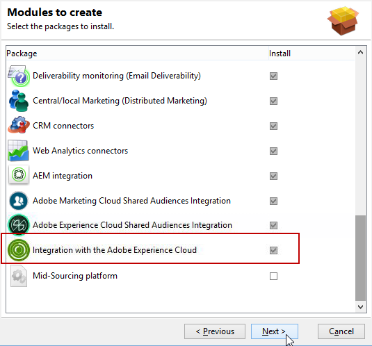
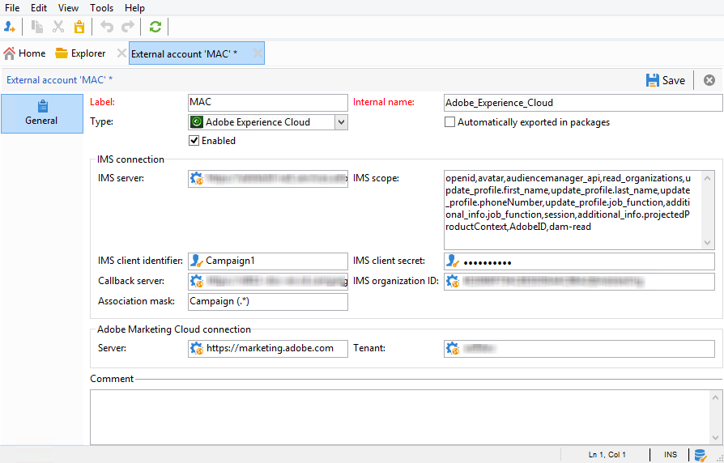

# Configuring IMS{#configuring-ims}

>[!IMPORTANT]
>
>Adobe IMS implementation is strictly reserved to the Adobe technical administrators. Contact your Adobe executive to start the implementation process.

## Prerequisites {#prerequisites}

To use the integration with the IMS:

* You must have an Adobe Experience Cloud organization and IMS IDs (provided when you first connect to the Adobe Experience Cloud).
* You have to add users in the Experience Cloud. For more on this, refer to [this page](https://experienceleague.adobe.com/docs/core-services/interface/manage-users-and-products/admin-getting-started.html).

>[!NOTE]
>
>Make sure that your users are linked to the Adobe Experience Cloud groups that will be synced with Adobe Campaign. Refer to [Configuring the external account](#configuring-the-external-account).

## Updating the console {#updating-the-console}

To use this functionality, it is imperative that you install the latest version of the console.

## Installing the package {#installing-the-package}

You must install the **[!UICONTROL Integration with the Adobe Experience Cloud]** package. Installing an integration package is the same as installing a standard package, which is detailed in [this page](../../installation/using/installing-campaign-standard-packages.md). 

## Configuring the external account {#configuring-the-external-account}

Configure the **Adobe Experience Cloud** external account in **[!UICONTROL Administration > Platform > External accounts]**.

>[!CAUTION]
>
>This configuration is reserved for the technical administrator.

Enter the following information:

* Connection information for the IMS server used (ID and secret). This information is provided by Adobe support. For more information, refer to the [FAQ for Adobe Experience Cloud Administrators](https://experienceleague.adobe.com/docs/core-services/interface/manage-users-and-products/faq.html).

  The **[!UICONTROL Callback server]** address must be specified in **https**. This field corresponds to the access URL of your Adobe Campaign instance.

* IMS organization ID: this information is available on the Experience Cloud (in **[!UICONTROL Administration > Experience Cloud Details]** ) and is provided when you first connect to the Adobe Experience Cloud.
* Association mask: this field allows you to define the syntax which will allow configuration names in Enterprise Dashboard to be synced with the groups in Adobe Campaign. If you use the syntax "Campaign - tenant_id - (.&#42;)", the security group created in Adobe Campaign will be linked to the configuration name "Campaign - tenant_id - internal_name" in Enterprise Dashboard.

  >[!CAUTION]
  >
  >The association mask is essential for the connection via the Adobe ID to work correctly.

* Adobe Experience Cloud connection information, particularly the name of the Adobe Experience Cloud Tenant.
