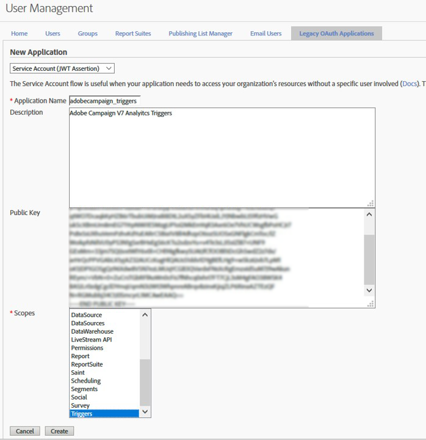
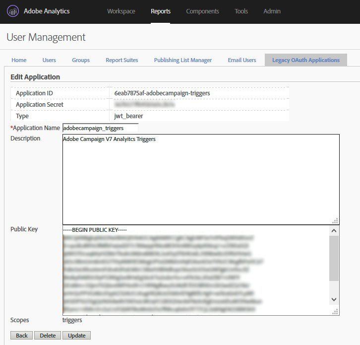

# Configuring pipeline {#configuring-pipeline}

Authentication parameters such as the customer ID, the private key, and the authentication endpoint are configured in the instance configuration files.
The list of triggers to be processed is configured in an option. It is in JSON format.
The trigger is processed immediately using Javascript code. It is saved into a database table with no further processing in real time.
The triggers are used for targeting by a campaign workflow that sends emails. The campaign is set up so that a customer that has both trigger events receives an email.

## Prerequisites {#prerequisites}

Using [!DNL Experience Cloud Triggers] in Campaign requires:

* Adobe Campaign version 6.11 build 8705 or later.
* Adobe Analytics Ultimate, Premium, Foundation, OD, Select, Prime, Mobile Apps, Select, or Standard.

Prerequisite configurations are:

* Creation of a private key file and then the creation of the oAuth application registered with that key.
* Configuration of the triggers in Adobe Analytics.

The Adobe Analytics configuration is out of the scope of this document.

Adobe Campaign requires the following information from Adobe Analytics:

* The name of the oAuth application.
* The IMSOrgId, the identifier of the Experience Cloud customer.
* The names of the triggers configured in Analytics.
* The name and format of the data fields to reconcile with the Marketing database.

Part of this configuration is a custom development and requires the following:

* Working knowledge of JSON, XML, and Javascript parsing in Adobe Campaign.
* Working knowledge of the QueryDef and Writer APIs.
* Working notions of encryption and authentication using private keys.

>[!NOTE]
>
>Since editing the JS code requires technical skills, do not attempt it without the proper understanding. <br>Triggers are saved to a database table. Thus, trigger data can be safely used by marketing operators in targeting workflows.

## Authentication and configuration files {#authentication-configuration}

Authentication is required since Pipeline is hosted in the Adobe Experience Cloud.
If the Marketing server is hosted on premise, when it logs in to Pipeline, it must authenticate to have a secure connection.
It uses a pair of public and private keys. This process is the same function as a user/password, only more secure.

### IMSOrgId {#imsorgid}

The IMSOrgId is the identifier of the customer on the Adobe Experience Cloud.
Set it in the instance serverConf.xml file, under the IMSOrgId attribute.
Example:

```
<redirection IMSOrgId="C5E715(…)98A4@AdobeOrg" (…)
```

### Key generation {#key-generation}

The key is a pair of files. It's in the RSA format and 4096 bytes long. It can be generated with an open source tool such as OpenSSL. Each time the tool is run, a new key is randomly generated.
For the sake of convenience, the steps are listed below:

* ```openssl genrsa -out <private_key.pem> 4096```

* ```openssl rsa -pubout -in <private_key.pem> -out <public_key.pem>```

Example private_key.pem file:

```

----BEGIN RSA PRIVATE KEY----
MIIEowIBAAKCAQEAtqcYzt5WGGABxUJSfe1Xy8sAALrfVuDYURpdgbBEmS3bQMDb
(…)
64+YQDOSNFTKLNbDd+bdAA+JoYwUCkhFyvrILlgvlSBvwAByQ2Lx
----END RSA PRIVATE KEY----

```

Example public_key.pem file:

```
----BEGIN PUBLIC KEY----
MIIBIjANBgkqhkiG9w0BAQEFAAOCAQ8AMIIBCgKCAQEAtqcYzt5WGGABxUJSfe1X
(…)
EwIDAQAB
----END PUBLIC KEY----
```

>[!NOTE]
>
>Keys should not be generated by PuttyGen, OpenSSL is the best choice.

### oAuth client creation in Adobe Experience Cloud {#oauth-client-creation}

An Application of type JWT needs to be created by logging into the Adobe Analytics in the correct organization account under **[!UICONTROL Admin]** > **[!UICONTROL User Management]** > **[!UICONTROL Legacy Oath application]**.

Follow these steps:

1. Select the **[!UICONTROL Service Account (JWT Assertion)]**.
1. Enter the **[!UICONTROL Application Name]**.
1. Register the **[!UICONTROL Public key]**.
1. Select the trigger's **[!UICONTROL Scopes]**.

    

1. Click on **[!UICONTROL Create]** and check the **[!UICONTROL Application ID]** and **[!UICONTROL Application Secret]** created.

    

### Application name registration in Adobe Campaign Classic {#application-name-registration}

The Application ID of the oAuth client created must be configured in Adobe Campaign. You can do it by editing the instance config file in the pipelined element, specifically the appName attribute.

Example:

```
<pipelined autoStart="true" appName="applicationID" authPrivateKey="@qQf146pexBksGvo0esVIDO(…)"/>
```

### Key encryption {#key-encription}

To be used by pipelined, the private key must be encrypted. Encryption is done using the cryptString Javascript function and must be performed on the same instance as pipelined.

A sample of private Key encryption with JavaScript is available in this [page](../../integrations/using/pipeline-troubleshooting.md).

The encrypted private key must be registered in Adobe Campaign. You can do it by editing the instance config file in the pipelined element, specifically the authPrivateKey attribute.

Example:

```
<pipelined autoStart="true" appName="applicationID" authPrivateKey="@qQf146pexBksGvo0esVIDO(…)"/>
```

### Pipelined process auto-start {#pipelined-auto-start}

The pipelined process must be started automatically.
To do it, set the element in the configuration file to autostart="true":

```
<pipelined autoStart="true" appName="applicationID" authPrivateKey="@qQf146pexBksGvo0esVIDO(…)"/>
```

### Pipelined process restart {#pipelined-restart}

It can also be started manually using the command line:

```
nlserver start pipelined@instance
```

A restart is required for the changes to take effect:

```
nlserver restart pipelined@instance
```

In case of errors, look for errors on the standard output (if you started manually) or in the pipelined log file. Refer to the Troubleshooting section of this document for more information on resolving issues.

### Pipelined configuration options {#pipelined-configuration-options}

| Option | Description |
|:-:|:-:|
| appName| ID of the OAuth application (Application ID) registered in Adobe Analytics (where the public key was uploaded): Admin > User Management > Legacy Oath application. Refer to this [section](../../integrations/using/configuring-pipeline.md#oauth-client-creation). |
| authGatewayEndpoint| URL to get "gateway tokens". <br> Default: https://api.omniture.com|
| authPrivateKey | Private key (public part uploaded in Adobe Analytics (refer to this section). AES encrypted with the XtkSecretKey option: xtk.session.EncryptPassword("PRIVATE_KEY");|
| disableAuth| Disable authentication (connecting without gateway tokens is only accepted by some development Pipeline endpoints)|
| discoverPipelineEndpoint | URL to discover the Pipeline Services endpoint to be used for this tenant. Default: https://producer-pipeline-pnw.adobe.net|
| dumpStatePeriodSec| Period between 2 dumps of the process internal state in var/INSTANCE/pipelined.json Internal state is also accessible on-demand at http://INSTANCE/pipelined/status (port 7781). |
| forcedPipelineEndpoint| Disable the discovery of the PipelineServicesEndpoint and force it  |
| monitorServerPort| The pipelined process listens on this port to provide the process internal state at http://INSTANCE/pipelined/status (port 7781). |
| pointerFlushMessageCount | When this number of messages is processed, the offsets are saved in the database. Default is 1000|
| pointerFlushPeriodSec| After this period, the offsets will be saved in the database. Default is 5 (secs) |
| processingJSThreads | Number of dedicated threads processing messages with custom JS connectors. Default is 4 |
| processingThreads| Number of dedicated threads processing messages with built-in code. Default is 4 |
| retryPeriodSec | Delay between retries (if there are processing errors). Default is 30 (secs) |
| retryValiditySec| Discard the message if it is not successfully processed after this period (too many retries). Default is 300 (secs) |
